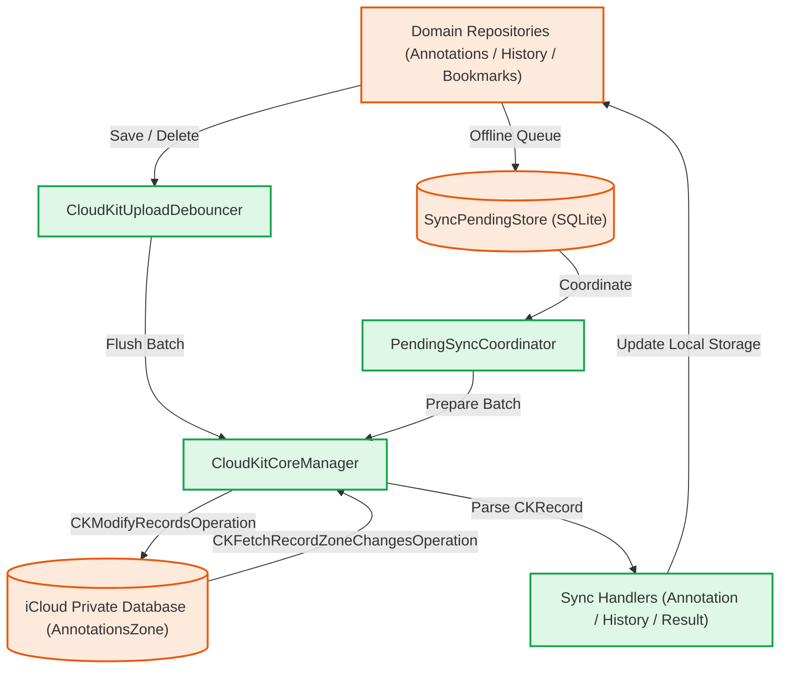
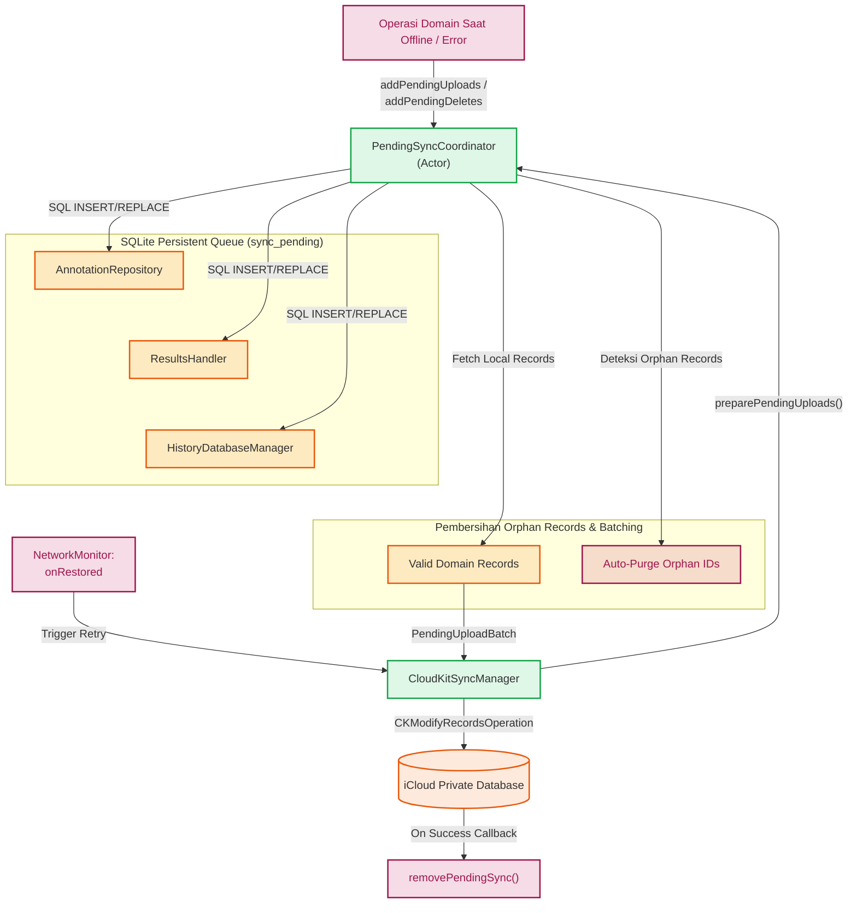

# Arsitektur Sinkronisasi CloudKit

Mekanisme sinkronisasi CloudKit pada Maktabah menggunakan pendekatan asinkron yang *thread-safe* berbasis Swift 6 Concurrency (`actor`, `Sendable`, dan `Synchronization.Mutex`). Modul ini mengelola *upload*, *fetch*, *debounce*, dan *pending sync* secara terpusat untuk seluruh entitas (Anotasi, Riwayat, dan Hasil Pencarian Tersimpan).

### Alur Arsitektur (*Architecture Pipeline*)

Diagram berikut menggambarkan interaksi komponen antara lapisan repositori domain, penyimpanan basis data, dan mesin inti CloudKit:



Penjelasan metode dan prinsip arsitektur:

*   **Prinsip Pemisahan Tanggung Jawab (*Separation of Concerns*)**:
    *   `CloudKitCoreManager`: Bertanggung jawab secara eksklusif untuk interaksi dengan CloudKit API, manajemen *token*, dan eksekusi antrean jaringan, tanpa perlu mengetahui detail entitas domain.
    *   `PendingSyncCoordinator`: Mengoordinasikan antrean data yang belum tersinkronisasi (*pending sync*) dari berbagai repositori domain.
    *   `CloudKitUploadDebouncer`: Menangani pembatasan laju (*rate limiting*) dengan mengelompokkan permintaan sinkronisasi yang berdekatan waktunya.
    *   `SyncPendingStore`: Menyediakan lapisan persistensi SQLite lokal untuk menyimpan status sinkronisasi yang tertunda.
    *   `Sync Handlers`: Menerjemahkan data antara `CKRecord` (CloudKit) dan model domain aplikasi.

*   **Pending Sync & Debounce**:
    *   **Debounce**: Setiap permintaan unggah akan ditahan sementara oleh `CloudKitUploadDebouncer` selama 2 detik (dapat dikonfigurasi). Jika ada permintaan baru sebelum batas waktu berakhir, *timer* direset. Mekanisme ini menjaga agar aplikasi tidak membebani server Apple secara berlebihan.
    *   **Pending Sync**: Jika operasi CloudKit gagal saat `flush()`, operasi tersebut (`upload` atau `delete`) dimasukkan ke tabel SQLite lokal melalui `SyncPendingStore`.

*   **Metode Fetch dan Upload**:
    *   **Fetch (Unduh)**: Menggunakan `CKFetchRecordZoneChangesOperation` yang memanfaatkan *token* perubahan (`CKServerChangeToken`). Proses ini dijalankan dalam antrean operasi dengan konkurensi maksimal 2.
    *   **Upload (Unggah)**: Menggunakan `CKModifyRecordsOperation` untuk menambah, mengubah, atau menghapus data di dalam *custom zone* `AnnotationsZone`.

### Komponen Inti (*Core Components*)

Seluruh implementasi `class` dan `struct` dirancang untuk memenuhi batasan memori dan *thread-safety* pada Swift 6.

#### `CloudKitSyncManager` (Class) & Inisialisasi

`CloudKitSyncManager` adalah *class* orkestrator tingkat atas yang mengoordinasikan seluruh alur sinkronisasi saat siklus hidup aplikasi dimulai. Titik inisialisasi utamanya berada pada fungsi `initializeOnLaunch()`:

```swift
func initializeOnLaunch() {
    guard AppConfig.useICloud else { return }

    checkUserIdentityChange()
    core.setSyncing(false)

    // ... inisialisasi zona kustom ...
}
```

!!! note "Ketergantungan Pengaturan (AppConfig)"
    Aplikasi **hanya** akan memicu koneksi, pengunduhan, maupun pengunggahan CloudKit apabila pengaturan `useICloud` di dalam `AppConfig` (*Source/Core/Configuration/AppConfig.swift*) bernilai `true`. Jika pengguna menonaktifkan sinkronisasi iCloud, fungsi ini langsung kembali (`return`).

Jika pengaturan aktif, `initializeOnLaunch()` akan menjalankan tahapan berikut secara berurutan:

1. **Memeriksa Identitas Pengguna (*User Identity*)**: Fungsi `checkUserIdentityChange()` memastikan apakah akun iCloud pengguna di perangkat telah berganti. Jika berubah, sistem otomatis mereset *token* perubahan agar data tidak tercampur.
2. **Pembuatan Zona Kustom (*Custom Zone*)**: Memverifikasi dan membuat `CKRecordZone` khusus di dalam *Private Database*.
3. **Pemicu Aksi Asinkron**: Jika pembuatan/verifikasi zona berhasil, manajer ini memicu 4 aksi secara asinkron:
    * `fetchChanges()`: Menarik seluruh pembaruan dari server CloudKit.
    * `subscribeToChanges()`: Mendaftarkan aplikasi untuk menerima notifikasi (*silent push*) saat ada data baru di server.
    * `performInitialUploadCheck()`: Melakukan pemeriksaan unggahan awal untuk data lokal.
    * `retryAllPendingOperations()`: Mengunggah kembali seluruh data yang berada di antrean luring (`SyncPendingStore`).

#### `CloudKitCoreManager` (Class)

*Class* utama (*singleton*) yang berinteraksi langsung dengan API `CloudKit`. Menyediakan fungsi untuk mengunggah (`upload`), menghapus (`delete`), dan menarik pembaruan (`fetchChanges`).

```swift
final class CloudKitCoreManager: Sendable {
    private struct ManagerState { // (1)!
        var isSyncing: Bool = false
        var notifyTask: Task<Void, Never>? = nil
    }

    static let shared = CloudKitCoreManager()
    let container: CKContainer
    let privateDatabase: CKDatabase
    let zoneId: CKRecordZone.ID
    // ...
}
```

1. `struct` ini membungkus *state* yang bersifat *mutable*, kemudian diamankan menggunakan `Synchronization.Mutex` untuk mencegah *data race* saat diakses secara konkuren.

=== "macOS"
    Mengeksekusi antrean di latar belakang secara *native* pada AppKit.

=== "iOS"
    Berjalan selaras dengan *background task* bawaan sistem iOS/UIKit.

#### `PendingSyncCoordinator` (Actor)

`actor` yang bertugas mengoordinasikan antrean operasi sinkronisasi tertunda (*offline queue*) lintas repositori domain (Anotasi, Hasil Pencarian, dan Riwayat Baca).



```swift
actor PendingSyncCoordinator {
    static let shared = PendingSyncCoordinator()

    enum SyncTarget: Sendable {
        case annotation
        case result
        case history
    }

    struct PendingUploadBatch: Sendable {
        let annotations: [Annotation]
        let folders: [SyncFolder]
        let results: [SyncResult]
        let history: [ReadingEntry]

        var isEmpty: Bool {
            annotations.isEmpty && folders.isEmpty && results.isEmpty && history.isEmpty
        }
    }

    struct PendingDeleteBatch: Sendable {
        let annotationIds: [String]
        let resultIds: [String]
        let historyIds: [String]

        var isEmpty: Bool {
            annotationIds.isEmpty && resultIds.isEmpty && historyIds.isEmpty
        }
    }
}
```

##### 1. Persistensi Antrean Lokal (SQLite)
Ketika operasi unggah atau hapus gagal dilakukan saat perangkat luring (*offline*), ID entitas langsung dicatat ke dalam tabel lokal `sync_pending` melalui metode:
- `addPendingUploads(_:target:)`
- `addPendingDeletes(_:target:)`

Operasi ini didelegasikan langsung ke repositori domain masing-masing (`AnnotationRepository.shared`, `ResultsHandler.shared`, `HistoryDatabaseManager.shared`) sehingga antrean tetap bertahan (*durable*) meskipun aplikasi dihentikan paksa atau perangkat dimatikan.

##### 2. Pembersihan Orphan Records & Perakitan Batch (`preparePendingUploads`)
Sebelum melakukan pengunggahan ulang, fungsi `preparePendingUploads()` menjalankan sanitasi data otomatis:
1. Membaca daftar ID bertanda `upload` dari tabel `sync_pending`.
2. Mengambil entitas data aslinya dari tabel domain utama.
3. **Deteksi Orphan Records**: Apabila terdapat ID di dalam antrean `sync_pending` yang datanya sudah tidak ditemukan di basis data lokal (misalnya karena telah dihapus oleh pengguna saat luring), koordinator secara otomatis menghapus ID tersebut dari antrean lokal (`removePendingSync`).
4. Merangkai seluruh entitas yang valid ke dalam `PendingUploadBatch` untuk dikirimkan secara serentak.

##### 3. Pemulihan Koneksi Otomatis (`NetworkMonitor`)
`CloudKitSyncManager` mendaftarkan *callback* ke `NetworkMonitor.shared`:
```swift
await NetworkMonitor.shared.registerConnectivityCallbacks(
    onRestored: { [weak self] in
        self?.retryAllPendingOperations()
    }
)
```
- **Coalescing Loop**: Perulangan `runRetryCoalescingLoop` dilindungi oleh `Mutex` (`retryState`) guna mencegah pemicuan ganda jika koneksi berfluktuasi dengan cepat.
- **Batch Upload & Delete Paralel**: Eksekusi *batch* dijalankan serentak menggunakan `withTaskGroup`.
- **Atomic Cleanup**: Hanya rekaman yang dikonfirmasi berhasil disimpan oleh CloudKit yang akan dihapus dari antrean lokal melalui `removePendingSync()`.

#### `CloudKitUploadDebouncer` (Actor)

`actor` generik untuk membatasi laju unggahan (*rate limiter*).

```swift
actor CloudKitUploadDebouncer<Item: Sendable> {
    private var buffer: [String: Item] = [:]
    private var debounceTask: Task<Void, Never>?
    private var pendingCompletions: [@Sendable (Result<Void, Error>) -> Void] = []
    private let debounceInterval: Duration
}
```

!!! note "Logika Debounce"
    Semua entitas yang masuk akan ditampung di `buffer`. Metode `add` akan membatalkan `debounceTask` sebelumnya dan memulai interval penundaan baru (`debounceInterval`). Jika tidak ada permintaan baru hingga batas waktu terlewati, data akan diteruskan ke CloudKit.

#### `SyncPendingStore` (Struct)

Lapisan penyimpanan tingkat rendah yang mengeksekusi instruksi SQL ke basis data SQLite lokal.

```swift
struct SyncPendingStore {
    static let tableName = "sync_pending"

    static let createTableSQL = """
    CREATE TABLE IF NOT EXISTS sync_pending (
        ck_record_id TEXT PRIMARY KEY,
        operation TEXT NOT NULL CHECK(operation IN ('upload', 'delete')),
        queued_at INTEGER NOT NULL
    );
    """
    // ...
}
```

*   `ck_record_id`: Kunci primer (*Primary Key*) sebagai rujukan mutlak ke `CKRecord`.
*   `operation`: Menyatakan jenis perintah tunda (`upload` atau `delete`).
*   `queued_at`: Pencatat waktu dalam format integer (UNIX *timestamp*).

!!! warning "Penyelesaian Konflik Status"
    Bila status `'upload'` ditambahkan, tetapi tabel `sync_pending` telah memiliki entri `'delete'` untuk ID terkait, status `'delete'` tetap dipertahankan. Sebaliknya, instruksi `'delete'` yang baru akan menimpa catatan `'upload'` lama.

### Protocol & Handler

Digunakan sebagai antarmuka standar bagi semua domain untuk dikonversi menjadi `CKRecord`.

```swift
protocol CloudKitSyncable {
    var ckRecordId: String? { get }
    func toCKRecord(zoneID: CKRecordZone.ID) -> CKRecord?
}

protocol CloudKitRecordParser {
    associatedtype Model
    static var recordType: String { get }
    static func parse(from record: CKRecord) -> Model?
}
```

Berikut rincian masing-masing pengelola (*handler*):

1.  **AnnotationSyncHandler**
    *   **Tipe Rekaman**: `Annotation`
    *   **Fungsi**: Mentranslasikan format `CKRecord` menjadi objek `Annotation` yang utuh (termasuk referensi ke buku, lokasi rentang teks, ID konten, warna heksadesimal, indeks, serta daftar label (*tags*)).

2.  **HistorySyncHandler**
    *   **Tipe Rekaman**: `ReadingEntry`
    *   **Fungsi**: Mengekstrak informasi posisi bacaan terakhir dari CloudKit, memperbarui indikator favorit, serta mencatat waktu pembaruan rekaman.

3.  **ResultSyncHandler**
    *   **Tipe Rekaman**: `SearchFolder` dan `SearchResult`
    *   **Fungsi**: Modul ini menopang dua jenis konversi sekaligus melalui fungsi pembantu statis `parseFolder` maupun `parseResult`, karena setiap pencarian yang disimpan dapat menempati lokasi folder tertentu dalam hierarki.
