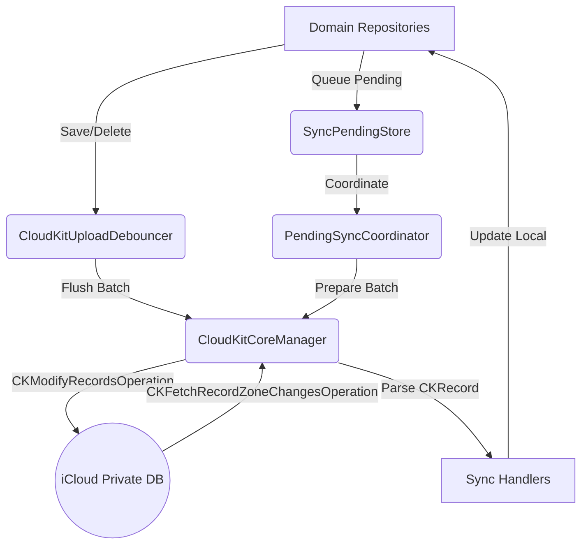

# CloudKit Sync Architecture

Mekanisme sinkronisasi CloudKit pada Maktabah menggunakan pendekatan asinkron yang thread-safe dengan implementasi Swift 6 Concurrency (`actor`, `Sendable`, dan `Synchronization.Mutex`). Modul ini mengelola *upload*, *fetch*, *debounce*, dan *pending sync* secara terpusat untuk seluruh entitas (Anotasi, Riwayat, dan Bookmark/Hasil Pencarian).

### Architecture Pipeline

Berikut adalah diagram interaksi komponen antara Layer, Database/Store, dan Core Engine:



Penjelasan metode dan prinsip arsitektur:

*   **Prinsip Pemisahan Tanggung Jawab (Separation of Concerns)**:
    *   `CloudKitCoreManager`: Bertanggung jawab secara eksklusif untuk interaksi dengan CloudKit API, manajemen Token, dan eksekusi antrean jaringan, tanpa mengetahui detail entitas domain.
    *   `PendingSyncCoordinator`: Bertugas mengoordinasikan antrean data yang belum tersinkronisasi (Pending Sync) dari berbagai *domain repository*.
    *   `CloudKitUploadDebouncer`: Menangani pembatasan laju (*rate limiting*) dengan mengelompokkan permintaan sinkronisasi yang berdekatan waktunya.
    *   `SyncPendingStore`: Menyediakan lapisan persistensi SQLite lokal untuk menyimpan status sinkronisasi yang tertunda.
    *   `Sync Handlers`: Menerjemahkan data antara `CKRecord` (CloudKit) dan Model Domain (aplikasi).

*   **Pending Sync & Debounce**:
    *   **Debounce**: Setiap permintaan unggah akan ditahan sementara oleh `CloudKitUploadDebouncer` selama 2 detik (dapat diatur). Jika ada permintaan baru, penanda waktu akan diulang. Ini menjaga agar aplikasi tidak men-spam server Apple.
    *   **Pending Sync**: Jika operasi CloudKit gagal saat `flush()`, operasi tersebut (`upload` atau `delete`) akan dimasukkan ke tabel SQLite lokal melalui `SyncPendingStore`.

*   **Metode Fetch dan Upload**:
    *   **Fetch (Unduh)**: Menggunakan `CKFetchRecordZoneChangesOperation` yang mengambil token spesifik (`CKServerChangeToken`). Proses ini dijalankan dalam antrean operasi dengan konkurensi maksimal 2.
    *   **Upload (Unggah)**: Memanfaatkan `CKModifyRecordsOperation` untuk menambah, mengubah, atau menghapus data ke dalam *zone* `AnnotationsZone`.

### Komponen Inti (Core Components)

Seluruh implementasi kelas dan struktur data dirancang menyesuaikan batasan memori dan *thread-safety* pada Swift 6.

#### CloudKitSyncManager & Inisialisasi

Kelas ini adalah orkestrator tertinggi yang menyambungkan seluruh alur sinkronisasi saat siklus hidup aplikasi baru dimulai. Hal yang paling fundamental adalah fungsi `initializeOnLaunch()`:

```swift
func initializeOnLaunch() {
    guard AppConfig.useICloud else { return }
    
    checkUserIdentityChange()
    core.setSyncing(false)
    
    // ... inisialisasi zona kustom ...
}
```

!!! note "Ketergantungan Pengaturan (AppConfig)"
    Aplikasi **hanya** akan memicu koneksi, pengunduhan, maupun pengunggahan CloudKit apabila pengaturan `useICloud` di dalam `AppConfig` (*Source/Core/Configuration/AppConfig.swift*) bernilai `true`. Jika pengguna mematikan pengaturan sinkronisasi iCloud, fungsi ini akan langsung terhenti (`return`).

Jika pengaturan aktif, `initializeOnLaunch()` akan melakukan langkah-langkah eksplisit berikut secara berurutan:
1. **Memeriksa Identitas (User Identity)**: Fungsi `checkUserIdentityChange()` memastikan apakah akun iCloud pengguna di perangkat telah berganti. Jika berubah, sistem otomatis mereset *token* perubahan agar data tidak tertukar.
2. **Pembuatan Zona Kustom**: Memverifikasi dan membuat `CKRecordZone` khusus di dalam *Private Database*. 
3. **Pemicu Aksi Berantai**: Jika pembuatan/verifikasi zona berhasil, manajer ini memicu 4 aksi penting sekaligus secara asinkron:
    * `fetchChanges()`: Menarik semua pembaruan jarak jauh.
    * `subscribeToChanges()`: Mendaftarkan aplikasi untuk menerima notifikasi (*silent push*) jika ada data baru di peladen.
    * `performInitialUploadCheck()`: Melakukan pemeriksaan unggahan perdana untuk data lokal.
    * `retryAllPendingOperations()`: Menguras dan mengunggah kembali semua data yang ada di dalam antrean luring (`SyncPendingStore`).

#### CloudKitCoreManager

Kelas utama (Singleton) yang berinteraksi dengan API `CloudKit`. Memiliki fungsi untuk mengunggah (`upload`), menghapus (`delete`), dan menarik pembaruan (`fetchChanges`).

```swift
final class CloudKitCoreManager: Sendable {
    private struct ManagerState { // (1)!
        var isSyncing: Bool = false
        var notifyTask: Task<Void, Never>? = nil
    }

    static let shared = CloudKitCoreManager()
    let container: CKContainer
    let privateDatabase: CKDatabase
    let zoneId: CKRecordZone.ID
    // ...
}
```

1.  Membungkus status yang *mutable* di dalam struktur ini, kemudian diamankan menggunakan kunci dari `Synchronization.Mutex` untuk menghindari kebocoran data di lintas jalur (*data race*).

=== "macOS"
    Mengeksekusi antrean di latar belakang secara *native* pada AppKit.

=== "iOS"
    Berjalan selaras dengan *background task* bawaan sistem iOS/UIKit.

#### PendingSyncCoordinator

Aktor yang bertugas menyelaraskan *queue* operasi *sync* di level lintas domain repositori.

```swift
actor PendingSyncCoordinator {
    static let shared = PendingSyncCoordinator()

    enum SyncTarget: Sendable {
        case annotation
        case result
        case history
    }

    struct PendingUploadBatch: Sendable {
        let annotations: [Annotation]
        let folders: [SyncFolder]
        let results: [SyncResult]
        let history: [ReadingEntry]

        var isEmpty: Bool {
            annotations.isEmpty && folders.isEmpty && results.isEmpty && history.isEmpty
        }
    }

    struct PendingDeleteBatch: Sendable {
        let annotationIds: [String]
        let resultIds: [String]
        let historyIds: [String]

        var isEmpty: Bool {
            annotationIds.isEmpty && resultIds.isEmpty && historyIds.isEmpty
        }
    }
}
```

*   `SyncTarget`: Merupakan enum penanda sasaran entitas domain untuk operasi sinkronisasi CloudKit. Nilai-nilainya adalah `annotation`, `result`, dan `history`.
*   `PendingUploadBatch`: Menampung berbagai sekumpulan entitas (*arrays of entities*) yang siap diunggah ke *server* secara kolektif untuk meminimalkan beban jaringan.
*   `PendingDeleteBatch`: Menampung kumpulan *ID* bertipe *string* yang akan dihapus dari data *server* iCloud.

#### CloudKitUploadDebouncer

Aktor generik pembatas aliran unggahan.

```swift
actor CloudKitUploadDebouncer<Item: Sendable> {
    private var buffer: [String: Item] = [:]
    private var debounceTask: Task<Void, Never>?
    private var pendingCompletions: [@Sendable (Result<Void, Error>) -> Void] = []
    private let debounceInterval: Duration
}
```

!!! note "Logika Debounce"
    Semua entitas masuk akan dimasukkan ke `buffer`. Method `add` akan membatalkan `debounceTask` sebelumnya dan membuat penundaan baru (`debounceInterval`). Setelah tertunda sepenuhnya tanpa gangguan, data diteruskan ke CloudKit.

#### SyncPendingStore

Store level paling dasar. Kelas ini langsung mengeksekusi instruksi SQL ke dalam *database* (SQLite).

```swift
struct SyncPendingStore {
    static let tableName = "sync_pending"

    static let createTableSQL = """
    CREATE TABLE IF NOT EXISTS sync_pending (
        ck_record_id TEXT PRIMARY KEY,
        operation TEXT NOT NULL CHECK(operation IN ('upload', 'delete')),
        queued_at INTEGER NOT NULL
    );
    """
    // ...
}
```

*   `ck_record_id`: Kunci unik utama (*Primary Key*) sebagai rujukan mutlak `CKRecord`.
*   `operation`: Menyatakan jenis perintah tunda. Harus di antara nilai `upload` atau `delete`.
*   `queued_at`: Pencatat waktu dalam rupa integer (UNIX timestamp).

!!! warning "Penyelesaian Konflik"
    Bila status `'upload'` ditambahkan, tetapi tabel `sync_pending` telah memiliki entri `'delete'` untuk ID terkait, perlakuan `'delete'` tidak diganggu gugat. Sebaliknya, instruksi `'delete'` yang baru dapat menimpa rekaman `'upload'` lama.

### Protokol & Handler

Digunakan sebagai antarmuka standar bagi semua domain untuk dikonversi menjadi `CKRecord`.

```swift
protocol CloudKitSyncable {
    var ckRecordId: String? { get }
    func toCKRecord(zoneID: CKRecordZone.ID) -> CKRecord?
}

protocol CloudKitRecordParser {
    associatedtype Model
    static var recordType: String { get }
    static func parse(from record: CKRecord) -> Model?
}
```

Berikut rincian masing-masing pengelola (*handler*):

1.  **AnnotationSyncHandler**
    *   **Tipe Rekaman**: `Annotation`
    *   **Fungsi**: Mentranslasikan format `CKRecord` menjadi objek `Annotation` yang utuh (termasuk referensi ke buku, lokasi jangkauan teks, ID konten, warna heksadesimal, indeks, serta daftar label (*tags*)).

2.  **HistorySyncHandler**
    *   **Tipe Rekaman**: `ReadingEntry`
    *   **Fungsi**: Memecahkan informasi posisi pembacaan terakhir dari CloudKit, memperbarui indikator favorit, serta keterangan kapan rekaman diperbarui.

3.  **ResultSyncHandler**
    *   **Tipe Rekaman**: `SearchFolder` dan `SearchResult`
    *   **Fungsi**: Modul ini menopang dua jenis konversi sekaligus. Di dalamnya tersedia sub-prosedur statis `parseFolder` maupun `parseResult`, karena setiap pencarian yang disimpan dapat menempati lokasi folder yang spesifik.
