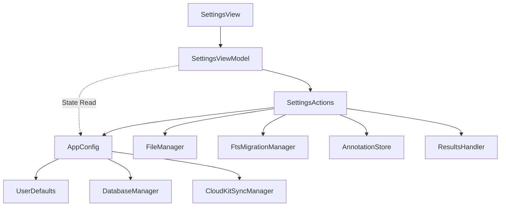

# Konfigurasi & Pengaturan Aplikasi (AppConfiguration & Settings)

Dokumentasi ini membedah arsitektur, pemisahan tanggung jawab, dan komponen teknis yang terlibat dalam konfigurasi aplikasi Maktabah, mulai dari manajemen *path* berkas, migrasi basis data, hingga alur kerja pengaturan pengguna (*Settings*).

---

## Pipeline Arsitektur

Sistem pengaturan dan konfigurasi aplikasi dibangun dengan mengedepankan pemisahan logika tampilan dan logika sistem berkas.



### Prinsip Pemisahan Tanggung Jawab (Separation of Concerns)

Sistem memecah beban kerja ke dalam empat lapisan utama:

1. **`AppConfig` (Manajemen Direktori dan Kunci)**
    Menangani penentuan lokasi penyimpanan aplikasi, *key* konstan untuk *UserDefaults*, dan pengelolaan opsi seperti Bundle Mode vs Custom Mode. Lapisan ini murni statis dan terisolasi dari *User Interface*.
2. **`SettingsActions` (Pengelola Aksi dan Efek Samping)**
    Menyediakan fungsi asinkron atau sinkron untuk menjalankan aktivitas berat, seperti membuka jendela pemilihan sistem berkas, memindahkan struktur *folder*, memvalidasi akses keamanan, dan memberitahu sistem indeks pencarian atau *database* saat perubahan selesai.
3. **`SettingsViewModel` (Manajemen Status Tampilan)**
    Kelas `Observable` tunggal (*singleton*) yang bertanggung jawab untuk menghubungkan status internal (*state*) dengan komponen UI. Jika ada kesalahan benturan berkas (*collision*), *ViewModel* akan menyimpan statusnya untuk dimunculkan sebagai peringatan *Alert*.
4. **`SettingsView` (Presentasi)**
    Tampilan SwiftUI murni yang menyesuaikan *form* berdasarkan sistem operasi (iOS/macOS). Komponen ini tidak mengandung logika manipulasi berkas secara langsung.

---

## Logika Pemilihan Direktori dan Migrasi

### Direktori Pustaka (*Library Folder*)

Aplikasi menggunakan pendekatan dua metode untuk direktori pustaka buku (*database* utama):

* **Bundle Mode (Bawaan)**:
    Aplikasi mengunduh dan menempatkan berkas inti (`main.sqlite`, `special.sqlite`) ke dalam `~/Library/Application Support/Maktabah/Caches/`.
* **Custom Mode (Kustom)**:
    Pengguna dapat menentukan direktori penyimpanan pribadi eksternal. Aplikasi menggunakan mekanisme `Security-Scoped Bookmark` untuk menyimpan otoritas akses sistem berkas terhadap *folder* kustom pengguna agar dapat diakses setiap kali aplikasi dijalankan.

!!! note "Proses Migrasi Pustaka"
    Ketika pengguna berpindah dari Bundle Mode ke Custom Mode, aplikasi otomatis menyalin basis data dasar (`main.sqlite` dan `special.sqlite`) dari direktori *cache* ke sub-direktori `Files` dalam direktori kustom yang dipilih pengguna. Ini memastikan aplikasi dapat langsung bekerja tanpa harus mengunduh ulang.

### Direktori Anotasi dan Hasil Pencarian

Anotasi dan hasil pencarian (`Annotations.sqlite`, `SearchResults.sqlite`) menggunakan basis data independen untuk mendukung penyelarasan komputasi awan.

Jika pengguna memindahkan direktori ini melalui tombol "Choose Annotations Folder", alur berikut dijalankan:

1. Sistem memverifikasi akses baca-tulis lokasi baru.
2. Sistem memutuskan sambungan basis data sementara di `AnnotationStore` dan `ResultsHandler`.
3. Seluruh berkas SQLite terkait beserta berkas jurnal *Write-Ahead Logging* (`-wal`, `-shm`) dipindahkan ke lokasi baru menggunakan `FileManager`.
4. Jika berkas serupa terdeteksi, sistem melemparkan (*throw*) pesan `StorageError.collision`, dan menampilkan dialog penyelesaian konflik (Timpa/Pertahankan).
5. Sambungan basis data dihubungkan kembali (*reconnect*) di lokasi yang baru.

---

## Bedah Komponen Teknis

### AppConfig

Objek `AppConfig` direpresentasikan sebagai `enum` yang dilarang diinisiasi. Komponen ini menyimpan seluruh letak kunci preferensi konfigurasi.

```swift
enum AppConfig {
    static let storageKey = "selected_shamela_bookmark" // (1)!
    static let annotationsAndResultsFolder = "annotations_FolderPath"
    static let bundleModeKey = "use_bundle_database_mode"

    static var isUsingBundleMode: Bool { // (2)!
        get { UserDefaults.standard.bool(forKey: bundleModeKey) }
        set { UserDefaults.standard.set(newValue, forKey: bundleModeKey) }
    }

    static var archiveCachePath: String? { ... } // (3)!
    static var customDatabasePath: String? { ... }
}
```

1. Konstanta ini adalah nama `key` yang digunakan untuk baca-tulis ke dalam fungsi `UserDefaults` sistem bawaan Apple.
2. Properti Boolean komputasi (*computed property*) mempermudah pembacaan status dengan mengabstraksi pemanggilan `UserDefaults` secara langsung.
3. Fungsi atau *properti* berbasis opsional (*optional*) yang digunakan untuk menentukan resolusi *path* internal (seperti *folder Cache*).

**Penjelasan Properti Utama Lainnya:**

* `databaseFilesPath`: Memeriksa apakah `customDatabasePath` tersedia, dan jika tidak, akan menggunakan `coreDatabasePath`.
* `bookReleaseBaseURL`: Menampung tautan GitHub *Releases* yang dipakai sebagai jalur dasar (*base URL*) pengunduhan buku (*database kitab*).
* `shouldCheckCoreVersion`: Memeriksa apakah jeda waktu dari pemeriksaan versi inti (*core*) terakhir telah melewati tenggat waktu enam bulan.

### SettingsActions

`SettingsActions` memfasilitasi interaksi I/O eksternal dan pergerakan berkas.

```swift
@MainActor
enum SettingsActions {
    static func chooseAnnotationsAndResultsFolder(
        resolution: AppConfig.MigrationResolution = .ask,
        retryURL: URL? = nil,
        onCompletion: @escaping (Result<URL, Error>?) -> Void
    ) { ... }

    @discardableResult
    static func selectLibraryFolder(
        showSuccessAlert: Bool,
        shouldTerminateOnCancel: Bool,
        validate: ((URL) -> Error?)? = nil,
        onCompletion: ((Bool) -> Void)? = nil
    ) -> Bool { ... }
}
```

=== "macOS"
    Memanfaatkan komponen kelas `NSOpenPanel` dengan `canChooseDirectories = true`.

=== "iOS"
    Membungkus dan memanggil kelas delegasi `UIDocumentPickerViewController` (*Folder Picker*).

**Penjelasan Aksi Utama:**

* `chooseAnnotationsAndResultsFolder`: Memanggil pelaksana penggeser direktori khusus untuk anotasi, menangani *retryURL* jika proses migrasi dibatalkan sebelumnya untuk menanyakan resolusi bentrokan *file*.
* `selectLibraryFolder`: Berfungsi dalam transisi penyimpanan *database* inti. Parameter validasi dikaitkan dengan `DatabaseManager` untuk memverifikasi apakah *folder* yang diincar adalah pustaka aplikasi yang absah.
* `switchToBundleMode`: Menangani aksi peralihan sistem berkas kembali ke *bundle mode*. Memeriksa kelengkapan prasyarat menggunakan fungsi sinkron `CoreDatabaseDownloader`.

### SettingsViewModel

*ViewModel* tunggal (singleton) ini menggunakan `@Observable` agar propertinya dapat dipantau langsung oleh tampilan SwiftUI.

```swift
@Observable @MainActor
final class SettingsViewModel {
    static let shared: SettingsViewModel = .init()

    var isBundleMode: Bool = AppConfig.isUsingBundleMode
    var useICloud: Bool = AppConfig.useICloud
    var showCollisionAlert = false
    var isVacuuming: Bool = false
    ...
}
```

**Penjelasan Status Utama:**

* `isVacuuming`: Bendera status (flag) yang digunakan SwiftUI untuk memunculkan ikon pemuatan (loading) dan menonaktifkan tombol pada saat metode `BookArchiveIntegrator.shared.vacuumPendingArchives()` dioperasikan dari belakang layar (*background thread*). Flag ini digunakan di AppDelegate macOS untuk menjalankan VACUUM ketika aplikasi akan ditutup di file database yang tabel di dalamnya ada yang dihapus karena menghapus tabel buku saat aplikasi berjalan.
* `showCollisionAlert`: Menginstruksikan `SettingsView` memunculkan peringatan konflik *file* pemindahan sistem berkas.
* `pendingCollisionAction`: Berisi `enum` aksi penundaan. Menyimpan titik URL untuk dilanjutkan ketika opsi (seperti ganti atau abaikan berkas yang berbentrokan) dipilih oleh pengguna.

---

## Status Enumerasi dan Kesalahan (Error Types)

Sistem konfigurasi ini membungkus galat (kesalahan) secara tegas ke dalam parameter enum.

### AppConfig.MigrationResolution

```swift
enum MigrationResolution {
    case ask
    case keepDestination
    case overwriteDestination
}
```

**Penjelasan Kasus Enum:**

* `ask`: Metode migrasi akan berhenti dan mengembalikan (*return*) kesalahan jika menemukan *file* yang bertabrakan (sama) di tempat tujuan.
* `keepDestination`: Metode migrasi memprioritaskan mempertahankan *file* yang ada di tempat tujuan (direktori baru). Sistem akan menghapus *file* asal.
* `overwriteDestination`: Metode migrasi memprioritaskan pemindahan *file* sumber (direktori lama). Berkasi yang telah ada di tempat tujuan akan ditimpa atau dihapus.

### StorageError

Sistem akan melemparkan (`throw`) jenis enum `StorageError` apabila instruksi I/O mengalami disrupsi. Karena patuh pada protokol `LocalizedError`, masing-masing jenis galat terikat dengan variabel teks pesan deskripsi standar pengguna.

```swift
enum StorageError: Error, LocalizedError {
    case invalidDirectory
    case cannotAccessSecurityScope
    case collision(URL?)
    case downloadTimeout(String)

    var errorDescription: String? { ... }
}
```

**Penjelasan Kasus Kesalahan:**

* `invalidDirectory`: Jalur (*path*) URL tidak menunjuk ke direktori yang sah, melainkan sebuah *file*, atau tak lagi eksis di tempat penyimpanan perangkat.
* `cannotAccessSecurityScope`: Sandboxing macOS atau iOS menolak perpanjangan izin `security-scoped bookmark` yang mana sangat vital untuk operasi baca-tulis berkas berkelanjutan.
* `collision`: Kasus migrasi terdeteksi menabrak berkas identik di sistem baru (disertai pembawa nilai *Payload* URL tujuan).
* `downloadTimeout`: Proses sinkronisasi lokal terhambat karena tenggat waktu maksimal iCloud Drive (*timeout*) memuncak dan gagal diunduh pada satu titik sesi tunggal.
