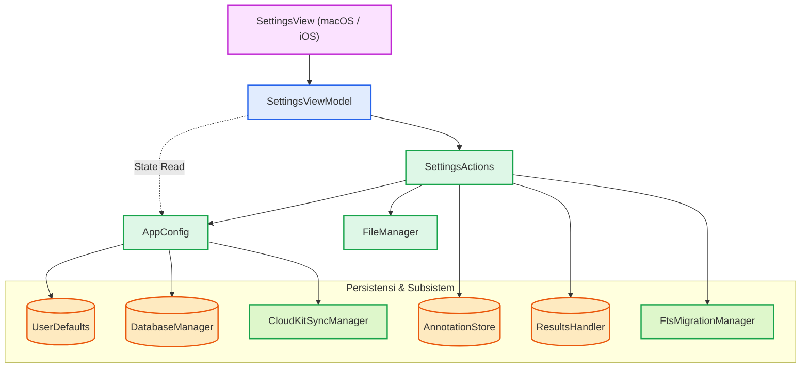

# Konfigurasi & Pengaturan Aplikasi (AppConfiguration & Settings)

Dokumentasi ini membedah arsitektur, pemisahan tanggung jawab, dan komponen teknis yang terlibat dalam konfigurasi aplikasi Maktabah, mulai dari manajemen *path* berkas, migrasi basis data, hingga alur kerja pengaturan pengguna (*Settings*).

---

## Alur Arsitektur (*Architecture Pipeline*)

Sistem pengaturan dan konfigurasi aplikasi dibangun dengan mengedepankan pemisahan logika tampilan dan logika sistem berkas.



### Prinsip Pemisahan Tanggung Jawab (*Separation of Concerns*)

Sistem memecah beban kerja ke dalam empat lapisan utama:

1. **`AppConfig` (Manajemen Direktori dan Kunci Konfigurasi)**
    Menangani penentuan lokasi penyimpanan aplikasi, *key* konstan untuk *UserDefaults*, dan pengelolaan opsi seperti Bundle Mode vs Custom Mode. Lapisan ini murni statis dan terisolasi dari antarmuka pengguna (*User Interface*).

2. **`SettingsActions` (Pengelola Aksi dan Efek Samping)**
    Menyediakan fungsi untuk menjalankan aktivitas I/O, seperti membuka jendela pemilihan sistem berkas (*folder picker*), memindahkan struktur folder, memvalidasi akses keamanan *sandbox*, dan memberitahukan modul pencarian atau basis data saat perpindahan selesai.

3. **`SettingsViewModel` (Manajemen Status Tampilan)**
    *Class* `Observable` tunggal (*singleton*) yang bertanggung jawab menghubungkan *state* internal dengan komponen UI. Jika terjadi konflik berkas (*collision*), *ViewModel* menyimpan statusnya untuk ditampilkan dalam dialog peringatan (*Alert*).

4. **`SettingsView` (Presentasi)**
    Tampilan SwiftUI yang menyesuaikan *form* berdasarkan sistem operasi (iOS/macOS). Komponen ini tidak memuat logika manipulasi berkas secara langsung.

---

## Logika Pemilihan Direktori dan Migrasi

### Direktori Pustaka (*Library Folder*)

Aplikasi menggunakan dua mode penyimpanan untuk basis data utama:

* **Bundle Mode (Bawaan)**:
    Aplikasi mengunduh dan menempatkan berkas inti (`main.sqlite`, `special.sqlite`) ke dalam `~/Library/Application Support/Maktabah/Caches/`.

* **Custom Mode (Kustom)**:
    Pengguna dapat menentukan direktori penyimpanan eksternal. Aplikasi menggunakan mekanisme `Security-Scoped Bookmark` untuk menyimpan izin akses sistem berkas terhadap folder kustom pengguna agar dapat diakses kembali setiap kali aplikasi dijalankan.

!!! note "Proses Migrasi Pustaka"
    Ketika pengguna berpindah dari Bundle Mode ke Custom Mode, aplikasi otomatis menyalin basis data dasar (`main.sqlite` dan `special.sqlite`) dari direktori *cache* ke subdirektori `Files` pada folder kustom yang dipilih. Hal ini memastikan aplikasi dapat langsung digunakan tanpa harus mengunduh ulang.

### Direktori Anotasi dan Hasil Pencarian

Anotasi dan hasil pencarian (`Annotations.sqlite`, `SearchResults.sqlite`) menggunakan basis data independen untuk mendukung sinkronisasi CloudKit.

Jika pengguna memindahkan direktori ini melalui tombol "Choose Annotations Folder", alur berikut dijalankan:

1. Sistem memverifikasi akses baca-tulis pada lokasi baru.
2. Sistem memutuskan sambungan basis data sementara di `AnnotationStore` dan `ResultsHandler`.
3. Seluruh berkas SQLite terkait beserta berkas jurnal *Write-Ahead Logging* (`-wal`, `-shm`) dipindahkan ke lokasi baru menggunakan `FileManager`.
4. Jika berkas serupa terdeteksi di tempat tujuan, sistem melemparkan (*throw*) galat `StorageError.collision` dan menampilkan dialog penyelesaian konflik (Timpa / Pertahankan).
5. Sambungan basis data dihubungkan kembali (*reconnect*) di lokasi baru.

---

## Bedah Komponen Teknis

### `AppConfig` (Enum)

Objek `AppConfig` direpresentasikan sebagai `enum` tanpa *case* sehingga tidak dapat diinstansiasi. Komponen ini menyimpan seluruh letak kunci preferensi konfigurasi.

```swift
enum AppConfig {
    static let storageKey = "selected_shamela_bookmark" // (1)!
    static let annotationsAndResultsFolder = "annotations_FolderPath"
    static let bundleModeKey = "use_bundle_database_mode"

    static var isUsingBundleMode: Bool { // (2)!
        get { UserDefaults.standard.bool(forKey: bundleModeKey) }
        set { UserDefaults.standard.set(newValue, forKey: bundleModeKey) }
    }

    static var archiveCachePath: String? { ... } // (3)!
    static var customDatabasePath: String? { ... }
}
```

1. Konstanta nama `key` yang digunakan untuk baca-tulis ke dalam `UserDefaults` sistem Apple.
2. *Computed property* Boolean yang mengabstraksi pemanggilan `UserDefaults` secara langsung.
3. Properti opsional untuk menentukan resolusi *path* internal (seperti folder *Cache*).

**Penjelasan Properti Utama Lainnya:**

* `databaseFilesPath`: Memeriksa ketersediaan `customDatabasePath`; jika tidak ada, sistem menggunakan `coreDatabasePath`.
* `bookReleaseBaseURL`: Menampung tautan GitHub Releases yang dipakai sebagai *base URL* pengunduhan berkas buku.
* `shouldCheckCoreVersion`: Memeriksa apakah jeda waktu dari pemeriksaan versi inti (*core*) terakhir telah melampaui enam bulan.

### `SettingsActions` (Enum)

`SettingsActions` memfasilitasi interaksi I/O eksternal dan pemindahan berkas.

```swift
@MainActor
enum SettingsActions {
    static func chooseAnnotationsAndResultsFolder(
        resolution: AppConfig.MigrationResolution = .ask,
        retryURL: URL? = nil,
        onCompletion: @escaping (Result<URL, Error>?) -> Void
    ) { ... }

    @discardableResult
    static func selectLibraryFolder(
        showSuccessAlert: Bool,
        shouldTerminateOnCancel: Bool,
        validate: ((URL) -> Error?)? = nil,
        onCompletion: ((Bool) -> Void)? = nil
    ) -> Bool { ... }
}
```

=== "macOS"
    Memanfaatkan komponen `NSOpenPanel` dengan konfigurasi `canChooseDirectories = true`.

=== "iOS"
    Membungkus dan memanggil delegasi `UIDocumentPickerViewController` (*Folder Picker*).

**Penjelasan Aksi Utama:**

* `chooseAnnotationsAndResultsFolder`: Menjalankan pemindahan direktori khusus anotasi, serta menangani `retryURL` untuk melanjutkan proses migrasi setelah pengguna menentukan opsi resolusi konflik berkas.
* `selectLibraryFolder`: Berfungsi dalam transisi penyimpanan basis data inti. Parameter validasi memeriksa apakah folder yang dipilih merupakan direktori pustaka yang valid.
* `switchToBundleMode`: Menangani aksi peralihan sistem berkas kembali ke *bundle mode* dan memeriksa kelengkapan berkas menggunakan `CoreDatabaseDownloader`.

### `SettingsViewModel` (Class)

*ViewModel* tunggal (*singleton*) ini menggunakan `@Observable` agar propertinya dapat dipantau langsung oleh antarmuka SwiftUI.

```swift
@Observable @MainActor
final class SettingsViewModel {
    static let shared: SettingsViewModel = .init()

    var isBundleMode: Bool = AppConfig.isUsingBundleMode
    var useICloud: Bool = AppConfig.useICloud
    var showCollisionAlert = false
    var isVacuuming: Bool = false
    ...
}
```

**Penjelasan Status Utama:**

* `isVacuuming`: Penanda status (*flag*) untuk menampilkan indikator pemuatan dan menonaktifkan tombol saat `BookArchiveIntegrator.shared.vacuumPendingArchives()` berjalan di latar belakang (*background thread*). Penanda ini digunakan pada `AppDelegate` macOS untuk menjalankan perintah `VACUUM` saat aplikasi ditutup, khususnya pada berkas basis data yang tabel bukunya telah dihapus saat aplikasi berjalan.
* `showCollisionAlert`: Menginstruksikan `SettingsView` untuk menampilkan peringatan konflik berkas saat migrasi.
* `pendingCollisionAction`: Menyimpan titik URL untuk melanjutkan proses migrasi setelah opsi penyelesaian konflik (timpa atau pertahankan) dipilih oleh pengguna.

---

## Status Enum dan Kesalahan (*Error Types*)

Sistem konfigurasi membungkus galat ke dalam *enum* yang terstruktur.

### `AppConfig.MigrationResolution` (Enum)

```swift
enum MigrationResolution {
    case ask
    case keepDestination
    case overwriteDestination
}
```

**Penjelasan Opsi Enum (*Enum Cases*):**

* `ask`: Metode migrasi berhenti dan mengembalikan (*return*) kesalahan jika mendeteksi berkas yang sama di direktori tujuan.
* `keepDestination`: Metode migrasi mempertahankan berkas yang sudah ada di direktori tujuan dan menghapus berkas asal.
* `overwriteDestination`: Metode migrasi memindahkan berkas dari direktori sumber dan menimpa berkas yang ada di direktori tujuan.

### `StorageError` (Enum)

Sistem melemparkan (`throw`) jenis enum `StorageError` apabila instruksi I/O mengalami kegagalan. Karena mengadopsi *protocol* `LocalizedError`, setiap *case* menyediakan deskripsi pesan galat standar.

```swift
enum StorageError: Error, LocalizedError {
    case invalidDirectory
    case cannotAccessSecurityScope
    case collision(URL?)
    case downloadTimeout(String)

    var errorDescription: String? { ... }
}
```

**Penjelasan Kasus Kesalahan:**

* `invalidDirectory`: *Path* URL tidak menunjuk ke direktori yang sah, melainkan berkas biasa, atau jalurnya tidak ditemukan di penyimpanan perangkat.
* `cannotAccessSecurityScope`: Mekanisme *sandbox* macOS atau iOS menolak perpanjangan izin `security-scoped bookmark` yang diperlukan untuk operasi baca-tulis berkas secara persisten.
* `collision`: Terdeteksi berkas identik di direktori tujuan (menyertakan *payload* URL tujuan).
* `downloadTimeout`: Batas waktu pengunduhan (*timeout*) terlampaui saat sinkronisasi berkas.
