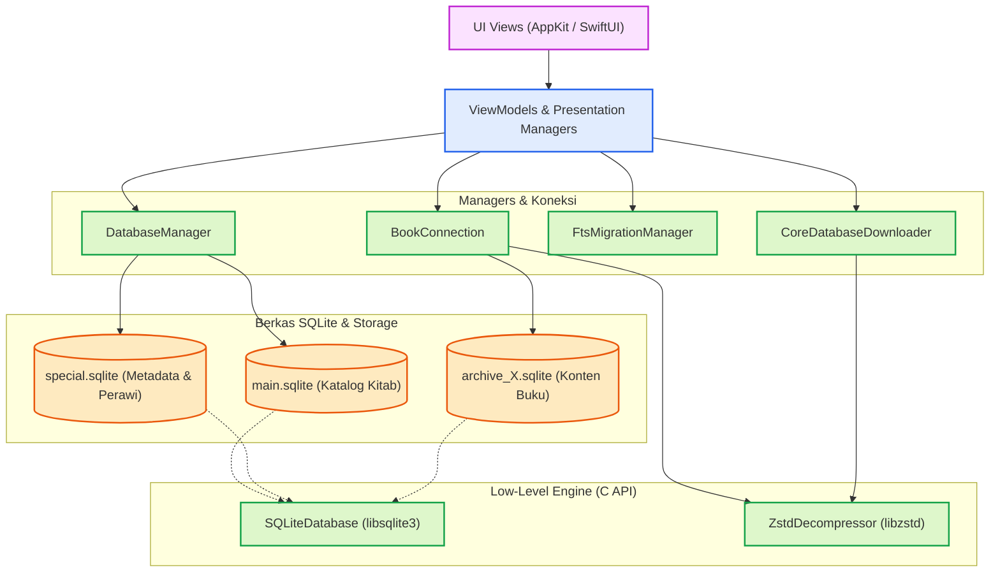
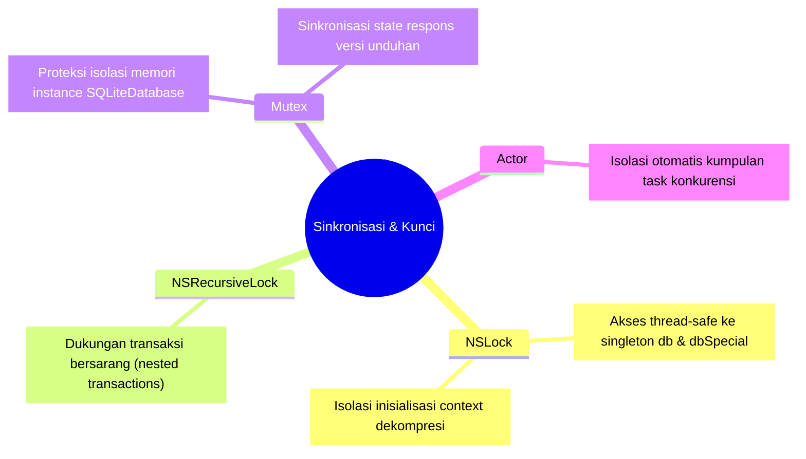

# Database

Dokumen ini membedah secara mendalam komponen dan arsitektur pengelolaan basis data pada aplikasi Maktabah. Seluruh lapisan, mulai dari pengelolaan koneksi tingkat rendah SQLite hingga sinkronisasi CloudKit dan dekompresi Zstandard, dibahas secara komprehensif.

## Alur Arsitektur (*Architecture Pipeline*)

!!! note "Interaksi Komponen"
    Diagram berikut menggambarkan bagaimana modul Basis Data bertindak sebagai jembatan antara lapisan presentasi, mesin pencari, dan berkas SQLite yang mendasarinya pada *disk*.



### Penjelasan Mekanisme Mutex & Locking

Aplikasi Maktabah sangat menekankan *thread-safety* untuk menghindari *race condition* saat membaca dan menulis basis data dari berbagai antrean (*queues*).



- `NSLock`: Digunakan di dalam `DatabaseManager` dan `ZSTDContextPool` untuk mengamankan akses ke properti *singleton* (seperti `db` dan `dbSpecial`) serta operasi inisialisasi folder/koneksi agar hanya satu *thread* yang dapat memodifikasi *state* dalam satu waktu.
- `NSRecursiveLock`: Digunakan pada `class` `SQLiteDatabase`. `NSRecursiveLock` memungkinkan satu *thread* untuk mengunci (*lock*) *resource* secara berulang tanpa menyebabkan *deadlock* pada *thread* yang sama. Hal ini sangat penting untuk *nested transactions* SQLite ketika metode pembungkus (*wrapper*) memanggil metode lain yang juga meminta kunci *lock*.
- `Mutex<T>` (dari *Synchronization framework* iOS/macOS 15+): Digunakan pada `BookConnection` (untuk membungkus *instance* `SQLiteDatabase`) dan `CoreDatabaseDownloader` (untuk membungkus respons versi) agar modifikasi referensi terjamin aman dan terisolasi secara *memory-safe*.
- `actor`: Digunakan pada `SingleFlight` untuk secara otomatis mengisolasi *state* (kumpulan *running tasks*), menghindari *data race* pada level konkurensi tugas (*task concurrency*).

### Prinsip Pemisahan Tanggung Jawab (*Separation of Concerns*)

Sistem basis data dirancang secara modular agar tidak terjadi tumpang tindih peran:

- **DatabaseManager**: Berperan sebagai pengelola basis data pusat (katalog buku, penulis, metadata utama). Modul ini tidak menangani isi buku, melainkan fokus pada pengelolaan lokasi berkas, status ketersediaan arsip, dan pemuatan *cache*.
- **SQLiteDatabase**: Merupakan *wrapper* tingkat rendah ke C-API SQLite (`libsqlite3`). Modul ini murni bertanggung jawab untuk eksekusi kueri, *prepared statements*, manajemen *locking*, dan abstraksi tingkat rendah.
- **BookConnection**: Menangani interaksi langsung dengan basis data arsip buku khusus (*archive*). Bertugas mengambil konten buku, memproses struktur daftar isi / TOC (*Table of Contents*), mendelegasikan dekompresi teks Zstandard (Zstd), serta mengelola `BookPageCache`.
- **CoreDatabaseDownloader**: Modul *standalone* yang memisahkan logika pengunduhan berkas (`main.sqlite` dan `special.sqlite`) dari GitHub Releases, ekstraksi dekompresi Zstd, serta pembaruan versi.
- **FtsMigrationManager & ArchiveDatabaseTools**: Dikhususkan untuk migrasi skema tabel *Full-Text Search* (FTS) di latar belakang (*background*), terpisah dari logika antarmuka dan pembacaan.

---

## Bedah Komponen Teknis

Berikut adalah perincian setiap *struct*, *class*, dan *enum* yang berada di dalam subsistem antarmuka basis data.

### 1. `SQLiteDatabase` (Class)

*Class* `SQLiteDatabase` membungkus interaksi dengan pustaka C SQLite agar berstatus *thread-safe* serta *Sendable*.

```swift
class SQLiteDatabase: @unchecked Sendable {
    let dbPointer: OpaquePointer // (1)!
    private let lock = NSRecursiveLock()
    private var savepointCounter: Int
    private var statementCache: [String: OpaquePointer] // (2)!
    private var cacheKeys: [String]
    private let maxCacheSize = 100
}
```

1. Mendeklarasikan *raw pointer* menuju koneksi `sqlite3`.
2. LRU Cache untuk menyimpan *prepared statements* agar kueri yang dieksekusi berulang kali tidak perlu diuraikan kembali oleh mesin SQLite.

- **Fungsi Utama**:
    - `transaction(_ block: () throws -> Void)`: Menjalankan transaksi aman atau menggunakan `SAVEPOINT` bila dipanggil di dalam transaksi yang sedang berjalan (*nested transaction*).
    - `execute(query: String, parameters: [Any])`: Menjalankan kueri modifikasi tanpa pengembalian baris data.
    - `fetch<T>(query: String, parameters: [Any], mapping: (SQLiteRow) throws -> T)`: Menjalankan *statement* `SELECT` dan memetakannya menjadi *array* objek model.
    - **Ekstensi OpaquePointer**: Memuat fungsi pembantu untuk *bind parameters*, membaca teks UTF-8 (`columnString`), hingga mengekstraksi *blob* Zstd dan melakukan dekompresi otomatis (`columnTextOrDecompressedBlob`).

### 2. `DatabaseManager` (Class)

Merupakan *singleton* utama penampung data katalog Maktabah.

```swift
class DatabaseManager {
    nonisolated(unsafe) static let shared: DatabaseManager
    private(set) var db: SQLiteDatabase?
    private(set) var dbSpecial: SQLiteDatabase?
    private let lock = NSLock()
    var shortsCache: [String: ShortsMapping]
    private var archiveAvailabilityCache: [Int: Bool]
}
```

- **Properti Utama**:
    - `db`: Koneksi ke `main.sqlite` untuk mendapatkan daftar kategori, penulis, dan daftar pustaka.
    - `dbSpecial`: Koneksi ke `special.sqlite` yang menyimpan informasi relasi (misalnya tabel penulis `Auth` atau tabel singkatan teks `shorts`).
- **Logika Sistem**:
    - `setupFolders()`: Membuka koneksi `db` dan `dbSpecial` sesuai *path* konfigurasi aplikasi. Apabila berkas tidak ditemukan, eksekusi dialihkan ke *mode read-only* atau memicu pengunduhan.
    - Fungsi *Fetch*: `fetchAllCategories()`, `fetchAllBooksGroupedByCategory()`, `fetchBook(byId:)`, yang memetakan baris hasil `SQLiteRow` ke *struct* model aplikasi.

### 3. `BookConnection` (Class)

Mengelola akses basis data masing-masing arsip buku berdasarkan pola *lazy loading*.

```swift
class BookConnection: @unchecked Sendable {
    private let _db = Mutex<SQLiteDatabase?>(nil)
    var db: SQLiteDatabase? { _db.withLock { $0 } }

    nonisolated(unsafe) static let tocTreeCache: NSCache<NSNumber, NSArray>
    nonisolated(unsafe) static let totalPartsCache: NSCache<NSString, NSNumber>
}
```

- **Logika Internal**:
    - `connect(archive: Int)`: Memastikan ketersediaan arsip buku di sistem berkas dan membuat *instance* `SQLiteDatabase` dari *path* arsip yang dituju.
    - `getContent(bkid:contentId:quran:)`: Mengambil rekaman data buku dari tabel `b{bkid}` (contoh `b1442`). Fungsi ini secara otomatis memeriksa status kompresi dan membaca konten melalui blok Zstd (bila berupa *blob*) lalu menyimpannya ke `BookPageCache`.
    - `buildTOCTree(from:bookId:)`: Memproses baris linier daftar isi menjadi hierarki *parent-child* `[TOCNode]` melalui algoritma *multiple-pass*. Menggunakan `tocTreeCache` agar performa pemuatan daftar isi tetap responsif.

### 4. `SingleFlight` (Actor)

Mencegah pemanggilan fungsi *async* yang sama persis bila operasi sebelumnya masih berjalan (menerapkan pola *request coalescing*).

```swift
actor SingleFlight<Key: Hashable, Value: Sendable> {
    private var runningTasks: [Key: Task<Value, Error>] = [:]
}
```

- **Cara Kerja**:
    - Saat metode `run(key:operation:)` dipanggil, pengecekan awal dilakukan pada *dictionary* `runningTasks`.
    - Jika *key* sudah ada, pemanggil akan menunggu hasil eksekusi tugas yang sedang berjalan (`await existingTask.value`).
    - Jika *key* belum terdaftar, *task* baru dibuat, disimpan, dan dieksekusi hingga selesai untuk mendistribusikan hasilnya ke seluruh pemanggil.

### 5. `ZstdDecompressor` (Enum) & `ZSTDContextWrapper` (Class)

Modul manajer khusus yang membungkus pustaka C Zstandard (`libzstd`) tingkat rendah secara *thread-safe* di platform Apple.

```swift
final class ZSTDContextWrapper: @unchecked Sendable {
    let dctx: OpaquePointer
}

enum ZstdDecompressor {
    static func decompressData(from ptr: UnsafeRawBufferPointer?) -> String
    static func compressData(_ text: String, level: Int32 = 10) -> Data?
}
```

- **ZSTDContextPool**: *Singleton pool* yang menjaga ketersediaan pembungkus konteks (`ZSTDContextWrapper`) melalui *lock pool array*. Pendekatan ini menghemat *overhead* pembuatan *decompressor context* pada setiap perulangan baris basis data.
- **Decompressor**:
    - Jika memori berupa *blob* Zstd dikenali (melalui parameter *frame* pada `ZSTD_getFrameContentSize`), data dialokasikan langsung dari pembungkus ke `String` Swift menggunakan `String(unsafeUninitializedCapacity:...)`. Ini merupakan optimasi performa tinggi tanpa penyalinan memori perantara (*zero-copy intermediate*).

### 6. `CoreDatabaseDownloader` (Class)

Komponen yang mengelola pemeriksaan pembaruan dan pengunduhan berkas basis data berukuran besar dari GitHub Releases.

```swift
final class CoreDatabaseDownloader: NSObject, Sendable {
    func areCoreFilesReady() -> Bool
    func fetchTotalDownloadSize() async -> Int64
    func startDownload(onProgress:onCompletion:)
}
```

- Menggunakan arsitektur `AsyncThrowingStream` yang dibungkus di dalam `class` delegasi pembantu (`CoreDownloadDelegate: URLSessionDownloadDelegate`).
- Mengekstrak dan mengonversi berkas arsip Zstandard (`.zst`) menjadi basis data `.sqlite` secara langsung (*on-the-fly*).

!!! note "Modal Pengunduhan Spesifik Platform"
    Modul pengunduhan memiliki subkomponen antarmuka bernama `CoreDownloadModalCenter` yang beradaptasi terhadap karakteristik masing-masing platform.

    === "macOS"
        Pada macOS, `class` `CoreDownloadModalCenter` menggunakan implementasi kontrol `NSApp.runModal(for: window!)` serta *sheet modal* (`NSWindow.beginSheet(_:)`) untuk memblokir interaksi secara sinkron ketika arsip diunduh paksa akibat tidak ditemukannya basis data bawaan.

    === "iOS"
        Pada iOS, antarmuka ini dialihkan menggunakan komponen SwiftUI sehingga referensi `NSWindow` ditiadakan. Implementasi jendela modal tersebut hanya dikompilasi pada target macOS melalui makro kompilasi.

### 7. `FtsMigrationManager` (Class) & `ArchiveDatabaseTools`

Modul internal untuk memigrasikan skema basis data lama atau tabel pencarian (*Full-Text Search*).

```swift
@Observable @MainActor
final class FtsMigrationManager {
    var isMigrating = false
    var progress: Double = 0.0
    func performMigration() async throws
}
```

- Bekerja menggunakan mekanisme tugas latar belakang tingkat OS (`UIBackgroundTaskIdentifier` pada iOS).
- Menggunakan `ArchiveDatabaseTools` untuk mengeksekusi kueri modifikasi tabel (seperti `DROP TABLE`, `CREATE VIRTUAL TABLE USING fts5`, serta pembersihan tag HTML dan harakat teks Arab melalui `stemArabicLight10()`).

---

## Enum dan Error Types

Seluruh notifikasi galat yang ditimbulkan subsistem ini distandarisasi dengan *custom error enum* menggunakan *protocol* `LocalizedError`.

### `ArchiveError` (Enum)

Menggambarkan permasalahan status sistem berkas pada repositori buku (arsip berkas SQLite 1–20).

```swift
enum ArchiveError: LocalizedError {
    case archiveNotAvailable(archiveId: Int)
    case ftsDatabaseNotAvailable(archiveId: Int)
    case archiveIncomplete(archiveId: Int)
    case databasePathNotAvailable
    case fileAlreadyExists(path: String)
    case fileNotReadable(path: String)
    case invalidPath(String)
    case connectionFailed(String)
}
```

### `DatabaseError` (Enum)

Pengecualian (*exception*) spesifik ketika terjadi kendala kueri pada manajer utama.

```swift
enum DatabaseError: Error, LocalizedError {
    case noConnection
    case authorNotFound(Int)
    case bookNotFound(Int)
    case other(String)
}
```

### `DBConnectionType` (Protocol)

*Protocol* `Sendable` standar yang berfungsi sebagai antarmuka abstrak bagi pembungkus SQLite agar komponen data tidak bergantung langsung pada `class` konkret.

```swift
protocol DBConnectionType: Sendable {
    func queryRows(sql: String, params: [SQLValue]) throws -> [[String: Any?]]
    func queryMapped<T>(sql: String, params: [SQLValue], mapper: (OpaquePointer) -> T) throws -> [T]
    func queryInts(sql: String, params: [SQLValue]) throws -> [Int]
    func execute(query: String) throws
    func attachDatabase(path: String, as schema: String) throws
    func queryContents(sql: String, params: [SQLValue]) throws -> [BookContent]
    func queryTarjamah(sql: String, params: [SQLValue], isIsoName: Bool) throws -> [TarjamahMen]
    func querySingleNass(sql: String, params: [SQLValue]) throws -> String?
}
```

!!! warning "Konteks Transaksi (Transaction Context)"
    Metode modifikasi tabel seperti `execute(query:)` tidak secara otomatis membungkus pemanggilan transaksi (`BEGIN TRANSACTION`). Transaksi tulis (*write*) harus dibuka dan ditutup dari sisi pemanggil dengan memanfaatkan `ArchiveDatabaseTools.withTransaction(db:)` atau menggunakan fitur `.transaction { }` dari `SQLiteDatabase`.
