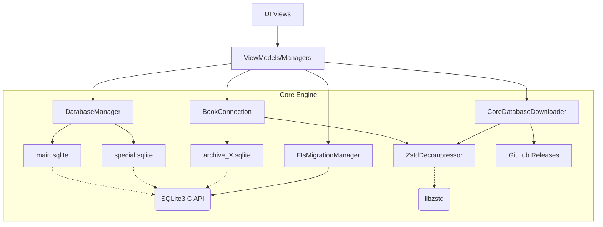

# Database

Dokumentasi ini membedah secara mendalam (deep-dive) komponen dan arsitektur pengelolaan database pada aplikasi Maktabah. Seluruh lapisan, dari manajemen koneksi rendah (SQLite) hingga pengelolaan sinkronisasi CloudKit dan dekompresi Zstd, dikupas tuntas.

## Aliran Arsitektur

!!! note "Interaksi Komponen"
    Diagram berikut menggambarkan bagaimana modul Basis Data bertindak sebagai jembatan antara lapisan presentasi, mesin pencari, dan file SQLite yang mendasarinya pada disk.



### Penjelasan Penggunaan Mutex/Lock

Aplikasi Maktabah sangat menekankan *thread-safety* untuk menghindari *race condition* saat membaca dan menulis database dari berbagai antrean (*queues*). Berikut adalah pendekatan penguncian yang digunakan:

- `NSLock`: Digunakan di dalam `DatabaseManager` dan `ZSTDContextPool` untuk mengamankan akses ke properti *singleton* (seperti `db` dan `dbSpecial`) serta operasi inisialisasi folder/koneksi agar hanya satu utas (*thread*) yang dapat mengubah *state* secara bersamaan.
- `NSRecursiveLock`: Digunakan pada kelas `SQLiteDatabase`. `NSRecursiveLock` memungkinkan satu utas (*thread*) untuk mengunci (*lock*) *resource* secara berulang-ulang tanpa menyebabkan *deadlock* pada utas yang sama. Ini sangat penting untuk transaksi SQLite (nested transactions) ketika metode pembungkus (*wrapper*) memanggil metode lain yang juga meminta kunci (*lock*).
- `Mutex<T>` (dari Synchronization framework iOS/macOS 15+): Digunakan pada `BookConnection` (untuk membungkus *instance* `SQLiteDatabase`) dan `CoreDatabaseDownloader` (untuk membungkus respons versi) agar modifikasi referensi terjamin aman dan terisolasi secara *memory-safe*.
- `actor`: Digunakan pada `SingleFlight` untuk secara otomatis mengisolasi *state* (kumpulan *running tasks*), menghindari kondisi *race* pada level *task concurrency*.

### Prinsip Pemisahan Tanggung Jawab (Separation of Concerns)

Sistem database dirancang secara modular agar tidak terjadi tumpang tindih peran:

- **DatabaseManager**: Berperan sebagai pengelola basis data pusat (katalog buku, penulis, metadata utama). Tidak menangani isi buku, tetapi hanya fokus pada pengelolaan lokasi *file*, status pengarsipan, dan pemuatan *cache*.
- **SQLiteDatabase**: Merupakan pembungkus level-rendah (*low-level wrapper*) ke C-API SQLite (`libsqlite3`). Tidak mempedulikan struktur bisnis/tabel. Tanggung jawabnya murni untuk *query*, *prepared statements*, manajemen kunci (*locking*), dan fungsi abstraksi tingkat rendah.
- **BookConnection**: Menangani interaksi langsung dengan basis data buku khusus (*archive*). Bertugas mengambil konten buku, menangani struktur TOC (*Table of Contents*), mendelegasikan kompresi teks (Zstd), dan menggunakan `BookPageCache`.
- **CoreDatabaseDownloader**: Modul *standalone* yang memisahkan logika pengunduhan *file* (`main.sqlite` dan `special.sqlite`) dari GitHub Releases, ekstraksi (*decompress*), serta pembaruan versi.
- **FtsMigrationManager & ArchiveDatabaseTools**: Keduanya dikhususkan untuk migrasi skema tabel *Full-Text Search* (FTS) secara *background*. Tidak tercampur dengan logika antarmuka atau logika pembacaan.

---

## Bedah Komponen Teknis

Berikut adalah perincian setiap *struct*, *class*, dan *enum* yang berada di dalam subsistem antarmuka database.

### 1. SQLiteDatabase

Kelas `SQLiteDatabase` membungkus interaksi dengan pustaka C SQLite agar berstatus aman *thread-safe* serta *sendable*.

```swift
class SQLiteDatabase: @unchecked Sendable {
    let dbPointer: OpaquePointer // (1)!
    private let lock = NSRecursiveLock()
    private var savepointCounter: Int
    private var statementCache: [String: OpaquePointer] // (2)!
    private var cacheKeys: [String]
    private let maxCacheSize = 100
}
```

1. Mendeklarasikan *pointer* mentah (*raw pointer*) menuju koneksi `sqlite3`.
2. LRU *Cache* untuk menyimpan `prepared statements` agar kueri yang dieksekusi berkali-kali tidak perlu diuraikan berulang-ulang oleh mesin SQLite.

- **Fungsi Utama**:
    - `transaction(_ block: () throws -> Void)`: Membuat transaksi aman atau menggunakan `SAVEPOINT` bila dipanggil di dalam transaksi yang sedang berjalan (*nested transaction*).
    - `execute(query: String, parameters: [Any])`: Menjalankan kueri (*statement*) modifikasi tanpa pengembalian baris.
    - `fetch<T>(query: String, parameters: [Any], mapping: (SQLiteRow) throws -> T)`: Menjalankan *statement* `SELECT` dan memetakannya menjadi *array* objek T.
    - **Ekstensi OpaquePointer**: Memuat fitur pembantu untuk *bind parameters*, membaca teks UTF-8 (`columnString`), hingga mengekstraksi blob Zstd lalu melakukan dekompresi otomatis (`columnTextOrDecompressedBlob`).

### 2. DatabaseManager

Merupakan *singleton* utama penampung data abstrak Maktabah.

```swift
class DatabaseManager {
    nonisolated(unsafe) static let shared: DatabaseManager
    private(set) var db: SQLiteDatabase?
    private(set) var dbSpecial: SQLiteDatabase?
    private let lock = NSLock()
    var shortsCache: [String: ShortsMapping]
    private var archiveAvailabilityCache: [Int: Bool]
}
```

- **Properti Utama**:
    - `db`: Koneksi ke `main.sqlite` untuk mendapatkan daftar kategori, penulis, dan daftar pustaka.
    - `dbSpecial`: Koneksi ke `special.sqlite` yang menyimpan informasi relasi (misal tabel *Auth* atau tabel abreviasi *shorts*).
- **Logika Sistem**:
    - `setupFolders()`: Membuka koneksi `db` dan `dbSpecial` sesuai path konfigurasi *app*. Apabila tidak ada *file*, program akan dihentikan atau dioper ke *mode read-only*.
    - Fungsi-fungsi *Fetch*: `fetchAllCategories()`, `fetchAllBooksGroupedByCategory()`, `fetchBook(byId:)`, yang memetakan barisan hasil `SQLiteRow` ke *struct* model aplikasi.

### 3. BookConnection

Mengelola akses basis data masing-masing arsip buku berdasar pola *pool/lazy loading*.

```swift
class BookConnection: @unchecked Sendable {
    private let _db = Mutex<SQLiteDatabase?>(nil)
    var db: SQLiteDatabase? { _db.withLock { $0 } }

    nonisolated(unsafe) static let tocTreeCache: NSCache<NSNumber, NSArray>
    nonisolated(unsafe) static let totalPartsCache: NSCache<NSString, NSNumber>
}
```

- **Logika Internal**:
    - `connect(archive: Int)`: Memastikan tersedianya arsip buku di sistem berkas dan membuat instansiasi `SQLiteDatabase` dari *path* arsip yang dituju.
    - `getContent(bkid:contentId:quran:)`: Mengambil rekaman data buku dari tabel `b{bkid}` (contoh `b1442`). Secara otomatis memeriksa status kompresi dan membaca konten melalui blok Zstd (bila berwujud *blob*) lalu menyimpannya ke `BookPageCache`.
    - `buildTOCTree(from:bookId:)`: Memproses barisan linier daftar isi menjadi hierarki anak dan induk `[TOCNode]` melalui *multiple-pass algorithm*. Memanfaatkan `tocTreeCache` agar performa memuat daftar isi tetap gegas.

### 4. SingleFlight

Mencegah pemanggilan fungsi *async* yang sama persis bila operasi sebelumnya masih sedang berjalan, sering dikenal sebagai fitur penyatuan tugas (*request coalescing* / *debouncing*).

```swift
actor SingleFlight<Key: Hashable, Value: Sendable> {
    private var runningTasks: [Key: Task<Value, Error>] = [:]
}
```

- **Cara Kerja**:
    - Saat metode `run(key:operation:)` dipanggil, pengecekan awal dilakukan ke *dictionary* `runningTasks`.
    - Jika *key* sudah digunakan, pengakses akan disisipkan untuk menunggu hasil eksekusi tugas yang sudah berjalan (*await existingTask.value*).
    - Jika *key* belum dipakai, maka *task* baru dibentuk, disimpan, dan akhirnya dituntaskan untuk disebarkan hasilnya kepada setiap penunggu.

### 5. ZstdDecompressor & ZSTDContextWrapper

Kelas manajer khusus membungkus pustaka *C Zstandard* (`libzstd`) tingkat rendah secara *thread-safe* di platform Apple.

```swift
final class ZSTDContextWrapper: @unchecked Sendable {
    let dctx: OpaquePointer
}

enum ZstdDecompressor {
    static func decompressData(from ptr: UnsafeRawBufferPointer?) -> String
    static func compressData(_ text: String, level: Int32 = 10) -> Data?
}
```

- **ZSTDContextPool**: *singleton class pool* yang menjaga ketersediaan pembungkus koneksi konteks (`ZSTDContextWrapper`) lewat *lock pool array*. Ini menghemat *overhead* pembuatan *decompressor context* di tiap perulangan baris database.
- **Decompressor**:
    - Jika memori berupa blob Zstd dikenali (lewat frame parameter di `ZSTD_getFrameContentSize`), maka ia dialokasikan langsung dari pembungkus ke `String` Swift menggunakan `String(unsafeUninitializedCapacity:...)`. Ini adalah optimasi ekstrim yang tidak menyalin memori perantara (*zero-copy intermediate*).

### 6. CoreDatabaseDownloader

Komponen pengunduhan yang mengurus pencarian *update* dan penarikan berkas *database* berukuran besar dari relis GitHub.

```swift
final class CoreDatabaseDownloader: NSObject, Sendable {
    func areCoreFilesReady() -> Bool
    func fetchTotalDownloadSize() async -> Int64
    func startDownload(onProgress:onCompletion:)
}
```

- Menggunakan arsitektur `AsyncThrowingStream` yang dibungkus di dalam kelas delegasi pembantu (`CoreDownloadDelegate: URLSessionDownloadDelegate`).
- Melakukan konversi format *Zstd archive* (`.zst`) menjadi ekstensi biasa `.sqlite` secara instan (*on-the-fly*) bila tipe datanya zst.

!!! note "Platform Khusus Modal Pengunduhan"
    Bagian manajemen unduhan memiliki sub-kelas antarmuka bernama `CoreDownloadModalCenter`. Mode pemanggilan dan interaksinya beradaptasi penuh terhadap arsitektur masing-masing.

    === "macOS"
        Pada macOS, kelas `CoreDownloadModalCenter` dikompilasi secara asli. Menggunakan implementasi kontrol `NSApp.runModal(for: window!)` serta dukungan *Sheet Modal* (`NSWindow.beginSheet(_:)`) untuk memblokir secara *synchronous* ketika arsip diunduh paksa akibat tidak ditemukannya basis data bawaan.

    === "iOS"
        Pada iOS, tampilan modifikasi ini diserahkan pada infrastruktur pembungkus SwiftUI sehingga referensi `NSWindow` dibuang dan tidak dikompilasi secara *native*. Implementasi jendela pembungkus tersebut hanya muncul di berkas macOS spesifik (jika diarahkan ke *macro* kompilasi app).

### 7. FtsMigrationManager & ArchiveDatabaseTools

Modul yang dipakai secara internal untuk mengubah skema basis data lama atau tabel pencarian (*Full-Text Search*).

```swift
@Observable @MainActor
final class FtsMigrationManager {
    var isMigrating = false
    var progress: Double = 0.0
    func performMigration() async throws
}
```

- Bekerja menggunakan mekanisme tugas latar belakang tingkat OS (`UIBackgroundTaskIdentifier` pada iOS).
- Secara otomatis menggunakan `ArchiveDatabaseTools` untuk mengelola kueri penyalinan baris (misal `DROP TABLE`, `CREATE VIRTUAL TABLE USING fts5`, serta iterasi pencabutan token *HTML/Harakat* (`stemArabicLight10()`)).

---

## Enum dan Error Types (Status Definitions)

Seluruh notifikasi galat yang ditimbulkan sub-sistem ini diregulasi dengan *custom error enum* menggunakan standar tipe `LocalizedError`.

### ArchiveError

Menggambarkan permasalahan status sistem berkas pada repositori buku (arsip berkas SQLite 1-20).

```swift
enum ArchiveError: LocalizedError {
    case archiveNotAvailable(archiveId: Int)
    case ftsDatabaseNotAvailable(archiveId: Int)
    case archiveIncomplete(archiveId: Int)
    case databasePathNotAvailable
    case fileAlreadyExists(path: String)
    case fileNotReadable(path: String)
    case invalidPath(String)
    case connectionFailed(String)
}
```

### DatabaseError

Pengecualian spesifik manakala ada kejanggalan dalam *query* bisnis di manajer utama.

```swift
enum DatabaseError: Error, LocalizedError {
    case noConnection
    case authorNotFound(Int)
    case bookNotFound(Int)
    case other(String)
}
```

### DBConnectionType (Protokol)

Protokol *Sendable* standar yang dibuat sebagai antarmuka abstrak bagi pembungkus SQLite supaya perantara data bisa dilalui tanpa bergantung langsung pada *class* konkret.

```swift
protocol DBConnectionType: Sendable {
    func queryRows(sql: String, params: [SQLValue]) throws -> [[String: Any?]]
    func queryMapped<T>(sql: String, params: [SQLValue], mapper: (OpaquePointer) -> T) throws -> [T]
    func queryInts(sql: String, params: [SQLValue]) throws -> [Int]
    func execute(query: String) throws
    func attachDatabase(path: String, as schema: String) throws
    func queryContents(sql: String, params: [SQLValue]) throws -> [BookContent]
    func queryTarjamah(sql: String, params: [SQLValue], isIsoName: Bool) throws -> [TarjamahMen]
    func querySingleNass(sql: String, params: [SQLValue]) throws -> String?
}
```

!!! warning "Ketentuan Transaksi (Transaction Context)"
    Metode modifikasi tabel seperti `execute(query:)` tidak secara transparan membungkus pemanggilan transaksi (`BEGIN TRANSACTION`). Transaksi *write* harus ditutup dan dibuka dari sisi implementor dengan memanggil abstraksi *tools* seperti `ArchiveDatabaseTools.withTransaction(db:)` atau menggunakan fitur `.transaction { }` dari `SQLiteDatabase`.
