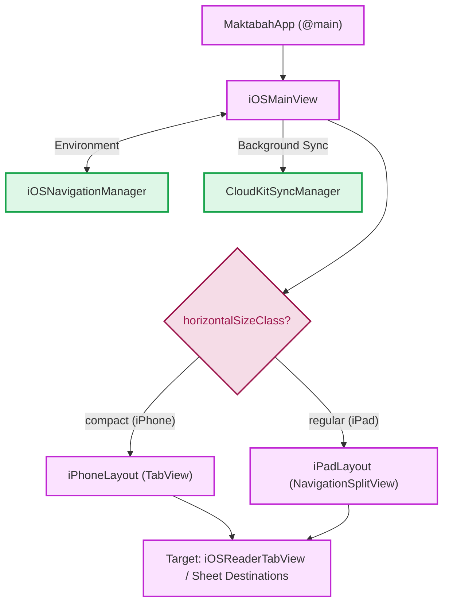
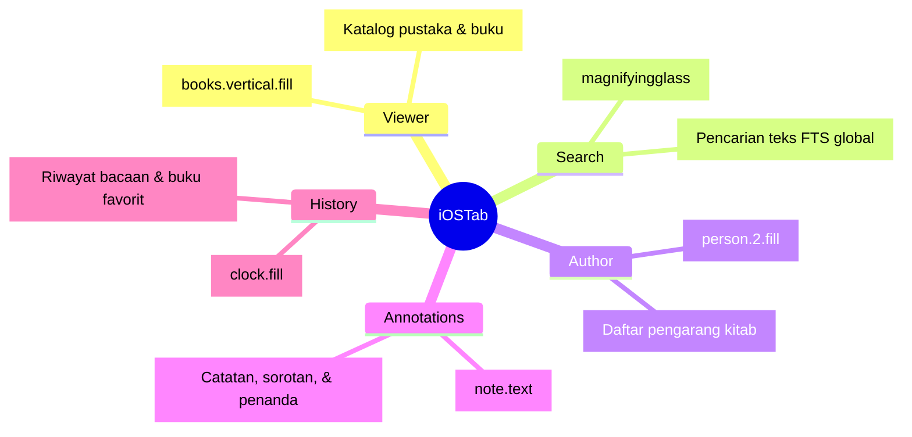
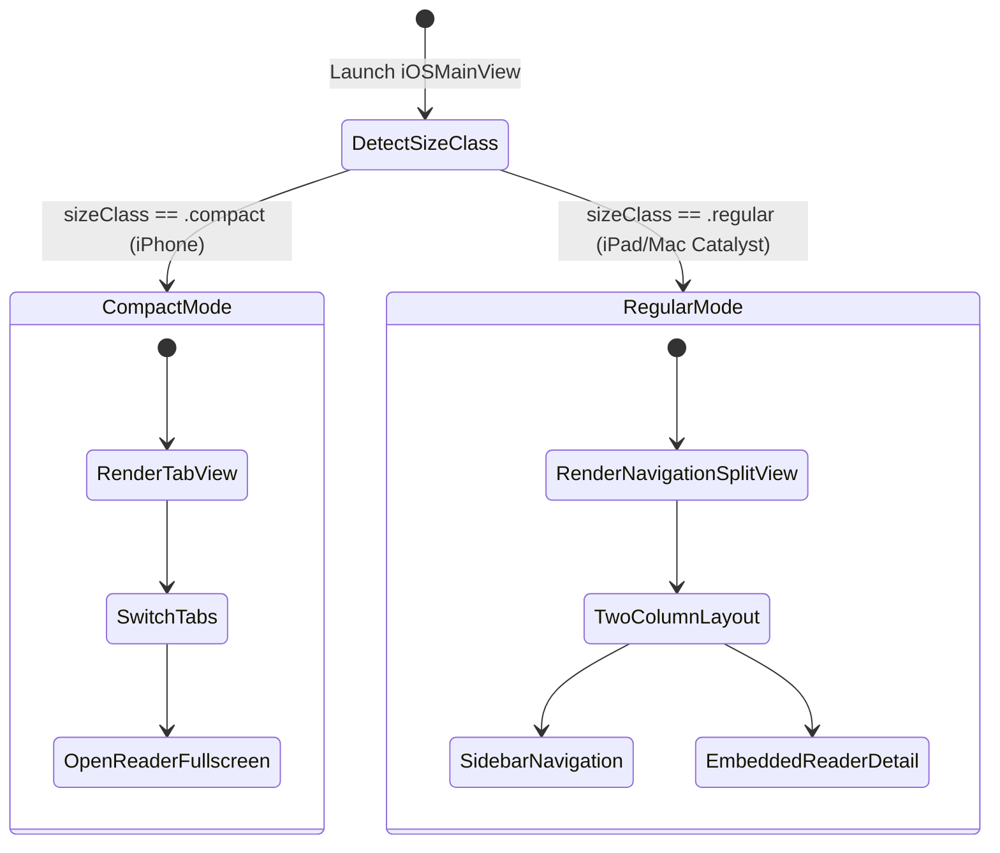

# Dokumentasi iOS Core UI (iOSMainView)

Dokumen ini membedah arsitektur dan implementasi antarmuka utama (*Core UI*) untuk platform iOS pada aplikasi Maktabah yang berpusat pada `iOSMainView`.

## Arsitektur & Interaksi Komponen

Aliran data dan navigasi dimulai dari titik masuk aplikasi (`MaktabahApp`) menuju `iOSMainView`, yang kemudian membagi tata letak berdasarkan kelas ukuran layar (*Size Class*) antara iPhone dan iPad.

### A. Hierarki Penentuan Tata Letak (*Layout Router*)

### B. Taksonomi Tab Navigasi (`iOSTab`)

### C. Siklus Transisi Tata Letak Responsif

## Komponen Inti: iOSMainView

`iOSMainView` adalah kontainer utama yang merespons perubahan *environment* dan menentukan tata letak yang sesuai.

### `iOSMainView` (Struct)

Tanggung jawab utama `iOSMainView`:

- **Routing Berbasis Lingkungan**: Memeriksa `horizontalSizeClass`. Jika bernilai `.regular` (iPad / Mac Catalyst), sistem merender `iPadLayout`. Jika bernilai `.compact` (iPhone), sistem merender `iPhoneLayout`.
- **Manajemen State Global**: Mengelola `@State` untuk navigasi (`iOSNavigationManager`), tab yang dipilih (`selectedTab`), visibilitas kolom iPad, serta status tampilan *sheet* (Pengaturan / Donasi).
- **Deep Linking**: Menangani `.onOpenURL` untuk membuka anotasi tertentu atau riwayat bacaan berdasarkan URL WidgetKit.
- **Siklus Hidup (*Lifecycle*)**: Memantau perubahan `scenePhase`. Saat bernilai `.active`, sistem memicu sinkronisasi `CloudKitSyncManager` dan mencatat aktivasi aplikasi pada `DonationManager`.

!!! note "Lifecycle"
    `iOSMainView` bereaksi pada fase *scene* `.active` untuk menyerap perubahan sinkronisasi CloudKit dan memperbarui status donasi secara otomatis.

### `iOSTab` (Enum)

Enum `iOSTab` mendefinisikan menu navigasi utama dengan 5 pilihan:

- `viewer` (Perpustakaan)
- `search` (Pencarian)
- `author` (Perawi / *Narrators*)
- `annotations` (Anotasi)
- `history` (Riwayat & Favorit)

Setiap *case* memiliki properti pendukung:

- `id`: Nilai integer unik berbasis `rawValue`.
- `title`: Teks judul terlokalisasi.
- `icon`: Nama ikon *SF Symbols*.
- `appMode`: Pemetaan ke tipe `AppMode` global.

## Navigasi dan Tata Letak

Pendekatan antarmuka Maktabah bersifat adaptif dengan memisahkan alur navigasi antara iPhone dan iPad:

=== "iPhone (TabView)"

    ### `iPhoneLayout`

    Pada iPhone, aplikasi menggunakan bilah tab (**TabView**) di bagian bawah layar. `iPhoneLayout` membungkus setiap menu tab dengan `NavigationStack` tersendiri sehingga navigasi subhalaman di satu tab tidak memengaruhi tab lainnya.

    Fitur utama:

    - **Penyimpanan State Tab**: Menggunakan `@AppStorage("lastSelectedTab")` agar aplikasi mempertahankan tab terakhir yang aktif saat dibuka kembali.
    - **Pemilihan Tab (*Tab Selection*)**: Saat pengguna berpindah tab, blok `.onChange` menginstruksikan `iOSNavigationManager` untuk mengganti mode via `switchToMode(newValue.appMode)`.
    - **Pencarian Terintegrasi**: Setiap `NavigationStack` mengimplementasikan modifier `.searchable(...)` yang terikat (*binding*) ke teks pencarian pada ViewModel masing-masing.

    Struktur Tab:

    - **Library (Viewer)**: Memanggil `iOSLibraryView()`.
    - **Search**: Memanggil `SearchModeView()`.
    - **Author**: Memanggil `AuthorModeView()`.
    - **Annotations**: Memanggil `AnnotationListView()` dengan dukungan `.searchScopes`.
    - **History**: Memanggil `iOSHistoryView()` dan menyertakan tombol `HomeToolbarItems` untuk menambah favorit.

=== "iPad (Sidebar)"

    ### `iPadLayout`

    Pada iPad, aplikasi menggunakan **NavigationSplitView** (tata letak 2–3 kolom) untuk memaksimalkan area layar lebar. Navigasi ditempatkan pada *sidebar* (kolom kiri) dan pembaca buku (*Reader*) pada kolom detail (kanan).

    Fitur utama:

    - **Sidebar (Master)**: Menampilkan menu navigasi dalam format `List` dengan `ThemeList`.
    - **Integrasi Riwayat & Favorit**: Pada iPad, bagian Riwayat dan Favorit langsung dimuat di dalam *sidebar* (menggunakan `HistorySection` dan `FavoritesSection`).
    - **Filter Sidebar Lokal**: *Sidebar* memiliki kolom pencarian khusus (`sidebarSearchText`) untuk menyaring daftar buku favorit dan riwayat secara langsung (`filterSidebarBooks`).
    - **Tujuan Navigasi (*Destination*)**: Memilih item *sidebar* akan memicu `.navigationDestination` untuk memperbarui area konten dengan tampilan yang sesuai (`libraryDestination`, `searchDestination`, dll.).
    - **Reader Persisten**: Kolom detail kanan menampilkan `iOSReaderTabView()` secara persisten sehingga perpindahan menu pada *sidebar* tidak menutup buku yang sedang dibaca.

    Saat buku dibuka dari Riwayat atau Favorit, `iPadLayout` memanggil `bManager.openBook(...)` dengan ID konten terakhir.

## Komponen UI Tambahan

Beberapa ekstensi dan struktur pembantu digunakan untuk menyeragamkan presentasi antarmuka:

- **Modifier `adaptiveReaderPush`**:
    Ekstensi pada `View` yang mendeklarasikan `.navigationDestination(item: ...)` untuk membuka layar pembaca (`iOSReaderView`). Modifier ini secara cerdas mencari tab yang sudah terbuka di `iOSNavigationManager` guna mempertahankan status ViewModel dan riwayat bacaan.

- **Modifier `toolbarGeneral`**:
    Menambahkan tombol ikon pengaturan (*gear*) pada sisi *leading* *toolbar* di semua halaman tab.

- **`CustomToolbarSpacer`**:
    Komponen pembantu `ToolbarContent` yang membungkus `ToolbarSpacer` bawaan untuk memberikan spasi *toolbar* pada `.topBarLeading`.

- **`HomeToolbarItems`**:
    Kumpulan kontrol *toolbar* pada `iPhoneLayout.swift` yang memuat tombol Pengaturan (kiri) dan tombol Tambah Favorit (kanan).
