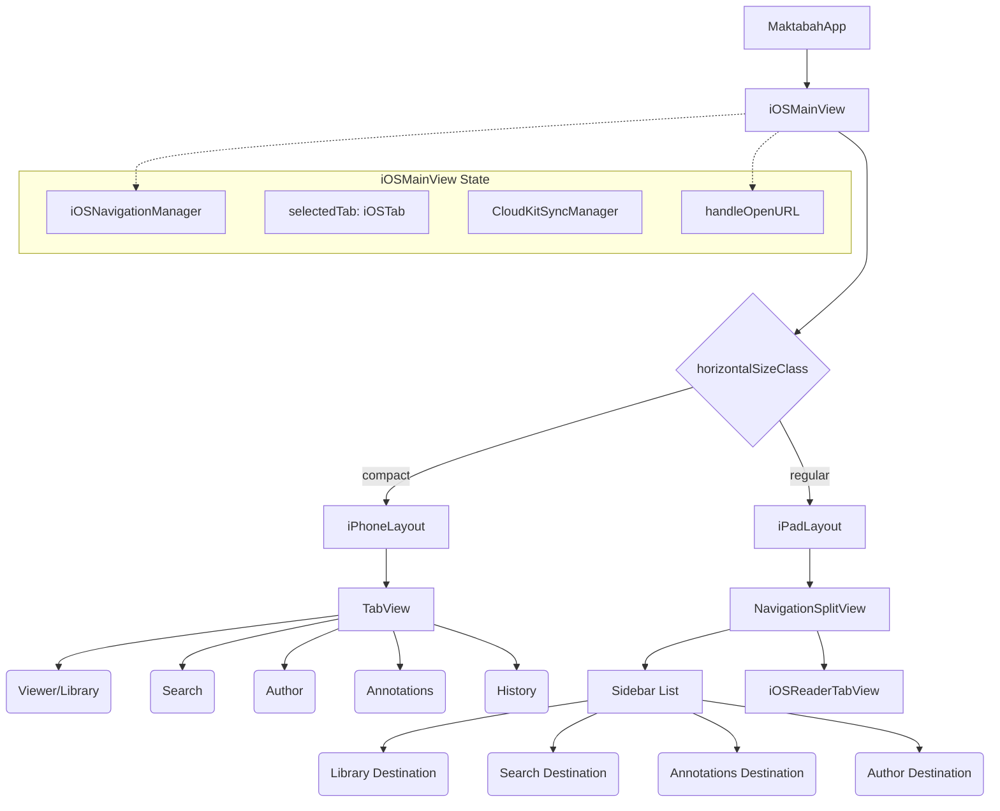

# Dokumentasi iOS Core UI (iOSMainView)

Dokumen ini membedah arsitektur dan implementasi antarmuka utama (Core UI) untuk platform iOS pada aplikasi Maktabah, yang berpusat pada `iOSMainView`.

## Arsitektur & Interaksi Komponen

Aliran data dan navigasi dimulai dari titik masuk aplikasi (`MaktabahApp`) menuju `iOSMainView`, yang kemudian membagi tata letak berdasarkan kelas ukuran layar (Size Class) antara iPhone dan iPad.

## Komponen Inti: iOSMainView

`iOSMainView` adalah kontainer utama yang merespons perubahan *environment* dan menentukan tata letak yang tepat.

### Struct `iOSMainView`

Tanggung jawab utama dari `iOSMainView`:

- **Routing Berbasis Lingkungan**: Mengecek `horizontalSizeClass`. Jika `.regular` (iPad/Mac), menggunakan `iPadLayout`. Jika sebaliknya (iPhone), menggunakan `iPhoneLayout`.
- **Manajemen State Global**: Memegang `@State` untuk navigasi (`iOSNavigationManager`), tab yang dipilih (`selectedTab`), visibilitas kolom iPad, dan status sheet (Pengaturan/Donasi).
- **Deep Linking**: Menangani `.onOpenURL` untuk membuka anotasi spesifik atau riwayat bacaan berdasarkan URL WidgetKit.
- **Siklus Hidup (Lifecycle)**: Mendengarkan perubahan `scenePhase`. Saat aktif, memicu sinkronisasi `CloudKitSyncManager` dan mencatat aktivasi aplikasi di `DonationManager`.

!!! note "Lifecycle"
    `iOSMainView` bereaksi pada `.active` scene phase untuk mengambil perubahan sinkronisasi (CloudKit) dan mengelola status donasi secara otomatis.

### Enum `iOSTab`

Enum `iOSTab` mendefinisikan menu navigasi utama. Tersedia 5 kasus:

- `viewer` (Perpustakaan)
- `search` (Pencarian)
- `author` (Perawi/Narrators)
- `annotations` (Anotasi)
- `history` (Riwayat & Favorit)

Masing-masing memiliki properti dinamis:

- `id`: Berbasis `rawValue` (Int) untuk identifikasi unik.
- `title`: String terlokalisasi.
- `icon`: Nama ikon *SFSymbol*.
- `appMode`: Pemetaan ke `AppMode` (mode global aplikasi).

## Navigasi dan Tata Letak

Pendekatan UI Maktabah sangat adaptif, memisahkan implementasi navigasi secara drastis untuk iPhone dan iPad.

=== "iPhone (TabView)"

    ### `iPhoneLayout`

    Di iPhone, aplikasi menggunakan standar **TabView** di bagian bawah layar. `iPhoneLayout` membungkus setiap menu utama (tab) dengan `NavigationStack` sendiri, sehingga pengguna bisa menavigasi sub-halaman di satu tab tanpa mempengaruhi tab lainnya.

    Fitur utama:

    - **Penyimpanan State Tab**: Menggunakan `@AppStorage("lastSelectedTab")` agar aplikasi mengingat tab terakhir saat dibuka kembali.
    - **Tab Selection**: Saat pengguna berpindah tab, metode `.onChange` akan menginstruksikan `iOSNavigationManager` untuk mengganti mode via `switchToMode(newValue.appMode)`.
    - **Pencarian Terintegrasi**: Setiap `NavigationStack` dalam tab mengimplementasikan `.searchable(...)` dengan `Binding` ke teks pencarian pada ViewModel masing-masing.

    Struktur Tab:

    - **Library (Viewer)**: Memanggil `iOSLibraryView()`.
    - **Search**: Memanggil `SearchModeView()`.
    - **Author**: Memanggil `AuthorModeView()`.
    - **Annotations**: Memanggil `AnnotationListView()` dengan `.searchScopes` tambahan.
    - **History**: Memanggil `iOSHistoryView()` dan menyertakan toolbar khusus `HomeToolbarItems` untuk menambah favorit.

=== "iPad (Sidebar)"

    ### `iPadLayout`

    Di iPad, aplikasi memanfaatkan **NavigationSplitView** (layout 2-3 kolom) untuk memaksimalkan ukuran layar lebar. `iPadLayout` sangat berbeda dari iPhone karena navigasi diletakkan di sidebar (kolom kiri) dan konten pembaca (Reader) di kolom detail (kanan).

    Fitur utama:

    - **Sidebar (Master)**: Menampilkan menu tab dalam format `List` dengan `ThemeList`.
    - **Integrasi History & Favorites**: Berbeda dengan iPhone yang mendedikasikan satu tab penuh, di iPad, bagian History dan Favorites langsung dimuat di dalam Sidebar (menggunakan `HistorySection` dan `FavoritesSection`).
    - **Filter Sidebar Lokal**: Sidebar memiliki bar pencarian khusus (`sidebarSearchText`) yang berguna untuk memfilter daftar buku favorit dan riwayat secara instan (`filterSidebarBooks`).
    - **Navigasi Destination**: Klik pada item sidebar `.navigationDestination` akan mengubah area tengah/konten dengan view bersangkutan (`libraryDestination`, `searchDestination`, dll.).
    - **Reader Konstan**: Kolom detail/kanan secara persisten menggunakan `iOSReaderTabView()`, sehingga perpindahan mode (Pencarian ke Perpustakaan) tidak menutup buku yang sedang dibaca.

    Saat sebuah buku dibuka dari History/Favorites, `iPadLayout` akan memanggil `bManager.openBook(...)` dengan konten ID terakhir.

## Komponen UI Tambahan

Beberapa ekstensi dan struktur tambahan digunakan di seluruh Core UI untuk menyeragamkan presentasi:

- **Modifier `adaptiveReaderPush`**:
    Fungsi khusus dalam `extension View` yang mendeklarasikan `.navigationDestination(item: ...)` untuk membuka layar pembaca (`iOSReaderView`). Modifier ini secara cerdas mencari tab yang sudah terbuka di `iOSNavigationManager` untuk mempertahankan riwayat bacaan/status viewModel.

- **Modifier `toolbarGeneral`**:
    Menambahkan tombol ikon pengaturan (gear) pada sisi *leading* toolbar untuk semua halaman tab.

- **`CustomToolbarSpacer`**:
    Objek pembantu `ToolbarContent` yang membungkus `ToolbarSpacer` asli. Digunakan untuk mengatasi keterbatasan versi API iOS dengan memberikan spasi toolbar pada `.topBarLeading`.

- **`HomeToolbarItems`**:
    Berada di `iPhoneLayout.swift`, ini adalah kumpulan kontrol toolbar ringkas yang berisi tombol Pengaturan (kiri) dan tombol Tambah Favorit (kanan).
