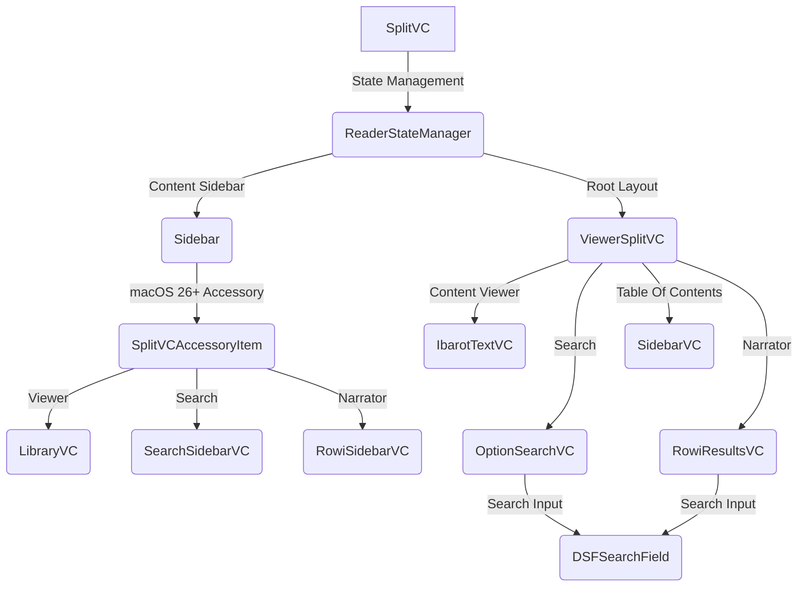

# SplitVC & Core UI (macOS)

Dokumentasi ini membedah implementasi `SplitVC` sebagai container terpadu untuk berbagai mode aplikasi di Maktabah (Viewer, Search, dan Narrator), beserta komponen-komponen UI pendukungnya.

## Arsitektur & Interaksi Komponen

Diagram berikut menggambarkan bagaimana `SplitVC` berinteraksi dengan berbagai layer `NSViewController` dan manajer state dalam arsitektur aplikasi.

## Bedah SplitVC & State Manajemen

`SplitVC` adalah subclass dari `NSSplitViewController` yang bertindak sebagai fondasi utama tata letak Maktabah. Daripada membuat window atau split view controller terpisah untuk setiap mode, Maktabah mendaur ulang instance ini untuk menghemat memori dan memperhalus transisi.

### Mode & State Management

Manajemen state seperti tata letak ketebalan panel, status *collapsed* dari sidebar, hingga elemen aktif diatur secara persisten menggunakan `ReaderStateManager`.

* **Peralihan Mode (`switchToMode(_:)`)**
    Ketika berganti mode (misalnya dari Viewer ke Search), aplikasi mengeksekusi langkah-langkah berikut:
    1. Menyimpan state (layout, *collapsed state*) mode saat ini melalui `stateManager.saveState`.
    2. Membersihkan layar konten bacaan (`ibarotTextVC.textView.string.removeAll()`).
    3. Menghapus seluruh sub-item `splitViewItems` kecuali satu *persistent container* (`sidebarItem`).
    4. Mengonfigurasi ulang child controllers untuk mode yang baru (via `setupForMode`).
    5. Mengembalikan state tersimpan milik mode baru menggunakan `stateManager.restoreState`.

* **Menyimpan State (`persistCurrentStateToDisk()`)**
    Setiap perubahan rasio UI secara proaktif disimpan ke *disk* sehingga saat aplikasi direstart, state (termasuk status *collapsed* panel anotasi atau daftar isi) tidak hilang.

### Struct, Class, & Enum Terkait

* **`AppMode` (Enum)**
    Representasi dari mode aktif pada layar utama aplikasi.

    * `.viewer`: Mode baca buku tunggal dengan library pada sidebar.
    * `.search`: Mode pencarian komprehensif (FTS) dengan filter pada sidebar dan hasil pencarian di panel bawah.
    * `.narrator`: Mode ensiklopedia perawi dengan daftar nama pada sidebar dan hasil analisis perawi di panel bawah.

* **`SplitVC` (Class)**
    Komponen sentral (`NSSplitViewController`).

    * Secara dinamis memuat komponen lazily seperti `ibarotTextVC` dan `viewerSplitVC`.
    * Memiliki referensi instan ke seluruh varian Sidebar: `libraryVC`, `searchSidebarVC`, dan `rowiSidebarVC`.
    * Mengontrol visibilitas alat-alat pencarian (`hideLibrarySearchField()`, `setupSearchFieldTahoe()`).
    * Meneruskan event ke *content renderer* terkait, seperti `nextPage()`, `prevPage()`, atau `displayAnnotations()`.

## Komponen Pendukung

=== "SplitView Logic"

    ### CustomSplitView

    `CustomSplitView` adalah subclass khusus `NSSplitView` yang memberikan fleksibilitas untuk mengubah tampilan antarmuka pemisah panel (*divider*), menyesuaikan diri dengan skema tema bacaan (seperti sepia atau mode malam).

    * **Warna Custom (`customDividerColor`)**: Properti khusus untuk meng-override warna pembatas bawaan macOS (`.separatorColor`). Nilai baru akan memicu kalkulasi ulang tata letak melalui `setNeedsDisplay` dan `layoutSubtreeIfNeeded()` pada blok `DispatchQueue.main.async`.
    * **Ketebalan Pembatas (`dividerThickness`)**: Mengganti ketebalan garis menjadi tepat `1.0` poin untuk menjaga desain tetap minimalis.
    * **Adaptasi Background**: Fungsi `updateDividerColor(to bgColor: BackgroundColor)` melakukan injeksi warna pemisah berdasarkan tema bacaan, mencakup nuansa `.darkSepia`, `.sepia`, `.black`, `.gray`, hingga `.white` yang dikalkulasi dengan tingkat bayangan dinamis (`shadow(withLevel:)`).

=== "Toolbar & Accessory"

    ### SplitVCAccessoryItem

    Tersedia untuk target sistem operasi macOS 26.0+, kelas `SplitVCAccessoryItem` memfasilitasi integrasi Toolbar dan kolom pencarian yang terbenam mulus pada judul Sidebar atas (`NSSplitViewItemAccessoryViewController`).

    * **State Penyimpanan Mandiri**: Membedakan `DSFSearchField` berdasarkan setiap mode (Viewer, Search, Narrator) agar fitur bawaan *Recents Search* AppKit bisa diisolasi menggunakan nama unik (seperti `"LibraryVCSearch"` atau `"RecentsRowiSidebarSearchField"`).
    * **Layout Fleksibel**: Mengandalkan `NSStackView` vertikal. Layout ini membantu Maktabah menyisipkan widget lain selain kolom pencarian (seperti menautkan tombol "Select All" melalui metode `addButton(_:)`) tanpa merusak constraint Autolayout.
    * **Pembaruan Konteks (`setupView(mode:)`)**: Secara instan menukar dan mengaitkan *search field* aktif ke sub-view yang tepat tanpa harus memicu alokasi ulang hierarki objek secara keseluruhan.

!!! note "Autosave Konfigurasi"
    `SplitVC` dan kontrolernya secara otomatis menyimpan ketebalan sidebar menggunakan `autosaveName` dari AppKit (seperti `"UnifiedViewerSplitView"` dan `"UnifiedSplitView"`). Hal ini bekerja selaras dengan metode persistensi internal milik `ReaderStateManager`.
