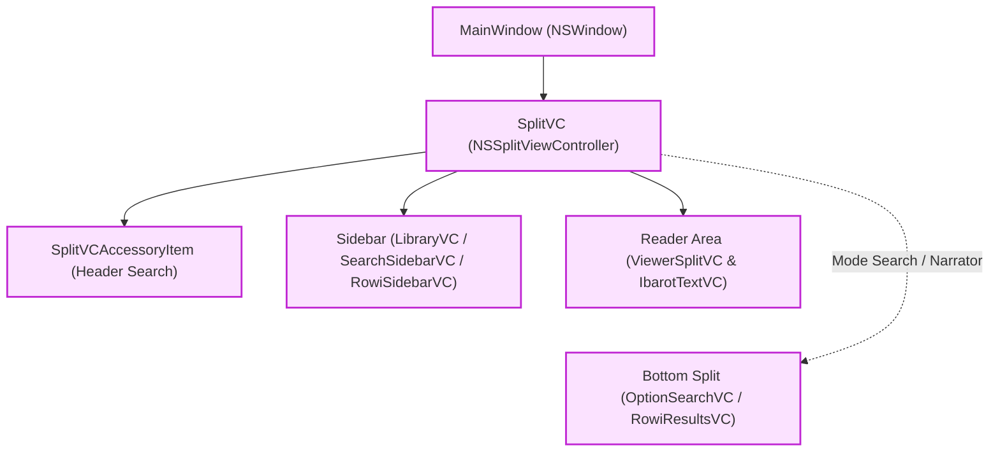
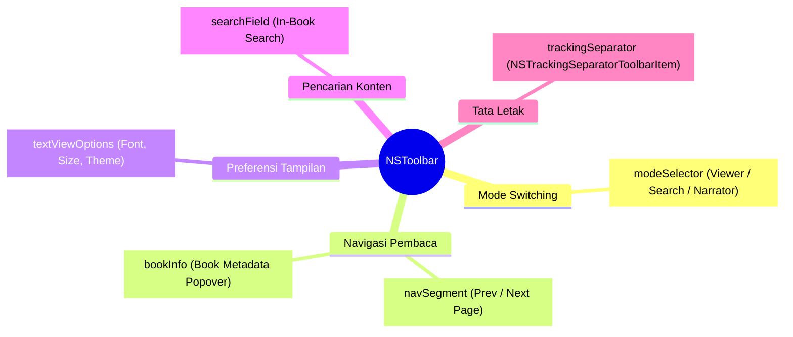
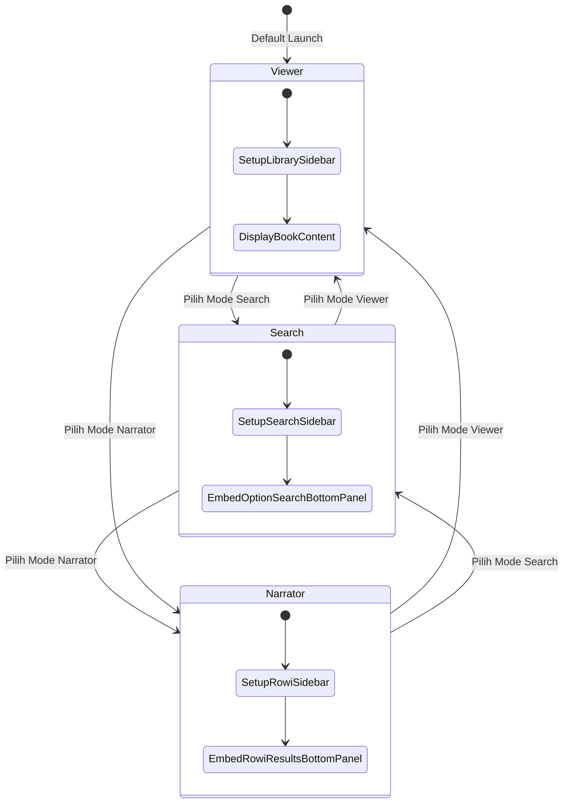
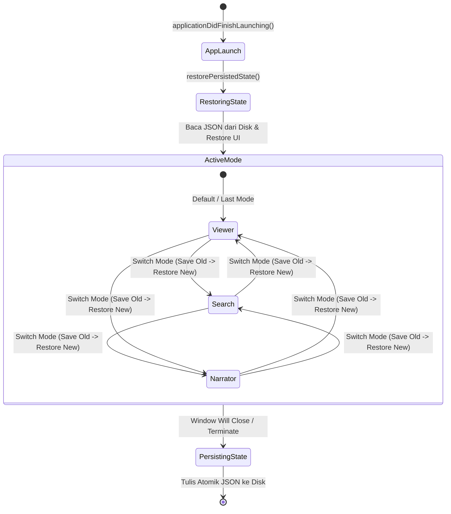
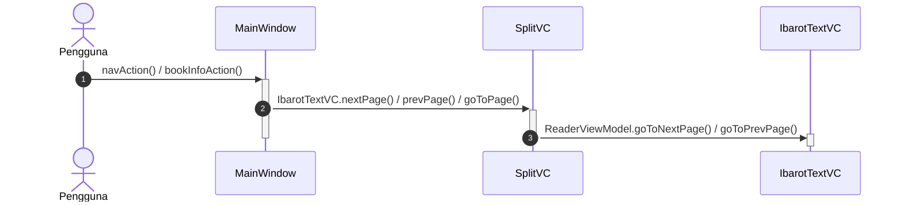
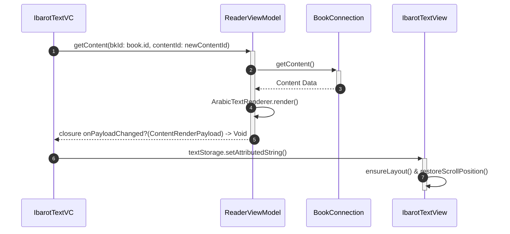
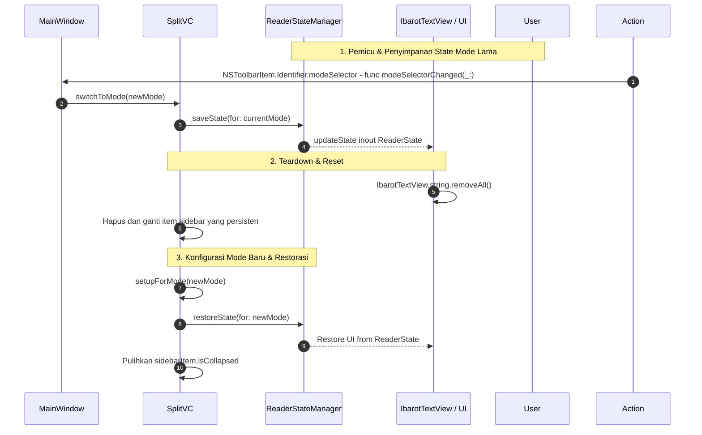
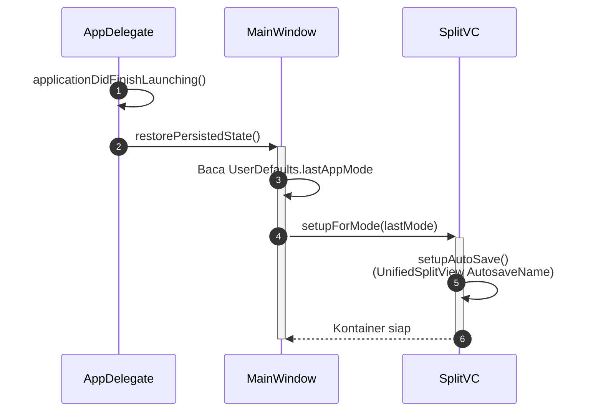
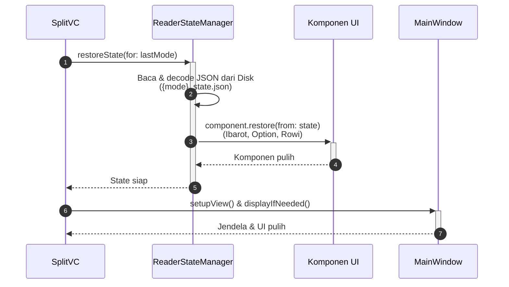
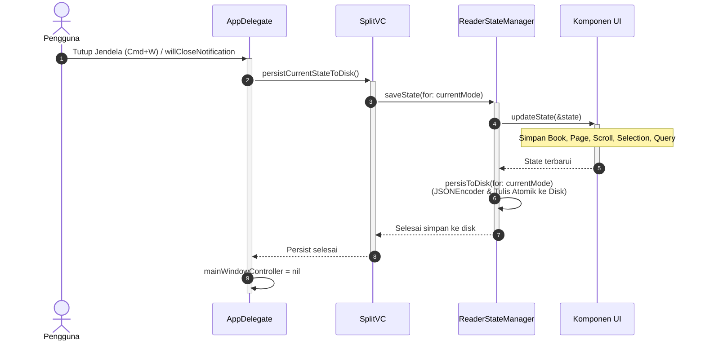

# SplitVC & Window Architecture (macOS)

Dokumentasi ini membedah arsitektur antarmuka tingkat atas (*Top-Level UI*) pada platform macOS, mencakup jendela utama (`MainWindow`), bilah alat kustom (`NSToolbar`), dan pengontrol kontainer terpadu (`SplitVC`) yang mengatur transisi antarmode (Viewer, Search, dan Narrator).

Sumber kode:

* Window & Toolbar: `Source/UI/macOS/Window/`
* SplitView Container: `Source/UI/macOS/SplitView/SplitVC.swift`

---

## 1. Arsitektur Komponen Visual

Hierarki antarmuka tingkat atas di macOS diorganisasikan ke dalam kontainer bertingkat:

### A. Hierarki Kontainer & Split View



### B. Taksonomi Kontrol Toolbar (`NSToolbar`)



### C. Siklus Transisi Antarmode (`AppMode`)



### D. Siklus Hidup Status Global: Launch, Runtime & Persistensi



---

## 2. Alur Interaksi: Dari Aksi Klik Toolbar ke TextView

Ketika pengguna menekan tombol navigasi halaman atau memilih bab tertentu pada *toolbar* jendela utama:

### A. Alur Navigasi Halaman (Toolbar $\rightarrow$ Reader TextView)





### B. Alur Penukaran Mode Antarmuka (Mode Switching & In-Memory Transfer)



### C. Alur Restorasi State saat Peluncuran Aplikasi (*Cold Launch Restoration*)





### D. Alur Persistensi State ke Disk saat Jendela Ditutup (*Window Close & Disk Persistence*)



---

## 3. Bedah SplitVC & Manajemen State

`SplitVC` adalah *subclass* dari `NSSplitViewController` yang bertindak sebagai fondasi utama tata letak Maktabah pada macOS. Maktabah mendaur ulang *instance* ini untuk seluruh mode guna menghemat alokasi memori dan menjaga kelancaran animasi transisi.

### Siklus Hidup `ReaderStateManager`

Manajemen status antarmuka (seperti kitab aktif, nomor halaman, posisi *scroll*, rentang seleksi teks, kueri pencarian, serta status *collapsed* pada *sidebar*) dikelola oleh `ReaderStateManager` melalui 3 fase siklus:

1. **Restorasi saat Peluncuran (`restorePersistedState`)**
   - Dipicu di `AppDelegate.applicationDidFinishLaunching(_:)` saat jendela utama pertama kali dibuka.
   - Mengambil mode terakhir dari `UserDefaults.standard.lastAppMode` (misalnya `.viewer`, `.search`, atau `.narrator`).
   - Memanggil `splitVC.setupForMode(lastMode)` dan `splitVC.setupAutoSave()`.
   - Mengeksekusi `stateManager.restoreState(for: lastMode, components: splitVC.components(for: lastMode))`.
   - `ReaderStateManager` memuat berkas JSON secara *lazy* dari direktori `~/Library/Application Support/Maktabah/States/{viewer,search,author}_state.json`.
   - Setiap komponen yang mengadopsi *protocol* `ReaderStateComponent` (`IbarotTextVC`, `OptionSearchVC`, atau `RowiResultsVC`) memulihkan kondisi UI mereka secara sinkron.

2. **Penyimpanan & Restorasi saat Beralih Mode (`switchToMode`)**
   - Dipicu ketika pengguna memilih mode pada *segmented control* di *toolbar* atau menu bar.
   - **Langkah 1 (Simpan Mode Lama)**: `stateManager.saveState(for: currentMode, components: components(for: currentMode))` mengumpulkan data UI mutakhir ke memori RAM (`ReaderState`).
   - **Langkah 2 (Teardown Tampilan)**: Mengosongkan teks bacaan (`ibarotTextVC.textView.string.removeAll()`) dan menghapus seluruh item split kecuali kontainer *sidebar* persisten.
   - **Langkah 3 (Setup Mode Baru)**: Memasang *child controllers* mode baru via `setupForMode(newMode)` dan memulihkan status *collapsed* pada *sidebar* (`sidebarItem.isCollapsed`).
   - **Langkah 4 (Restorasi Mode Baru)**: `stateManager.restoreState(for: newMode, components: components(for: currentMode))` memulihkan *state* mode baru dari *cache* memori (atau memuat dari *disk* jika mode tersebut belum pernah dibuka pada sesi aktif).

3. **Persistensi ke Disk saat Jendela Ditutup (`persistCurrentStateToDisk`)**
   - `AppDelegate` mengamati notifikasi `NSWindow.willCloseNotification` melalui `windowObserverWillCloseNotification(_:)`.
   - Memanggil `window.splitVC.persistCurrentStateToDisk()`.
   - `stateManager.saveState(for: currentMode, components: components(for: currentMode))` memperbarui *state* di memori.
   - `stateManager.persisToDisk(for: currentMode)` melakukan serialisasi `ReaderState` ke format JSON (`.prettyPrinted`, `.sortedKeys`) dan menuliskannya secara atomik ke *disk* (`.atomic`).

### `ReaderStateComponent` (Protocol)

Komponen UI yang berpartisipasi dalam persistensi *state* mengadopsi *protocol* `@MainActor ReaderStateComponent`:

```swift
@MainActor
protocol ReaderStateComponent: AnyObject {
    func updateState(_ state: inout ReaderState)
    func restore(from state: ReaderState)
    func cleanUpState()
}
```

* **`updateState(_ state: inout ReaderState)`**: Mengisi properti relevan pada objek `ReaderState` (seperti ID buku, nomor halaman, posisi *scroll*, rentang seleksi, atau kueri pencarian).
* **`restore(from state: ReaderState)`**: Membaca nilai dari `ReaderState` dan menerapkannya kembali ke UI (misalnya membuka kembali kitab, memposisikan *scroll*, atau merender ulang hasil pencarian).
* **`cleanUpState()`**: Mengembalikan UI ke kondisi awal saat pengguna mengeksekusi *reset* melalui menu *Reset Current View* (`AppDelegate.resetCurrentViewState()`).

### `ReaderState` (Struct)

Objek *state* dienkapsulasi dalam struktur `Codable` yang disimpan pada direktori `~/Library/Application Support/Maktabah/States/`:

- `viewer_state.json`: Menyimpan *state* mode pembaca (kitab aktif, halaman, posisi *scroll*, seleksi, status TOC).
- `search_state.json`: Menyimpan *state* pencarian (kueri, opsi FTS, hasil pencarian, dan buku terpilih).
- `author_state.json`: Menyimpan *state* biografi perawi (perawi aktif, kueri rujukan, dan hasil biografi).

### Penanganan Jendela Ganda (*Multi-Window & Tabs*)

- **Jendela Utama (*Primary Window*)**: Menjalankan `restorePersistedState(_:)` untuk memulihkan sesi terakhir dari *disk*.
- **Tab / Jendela Baru (`newWindowForTab(_:)`)**: Memanggil `setupContentView(restoreState: false)` yang menginisialisasi `ReaderState()` baru di memori tanpa memuat *state* lama dari *disk*, mencegah benturan antarjendela.

### Struct, Class, & Enum Terkait

* **`AppMode` (Enum)**: Representasi mode aktif pada layar utama aplikasi (`.viewer`, `.search`, `.narrator`).
* **`SplitVC` (Class)**: Komponen sentral (`NSSplitViewController`) yang mengelola *sidebar*, *viewer*, dan panel bawah, serta meneruskan aksi seperti `nextPage()`, `prevPage()`, dan `displayAnnotations()`.

## Komponen Pendukung

=== "SplitView Logic"

    ### CustomSplitView

    `CustomSplitView` adalah *subclass* khusus `NSSplitView` yang memberikan fleksibilitas untuk mengubah tampilan pemisah panel (*divider*), menyesuaikan diri dengan skema tema bacaan (seperti sepia atau mode gelap).

    * **Warna Kustom (`customDividerColor`)**: Properti untuk menimpa (*override*) warna pembatas bawaan macOS (`.separatorColor`). Perubahan nilai memicu kalkulasi ulang tata letak melalui `setNeedsDisplay` dan `layoutSubtreeIfNeeded()` pada blok `DispatchQueue.main.async`.
    * **Ketebalan Pembatas (`dividerThickness`)**: Menetapkan ketebalan garis tepat `1.0` poin untuk menjaga estetika desain minimalis.
    * **Adaptasi Latar Belakang**: Fungsi `updateDividerColor(to bgColor: BackgroundColor)` menyuntikkan warna pemisah berdasarkan tema aktif (`.darkSepia`, `.sepia`, `.black`, `.gray`, `.white`).

=== "Toolbar & Accessory"

    ### SplitVCAccessoryItem

    Tersedia untuk target macOS 26.0+, `class` `SplitVCAccessoryItem` memfasilitasi integrasi *toolbar* dan kolom pencarian yang terbenam pada judul *sidebar* (`NSSplitViewItemAccessoryViewController`).

    * **Isolasi State Pencarian**: Membedakan `DSFSearchField` untuk setiap mode (Viewer, Search, Narrator) agar fitur *Recents Search* bawaan AppKit terisolasi menggunakan pengenal unik (seperti `"LibraryVCSearch"` atau `"RecentsRowiSidebarSearchField"`).
    * **Tata Letak Fleksibel**: Menggunakan `NSStackView` vertikal untuk menyisipkan kontrol tambahan tanpa merusak batasan Autolayout.
    * **Pembaruan Konteks (`setupView(mode:)`)**: Mengaitkan *search field* aktif ke sub-tampilan yang tepat tanpa alokasi ulang hierarki objek secara keseluruhan.

!!! note "Autosave Konfigurasi"
    `SplitVC` secara otomatis menyimpan posisi dan ketebalan *sidebar* menggunakan `autosaveName` bawaan AppKit (`"UnifiedViewerSplitView"` dan `"UnifiedSplitView"`), bekerja selaras dengan metode persistensi milik `ReaderStateManager`.
