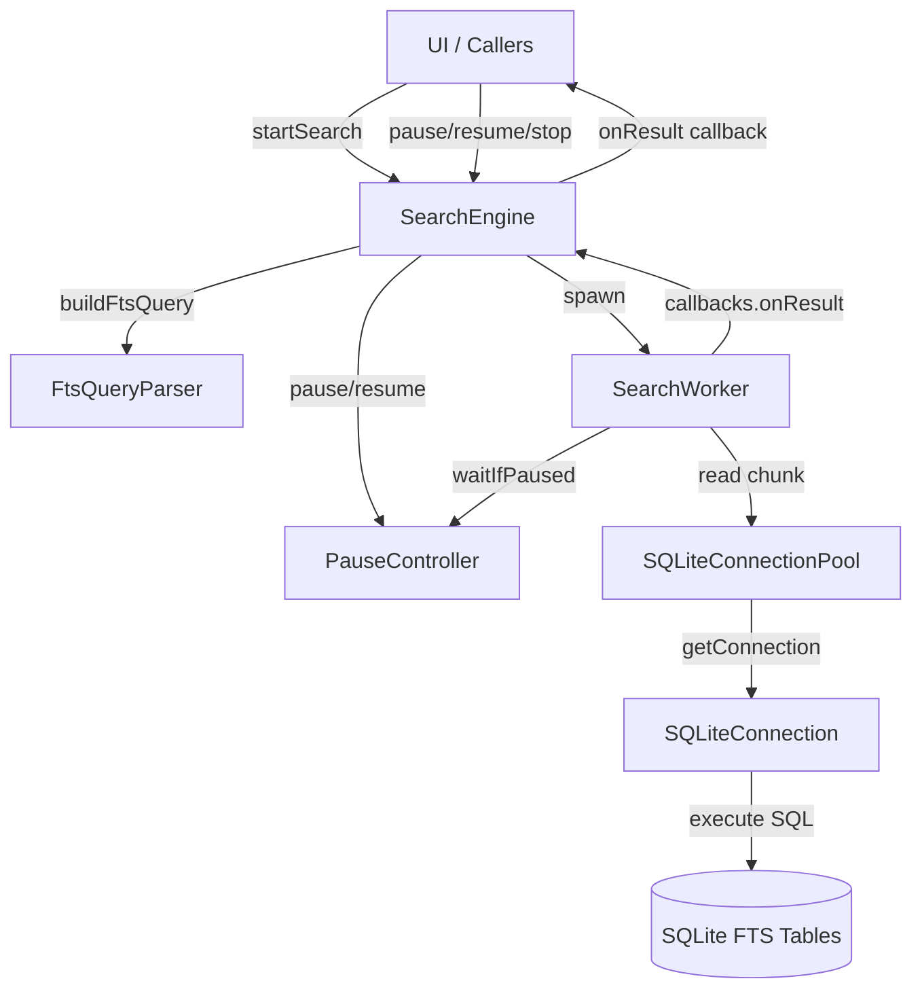

# Search Engine Core

Dokumentasi ini membedah secara teknis arsitektur, desain konkurensi, dan komponen-komponen utama yang membangun fitur pencarian berkecepatan tinggi (FTS) di Maktabah.

## Architecture Pipeline

### Diagram Interaksi Komponen

Diagram berikut menggambarkan bagaimana komponen di dalam folder `SearchEngine` berinteraksi satu sama lain, mulai dari penerimaan kueri hingga pengiriman hasil.



### Konkurensi Pekerja (Worker Concurrency)

Pencarian dirancang agar berjalan secara paralel, baik pada level database file maupun table chunks. Maktabah menginisialisasi beberapa instance `SearchWorker`, biasanya satu per archive (`1-20.sqlite`, dsb). Setiap worker memiliki `SQLiteConnectionPool` dengan beberapa koneksi.

1. `SearchEngine.startSearch` memicu proses pencarian dengan detached task.
2. Setiap `SearchWorker` mengumpulkan matched row IDs terlebih dahulu dari tabel FTS `*_fts`.
3. Setelah total ID didapatkan, worker membagi kumpulan ID tersebut (chunk) ke dalam Task Group paralel (`executeParallelChunks`).
4. Jumlah koneksi paralel diatur oleh ukuran `SQLiteConnectionPool` per worker. Tiap koneksi menangani chunk ID tertentu (`searchChunkByIDs`), menjalankan query ke tabel utama.
5. Hasil dari tiap chunk dikumpulkan dan diproses secara asinkron dalam stream, kemudian dikirim ke UI melalui callback.

### Metode Pause, Resume, dan Stop

Pengontrolan siklus hidup pencarian (Pause, Resume, Stop) dikoordinasi secara tersentralisasi oleh `PauseController`, sebuah actor yang membungkus status `isPaused` dan daftar `CheckedContinuation`.

- **Pause (`pause()`)**: Menandai flag `isPaused = true`. Setiap kali worker memproses iterasi chunk, worker akan memanggil `await pauseController.waitIfPaused()`. Jika dijeda, execution tertahan karena `CheckedContinuation` ditambahkan ke antrean tanpa di-resume.
- **Resume (`resume()`)**: Membalikkan flag `isPaused = false` lalu memanggil `cont.resume()` ke semua continuation yang tertahan, melepaskan aliran eksekusi para worker seketika.
- **Stop (`stopAndResumeAll()`)**: Karena task tidak bisa merespons cancellation saat suspended oleh continuation, memanggil stop wajib me-resume seluruh task yang dijeda (`resume()`) sembari membatalkan `Task` utama.

### Prinsip Pemisahan Tanggung Jawab (Separation of Concerns)

Komponen pada Search Engine dibangun mengikuti prinsip pemisahan tanggung jawab yang tegas:

- **`SearchEngine`**: Fasilitator utama (Facade). Mengatur lifecycle task utama, menyimpan daftar worker, dan meneruskan instruksi kontrol ke `PauseController`.
    - Menginisialisasi workers.
    - Mengikat callback progres dan completion.
- **`SearchWorker`**: Berfokus murni pada logika orkestrasi paralel (Chunking) untuk satu arsip / tabel. Tidak peduli tentang parsing query atau status UI.
    - Menjalankan `executeParallelChunks` dengan pembagian `matchedIDs`.
    - Mengirim progres kembali melalui berbagai callback.
        - `onResult` untuk tiap baris yang cocok.
        - `onRowProgress` untuk progres hitungan baris.
- **`SQLiteConnection` & `SQLiteConnectionPool`**: Abstraksi lapisan koneksi thread-safe ke libsqlite3. Mengatur isolasi pemanggilan prepared statement.
- **`FtsQueryParser`**: Stateless utility yang bertanggung jawab penuh terhadap sanitasi, stemming teks Arab, dan konversi kueri.
- **`PauseController`**: Khusus mengurus logika suspensi asinkron (yielding) via `CheckedContinuation` di lingkungan Swift Concurrency.

---

## Bedah Komponen Teknis

### Struct dan Class

#### `SearchEngine` (Actor)

Actor pengatur siklus hidup pencarian utama. Menerima permintaan, membuat FTS query, mendelegasikan tugas ke worker, dan mem-proxy callback ke UI.

```swift
actor SearchEngine {
    private(set) var workers: [SearchWorker] = [] // (1)!
    private let pauseController = PauseController()
    private var searchTask: Task<Void, Never>?
    private var isStopped = false
    // ...
}
```

1. Kumpulan worker yang dipetakan per ID arsip database.

!!! note "Task Cancellation"
    SearchEngine me-manage penugasan task utamanya dalam `searchTask` yang bisa dipanggil dengan `.cancel()` ketika operasi diinterupsi.

#### `SearchWorker` (Class)

Worker yang bertugas melakukan FTS query untuk serangkaian tabel (buku) di dalam satu Archive ID. Dibangun dengan pola `Sendable` meskipun bertipe class (`@unchecked Sendable` asalkan immutable state).

```swift
final class SearchWorker: @unchecked Sendable {
    let archiveId: String
    let tables: [String]
    let pool: SQLiteConnectionPool
    let batchSize: Int
}
```

- **`archiveId`**: Pengidentifikasi arsip (database file), misalnya "1".
- **`tables`**: Daftar nama tabel yang akan dicari dalam archive ini.
- **`pool`**: Connection Pool agar dapat melakukan pembacaan konkuren (`executeParallelChunks`).
- **`batchSize`**: Jumlah maksimum baris (IDs) yang diambil (fetch) dalam satu SQL query IN clause. Standarnya 200.

#### `SQLiteConnection` (Class)

Membungkus interaksi low-level C API dari SQLite3. Class ini menahan opaque pointer untuk database dan mengimplementasikan statement cache dasar.

```swift
final class SQLiteConnection: DBConnectionType, @unchecked Sendable {
    private let db: OpaquePointer?
    private var statementCache: [String: OpaquePointer] = [:]
    private var cacheKeys: [String] = []
    private let maxCacheSize = 50
    private let executionLock = NSLock()
}
```

- **`db`**: Pointer koneksi SQLite (tipe `OpaquePointer`).
- **`statementCache`**: Cache prepared statement (menghindari penyiapan ulang SQL berulang-ulang, menaikkan performa).
- **`cacheKeys` & `maxCacheSize`**: Logika sederhana implementasi LRU (Least Recently Used) cache.
- **`executionLock`**: Mutex (`NSLock`) untuk mencegah `EXC_BAD_ACCESS` jika satu instance `SQLiteConnection` tak sengaja dipanggil secara konkuren.

#### `SQLiteConnectionPool` (Actor)

Menyediakan kumpulan koneksi SQLite yang terisolasi. Berguna saat worker melakukan chunking.

```swift
actor SQLiteConnectionPool {
    private var connections: [DBConnectionType]
    // ...
}
```

- **`connections`**: Kumpulan koneksi database (`DBConnectionType`). Saat worker memanggil fungsi `read(at:)`, pool akan memilih koneksi dengan index modulo dari jumlah koneksi (misal `index % connections.count`), menjamin rotasi pemakaian.

#### `PauseController` (Actor)

Mengelola state pause/resume dengan aman dalam lingkungan asinkron.

```swift
actor PauseController {
    private var isPaused = false
    private var continuations: [CheckedContinuation<Void, Never>] = []
    // ...
}
```

- **`isPaused`**: Status penanda apakah pencarian dijeda.
- **`continuations`**: Array dari `CheckedContinuation` yang mem-parkir Task selagi status pause aktif.

#### `SearchQueryOptions` (Struct)

Membawa parameter kueri dari luar (UI/ViewModel) masuk ke dalam SearchEngine.

```swift
struct SearchQueryOptions: Sendable {
    var query: String = ""
    var keywords: [String] = []
    var allowedTables: Set<String>? = nil
    var mode: SearchMode
    var nearDistance: Int = 10
}
```

- **`query`**: String kueri utuh dari input pengguna.
- **`keywords`**: Fallback bila query kosong, digabung menjadi kueri.
- **`allowedTables`**: Set tabel yang difilter (opsional, jika nil berarti cari di semua tabel `SearchWorker`).
- **`mode`**: Tipe operasi `SearchMode` (phrase, contains, or, near).
- **`nearDistance`**: Toleransi jarak kata untuk operasi `NEAR()`, default 10.

#### `SafeCounter` (Class)

Counter aman untuk konkurensi (Thread-safe) menggunakan Mutex. Digunakan saat menghitung penyelesaian tabel lintas Task konkuren.

```swift
final class SafeCounter: Sendable {
    private let state = Mutex<Int>(0)

    func increment() -> Int {
        state.withLock { count in
            count += 1
            return count
        }
    }
}
```

#### `SerialTaskQueue` (Class)

Antrean asinkron untuk memastikan task-task dieksekusi secara serial (satu persatu). Ini membantu menertibkan urutan mutasi state atau proses tulis di UI/Disk.

```swift
final class SerialTaskQueue: Sendable {
    private let tailState = Mutex<Task<Void, Never>?>(nil)
    // ...
}
```

- **`tailState`**: Mutex membungkus ekor task, mengatur chaining pembatalan task dan eksekusi sekuensial.

#### `TOCLoaderRefCount` (Actor)

Manajer siklus hidup untuk memuat Table of Contents (TOC). Memiliki mekanisme cache, in-flight request deduplication, dan reference counting.

```swift
actor TOCLoaderRefCount {
    struct Entry {
        var task: Task<[TOCNode], Error>
        var consumers: Int
    }
    private var inFlight: [Int: Entry] = [:]
    private let connFactory: @Sendable () -> BookConnection
    private let treeCache = BookConnection.tocTreeCache
}
```

- **`Entry`**: Membungkus status `Task` aktif dan jumlah pemanggil `consumers`.
- **`inFlight`**: Memastikan buku yang sama tidak memicu dua ekstraksi struktur TOC bersamaan.

### Enums & Event Types

#### `SearchMode` (Enum)

Menentukan perilaku (operator relasional) logika pencarian ke dalam `FtsQueryParser`.

```swift
enum SearchMode: Int, CaseIterable, Identifiable {
    case phrase
    case contains
    case or
    case near
}
```

Tipe mode pencarian mengubah cara perlakuan input:

- **`phrase`**: Teks pencarian dibungkus dengan kutip murni (contoh: `"kata satu dua"`), harus pas persis.
- **`contains`**: Teks pencarian digabung dengan operator `AND` (contoh: `"kata" AND "satu"`).
- **`or`**: Teks pencarian digabung dengan operator `OR` (contoh: `"kata" OR "satu"`).
- **`near`**: Pencarian berdekatan menggunakan `NEAR(kata satu dua, 10)`, kata berada berdekatan hingga limit parameter (distance).

#### `SQLValue` (Enum)

Abstraksi tipe data safe untuk parameter binding pada SQLite.

```swift
enum SQLValue {
    case text(String)
    case int(Int)
    case null
}
```

#### Callback Types

Berbagai struct callbacks digunakan di antara lapisan `SearchEngine` dan `SearchWorker` sebagai antarmuka (interface) komunikasi ke pengamat:

- **`SearchEngineCallbacks`**: Callback level-atas seperti `onInitialize`, `onTableComplete`, `onResult`.
- **`SearchWorkerCallbacks`**: Callback antara Engine dan Worker.
- **`SearchCallbacks`**: Dipakai untuk progres internal table/chunk (murni progres baris).

!!! warning "Callback Execution"
    Pastikan pembaruan antarmuka pada pengamat (caller) dilakukan melalui `@MainActor` karena callbacks dieksekusi dari background queue / `Task.detached`.

### FtsQueryParser: Logika Kueri Lanjut

FtsQueryParser memiliki logika spesifik untuk mendeteksi perintah kueri manual pengguna menggunakan fitur `NEAR`. Parser memprioritaskan regex berikut:

```swift
let pattern = #"(?i)(?:NEAR\s*\(\s*[^,\)]+(?:,\s*(\d+))?\s*\)|[^\s]+\s+NEAR(?:/(\d+))?\s+[^\s]+)"#
```

Jika pengguna menulis eksplisit `kata NEAR/5 lain`, maka parser secara cerdas melewati `SearchMode` dan menerapkan operator eksplisit dengan jarak spesifik `5`.

Kueri biasa di-sanitize secara mendalam dengan metode chaining:
`text.trimmingCharacters(in: .whitespacesAndNewlines).normalizeArabic().stemArabicLight10()`

Hal ini membuang harakat, melakukan stemming awal (misal awalan "al"), dan menghapus tanda baca agar sinkron dengan implementasi Tokenizer internal SQLite.

=== "macOS"
    Pemanggilan native antarmuka UI dilakukan melalui delegate standar AppKit sesudah menerima rilis `onResult`.
=== "iOS"
    Penyebaran status dan array updates diteruskan sebagai published objects di ekosistem Observable.
