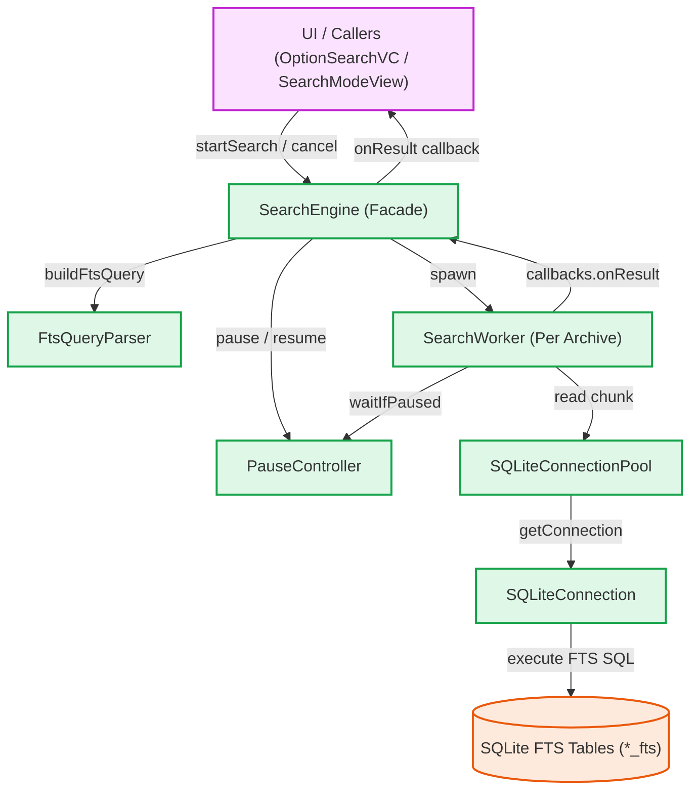
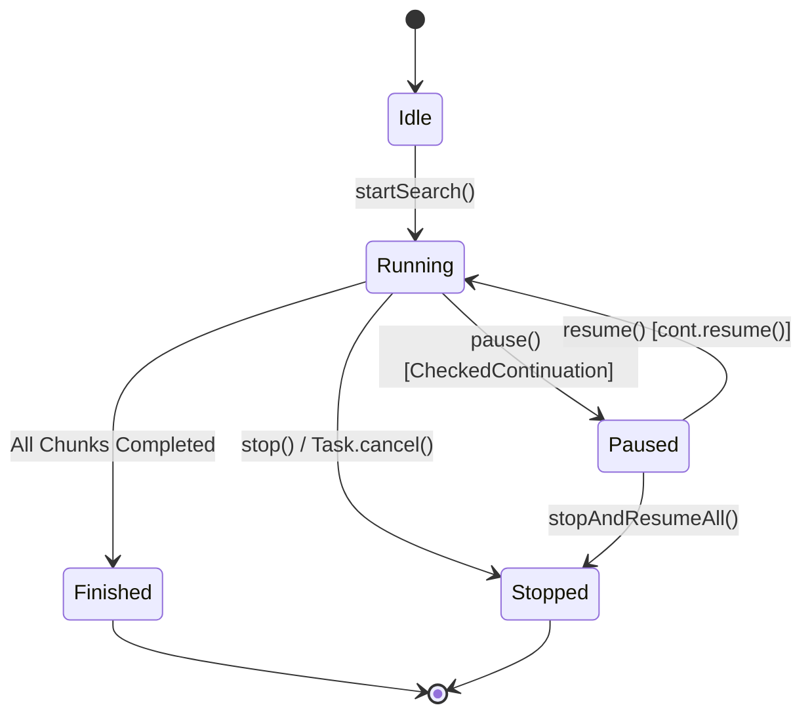

# Inti Mesin Pencari (Search Engine Core)

Dokumentasi ini membedah secara teknis arsitektur, desain konkurensi, dan komponen-komponen utama yang membangun fitur pencarian berkecepatan tinggi (*Full-Text Search* / FTS) di Maktabah.

## Alur Arsitektur (*Architecture Pipeline*)

### Diagram Interaksi Komponen

Diagram berikut menggambarkan interaksi antarkomponen di dalam modul `SearchEngine`, mulai dari penerimaan kueri hingga pengiriman hasil ke antarmuka pengguna:



### Konkurensi Pekerja (*Worker Concurrency*)

Pencarian dirancang agar berjalan secara paralel, baik pada level berkas basis data maupun pecahan tabel (*chunks*). Maktabah menginisialisasi beberapa *instance* `SearchWorker`, umumnya satu per berkas arsip (`1.sqlite` s.d. `20.sqlite`). Setiap *worker* memiliki `SQLiteConnectionPool` tersendiri.

1. `SearchEngine.startSearch` menjalankan proses pencarian di latar belakang menggunakan `Task.detached`.
2. Setiap `SearchWorker` mengumpulkan ID baris yang cocok (*matched row IDs*) dari tabel FTS `*_fts`.
3. Setelah seluruh ID terkumpul, *worker* membagi kumpulan ID tersebut (*chunk*) ke dalam *Task Group* paralel (`executeParallelChunks`).
4. Jumlah koneksi paralel diatur oleh kapasitas `SQLiteConnectionPool`. Setiap koneksi menangani pecahan ID tertentu (`searchChunkByIDs`) dan mengeksekusi kueri ke tabel utama.
5. Hasil dari setiap *chunk* dikumpulkan dan diproses secara asinkron dalam *stream*, kemudian dikirimkan ke UI melalui fungsi *callback*.

### Metode Pause, Resume, dan Stop

Pengontrolan siklus hidup pencarian (Jeda, Lanjutkan, Hentikan) dikoordinasikan secara terpusat oleh `PauseController`, sebuah *actor* yang mengelola status `isPaused` dan daftar `CheckedContinuation`.



- **Pause (`pause()`)**: Menandai `isPaused = true`. Setiap kali memproses iterasi *chunk*, *worker* memanggil `await pauseController.waitIfPaused()`. Jika pencarian dijeda, eksekusi tertahan karena `CheckedContinuation` dimasukkan ke dalam antrean tanpa dilanjutkan (*resume*).
- **Resume (`resume()`)**: Mengubah `isPaused = false` lalu memanggil `cont.resume()` pada seluruh *continuation* yang tertahan, melepaskan penundaan eksekusi *worker* seketika.
- **Stop (`stopAndResumeAll()`)**: Karena sebuah *task* tidak dapat merespons pembatalan (*cancellation*) saat berstatus *suspended* oleh *continuation*, pemanggilan `stop` wajib melanjutkan (*resume*) seluruh *task* yang tertahan sembari membatalkan `Task` utama.

### Prinsip Pemisahan Tanggung Jawab (*Separation of Concerns*)

Komponen pada mesin pencari dirancang dengan batas tanggung jawab yang jelas:

- **`SearchEngine`**: Fasilitator utama (*Facade*). Mengatur siklus hidup tugas utama, mengelola daftar *worker*, dan meneruskan instruksi kontrol ke `PauseController`.
- **`SearchWorker`**: Berfokus murni pada logika orkestrasi paralel (*chunking*) untuk satu berkas arsip / kelompok tabel.
- **`SQLiteConnection` & `SQLiteConnectionPool`**: Abstraksi koneksi *thread-safe* ke `libsqlite3` serta isolasi eksekusi *prepared statements*.
- **`FtsQueryParser`**: Utilitas *stateless* yang bertugas melakukan sanitasi, normalisasi akar kata (*stemming*) teks Arab, dan konversi format kueri FTS.
- **`PauseController`**: Mengelola logika penundaan asinkron melalui `CheckedContinuation` di lingkungan Swift Concurrency.

---

## Bedah Komponen Teknis

### Struct dan Class

#### `SearchEngine` (Actor)

*Actor* pengatur siklus hidup pencarian utama. Bertugas menerima permintaan, menyusun kueri FTS, mendelegasikan tugas ke *worker*, serta meneruskan *callback* hasil ke antarmuka pengguna.

```swift
actor SearchEngine {
    private(set) var workers: [SearchWorker] = [] // (1)!
    private let pauseController = PauseController()
    private var searchTask: Task<Void, Never>?
    private var isStopped = false
    // ...
}
```

1. Kumpulan *worker* yang dipetakan per ID arsip basis data.

!!! note "Task Cancellation"
    `SearchEngine` mengelola penugasan tugas utamanya dalam properti `searchTask`, yang dapat dibatalkan melalui `.cancel()` saat operasi diinterupsi oleh pengguna.

#### `SearchWorker` (Class)

*Class* *worker* yang bertugas menjalankan kueri FTS pada serangkaian tabel kitab di dalam satu berkas arsip. Mengadopsi *protocol* `@unchecked Sendable` dengan menjaga status tak berubah (*immutable state*).

```swift
final class SearchWorker: @unchecked Sendable {
    let archiveId: String
    let tables: [String]
    let pool: SQLiteConnectionPool
    let batchSize: Int
}
```

- **`archiveId`**: Pengenal arsip basis data (misalnya `"1"`).
- **`tables`**: Daftar nama tabel kitab yang dicari di dalam arsip ini.
- **`pool`**: *Connection Pool* untuk eksekusi kueri konkuren (`executeParallelChunks`).
- **`batchSize`**: Jumlah maksimum baris (ID) yang diambil dalam satu klausa SQL `IN` (nilai bawaan: 200).

#### `SQLiteConnection` (Class)

Membungkus interaksi tingkat rendah C API dari `libsqlite3`. *Class* ini menyimpan *opaque pointer* koneksi basis data dan mengimplementasikan mekanisme *statement cache*.

```swift
final class SQLiteConnection: DBConnectionType, @unchecked Sendable {
    private let db: OpaquePointer?
    private var statementCache: [String: OpaquePointer] = [:]
    private var cacheKeys: [String] = []
    private let maxCacheSize = 50
    private let executionLock = NSLock()
}
```

- **`db`**: *Pointer* koneksi SQLite (bertipe `OpaquePointer`).
- **`statementCache`**: *Cache* untuk menyimpan *prepared statements* agar kueri yang dieksekusi berulang kali tidak perlu diuraikan ulang.
- **`cacheKeys` & `maxCacheSize`**: Mekanisme pengosongan *cache* (*cache eviction*) berbasis algoritma LRU (*Least Recently Used*).
- **`executionLock`**: Mutex (`NSLock`) untuk mencegah *data race* atau `EXC_BAD_ACCESS` saat pemanggilan konkuren pada *instance* koneksi.

#### `SQLiteConnectionPool` (Actor)

Menyediakan kumpulan koneksi SQLite yang terisolasi untuk mendukung operasi *chunking* paralel pada *worker*.

```swift
actor SQLiteConnectionPool {
    private var connections: [DBConnectionType]
    // ...
}
```

- **`connections`**: Kumpulan koneksi basis data (`DBConnectionType`). Saat *worker* memanggil fungsi `read(at:)`, *pool* memilih koneksi menggunakan operasi modulo indeks (`index % connections.count`), menjamin rotasi penggunaan koneksi secara merata.

#### `PauseController` (Actor)

Mengelola status jeda (*pause*) dan lanjut (*resume*) secara *thread-safe*.

```swift
actor PauseController {
    private var isPaused = false
    private var continuations: [CheckedContinuation<Void, Never>] = []
    // ...
}
```

- **`isPaused`**: Penanda status apakah proses pencarian sedang dijeda.
- **`continuations`**: *Array* dari `CheckedContinuation` yang menahan eksekusi *Task* selama status jeda aktif.

#### `SearchQueryOptions` (Struct)

Membawa parameter kueri dari lapisan UI / ViewModel menuju `SearchEngine`.

```swift
struct SearchQueryOptions: Sendable {
    var query: String = ""
    var keywords: [String] = []
    var allowedTables: Set<String>? = nil
    var mode: SearchMode
    var nearDistance: Int = 10
}
```

- **`query`**: Teks kueri pencarian dari pengguna.
- **`keywords`**: Kata kunci alternatif apabila kueri utama kosong.
- **`allowedTables`**: Himpunan tabel yang difilter (jika bernilai `nil`, pencarian mencakup seluruh tabel).
- **`mode`**: Tipe operasi `SearchMode` (`phrase`, `contains`, `or`, `near`).
- **`nearDistance`**: Batas toleransi jarak antarkata untuk operator `NEAR()` (nilai bawaan: 10).

#### `SafeCounter` (Class)

Penghitung (*counter*) *thread-safe* menggunakan `Synchronization.Mutex`. Digunakan saat menghitung progres penyelesaian tabel lintas tugas konkuren.

```swift
final class SafeCounter: Sendable {
    private let state = Mutex<Int>(0)

    func increment() -> Int {
        state.withLock { count in
            count += 1
            return count
        }
    }
}
```

#### `SerialTaskQueue` (Class)

Antrean asinkron untuk memastikan tugas-tugas dieksekusi secara sekuensial (satu per satu). Membantu menertibkan urutan mutasi *state* atau proses penulisan ke antarmuka dan *disk*.

```swift
final class SerialTaskQueue: Sendable {
    private let tailState = Mutex<Task<Void, Never>?>(nil)
    // ...
}
```

#### `TOCLoaderRefCount` (Actor)

Pengelola siklus hidup pemuatan daftar isi (*Table of Contents* / TOC). Dilengkapi mekanisme penyimpanan sementara (*cache*), eliminasi permintaan ganda (*request deduplication*), serta penghitungan referensi (*reference counting*).

```swift
actor TOCLoaderRefCount {
    struct Entry {
        var task: Task<[TOCNode], Error>
        var consumers: Int
    }
    private var inFlight: [Int: Entry] = [:]
    private let connFactory: @Sendable () -> BookConnection
    private let treeCache = BookConnection.tocTreeCache
}
```

- **`Entry`**: Menyimpan status `Task` aktif dan jumlah pemanggil (`consumers`).
- **`inFlight`**: Memastikan buku yang sama tidak memicu ekstraksi struktur TOC ganda secara bersamaan.

### Enums & Event Types

#### `SearchMode` (Enum)

Menentukan operator logika pencarian yang diterapkan oleh `FtsQueryParser`:

```swift
enum SearchMode: Int, CaseIterable, Identifiable {
    case phrase
    case contains
    case or
    case near
}
```

- **`phrase`**: Teks pencarian dibungkus tanda kutip ganda (contoh: `"kata satu dua"`), mencocokkan frasa secara persis.
- **`contains`**: Kata kunci digabungkan dengan operator `AND` (contoh: `"kata" AND "satu"`).
- **`or`**: Kata kunci digabungkan dengan operator `OR` (contoh: `"kata" OR "satu"`).
- **`near`**: Pencarian kedekatan antarkata menggunakan `NEAR(kata satu dua, 10)`.

#### `SQLValue` (Enum)

Abstraksi tipe data aman untuk pengikatan parameter (*parameter binding*) pada SQLite:

```swift
enum SQLValue {
    case text(String)
    case int(Int)
    case null
}
```

#### Tipe Callback

Berbagai struktur *callback* digunakan sebagai antarmuka komunikasi:

- **`SearchEngineCallbacks`**: *Callback* tingkat atas (`onInitialize`, `onTableComplete`, `onResult`).
- **`SearchWorkerCallbacks`**: *Callback* antara Engine dan Worker.
- **`SearchCallbacks`**: Digunakan untuk memantau progres pembacaan baris di tingkat internal tabel atau *chunk*.

!!! warning "Eksekusi Callback pada UI"
    Pastikan pembaruan antarmuka pengguna pada pemanggil (*caller*) diarahkan ke `@MainActor` karena fungsi *callback* dipancarkan dari *background queue* (`Task.detached`).

### FtsQueryParser: Logika Kueri Lanjutan

`FtsQueryParser` memiliki logika khusus untuk mendeteksi perintah kueri manual pengguna yang memanfaatkan sintaks `NEAR`:

```swift
let pattern = #"(?i)(?:NEAR\s*\(\s*[^,\)]+(?:,\s*(\d+))?\s*\)|[^\s]+\s+NEAR(?:/(\d+))?\s+[^\s]+)"#
```

Jika pengguna menulis kueri secara eksplisit seperti `kata NEAR/5 lain`, parser langsung menerapkan operator tersebut dengan jarak spesifik `5`.

Kueri teks disanitasi secara berantai:
`text.trimmingCharacters(in: .whitespacesAndNewlines).normalizeArabic().stemArabicLight10()`

Langkah ini membersihkan harakat, melakukan *stemming* awal pada kata Arab (seperti awalan *"al-"*), dan menghapus tanda baca agar selaras dengan konfigurasi *tokenizer* SQLite.
