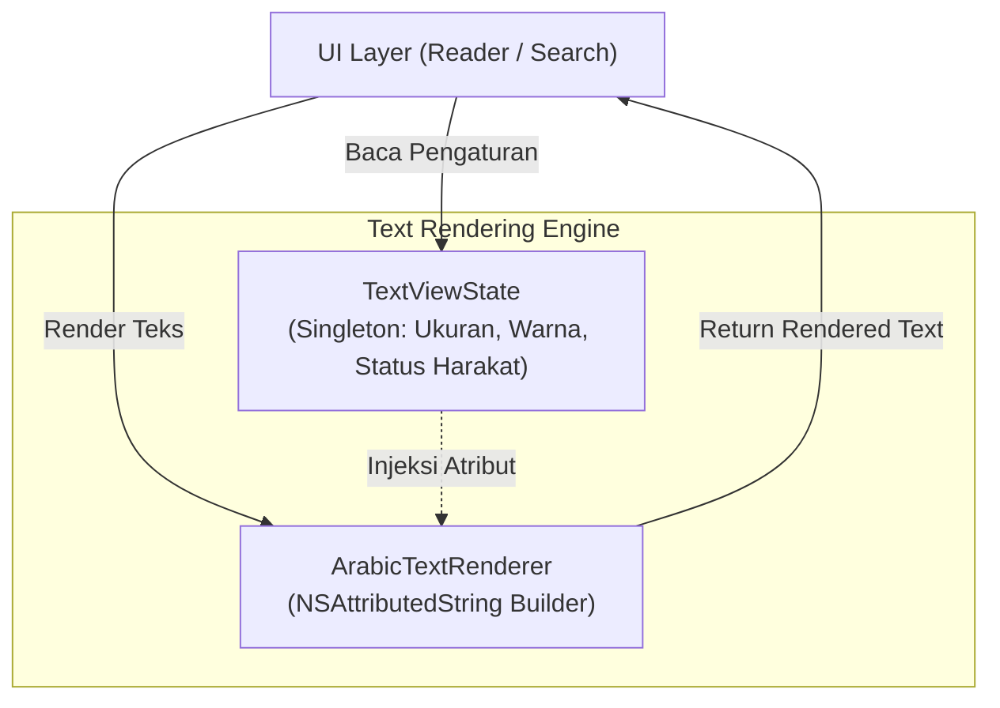
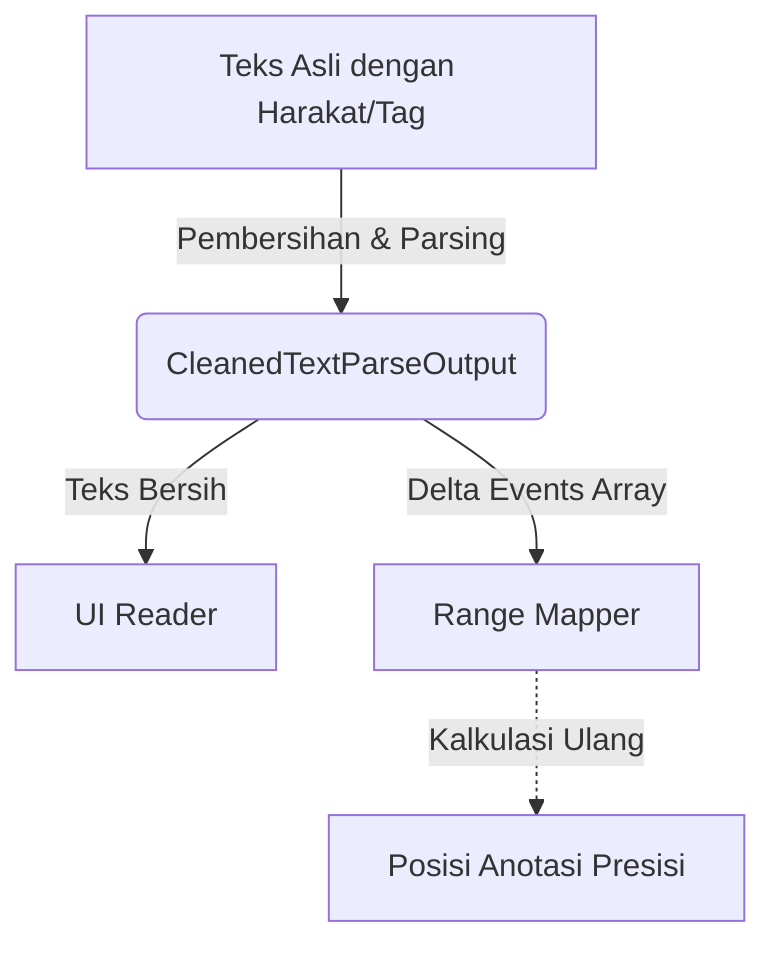

# Text Processing & String Extensions

Sub-sistem pemrosesan teks di Maktabah berfokus pada normalisasi teks Arab, pembersihan *harakat* (diakritik), kalkulasi pemetaan *range* (*range mapping*), serta rendering teks secara tipografis. Logika ini sebagian besar terkapsulasi di dalam `Source/Core/TextProcessing/` melalui *extensions* `String` bawaan.

---

## 1. Arsitektur Rendering & State Teks

Maktabah memisahkan antara state (pengaturan font, warna) dan mesin *renderer* (pemroses *NSAttributedString*).

* **`TextViewState`**: *Singleton* yang menyimpan konfigurasi *font* Arab (KFGQPC Uthmanic, dll), ukuran *font*, *theme* warna, serta sakelar (*toggle*) visibilitas harakat.
* **`ArabicTextRenderer`**: Bertugas menghasilkan `NSAttributedString` dengan mengonversi teks mentah SQLite berdasarkan atribut dari `TextViewState`, termasuk perataan teks kanan-ke-kiri (RTL) secara native.

---

## 2. Pembersihan & Pemetaan Teks (`String+TextCleaning.swift`)

Buku-buku dari Shamela seringkali mengandung format bawaan yang kotor (seperti *tag* ``, kode singkatan, atau tag HTML khusus). Pembersihan teks tidak boleh merusak indeks letak anotasi yang sudah dibuat oleh pengguna.

### Konversi Range Relatif (Delta Events)

Ketika sebuah teks dibersihkan dari harakat atau elemen HTML, panjang *string* akan berubah. Maktabah menggunakan pola **TextCleanDeltaEvent** untuk melacak setiap karakter yang dihapus sehingga *range* anotasi tetap presisi.

Fungsi utama:

* `cleanedTextWithRanges(mapping:)`: Membuang harakat dan menggeser rentang (`NSRange`) anotasi secara matematis. Ini sangat krusial agar stabilo (*highlight*) selalu menyorot kata yang persis sama, baik saat harakat ditampilkan maupun disembunyikan.
* `stripSpanTagsWithRanges()`: Menghapus tag `span` HTML dari *database* lawas dan mengekstraksi posisinya (misal untuk pewarnaan judul atau catatan kaki).
* `replaceKutubCodes()`: Menerjemahkan sandi angka perawi hadis (*kutub codes*) menjadi singkatan teks (misal: "خ" untuk Bukhari).

---

## 3. Pencarian & Snippets (`String+Search.swift`)

Mesin pencari membutuhkan cara cerdas untuk menyorot kata kunci dalam bahasa Arab di tengah teks panjang.

* **Normalisasi Skalar (`NormalizedArabicScalarMap`)**: Memetakan huruf Arab yang bentuk dasarnya sama tapi variasi Unicode-nya berbeda (seperti *alif*, *alif maksura*, *ya*, *hamza*) agar *matching* pencarian lebih tahan banting terhadap kesalahan ketik.
* **`snippetNear(keywords:nearDistance:)`**: Algoritma ekstraksi cuplikan teks (*snippet*) khusus mode "Search Near" (Pencarian Jarak Dekat). Algoritma menggunakan fungsi *sliding window* dan menghitung batas-batas klaster kata yang memenuhi toleransi kedekatan (`nearDistance`) sebelum memotong teks konteks (`contextLength`).
* **`highlightedAttributedText()`**: Menginjeksikan warna kuning/merah muda ke atas `NSAttributedString` untuk setiap kemunculan *keywords*.

---

## 4. Analisis Morfologi Arab (`String+Arabic.swift`)

Berisi fungsionalitas murni manipulasi *string* Arab:

* `normalizeArabic(_ removeDiacritics:)`: Standardisasi konversi *unicode* karakter Arab.
* `convertToArabicDigits()`: Mengonversi digit desimal ("123") ke digit Arab ("١٢٣").
* **Stemmer Light10 (`stemArabicLight10`)**: Implementasi parsial algoritma morfologi (stemming) *Light10* yang dioptimalkan untuk membuang awalan (*prefixes*) seperti "ال", "وال", "بال", dan akhiran (*suffixes*) dari kata Arab. Berguna untuk meningkatkan relevansi FTS5 dan normalisasi kueri (*search query*).

