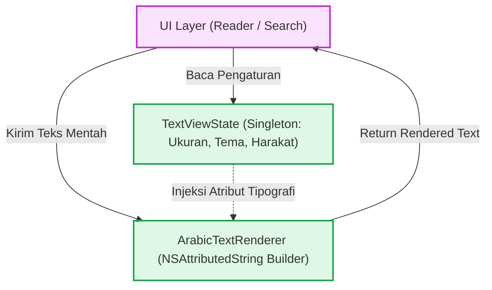
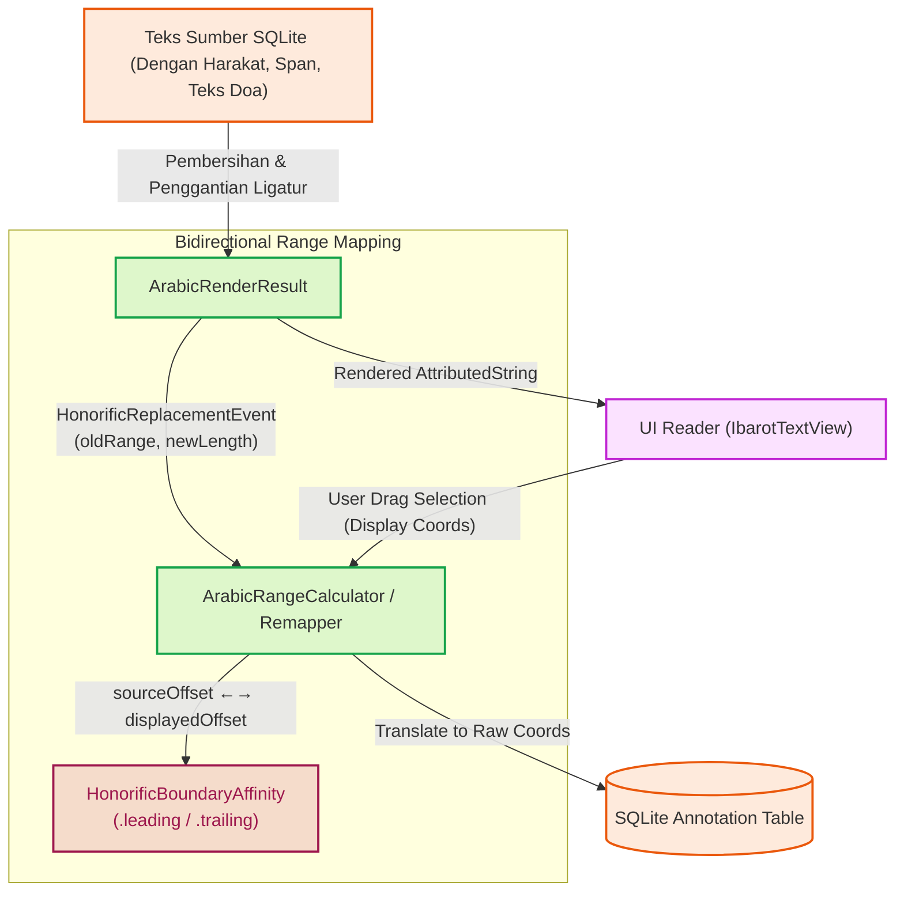

# Pemrosesan Teks & Ekstensi String

Subsistem pemrosesan teks di Maktabah berfokus pada normalisasi teks Arab, pembersihan harakat (*tashkeel*), kalkulasi pemetaan rentang (*range mapping*), serta perenderan tipografi teks. Logika ini sebagian besar terpusat di dalam `Source/Core/TextProcessing/` melalui *extension* `String` bawaan.

---

## 1. Arsitektur Rendering & State Teks

Maktabah memisahkan antara kondisi pengaturan (*state* font, ukuran, tema warna) dan mesin perender (*NSAttributedString builder*).



* **`TextViewState`**: *Singleton* yang menyimpan konfigurasi *font* Arab (KFGQPC Uthmanic, dll.), ukuran *font*, tema warna, serta sakelar (*toggle*) visibilitas harakat.
* **`ArabicTextRenderer`**: Bertugas menghasilkan `NSAttributedString` dengan mengonversi teks mentah SQLite berdasarkan atribut dari `TextViewState`, termasuk perataan teks kanan-ke-kiri (RTL) secara *native*.

---

## 2. Pembersihan & Pemetaan Teks (`String+TextCleaning.swift`)

Data kitab dari Shamela sering kali memuat pemformatan bawaan (seperti tag `<span class="footnote">`, kode singkatan, atau tag HTML khusus). Pembersihan teks tidak boleh merusak indeks letak anotasi yang telah dibuat oleh pengguna.

### Konversi Rentang Relatif (*Delta Events*)

Ketika teks dibersihkan dari harakat atau elemen HTML, panjang karakter (*string length*) mengalami perubahan. Maktabah menggunakan pola **TextCleanDeltaEvent** dan **HonorificReplacementEvent** untuk melacak setiap karakter yang dihapus atau diganti sehingga kalkulasi rentang (*range*) anotasi tetap presisi.



### 1. Penggantian Frasa Doa / Ligatur (`HonorificReplacementEvent`)
Dalam teks turats Islam, frasa doa umum seperti:
- `"صلى الله عليه وسلم"`
- `"رضي الله عنه"`
- `"رحمه الله"`
- `"عز وجل"`

Sering kali dirender menjadi satu glif kaligrafi (*calligraphic ligatures*) pada *font* khusus seperti KFGQPC Uthmanic Script. Penggantian frasa sepanjang 18 karakter menjadi satu glif kaligrafi tunggal menyebabkan pergeseran koordinat (*length delta*) yang signifikan:

```swift
struct HonorificReplacementEvent {
    let oldRange: NSRange
    let newLength: Int
}

enum HonorificBoundaryAffinity {
    case leading
    case trailing
}
```

### 2. Kalkulasi Koordinat Dua Arah (`ArabicRenderResult`)
Struktur `ArabicRenderResult` menyediakan fungsi translasi dua arah antara sistem koordinat sumber (*source offset* di basis data) dan koordinat tampilan (*displayed offset* di TextKit):

- **`displayedOffset(forSourceOffset:affinity:)`**: Menghitung pergeseran kumulatif $\Delta = \sum (\text{newLength} - \text{oldRange.length})$ untuk memposisikan sorotan teks (*highlight*) yang sedang ditampilkan di layar.
- **`sourceOffset(forDisplayedOffset:affinity:)`**: Menerjemahkan kembali seleksi kursor pengguna pada teks bertampilan ligatur menjadi rentang absolut pada teks mentah di basis data SQLite.
- **`HonorificBoundaryAffinity`**: Menentukan apakah seleksi kursor yang jatuh tepat di batas frasa ligatur condong ke awal (`.leading`) atau ke akhir (`.trailing`) teks asli, guna mencegah terpotongnya sorotan (*highlight*) pada kata tersebut.

### 3. Pembersihan Tag HTML & Kode Hadis
* `cleanedTextWithRanges(mapping:)`: Menghapus harakat dan menggeser rentang (`NSRange`) anotasi secara matematis agar sorotan teks (*highlight*) selalu menandai kata yang sama, baik saat harakat ditampilkan maupun disembunyikan.
* `stripSpanTagsWithRanges()`: Menghapus tag `span` HTML dari basis data terdahulu (*legacy database*) dan mengekstrak posisinya (misalnya untuk pewarnaan judul atau catatan kaki).
* `replaceKutubCodes()`: Menerjemahkan kode numerik kitab rujukan hadis (*kutub codes*) menjadi singkatan teks (misalnya: "خ" untuk Shahih Bukhari).

---

## 3. Pencarian & Cuplikan Teks (`String+Search.swift`)

Mesin pencari memerlukan normalisasi khusus untuk menyorot kata kunci dalam bahasa Arab di tengah teks panjang.

* **Normalisasi Skalar (`NormalizedArabicScalarMap`)**: Memetakan huruf Arab yang bentuk dasarnya sama tetapi kode Unicode-nya berbeda (seperti *alif*, *alif maksura*, *ya*, *hamza*) agar pencocokan kueri tahan terhadap variasi penulisan.
* **`snippetNear(keywords:nearDistance:)`**: Algoritma ekstraksi cuplikan teks (*snippet*) khusus mode *Search Near* (pencarian kedekatan kata). Menggunakan metode *sliding window* untuk menghitung batas-batas klaster kata yang memenuhi toleransi kedekatan (`nearDistance`) sebelum memotong teks konteks (`contextLength`).
* **`highlightedAttributedText()`**: Menyuntikkan atribut warna latar belakang ke dalam `NSAttributedString` untuk setiap kemunculan kata kunci (*keywords*).

---

## 4. Analisis Morfologi Arab (`String+Arabic.swift`)

Berisi fungsionalitas manipulasi *string* teks Arab:

* `normalizeArabic(_ removeDiacritics:)`: Standardisasi konversi Unicode karakter Arab.
* `convertToArabicDigits()`: Mengonversi digit desimal ("123") ke digit Arab ("١٢٣").
* **Stemmer Light10 (`stemArabicLight10`)**: Implementasi algoritma morfologi (*stemming*) *Light10* yang dioptimalkan untuk membuang awalan (*prefixes*) seperti "ال", "وال", "بال", dan akhiran (*suffixes*) dari kata Arab, meningkatkan relevansi pencarian FTS5 dan normalisasi kueri.

---

## 5. String Interning Pool (`StringInterner.swift`)

Untuk menghemat konsumsi memori saat ribuan baris teks dan nama kitab dimuat berulang kali, `StringInterner` menyediakan mekanisme deduplikasi *string* global (*string interning*).

```swift
import Foundation
import Synchronization

public final class StringInterner: Sendable {
    private let pool: Mutex<[String: String]> = .init([:])
    public static let shared: StringInterner = .init()

    public func intern(_ value: String) -> String {
        guard !value.isEmpty else { return value }
        return pool.withLock { dict in
            if let existing = dict[value] {
                return existing
            }
            dict[value] = value
            return value
        }
    }
}
```

* **Sinkronisasi via Mutex**: Menggunakan `Synchronization.Mutex` untuk menjamin operasi `intern` sepenuhnya *thread-safe* di lingkungan konkurensi Swift 6.
* **Protokol `Sendable` Penuh**: Memungkinkan `StringInterner.shared` dibagikan lintas *actor* dan *thread pool* tanpa menggunakan `nonisolated(unsafe)`.
