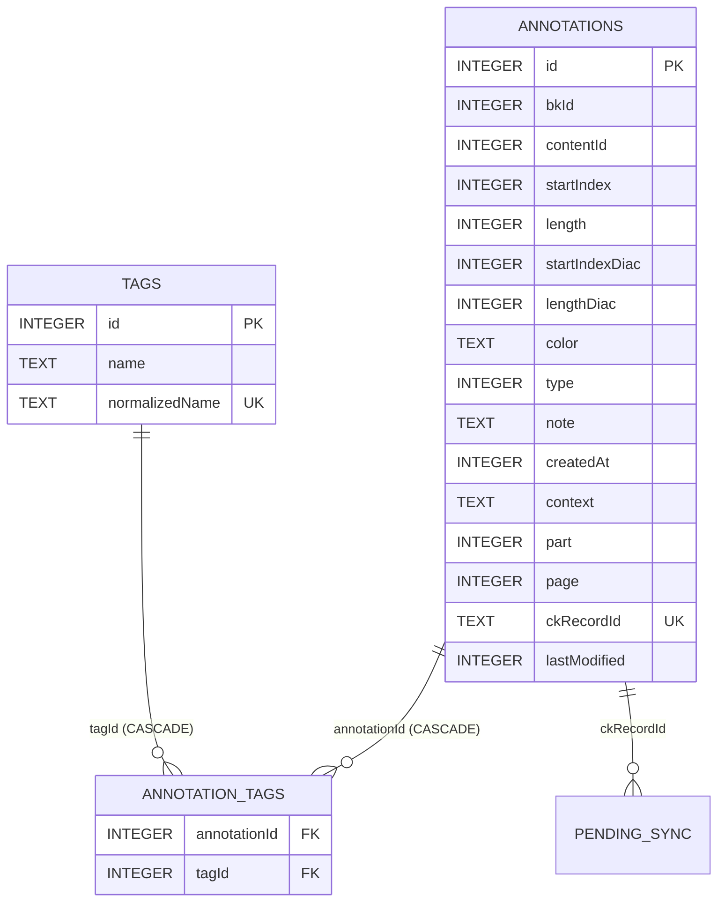
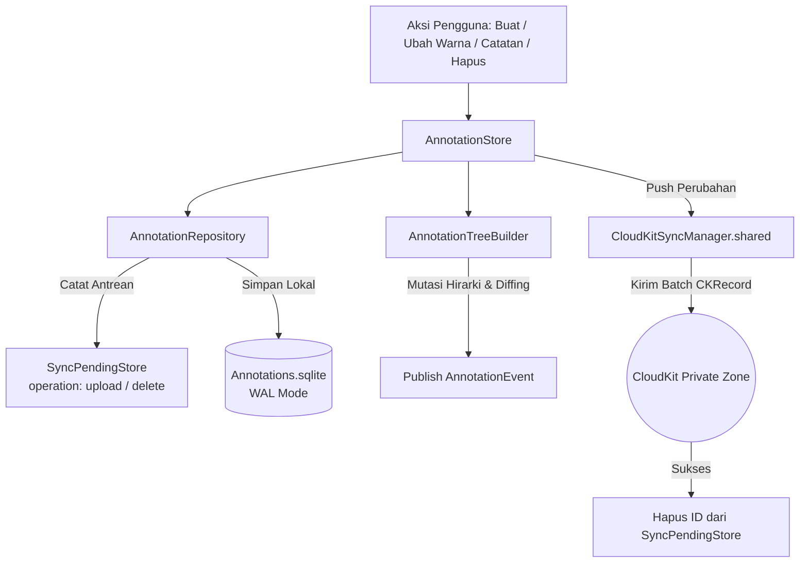
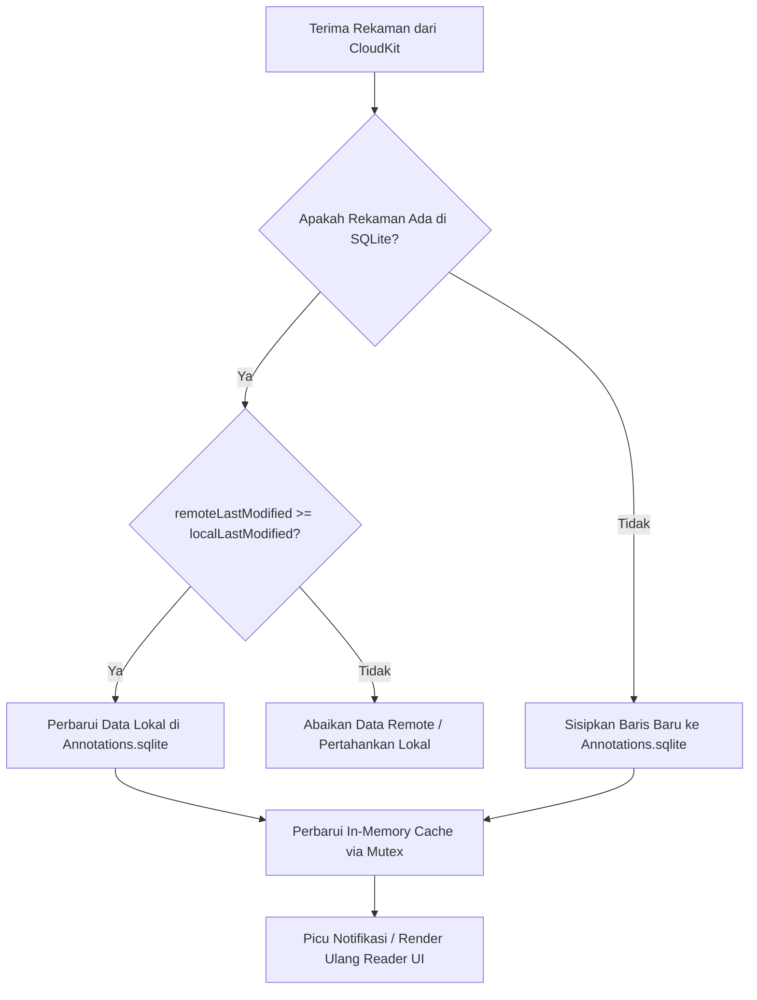

# Persistence, Cache & Concurrency

Fitur Annotations menyimpan data ke penyimpanan lokal (SQLite) serta melakukan sinkronisasi awan (CloudKit) agar konsisten di berbagai perangkat pengguna.

## Skema SQLite (`AnnotationRepository`)

`AnnotationRepository` bertindak sebagai *Direct Data Access* menggunakan pembungkus (wrapper) `SQLiteDatabase`. File database tersendiri disimpan pada path *Application Support* dengan nama `Annotations.sqlite`.

Database memiliki 3 tabel utama:

### 1. Tabel `annotations`

Menyimpan metadata detail setiap anotasi.



| Kolom | Tipe Data | Deskripsi |
| --- | --- | --- |
| `id` | INTEGER PRIMARY KEY AUTOINCREMENT | ID auto-increment dari SQLite. |
| `bkId` | INTEGER | ID Buku Maktabah. |
| `contentId` | INTEGER | ID Konten/Halaman dari Buku. |
| `startIndex` | INTEGER | Titik awal range teks *tanpa* harakat. |
| `length` | INTEGER | Panjang teks *tanpa* harakat. |
| `startIndexDiac` | INTEGER | Titik awal range teks *dengan* harakat. |
| `lengthDiac` | INTEGER | Panjang teks *dengan* harakat. |
| `color` | TEXT | Hexadecimal warna (misal `#FFFF00`). |
| `type` | INTEGER | Mode Anotasi (0: Highlight, 1: Underline). |
| `note` | TEXT | Catatan teks tambahan (Nullable). |
| `createdAt` | INTEGER | Timestamp UNIX detik pembuatan anotasi. |
| `context` | TEXT | Salinan teks yang dianotasi (String Interning). |
| `part` | INTEGER | Bagian / Jilid buku. |
| `page` | INTEGER | Halaman cetak buku. |
| `ckRecordId` | TEXT | UUID string khusus record CloudKit. |
| `lastModified` | INTEGER | Timestamp UNIX detik modifikasi terakhir (untuk *Conflict Resolution*). |

**Indeks Pencarian:**
- `idx_ann_bk_content` pada `(bkId, contentId)`: Digunakan saat merender UI Reader yang perlu cepat mengambil anotasi pada halaman berjalan.
- `idx_ann_ck_record_id` pada `(ckRecordId)`: Untuk efisiensi sinkronisasi CloudKit.

### 2. Tabel Relasi *Many-to-Many* (Tags)

- **`tags`**: Berisi `id` (INTEGER), `name` (TEXT), dan `normalizedName` (TEXT UNIQUE) untuk pencarian *case-insensitive*.
- **`annotation_tags`**: Tabel *junction* berisi `annotationId` (INTEGER) dan `tagId` (INTEGER). Terdapat *Unique Index* `idx_ann_tag_ids` untuk mencegah duplikasi tag di satu anotasi.

## Lapisan In-Memory Cache (`AnnotationStore`)

Sebagai optimasi, aplikasi jarang melakukan baca/tulis langsung ke `AnnotationRepository` di UI Thread. Melainkan, ia berinteraksi melalui **`AnnotationStore`**, sebuah *Singleton* yang mengelola Cache memori.

```swift
private struct CacheState: Sendable {
    var cacheById: [Int64: Annotation] = [:]
    var cacheByContent: [ContentKey: [Annotation]] = [:]
    var cacheByBook: [Int: [Annotation]] = [:]
    var cacheTagsByAnnotationId: [Int64: [String]] = [:]
    var cachedAllTagNames: [String]?
}
```

### Pengamanan Thread-Safety (Swift `Mutex`)

Mengikuti praktik terbaik konkurensi Swift modern (Swift 6), status *cache* dilindungi oleh sinkronisasi `Mutex` (dari framework `Synchronization`).

```swift
import Synchronization

private let cache = Mutex(CacheState())

func loadAnnotations(bkId: Int, contentId: Int) -> [Annotation] {
    let key = ContentKey(bkId: bkId, contentId: contentId)

    // 1. Coba ambil dari In-Memory (O(1) time)
    let cached = cache.withLock { $0.cacheByContent[key] }
    if let cached { return cached }

    // 2. Jika Miss, Fetch dari SQLite
    let loaded = (try? repository.loadAnnotations(bkId: bkId, contentId: contentId)) ?? []

    // 3. Update Cache dengan Mutex Lock
    cache.withLock { state in
        state.cacheByContent[key] = loaded
        // ... iterasi simpan lookup by ID
    }

    return loaded
}
```

Penggunaan `Mutex.withLock` sangat ringan (berbasis OS level atomic locks) dan memastikan tidak ada kondisi *Race-Condition* saat membaca ataupun memperbarui data anotasi meskipun dilakukan serentak (concurrently) oleh *search worker* dan *Main Thread*.

## Alur Sinkronisasi Offline & CloudKit (`AnnotationSyncHandler.swift`)

Untuk mendukung transisi baca lintas perangkat (misal: baca di iPad, lanjut di Mac), modul Anotasi tersambung ke `CloudKitSyncManager`. Sinkronisasi ini memanfaatkan zona kustom (*Custom Zone*) di database pribadi (*Private Database*) CloudKit pengguna agar mendukung *CKFetchRecordZoneChangesOperation* (Push Notification / Delta Download).

### Alur Sinkronisasi Keluar (Upload & Delete)



### Alur Sinkronisasi Masuk & Resolusi Konflik (LWW)

Ketika data remote diterima dari CloudKit via `fetchChanges`:



Apabila sinkronisasi menarik versi Cloud yang lebih baru dari versi lokal, SQLite akan meng-*overwrite* versi lokal, cache memori diperbarui di bawah proteksi `Mutex`, dan antarmuka Reader akan dipicu ulang untuk merender anotasi terbaru. Jika data remote lebih usang, data remote diabaikan untuk menjaga integritas pekerjaan lokal pengguna.

### Penanganan Mode Offline (`SyncPendingStore`)

Mirip seperti arsitektur Bookmarks, setiap mutasi (Insert, Update, Delete) yang dilakukan di `AnnotationRepository` secara implisit akan diregistrasikan ke tabel sinkronisasi tunda (pending):

```swift
try transaction {
    try exec(insertAnnotationSQL, parameters: params)
    // ...
    try self.addPendingSync(ckRecordId: ckId, operation: "upload")
}
```

Jika modifikasi lokal gagal terunggah (misal karena pengguna sedang dalam mode pesawat atau *offline*), perubahan akan dicatat dengan aman pada *Pending Queue* `syncPendingStore`. Kemudian, `CloudKitSyncManager` akan menguras (*flush*) antrean tersebut secara asinkronus sesaat setelah konektivitas internet terhubung kembali.

### *Nuke* Database & Import
Sebagai fitur pencadangan ekstrem, `AnnotationStore` juga menyediakan fungsi utilitas `nukeDatabase()` (yang menghapus tabel secara bersih total) dan `importAnnotations()` yang mengeksekusi strategi penimpaan massal saat pengguna merestorasi berkas arsip anotasi lokal.
