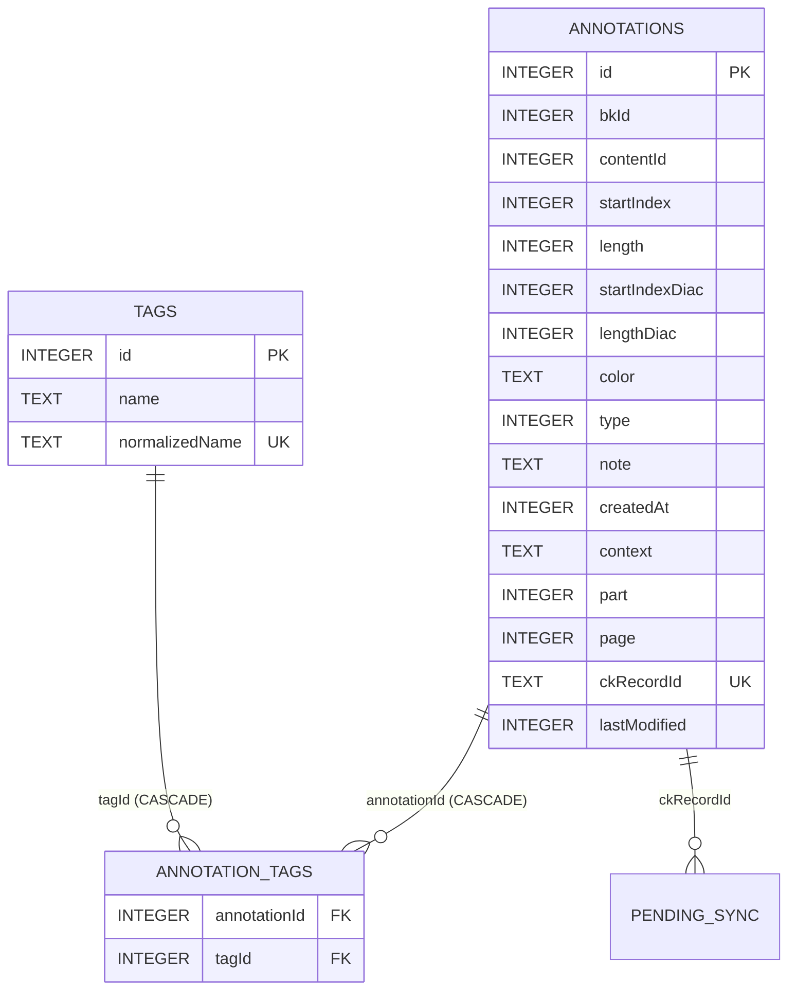
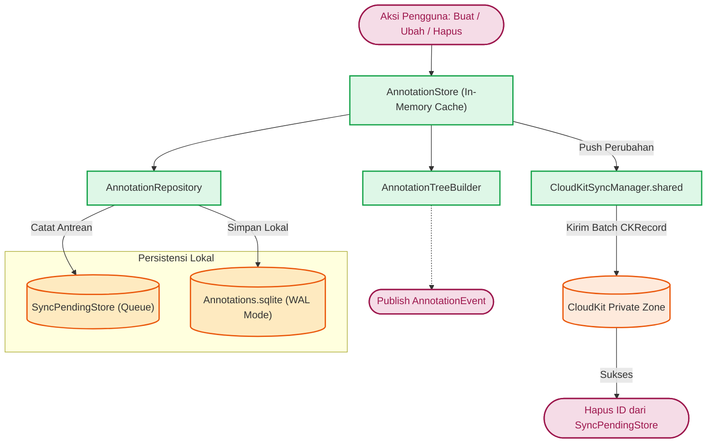
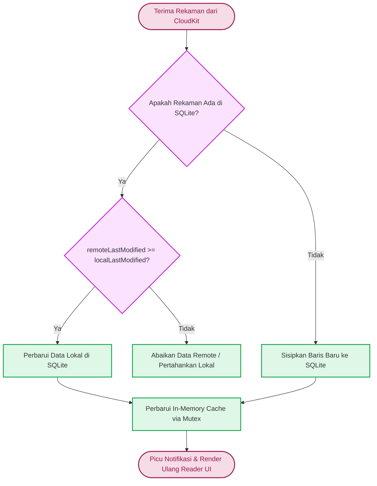

# Persistence, Cache & Concurrency

Fitur Annotations menyimpan data ke penyimpanan lokal (SQLite) serta melakukan sinkronisasi awan (CloudKit) agar konsisten di berbagai perangkat pengguna.

## Skema SQLite (`AnnotationRepository`)

`AnnotationRepository` bertindak sebagai lapisan akses data langsung (*Direct Data Access*) menggunakan pembungkus `SQLiteDatabase`. Berkas basis data disimpan pada direktori *Application Support* dengan nama `Annotations.sqlite`.

Basis data memiliki 3 tabel utama:

### 1. Tabel `annotations`

Menyimpan metadata detail setiap anotasi.



| Kolom | Tipe Data | Deskripsi |
| --- | --- | --- |
| `id` | INTEGER PRIMARY KEY AUTOINCREMENT | ID *auto-increment* dari SQLite. |
| `bkId` | INTEGER | ID Buku Maktabah. |
| `contentId` | INTEGER | ID Konten/Halaman dari Buku. |
| `startIndex` | INTEGER | Titik awal rentang teks *tanpa* harakat. |
| `length` | INTEGER | Panjang rentang teks *tanpa* harakat. |
| `startIndexDiac` | INTEGER | Titik awal rentang teks *dengan* harakat. |
| `lengthDiac` | INTEGER | Panjang rentang teks *dengan* harakat. |
| `color` | TEXT | Kode heksadesimal warna (misalnya `#FFFF00`). |
| `type` | INTEGER | Mode Anotasi (0: Highlight, 1: Underline). |
| `note` | TEXT | Catatan teks tambahan (*nullable*). |
| `createdAt` | INTEGER | UNIX *timestamp* detik pembuatan anotasi. |
| `context` | TEXT | Salinan teks yang dianotasi (denormalisasi untuk pencarian cepat). |
| `part` | INTEGER | Bagian / Jilid buku. |
| `page` | INTEGER | Halaman cetak buku. |
| `ckRecordId` | TEXT | UUID *string* khusus rekaman CloudKit. |
| `lastModified` | INTEGER | UNIX *timestamp* detik modifikasi terakhir (untuk *Conflict Resolution*). |

**Indeks Pencarian:**

- `idx_ann_bk_content` pada `(bkId, contentId)`: Digunakan saat merender UI Reader yang perlu mengambil anotasi pada halaman aktif secara cepat.
- `idx_ann_ck_record_id` pada `(ckRecordId)`: Untuk efisiensi sinkronisasi CloudKit.

### 2. Tabel Relasi Many-to-Many (Tags)

- **`tags`**: Berisi `id` (INTEGER), `name` (TEXT), dan `normalizedName` (TEXT UNIQUE) untuk pencarian *case-insensitive*.
- **`annotation_tags`**: Tabel *junction* berisi `annotationId` (INTEGER) dan `tagId` (INTEGER). Dilengkapi *Unique Index* `idx_ann_tag_ids` untuk mencegah duplikasi tag pada satu anotasi.

## Lapisan In-Memory Cache (`AnnotationStore`)

Aplikasi mengoptimalkan interaksi data dengan tidak melakukan pembacaan/penulisan langsung ke `AnnotationRepository` di UI Thread, melainkan melalui **`AnnotationStore`**, sebuah *singleton* yang mengelola *in-memory cache*.

```swift
private struct CacheState: Sendable {
    var cacheById: [Int64: Annotation] = [:]
    var cacheByContent: [ContentKey: [Annotation]] = [:]
    var cacheByBook: [Int: [Annotation]] = [:]
    var cacheTagsByAnnotationId: [Int64: [String]] = [:]
    var cachedAllTagNames: [String]?
}
```

### Pengamanan Thread-Safety (`Synchronization.Mutex`)

*State* *cache* dilindungi oleh `Mutex` bawaan framework `Synchronization` (Swift 6):

```swift
import Synchronization

private let cache = Mutex(CacheState())

func loadAnnotations(bkId: Int, contentId: Int) -> [Annotation] {
    let key = ContentKey(bkId: bkId, contentId: contentId)

    // 1. Ambil dari Cache In-Memory (kompleksitas O(1))
    let cached = cache.withLock { $0.cacheByContent[key] }
    if let cached { return cached }

    // 2. Jika Cache Miss, ambil dari SQLite
    let loaded = (try? repository.loadAnnotations(bkId: bkId, contentId: contentId)) ?? []

    // 3. Perbarui Cache dengan Mutex Lock
    cache.withLock { state in
        state.cacheByContent[key] = loaded
        // ... simpan pemetaan lookup berdasarkan ID
    }

    return loaded
}
```

Penggunaan `Mutex.withLock` berbasis operasi *lock* atomik tingkat OS memastikan tidak ada kondisi *data race* saat membaca ataupun memperbarui data anotasi secara konkuren oleh *search worker* dan Main Thread.

## Alur Sinkronisasi Offline & CloudKit (`AnnotationSyncHandler.swift`)

Untuk mendukung kesinambungan baca lintas perangkat, modul Anotasi terhubung ke `CloudKitSyncManager` melalui zona kustom (*Custom Zone*) di *Private Database* CloudKit pengguna.

### Alur Sinkronisasi Keluar (Upload & Delete)



### Alur Sinkronisasi Masuk & Resolusi Konflik (LWW)

Ketika data *remote* diterima dari CloudKit via `fetchChanges`:



Apabila sinkronisasi menarik versi Cloud yang lebih baru dari versi lokal, SQLite akan menimpa (*overwrite*) versi lokal, *cache* memori diperbarui di bawah proteksi `Mutex`, dan antarmuka Reader dipicu untuk merender anotasi terbaru. Jika data *remote* lebih usang, data tersebut diabaikan untuk menjaga integritas data lokal.

### Penanganan Mode Luring (`SyncPendingStore`)

Setiap mutasi (Insert, Update, Delete) yang dilakukan di `AnnotationRepository` dicatat ke dalam antrean sinkronisasi tertunda (*pending sync*):

```swift
try transaction {
    try exec(insertAnnotationSQL, parameters: params)
    // ...
    try self.addPendingSync(ckRecordId: ckId, operation: "upload")
}
```

Jika modifikasi lokal gagal terunggah (misalnya saat perangkat luring), perubahan tersimpan dengan aman pada `SyncPendingStore`. `CloudKitSyncManager` akan melakukan *flush* pada antrean tersebut secara asinkron setelah konektivitas internet kembali pulih.

### Thread-Safety & Sendable Conformance (`AnnotationRepository`)

`AnnotationRepository` mengadopsi protokol `Sendable` secara langsung tanpa membutuhkan penanda `@unchecked`. Komponen ini membungkus *pointer* basis data, URL, dan *instance* `SyncPendingStore` ke dalam kontainer *state* terisolasi:

```swift
final class AnnotationRepository: SyncPendingManaging, Sendable {
    private struct State: Sendable {
        var db: SQLiteDatabase?
        var syncPendingStore: SyncPendingStore?
        var dbURL: URL?
    }

    private let state = Mutex(State())

    var _db: SQLiteDatabase? {
        state.withLock { $0.db }
    }
    var syncPendingStore: SyncPendingStore? {
        state.withLock { $0.syncPendingStore }
    }
    var dbURL: URL? {
        state.withLock { $0.dbURL }
    }
}
```

Setiap operasi pembukaan koneksi, penutupan (`disconnect`), atau pengambilan *pointer* basis data dieksekusi di dalam blok `state.withLock`, menjamin keamanan thread tanpa resiko data race pada Swift 6.

### Operasi Reset Database & Impor

Sebagai fitur pemulihan, `AnnotationStore` menyediakan fungsi `nukeDatabase()` (yang mengosongkan tabel secara menyeluruh) dan `importAnnotations()` yang mengeksekusi strategi penggantian massal saat pengguna merestorasi berkas arsip anotasi lokal.
