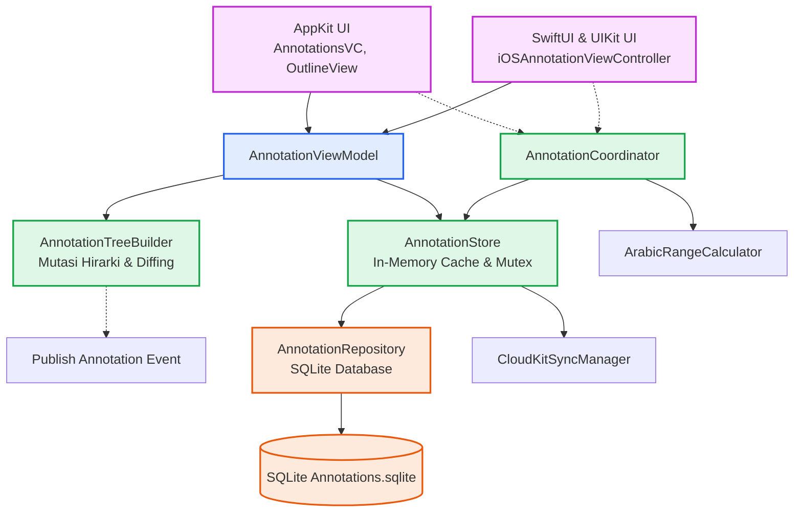

# Annotations - Overview & Architecture Pipeline

Dokumentasi ini membedah feature-slice **Annotations** pada Maktabah. Fitur ini menangani pembuatan, penyimpanan, dan sinkronisasi anotasi (highlight, underline, dan notes) pada buku.

## Prinsip Pemisahan Tanggung Jawab (Separation of Concerns)

Fitur Annotations dirancang dengan pemisahan lapisan (layering) yang ketat untuk memastikan skalabilitas dan kemudahan pengujian:

1. **Model Layer (`Models/`)**
    Berisi representasi data murni (`Annotation`, `AnnotationNode`) yang `Sendable` dan terbebas dari dependensi UI atau Database. Model ini dirancang untuk concurrency.

2. **Database & Storage Layer (`Database/`)**
    Mengelola persistensi data menggunakan SQLite (`AnnotationRepository`) dengan caching in-memory (`AnnotationStore`) yang *thread-safe* menggunakan `Mutex`. Lapisan ini juga mengoordinasikan sinkronisasi luring dan CloudKit.

3. **ViewModel Layer (`ViewModel/`)**
    Bertindak sebagai jembatan reaktif antara Storage dan UI. Menggunakan framework `Combine` dan `@Observable` (di `AnnotationViewModel`) untuk memberikan *state* yang siap dirender, serta menangani debounce dan operasi pencarian asinkron.

4. **Coordinator Layer (`Coordinator/`)**
    `AnnotationCoordinator` merangkum logika kompleks seperti kalkulasi *range* teks Arab (dengan dan tanpa harakat) antara UI Text View dan Core Engine.

5. **UI Layer (`macOS/` dan `iOS/`)**
    Menampilkan data dan menangani interaksi pengguna. Memanfaatkan AppKit (`NSViewController`, `NSOutlineView`) untuk macOS dan SwiftUI/UIKit untuk iOS.

## Diagram Interaksi Komponen

Berikut adalah *pipeline* arsitektur dari UI hingga ke Storage:

## Daftar Tautan

- [AppKit Implementation (macOS)](macos.md)
- [Contracts & Loose Coupling](protocols.md)
- [Data Models & State Types](models.md)
- [Diacritics & Range Mapping](range-mapping.md)
- [Persistence, Cache & Concurrency](database.md)
- [State Management, Combine & Async Workflows](viewmodel.md)
- [SwiftUI & UIKit Integration (iOS)](ios.md)
- [Tree Builder & Data Hierarchy](tree-builder.md)
- [UI & Platform Integration](ui-integration.md)
