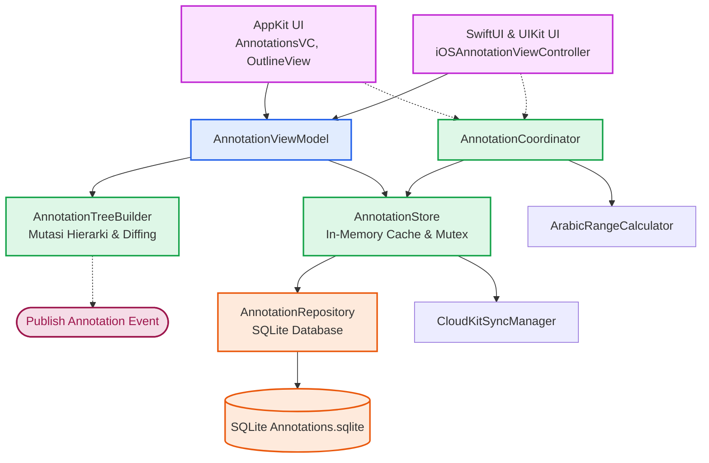

# Annotations - Overview & Architecture Pipeline

Dokumentasi ini membedah modul **Annotations** pada aplikasi Maktabah. Fitur ini menangani pembuatan, penyimpanan, dan sinkronisasi anotasi (*highlight*, *underline*, dan *notes*) pada teks kitab.

## Prinsip Pemisahan Tanggung Jawab (*Separation of Concerns*)

Modul Annotations dirancang dengan pemisahan lapisan yang ketat untuk memastikan skalabilitas dan kemudahan pemeliharaan:

1. **Model Layer (`Models/`)**
    Berisi representasi data murni (`Annotation`, `AnnotationNode`) yang mengadopsi `Sendable` dan terbebas dari dependensi UI atau basis data.

2. **Database & Storage Layer (`Database/`)**
    Mengelola persistensi data menggunakan SQLite (`AnnotationRepository`) dengan *caching in-memory* (`AnnotationStore`) yang *thread-safe* menggunakan `Synchronization.Mutex`. Lapisan ini juga mengoordinasikan sinkronisasi luring dan CloudKit.

3. **ViewModel Layer (`ViewModel/`)**
    Bertindak sebagai jembatan reaktif antara Storage dan UI. Menggunakan *framework* `Combine` dan `@Observable` (di `AnnotationViewModel`) untuk menyajikan *state* tampilan, serta menangani *debounce* dan operasi pencarian asinkron.

4. **Coordinator Layer (`Coordinator/`)**
    `AnnotationCoordinator` merangkum logika kalkulasi rentang (*range*) teks Arab (dengan dan tanpa harakat) antara UI Text View dan Core Engine.

5. **UI Layer (`macOS/` dan `iOS/`)**
    Menampilkan data dan menangani interaksi pengguna menggunakan AppKit (`NSViewController`, `NSOutlineView`) untuk macOS serta SwiftUI dan UIKit untuk iOS.

## Diagram Interaksi Komponen

Berikut adalah alur arsitektur dari lapisan antarmuka hingga ke penyimpanan:

## Daftar Tautan

- [AppKit Implementation (macOS)](macos.md)
- [Contracts & Loose Coupling](protocols.md)
- [Data Models & State Types](models.md)
- [Diacritics & Range Mapping](range-mapping.md)
- [Persistence, Cache & Concurrency](database.md)
- [State Management, Combine & Async Workflows](viewmodel.md)
- [SwiftUI & UIKit Integration (iOS)](ios.md)
- [Tree Builder & Data Hierarchy](tree-builder.md)
- [UI & Platform Integration](ui-integration.md)
