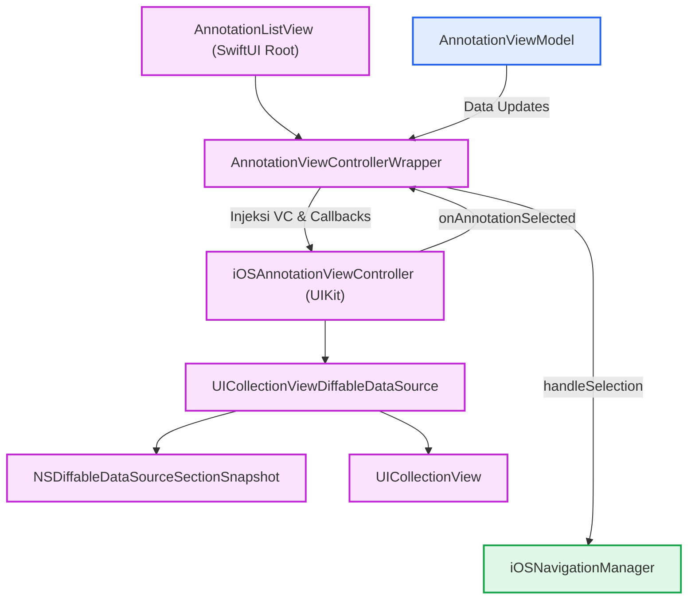
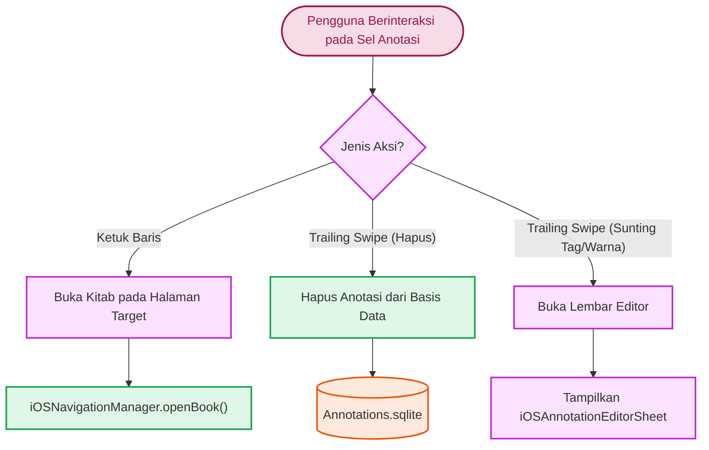

# Antarmuka Pengguna iOS Anotasi

Implementasi antarmuka anotasi di iOS dan iPadOS mengadopsi arsitektur hibrida (*hybrid*) yang menggabungkan paradigma deklaratif SwiftUI untuk level kontainer dan UIKit modern (`UICollectionViewCompositionalLayout` & `UICollectionViewDiffableDataSource`) untuk performa tinggi daftar hierarki teks Arab.

## Arsitektur Hibrida & Diagram Alur Data

Alur rendering dan pembagian tanggung jawab antarkomponen diatur sebagai berikut:



### Routing Interaksi Gestur & Aksi Baris



### Pembagian Tanggung Jawab Komponen

1.  **`AnnotationListView` (SwiftUI Root Container)**:
    *   Mengatur *toolbar* atas: Menu pengelompokan (*Group By: Book, Tag, Timeline*) dan pengurutan (*Sort By & Order*).
    *   Menangani ekspor dan impor JSON melalui modifier `.fileExporter` dan `.fileImporter` (`AnnotationJsonDocument`).
    *   Menampilkan dialog konfirmasi penggantian saat impor (*overwrite duplicate confirmation dialog*).
    *   Menangkap notifikasi `.annotationMissingBook` untuk memunculkan modal peringatan jika buku belum terunduh di perangkat.
2.  **`AnnotationViewControllerWrapper` (Bridge Layer)**:
    *   Menghubungkan *state* dan *callback* `AnnotationViewModel` (`onIncrementalUpdate`, `onTreeUpdate`, `onTagsChanged`) ke metode di `iOSAnnotationViewController`.
    *   Memiliki `Coordinator` yang menangani delegasi seleksi anotasi dan memicu `iOSNavigationManager.openBook(..., targetAnnotation:)`.
    *   Mengatur integrasi *pull-to-refresh* menuju `CloudKitSyncManager.shared.fetchChanges()`.
3.  **`iOSAnnotationViewController` (UIKit Presentation Layer)**:
    *   Mengelola tampilan koleksi hierarki, *expandable snapshot* per grup, *header tag chips*, dan pembaruan visual inkremental.

## Diffing Snapshot Data

Untuk menyajikan daftar anotasi yang dinamis, aplikasi memanfaatkan `UICollectionViewDiffableDataSource` yang dikombinasikan dengan `NSDiffableDataSourceSectionSnapshot`.

*   **Pembaruan Skala Penuh (*Full Rebuild*)**:
    Saat pengguna mengganti mode pengelompokan (*Grouping Mode*) atau memuat data awal, kontroler membuat ulang seluruh *snapshot*. Daftar *section* diterapkan langsung ke tingkat *root*, kemudian `NSDiffableDataSourceSectionSnapshot` dibuat untuk setiap grup, memasukkan *parent node* beserta *child nodes* anotasinya.

*   **Pembaruan Inkremental (*Incremental Update*)**:
    Untuk pembaruan seperti penambahan, pengubahan, atau penghapusan tunggal, sistem tidak memuat ulang seluruh data:
    *   Jika anotasi dihapus, elemen tersebut dicari di seluruh *section snapshot*, lalu dihapus secara terarah.
    *   Jika pembaruan menyebabkan sebuah grup menjadi kosong, grup tersebut akan dihapus dari tingkat *root* secara otomatis.

## Mode Pengelompokan & Filter Tag Chip

Antarmuka mendukung tata letak dinamis yang disesuaikan berdasarkan dua konsep:

*   **Mode Pengelompokan (*Grouping Mode*)**:
    Pengguna dapat mengelompokkan anotasi berdasarkan Buku (*Book*), Label (*Tag*), atau Linimasa (*Timeline*). Komponen `AnnotationContentConfiguration` menerima status mode ini untuk menentukan teks sekunder:
    *   Bila diurutkan berdasarkan Tag atau Linimasa, tampilan daftar anotasi menonjolkan judul buku.
    *   Saat dikelompokkan berdasarkan Buku, tampilan menonjolkan daftar tag yang terkait.

*   **Filter Tag Chip**:
    Komponen `iOSTagFilterHeaderView` disematkan sebagai *header* koleksi (*Collection Header*).
    *   Menampilkan deretan *chips* yang dapat digulir secara horizontal.
    *   Memiliki mode pergantian logika (AND/OR) yang ditandai dengan perubahan ikon.
    *   Diperbarui secara asinkron sehingga elemen baru disisipkan pada indeks yang tepat tanpa mengganggu status gulir elemen lainnya.

## Penanganan Arah Teks (Force LTR)

Aplikasi Maktabah dirancang untuk mengakomodasi teks Arab sehingga secara alami memakai orientasi Kanan-ke-Kiri (RTL). Namun, pada elemen metadata tertentu, tata letak diarahkan secara eksplisit ke Kiri-ke-Kanan (*Force LTR*).

*   **Manipulasi Semantik Kontainer**:
    Pada `AnnotationContentView`, kontainer bawah yang memuat label nomor halaman diatur secara spesifik:
    ```swift
    bottomStack.semanticContentAttribute = .forceLeftToRight
    ```
    Konfigurasi ini memastikan posisi indikator halaman tetap konsisten di pojok kiri.

*   **Inversi Gulir Matriks**:
    Pada *header* filter tag di dalam `UIScrollView`:
    ```swift
    chipsScrollView.transform = CGAffineTransform(scaleX: -1, y: 1)
    chipsStackView.transform = CGAffineTransform(scaleX: -1, y: 1)
    ```
    Inversi ganda ini menukar sumbu horizontal tanpa membalik teks, sehingga arah gulir bekerja harmonis dalam antarmuka RTL.

## Interaksi Seleksi, Navigasi Reader & Kitab Belum Terunduh

Ketika pengguna mengetuk item di `UICollectionView`:

1.  **Pembedaan Grup vs. Node Anotasi (`didSelectItemAt`)**:
    *   **Baris Grup**: Memanggil `toggleGroup(_:)`. Indeks *section snapshot* dibuka (*expand*) atau ditutup (*collapse*), serta statusnya dicatat dalam `expandedGroups`.
    *   **Item Anotasi**: Memancarkan *callback* `onAnnotationSelected(node)`.
2.  **Navigasi Reader via Coordinator**:
    `AnnotationViewControllerWrapper.Coordinator` menerima anotasi terpilih:
    *   Memeriksa apakah data kitab telah terpasang melalui `LibraryDataManager.shared.getBook([ann.bkId])`.
    *   Jika kitab ditemukan, memanggil `navigationManager.openBook(book, initialContentId: Int(ann.contentId), targetAnnotation: ann)` untuk membuka halaman dan menyorot teks pada `iOSReaderView`.
    *   Jika kitab belum diunduh, memancarkan notifikasi `Notification.Name.annotationMissingBook`.
3.  **Peringatan Kitab Belum Terunduh (*Missing Book Alert*)**:
    `AnnotationListView` di lapisan SwiftUI mengamati notifikasi tersebut melalui `.onReceive(NotificationCenter.default.publisher(for: .annotationMissingBook))` dan memunculkan dialog peringatan bahwa kitab terkait perlu diunduh terlebih dahulu.

## Aksi Geser Hapus (*Trailing Swipe Action*)

Daftar mengadopsi kemampuan aksi geser bawaan melalui `UICollectionLayoutListConfiguration.trailingSwipeActionsConfigurationProvider`:

```swift
listConfig.trailingSwipeActionsConfigurationProvider = { [weak self] indexPath in
    guard let self, let dataSource,
          let item = dataSource.itemIdentifier(for: indexPath),
          case let .annotation(node) = item
    else { return nil }

    let delete = UIContextualAction(style: .destructive, title: "Delete") { [weak self] _, _, _ in
        guard let self else { return }
        var snap = dataSource.snapshot()
        snap.deleteItems([item])
        dataSource.apply(snap, animatingDifferences: true)
        onAnnotationDeleted?(node)
    }
    delete.image = UIImage(systemName: "trash")
    return UISwipeActionsConfiguration(actions: [delete])
}
```

*   **Filter Tipe Item**: Aksi geser hanya disematkan pada baris *leaf node* anotasi (`case let .annotation(node)`), sedangkan baris *header* grup tidak dapat digeser.
*   **Animasi Cepat & Sinkronisasi**: Item langsung dihapus dari *snapshot* lokal secara visual (`snap.deleteItems([item])`), kemudian pemicu `onAnnotationDeleted?(node)` diteruskan ke `viewModel.deleteAnnotation(id:)`.

## Mekanisme Pengeditan Anotasi di iOS

*   **Pemisahan Aksi Hapus vs. Pengeditan**:
    Pengguna dapat menghapus anotasi secara cepat dari daftar melalui aksi geser (*swipe action*), namun form pengeditan isi tidak disematkan di dalam daftar.
*   **Pengeditan Berpusat di Reader (`iOSAnnotationEditorSheet`)**:
    Pengubahan catatan (*note*), warna sorotan, tipe garis bawah (*underline*), maupun penambahan tag dilakukan langsung dari dalam tampilan membaca (`iOSReaderView`) melalui lembar modal `iOSAnnotationEditorSheet` saat teks beranotasi diketuk.

## Modal Sheet Filter Tag (TagFilterSelectionView)

Saat tombol filter pada `iOSTagFilterHeaderView` diketuk:

1. Fungsi `presentTagFilterSheet()` menginisialisasi tampilan SwiftUI `TagFilterSelectionView`.
2. Tampilan dibungkus ke dalam `UIHostingController` dan dikonfigurasi menggunakan `UISheetPresentationController`:
    ```swift
    sheet.detents = [.medium(), .large()]
    sheet.prefersGrabberVisible = true
    ```
3. Pengguna dapat mencari tag secara instan, memilih mode relasi logika (AND/OR), serta memilih atau mengosongkan tag secara massal (*Select All / Deselect All*).

## Sinkronisasi CloudKit & Pull-to-Refresh

* `iOSAnnotationViewController` menyematkan komponen `UIRefreshControl` pada `collectionView`.
* Saat pengguna melakukan gestur tarik-untuk-memperbarui (*pull-to-refresh*), pemicu `onRefreshRequested` memanggil `CloudKitSyncManager.shared.fetchChanges()`.
* Animasi penyegaran dihentikan secara otomatis setelah proses penarikan data selesai melalui `endRefreshing()`.
