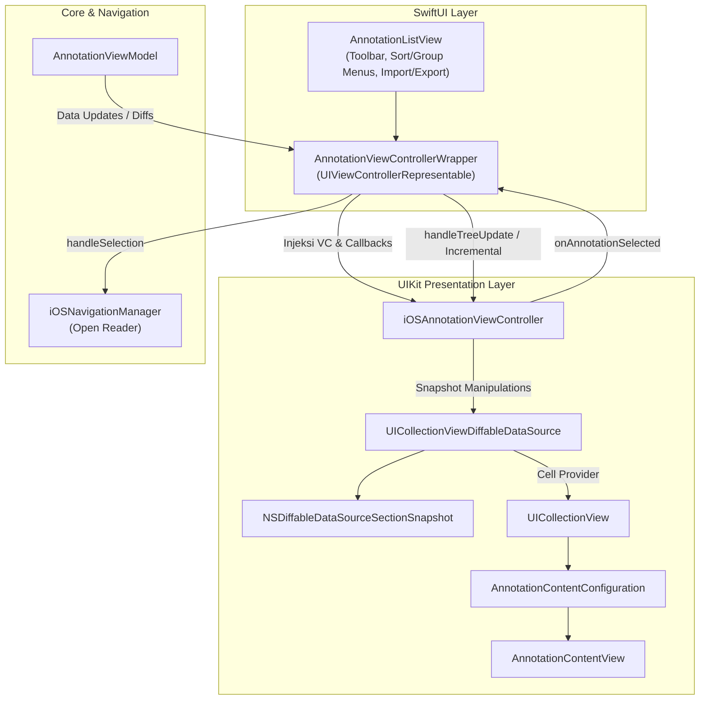

# Antarmuka Pengguna iOS Anotasi

Implementasi antarmuka anotasi di iOS dan iPadOS mengadopsi arsitektur *hybrid* yang menggabungkan deklaratif SwiftUI untuk level kontainer dan UIKit modern (`UICollectionViewCompositionalLayout` & `UICollectionViewDiffableDataSource`) untuk performa tinggi daftar hierarki teks Arab.

## Arsitektur Hybrid & Diagram Aliran Data

Alur rendering dan pembagian tanggung jawab antarkomponen diatur sebagai berikut:



### Pembagian Tanggung Jawab Komponen

1.  **`AnnotationListView` (SwiftUI Root Container)**:
    *   Mengatur toolbar atas: Menu pengelompokan (*Group By: Book, Tag, Timeline*) dan pengurutan (*Sort By & Order*).
    *   Menangani ekspor dan impor JSON melalui modifier `.fileExporter` dan `.fileImporter` (`AnnotationJsonDocument`).
    *   Menampilkan dialog konfirmasi tumpang tindih impor (*overwrite duplicate confirmation dialog*).
    *   Menangkap notifikasi `.annotationMissingBook` untuk memunculkan modal peringatan jika buku belum terunduh di perangkat.
2.  **`AnnotationViewControllerWrapper` (Bridge Layer)**:
    *   Menghubungkan state dan callback `AnnotationViewModel` (`onIncrementalUpdate`, `onTreeUpdate`, `onTagsChanged`) ke metode-metode di `iOSAnnotationViewController`.
    *   Memiliki `Coordinator` yang menangani delegasi seleksi anotasi dan memicu `iOSNavigationManager.openBook(..., targetAnnotation:)`.
    *   Mengatur jembatan *pull-to-refresh* menuju `CloudKitSyncManager.shared.fetchChanges()`.
3.  **`iOSAnnotationViewController` (UIKit Presentation Layer)**:
    *   Mengelola tampilan koleksi hierarki, expandable snapshot per grup, header tag chips, dan pembaruan visual inkremental.

## Diffing Snapshot Data

Untuk menyajikan daftar anotasi yang sangat dinamis, aplikasi memanfaatkan `UICollectionViewDiffableDataSource` yang dikombinasikan dengan `NSDiffableDataSourceSectionSnapshot`.

*   **Pembaruan Skala Penuh (Full Rebuild)**
    
    Saat pengguna mengganti mode pengelompokan (Grouping Mode) atau memuat data awal, kontroler akan membuat ulang seluruh snapshot. Daftar section diterapkan langsung ke tingkat akar, kemudian `NSDiffableDataSourceSectionSnapshot` dibuat untuk setiap grup, memasukkan node induk beserta anak-anak anotasinya.

*   **Pembaruan Tambahan (Incremental Update)**
    
    Untuk pembaruan skala kecil seperti penambahan, pengubahan, atau penghapusan tunggal, sistem tidak memuat ulang seluruh data:

    *   Jika anotasi dihapus, elemen tersebut dicari di seluruh section snapshot, lalu dihilangkan melalui eksekusi fungsi yang spesifik.
    *   Jika pembaruan menyebabkan sebuah grup menjadi kosong, grup tersebut akan dihapus dari tingkat akar secara otomatis.

!!! note
    Pendekatan ini memberikan animasi transisi yang mulus tanpa membebani kinerja rendering saat memanipulasi ratusan data sekaligus.

## Mode Pengelompokan & Filter Tag Chip

Antarmuka mendukung manajemen tata letak dinamis yang disesuaikan berdasarkan dua konsep utama:

*   **Mode Pengelompokan (Grouping Mode)**
    
    Pengguna dapat mengelompokkan anotasi berdasarkan Buku (Book), Penanda (Tag), atau Linimasa (Timeline). Komponen `AnnotationContentConfiguration` menerima status mode ini untuk menentukan teks sekunder:

    *   Bila diurutkan berdasarkan Tag atau Linimasa, tampilan daftar anotasi menonjolkan judul buku.
    *   Sebaliknya, saat dikelompokkan berdasarkan buku, tampilan menonjolkan daftar tag yang terkait.

*   **Filter Tag Chip (Tag Chip Filter)**
    
    Komponen `iOSTagFilterHeaderView` disematkan sebagai tajuk koleksi (Collection Header).

    *   Menampilkan deretan keping (chips) yang dapat digulir secara horizontal.
    *   Memiliki mode peralihan logikal (misalnya operasi AND atau OR) yang ditandai dengan perubahan ikon.
    *   Diperbarui secara asinkron sehingga elemen baru hanya disisipkan di posisi indeks yang tepat, dan elemen lawas dihapus tanpa mengganggu status gulir elemen lainnya.

## Teknik Custom StackView (Force LTR)

Aplikasi Maktabah dirancang untuk mengakomodasi teks Arab, sehingga komponen akar secara alami memakai orientasi Kanan-ke-Kiri (RTL). Namun, pada kasus tertentu seperti metadata atau susunan filter, elemen perlu direkayasa untuk dipaksa menjadi Kiri-ke-Kanan (Force LTR).

Taktik ini diterapkan menggunakan atribut semantik dan matriks transformasi:

*   **Manipulasi Semantik Kontainer**
    
    Pada `AnnotationContentView`, kontainer bawah yang memuat label nomor halaman diatur secara spesifik:

    ```swift
    bottomStack.semanticContentAttribute = .forceLeftToRight
    ```
    
    Konfigurasi ini memastikan posisi indikator halaman tetap konsisten di pojok kiri, tidak terpengaruh oleh lingkungan orientasi sistem RTL.

*   **Siasat Inversi Gulir Matriks**
    
    Pada tajuk filter tag, komponen diletakkan di dalam penampil gulir (`UIScrollView`). Agar interaksi sesuai ekspektasi tata letak di aplikasi RTL:

    ```swift
    chipsScrollView.transform = CGAffineTransform(scaleX: -1, y: 1)
    chipsStackView.transform = CGAffineTransform(scaleX: -1, y: 1)
    ```
    
    Siasat inversi ganda ini secara efektif menukar sumbu horizontal tanpa membalik teks, sehingga arah gulir dan penyusunan deretan secara visual bekerja harmonis dalam lingkungan dominan kanan-ke-kiri.

## Interaksi Seleksi, Navigasi Reader & Missing Book

Ketika pengguna mengetuk item di `UICollectionView`:

1.  **Pembedaan Grup vs. Daun Anotasi (`didSelectItemAt`)**:
    *   **Grup Baris**: Memanggil `toggleGroup(_:)`. Indeks section snapshot dibuka (*expand*) atau ditutup (*collapse*), serta statusnya dicatat dalam `expandedGroups`.
    *   **Item Anotasi**: Memancarkan callback `onAnnotationSelected(node)`.
2.  **Navigasi Reader via Coordinator**:
    `AnnotationViewControllerWrapper.Coordinator` menerima simpul anotasi terpilih:
    *   Memeriksa apakah data kitab telah terpasang melalui `LibraryDataManager.shared.getBook([ann.bkId])`.
    *   Jika kitab ditemukan, memanggil `navigationManager.openBook(book, initialContentId: Int(ann.contentId), targetAnnotation: ann)` untuk langsung melompat ke halaman dan menyorot teks pada `iOSReaderView`.
    *   Jika kitab belum diunduh, memancarkan notifikasi `Notification.Name.annotationMissingBook`.
3.  **Peringatan Kitab Belum Terunduh (*Missing Book Alert*)**:
    `AnnotationListView` di layer SwiftUI mengamati notifikasi tersebut melalui `.onReceive(NotificationCenter.default.publisher(for: .annotationMissingBook))`. Ketika terpicu, alert sistem dimunculkan untuk mengabari pengguna bahwa kitab terkait perlu diunduh terlebih dahulu dari perpustakaan.

## Aksi Geser Hapus (Trailing Swipe Action)

Meskipun daftar diimplementasikan menggunakan `UICollectionView`, iOS mengadopsi kemampuan aksi geser native melalui `UICollectionLayoutListConfiguration.trailingSwipeActionsConfigurationProvider`:

```swift
listConfig.trailingSwipeActionsConfigurationProvider = { [weak self] indexPath in
    guard let self, let dataSource,
          let item = dataSource.itemIdentifier(for: indexPath),
          case let .annotation(node) = item
    else { return nil }

    let delete = UIContextualAction(style: .destructive, title: "Delete") { [weak self] _, _, _ in
        guard let self else { return }
        var snap = dataSource.snapshot()
        snap.deleteItems([item])
        dataSource.apply(snap, animatingDifferences: true)
        onAnnotationDeleted?(node)
    }
    delete.image = UIImage(systemName: "trash")
    return UISwipeActionsConfiguration(actions: [delete])
}
```

*   **Filter Tipe Item**: Aksi geser hanya disematkan pada baris daun anotasi (`case let .annotation(node)`), sedangkan baris header grup tidak dapat digeser.
*   **Animasi Cepat & Sinkronisasi**: Item langsung dihapus dari snapshot lokal secara visual (`snap.deleteItems([item])`), kemudian pemicu `onAnnotationDeleted?(node)` diteruskan oleh `AnnotationViewControllerWrapper` ke `viewModel.deleteAnnotation(id:)`.

## Mekanisme Pengeditan Anotasi di iOS

Berbeda dengan macOS yang menyediakan menu konteks dan editor popover langsung di sidebar daftar:

*   **Pemisahan Aksi Hapus vs. Pengeditan**:
    Pengguna dapat menghapus anotasi secara cepat dari daftar melalui aksi geser (*swipe action*), namun daftar ini tidak menyediakan form pengeditan isi secara *in-place*.
*   **Pengeditan Berpusat di Reader (`iOSAnnotationEditorSheet`)**:
    Pengubahan teks catatan (*note*), warna sorotan, tipe garis bawah (*underline*), maupun penambahan tag dilakukan langsung dari dalam antarmuka membaca (`iOSReaderView`) melalui modal sheet [`iOSAnnotationEditorSheet`](file:///Volumes/Dokumen/Downloads/Shamela/Repositories/Maktabah/Source/Features/Reader/iOS/iOSAnnotationEditorSheet.swift) saat teks beranotasi diketuk.

## Modal Sheet Filter Tag (`TagFilterSelectionView`)

Saat tombol filter pada `iOSTagFilterHeaderView` diketuk:

1.  Fungsi `presentTagFilterSheet()` menginisialisasi tampilan SwiftUI bersama [`TagFilterSelectionView`](file:///Volumes/Dokumen/Downloads/Shamela/Repositories/Maktabah/Source/Features/Annotations/macOS/TagFilterSelectionView.swift).
2.  Tampilan ini dibungkus ke dalam `UIHostingController` dan dikonfigurasi menggunakan kontroler lembar modern UIKit (`UISheetPresentationController`):
    ```swift
    sheet.detents = [.medium(), .large()]
    sheet.prefersGrabberVisible = true
    ```
3.  Pengguna dapat mencari tag secara instan, memilih mode relasi logika (AND/OR), serta memilih atau mengosongkan tag secara massal (*Select All / Deselect All*).

## Sinkronisasi CloudKit & Pull-to-Refresh

*   `iOSAnnotationViewController` menyematkan komponen bawaan `UIRefreshControl` pada `collectionView`.
*   Saat pengguna melakukan gesture tarik-untuk-memperbarui (*pull-to-refresh*), pemicu `onRefreshRequested` diteruskan ke bridge wrapper untuk memanggil `CloudKitSyncManager.shared.fetchChanges()`.
*   Animasi penyegaran dihentikan secara otomatis setelah proses penarikan data selesai melalui `endRefreshing()`.
