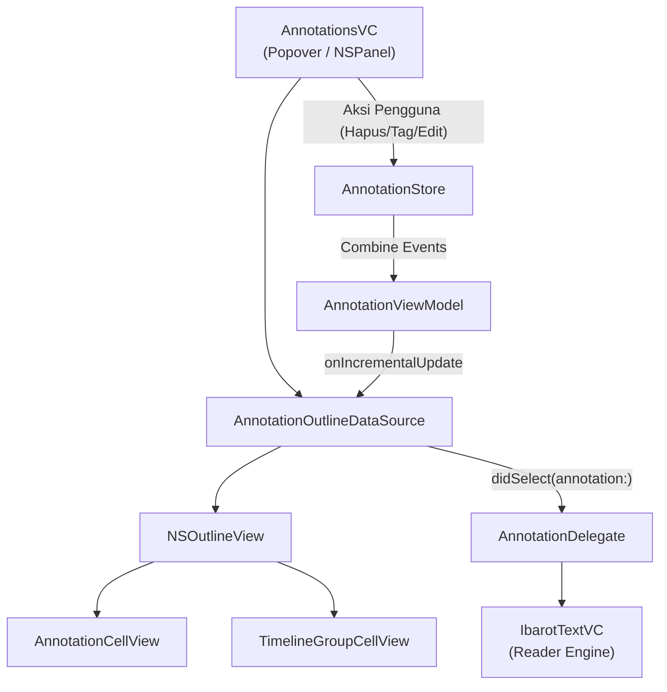

# Antarmuka Anotasi macOS

## Pendahuluan: Interaksi Komponen UI

Arsitektur antarmuka anotasi pada platform macOS didesain dengan memisahkan logika presentasi dari manajemen data. `AnnotationsVC` bertindak sebagai pengontrol utama tampilan, sedangkan `AnnotationOutlineDataSource` menangani abstraksi data dan manipulasi hierarki untuk `NSOutlineView`. Komunikasi dengan mesin pembaca (`IbarotTextVC`) dijembatani oleh protokol `AnnotationDelegate`.



## Mode Windowing: Popover vs. NSPanel

`AnnotationsVC` memiliki fleksibilitas mode tampilan untuk mendukung multitasking di macOS:

*   **Mode Popover Tersemat**:
    Secara bawaan, tampilan anotasi muncul sebagai popover (`SharedPopover.annotationsPopover`) yang melekat pada toolbar jendela utama pembaca.
*   **Mode Panel Melayang (`openAsPanel`)**:
    Pengguna dapat melepaskan popover menjadi jendela utilitas mandiri menggunakan `NSPanel` (`utilityWindow`, `resizable`, `closable`).
    *   `isFloatingPanel`: Bila opsi float aktif, panel selalu berada di atas jendela dokumen (`UserDefaults.standard.annotationFloatWindow`).
    *   `hidesOnDeactivate`: Mengontrol apakah panel otomatis disembunyikan saat aplikasi Maktabah kehilangan fokus (`NSWindow.hidesOnDeactivate`).
    *   **Injeksi Titlebar Accessory**: Saat bertransformasi menjadi panel mandiri (`setupLayoutPanel`), `titlebarRootStack` (yang berisi kolom pencarian dan filter tag) dicabut dari hierarki `rootStackView` dan disematkan langsung ke bawah titlebar panel menggunakan `NSTitlebarAccessoryViewController` (`layoutAttribute = .bottom`).

## Membedah Custom TableCellView

Komponen `AnnotationCellView` adalah turunan dari `NSTableCellView` yang dirancang spesifik untuk merender detail anotasi secara kustom.

*   **Tipografi Arab**:
    Menggunakan `BundledArabicTextField` pada variabel `context`, `note`, dan `pagePart`. Konfigurasi ini secara otomatis mengimplementasikan perataan teks dari kanan ke kiri (RTL) yang sesuai dengan aturan tipografi Arab.
*   **Tata Letak**:
    Elemen-elemen antarmuka disusun menggunakan `NSStackView` secara vertikal. Terdapat pengikatan batas fleksibel (`contentStackLeadingConstraint` dan `contentStackTrailingConstraint`) untuk menyesuaikan ruang margin secara dinamis.
*   **Elemen Garis Waktu**:
    Sel memiliki `timelineRail` dan `timelineDot`. Secara bawaan elemen ini disembunyikan dan hanya dimunculkan saat antarmuka beralih ke mode garis waktu melalui fungsi `setTimelineInset(_:)`.
*   **Pembatas Sisi**:
    Terdapat kotak dekoratif (border box) pada sisi kanan dan bawah untuk memisahkan antar kolom dan baris pada mode non-timeline.

## Membedah TimelineOutlineViews

Berkas `TimelineOutlineViews.swift` bertanggung jawab penuh atas elemen visual penunjuk rute waktu (timeline) pada judul grup.

*   **TimelineNodeView**:
    Subkelas `NSView` kustom yang bertugas menggambar titik lingkar (node) secara manual menggunakan rute lintasan `NSBezierPath`.
*   **TimelineGroupCellView**:
    Digunakan secara khusus untuk baris grup pada saat mode timeline aktif. Sel ini menggabungkan `topTimelineRail` dan `bottomTimelineRail` yang diatur sebagai garis separator untuk menciptakan ilusi rute vertikal yang saling menyambung di antar sel.

## Logika Grouping Modes

`NSOutlineView` dapat mengelompokkan data berdasarkan Buku, Tag, atau Garis Waktu. Transisi antarmode dikelola secara terpusat oleh `AnnotationOutlineDataSource`.

*   **Konfigurasi Visual**:
    Metode `applyOutlineViewConfiguration()` menyesuaikan perilaku tabel ketika terjadi perpindahan mode.
    *   Mode Garis Waktu: Fungsi `floatsGroupRows` diaktifkan agar header grup melayang di atas saat digulir, parameter `indentationPerLevel` bernilai 0, dan jarak antar sel dihilangkan.
    *   Mode Standar: Parameter `indentationPerLevel` bernilai 13 guna memberikan jarak margin yang pas pada struktur percabangan.
*   **Penyusunan Pohon (Tree Builder)**:
    Data dari pengontrol hierarki direpresentasikan dalam bentuk pohon oleh `AnnotationTreeBuilder`. Konsep hierarki induk-anak ini dibaca oleh kerangka kerja `NSOutlineView` untuk memperlihatkan baris sesuai mode yang aktif.

## Kalkulasi Tinggi Baris Dinamis (`AnnotationRowHeightCalculator`)

Karena teks kutipan Arab, catatan tambahan pengguna, serta daftar tag memiliki panjang yang tidak seragam, penentuan tinggi baris dilakukan melalui utilitas `@MainActor enum AnnotationRowHeightCalculator`:

*   **Pengukuran Komponen Teks (`measuredHeight`)**:
    *   Kutipan teks Arab (`context`): Dihitung dengan font Arab bawaan dan dibatasi oleh nilai preferensi `UserDefaults.standard.ctxMaxNumberOfLines`.
    *   Catatan tambahan (`note`): Jika ada, dihitung menggunakan font sistem reguler dan dibatasi oleh `UserDefaults.standard.annMaxNumberOfLines`.
    *   Metadata (`pagePart`): Menghitung ruang untuk nomor jilid/halaman dan tag chips.
*   **Formula Padding & Spacing**:
    Menghitung tinggi total secara presisi dengan formula:
    $$\text{Total Height} = \lceil 20 + \max(\text{contextHeight}, \text{dateHeight} + 8) + \text{pagePartHeight} + \text{noteHeight} + \text{stackSpacing} \rceil$$
    Metode ini dipanggil langsung oleh `outlineView(_:heightOfRowByItem:)` pada `AnnotationsOutlineDelegate`, sehingga penghitungan tinggi baris berjalan instan dan mulus tanpa lag saat pengguliran cepat.

## Interaksi Pengguna & Navigasi Reader

Saat pengguna berinteraksi dengan daftar baris:

1.  **Seleksi Anotasi**:
    Ketika baris anotasi dipilih, delegasi `outlineViewSelectionDidChange(_:)` mendeteksi perubahan. Jika item yang dipilih adalah simpul daun (`AnnotationNode` yang memiliki objek `Annotation`), delegasi memanggil:
    ```swift
    delegate?.didSelect(annotation: annotation)
    ```
2.  **Penanganan di Mesin Reader**:
    Objek `AnnotationOutlineDataSource.delegate` dihubungkan ke `IbarotTextVC` oleh `SplitVC`. Saat `didSelect(annotation:)` diterima:
    *   Kitab yang sesuai dimuat jika belum aktif.
    *   Halaman target dibuka melalui `contentId`.
    *   Kursor dan posisi gulir digeser ke rentang teks anotasi yang bersangkutan (`highlightRange`).

## Aksi Baris, Menu Konteks & Pengeditan

macOS menyediakan interaksi menyeluruh untuk memanipulasi anotasi langsung dari sidebar:

*   **Trailing Swipe Action (Hapus)**:
    Mengimplementasikan `NSTableViewDelegate.tableView(_:rowActionsForRow:edge:)` pada sisi `.trailing`. Menyediakan aksi geser dengan ikon `trash.slash.fill` bergaya destruktif untuk menghapus anotasi terpilih secara instan.
*   **Menu Konteks Baris (`AnnotationMenu`)**:
    Menyediakan aksi klik kanan: Salin teks (`copyMenuItem`), Tambah/Hapus Tag, Ubah Tipe (Highlight vs. Underline), serta opsi hapus.
*   **Menu Palet Warna Cepat (`AnnotationColorMenuView`)**:
    Menampilkan deretan titik warna kustom di dalam menu konteks, memungkinkan pengguna mengganti warna sorotan anotasi tanpa membuka editor penuh.
*   **Panel Editor Anotasi (`AnnotationEditorVC`)**:
    Panel popover khusus untuk mengedit catatan teks lengkap, mengubah status *underline*, memilih warna dari `NSColorWell`, serta mengatur tag token via `NSTokenField`.

## Pencarian & Scope Panel Melayang

*   **Kolom Pencarian (`DSFSearchField`)**:
    Terintegrasi dengan debounce di `AnnotationViewModel.searchText`. Perubahan teks secara asinkron menyaring struktur pohon anotasi.
*   **Scope Panel Melayang (`scopePanel`)**:
    Ketika kolom pencarian aktif, sebuah `NSPanel` melayang tak berbingkai (`level = .popUpMenu`) muncul tepat di bawah kolom pencarian. Panel ini memuat kontrol segmen (`NSSegmentedControl`) yang membatasi cakupan pencarian ke area spesifik: Semua (*All*), Teks Konteks (*Text*), Catatan (*Notes*), atau Tag (*Tags*).

## Manajemen Filter Tag & Tag Merge

*   **Penyusunan Bilah Filter (`createTagFilterBar`)**:
    Antarmuka filter dirancang melalui pembentukan `NSStackView` secara programatik (tanpa *Storyboard*). Susunannya mencakup tombol ikon filter, tombol pergantian mode logika (AND/OR), serta area gulir horizontal (`NSScrollView`) untuk menampung cip tag (*tag chips*).
*   **Penyematan Aksesori (Accessory Injection)**:
    Saat dalam mode panel mandiri, `NSStackView` tersebut dibungkus sebagai `view` utama milik objek `NSTitlebarAccessoryViewController` (`layoutAttribute = .bottom`), memastikan bilah filter melekat tepat di bagian pinggir bawah judul jendela (*titlebar*).
*   **Penyesuaian Visual Dinamis**:
    Pada versi macOS mutakhir, atribut `preferredScrollEdgeEffectStyle` disetel ke `.soft` untuk memberikan efek pinggiran gulir yang halus, serta memperluas batas ketinggian bingkai (*frame height*) secara proaktif agar bilah tag filter memiliki ruang yang cukup.
*   **Tag Popover (`AnnotationTagVC`)**:
    Ditampilkan saat aksi penambahan atau pencabutan tag dipicu dari menu baris atau toolbar.
*   **Penggabungan Tag (`TagMergePopoverVC`)**:
    Menyediakan dialog popover untuk menggabungkan (*merge*) dua tag berbeda menjadi satu nama tag di seluruh basis data anotasi.

## Penerimaan Event Combine

Aplikasi memanfaatkan observasi Combine (serta callback reaktif yang sejalan) untuk merespons transisi status secara sangat efisien, tanpa mengharuskan pemuatan ulang tampilan secara keseluruhan.

!!! note "Mekanisme Pembaruan Inkremental"
    Setiap perubahan data akan memicu pengiriman objek `AnnotationTreeDiff` melalui metode `onIncrementalUpdate`. Objek perbedaan (diff) ini memberikan pedoman rinci bagi data source perihal bagian baris yang spesifik untuk dimodifikasi.

*   **Saat Menghapus Anotasi**:
    1.  Tindakan hapus akan memperbarui struktur data (Store), yang kemudian memicu ViewModel untuk merumuskan objek *diff* dengan tipe `.deleted`.
    2.  Protokol `AnnotationOutlineDataSource` menerima objek *diff* ini dan segera mengeksekusi metode `handleDeletedAnnotation()`.
    3.  Fungsi ini mencari posisi indeks baris spesifik dari anotasi tersebut dan menghapusnya menggunakan `removeItems(at:inParent:withAnimation:)` disertai animasi pergeseran `slideUp`.
    4.  Apabila parent grup menjadi sepenuhnya kosong akibat dampak penghapusan anak simpul, metode `cleanupEmptyParentNode()` akan membersihkan nama grup tersebut dari layar.
*   **Saat Membuka Popover Tag**:
    1.  Permintaan interaktif untuk memanipulasi tag akan memancarkan sinyal `onAddTagsRequested` atau `onRemoveTagsRequested`.
    2.  Lapis kontrol `AnnotationsVC` merespons permintaan ini dengan menayangkan kotak dialog (popover) pemilihan tag.
    3.  Ketika pemakai selesai memodifikasi dan menyimpan tag, sistem merakit objek `TagUpdateDiff` yang berisi senarai penambahan, pembaruan, dan pelepasan relasi ikatan tag.
    4.  Metode `handleTagModeUpdate()` lalu secara tangkas memproses rentetan diferensiasi ini di sela-sela blok `beginUpdates()` dan `endUpdates()`:
        *   Mengeksekusi metode `applyTagModeRemovals()` untuk mencabut sel anotasi dari rumpun grup yang lama.
        *   Mengeksekusi metode `applyTagModeAdditions()` untuk menyelipkan ulang sel anotasi ke dalam rumpun grup yang baru melalui animasi `slideDown`.
