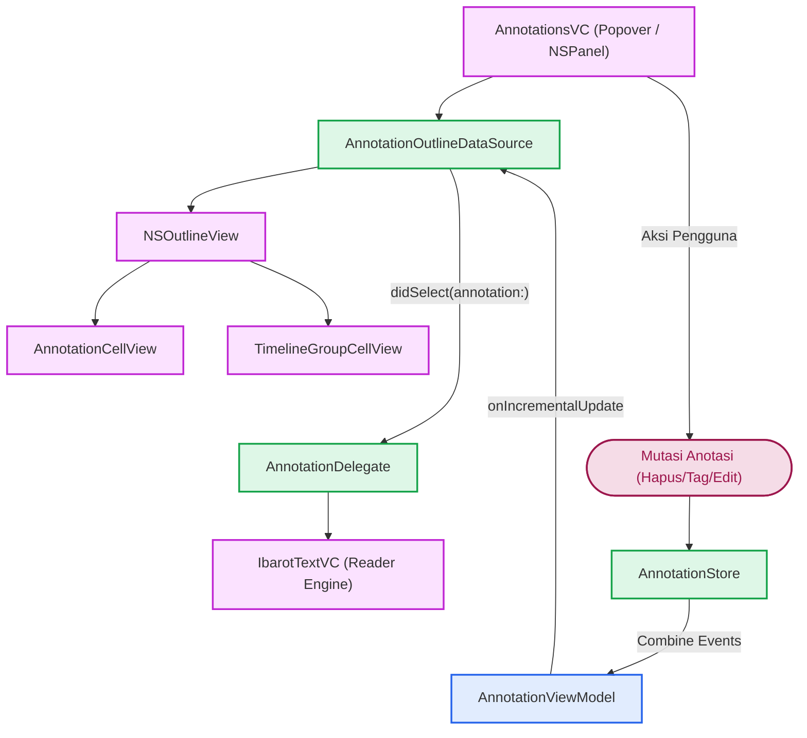
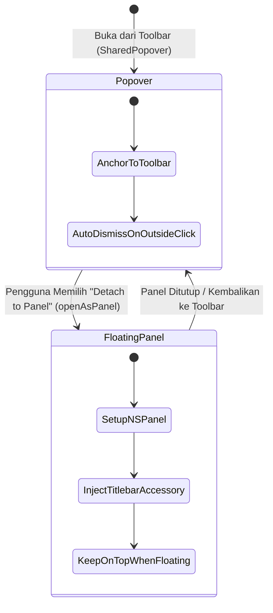

# Antarmuka Anotasi macOS

## Pendahuluan: Interaksi Komponen UI

Arsitektur antarmuka anotasi pada platform macOS didesain dengan memisahkan logika presentasi dari manajemen data. `AnnotationsVC` bertindak sebagai pengontrol utama tampilan, sedangkan `AnnotationOutlineDataSource` menangani abstraksi data dan manipulasi hierarki untuk `NSOutlineView`. Komunikasi dengan mesin pembaca (`IbarotTextVC`) dijembatani oleh *protocol* `AnnotationDelegate`.



## Mode Windowing: Popover vs. NSPanel

`AnnotationsVC` memiliki fleksibilitas mode tampilan untuk mendukung *multitasking* di macOS:



*   **Mode Popover Tersemat**:
    Secara bawaan, tampilan anotasi muncul sebagai *popover* (`SharedPopover.annotationsPopover`) yang melekat pada *toolbar* jendela utama pembaca.

*   **Mode Panel Melayang (`openAsPanel`)**:
    Pengguna dapat melepaskan *popover* menjadi jendela utilitas mandiri menggunakan `NSPanel` (`utilityWindow`, `resizable`, `closable`).

    *   `isFloatingPanel`: Bila opsi *float* aktif, panel selalu berada di atas jendela dokumen (`UserDefaults.standard.annotationFloatWindow`).
    *   `hidesOnDeactivate`: Mengontrol apakah panel otomatis disembunyikan saat aplikasi Maktabah kehilangan fokus (`NSWindow.hidesOnDeactivate`).
    *   **Injeksi Titlebar Accessory**: Saat bertransformasi menjadi panel mandiri (`setupLayoutPanel`), `titlebarRootStack` (yang berisi kolom pencarian dan filter tag) dicabut dari hierarki `rootStackView` dan disematkan ke bawah *titlebar* panel menggunakan `NSTitlebarAccessoryViewController` (`layoutAttribute = .bottom`).

## Custom TableCellView

Komponen `AnnotationCellView` adalah turunan dari `NSTableCellView` yang dirancang untuk merender detail anotasi secara kustom.

*   **Tipografi Arab**:
    Menggunakan `BundledArabicTextField` pada variabel `context`, `note`, dan `pagePart`. Konfigurasi ini secara otomatis mengimplementasikan perataan teks dari kanan ke kiri (RTL) yang sesuai dengan aturan tipografi Arab.

*   **Tata Letak**:
    Elemen antarmuka disusun menggunakan `NSStackView` vertikal dengan batasan fleksibel (`contentStackLeadingConstraint` dan `contentStackTrailingConstraint`) untuk menyesuaikan ruang margin secara dinamis.

*   **Elemen Linimasa**:
    Sel memiliki `timelineRail` dan `timelineDot`. Elemen ini dimunculkan saat antarmuka beralih ke mode linimasa melalui fungsi `setTimelineInset(_:)`.

*   **Pembatas Sisi**:
    Terdapat batas dekoratif (*border box*) pada sisi kanan dan bawah untuk memisahkan antarkolom dan baris pada mode non-linimasa.

## TimelineOutlineViews

Berkas `TimelineOutlineViews.swift` bertanggung jawab atas elemen visual penunjuk linimasa pada judul grup.

*   **TimelineNodeView**:
    *Subclass* `NSView` kustom yang berfungsi menggambar titik *node* secara manual menggunakan jalur `NSBezierPath`.

*   **TimelineGroupCellView**:
    Digunakan khusus untuk baris grup saat mode linimasa aktif. Sel ini menggabungkan `topTimelineRail` dan `bottomTimelineRail` untuk menciptakan jalur vertikal yang tersambung antar-sel.

## Logika Grouping Modes

`NSOutlineView` dapat mengelompokkan data berdasarkan Buku, Tag, atau Linimasa. Transisi antarmode dikelola oleh `AnnotationOutlineDataSource`.

*   **Konfigurasi Visual**:
    Metode `applyOutlineViewConfiguration()` menyesuaikan tata letak tabel ketika terjadi perpindahan mode:
    *   Mode Linimasa: Properti `floatsGroupRows` diaktifkan agar *header* grup melayang saat digulir, parameter `indentationPerLevel` disetel ke 0, dan jarak antar-sel dihilangkan.
    *   Mode Standar: Parameter `indentationPerLevel` disetel ke 13 guna memberikan indentasi margin pada struktur hierarki.
*   **Penyusunan Hierarki (*Tree Builder*)**:
    Data dari pengontrol hierarki direpresentasikan dalam bentuk struktur hierarki oleh `AnnotationTreeBuilder`. Relasi *parent-child* ini dibaca oleh `NSOutlineView` untuk merender baris sesuai mode yang aktif.

## Kalkulasi Tinggi Baris Dinamis (`AnnotationRowHeightCalculator`)

Karena kutipan teks Arab, catatan pengguna, serta daftar tag memiliki panjang yang bervariasi, penentuan tinggi baris dilakukan melalui `@MainActor enum AnnotationRowHeightCalculator`:

*   **Pengukuran Komponen Teks (`measuredHeight`)**:
    *   Kutipan teks Arab (`context`): Dihitung dengan *font* Arab bawaan dan dibatasi oleh nilai preferensi `UserDefaults.standard.ctxMaxNumberOfLines`.
    *   Catatan tambahan (`note`): Dihitung menggunakan *font* sistem dan dibatasi oleh `UserDefaults.standard.annMaxNumberOfLines`.
    *   Metadata (`pagePart`): Menghitung ruang untuk nomor jilid/halaman dan *tag chips*.
*   **Formula Padding & Spacing**:
    Menghitung tinggi total secara presisi dengan formula:
    $$\text{Total Height} = \lceil 20 + \max(\text{contextHeight}, \text{dateHeight} + 8) + \text{pagePartHeight} + \text{noteHeight} + \text{stackSpacing} \rceil$$
    Metode ini dipanggil langsung oleh `outlineView(_:heightOfRowByItem:)` pada `AnnotationsOutlineDelegate` sehingga penghitungan tinggi baris berjalan mulus tanpa jeda saat pengguliran cepat.

## Interaksi Pengguna & Navigasi Reader

Saat pengguna berinteraksi dengan daftar baris:

1.  **Seleksi Anotasi**:
    Ketika baris anotasi dipilih, delegasi `outlineViewSelectionDidChange(_:)` mendeteksi perubahan. Jika item yang dipilih adalah *leaf node* (`AnnotationNode` yang memiliki objek `Annotation`), delegasi memanggil:
    ```swift
    delegate?.didSelect(annotation: annotation)
    ```

2.  **Penanganan di Mesin Reader**:
    Objek `AnnotationOutlineDataSource.delegate` dihubungkan ke `IbarotTextVC` oleh `SplitVC`. Saat `didSelect(annotation:)` diterima:
    *   Kitab yang sesuai dimuat jika belum aktif.
    *   Halaman target dibuka melalui `contentId`.
    *   Kursor dan posisi gulir diarahkan ke rentang teks anotasi yang bersangkutan (`highlightRange`).

## Aksi Baris, Menu Konteks & Pengeditan

macOS menyediakan interaksi langsung dari *sidebar*:

*   **Trailing Swipe Action (Hapus)**:
    Mengimplementasikan `NSTableViewDelegate.tableView(_:rowActionsForRow:edge:)` pada sisi `.trailing`. Menyediakan aksi geser dengan ikon `trash.slash.fill` untuk menghapus anotasi terpilih secara instan.
*   **Menu Konteks Baris (`AnnotationMenu`)**:
    Menyediakan aksi klik kanan: Salin teks (`copyMenuItem`), Tambah/Hapus Tag, Ubah Tipe (*Highlight* vs. *Underline*), serta opsi hapus.
*   **Menu Palet Warna Cepat (`AnnotationColorMenuView`)**:
    Menampilkan deretan titik warna di dalam menu konteks, memungkinkan pengguna mengganti warna sorotan tanpa membuka editor penuh.
*   **Panel Editor Anotasi (`AnnotationEditorVC`)**:
    Panel *popover* untuk mengedit catatan teks lengkap, mengubah tipe garis bawah, memilih warna dari `NSColorWell`, serta mengatur tag melalui `NSTokenField`.

## Pencarian & Scope Panel Melayang

*   **Kolom Pencarian (`DSFSearchField`)**:
    Terintegrasi dengan *debounce* di `AnnotationViewModel.searchText`. Perubahan teks secara asinkron menyaring struktur hierarki anotasi.
*   **Scope Panel Melayang (`scopePanel`)**:
    Ketika kolom pencarian aktif, sebuah `NSPanel` melayang tak berbingkai (`level = .popUpMenu`) muncul tepat di bawah kolom pencarian. Panel ini memuat kontrol segmen (`NSSegmentedControl`) yang membatasi cakupan pencarian: Semua (*All*), Teks Konteks (*Text*), Catatan (*Notes*), atau Tag (*Tags*).

## Manajemen Filter Tag & Penggabungan Tag

*   **Penyusunan Bilah Filter (`createTagFilterBar`)**:
    Antarmuka filter dirancang menggunakan `NSStackView` secara programatik, mencakup tombol filter, sakelar logika (AND/OR), serta area gulir horizontal (`NSScrollView`) untuk menampung *tag chips*.
*   **Penyematan Aksesori (*Accessory Injection*)**:
    Saat dalam mode panel mandiri, `NSStackView` tersebut dibungkus sebagai `view` utama milik `NSTitlebarAccessoryViewController` (`layoutAttribute = .bottom`), melekat di bawah *titlebar*.
*   **Tag Popover (`AnnotationTagVC`)**:
    Ditampilkan saat aksi penambahan atau penghapusan tag dipicu dari menu baris atau *toolbar*.
*   **Penggabungan Tag (`TagMergePopoverVC`)**:
    Menyediakan dialog *popover* untuk menggabungkan (*merge*) dua tag berbeda menjadi satu nama tag di seluruh basis data anotasi.

## Penerimaan Event Combine

Aplikasi memanfaatkan observasi Combine untuk merespons pembaruan status secara efisien tanpa memuat ulang antarmuka secara keseluruhan.

!!! note "Mekanisme Pembaruan Inkremental"
    Setiap perubahan data memicu pengiriman objek `AnnotationTreeDiff` melalui metode `onIncrementalUpdate`. Objek *diff* ini memberikan pedoman rinci bagi *data source* perihal baris spesifik yang perlu dimodifikasi.

*   **Saat Menghapus Anotasi**:
    1. Tindakan hapus memperbarui `AnnotationStore`, yang kemudian memicu ViewModel menghasilkan objek *diff* dengan tipe `.deleted`.
    2. `AnnotationOutlineDataSource` menerima objek *diff* ini dan mengeksekusi metode `handleDeletedAnnotation()`.
    3. Fungsi ini mencari posisi indeks baris spesifik dan menghapusnya menggunakan `removeItems(at:inParent:withAnimation:)` disertai animasi pergeseran `slideUp`.
    4. Apabila *parent node* menjadi kosong akibat penghapusan *child node*, metode `cleanupEmptyParentNode()` membersihkan nama grup tersebut dari layar.
*   **Saat Membuka Popover Tag**:
    1. Permintaan manipulasi tag memancarkan sinyal `onAddTagsRequested` atau `onRemoveTagsRequested`.
    2. Lapisan kontrol `AnnotationsVC` merespons dengan menampilkan *popover* pemilihan tag.
    3. Saat pengguna menyimpan perubahan tag, sistem menyusun objek `TagUpdateDiff`.
    4. Metode `handleTagModeUpdate()` memproses perubahan di antara blok `beginUpdates()` dan `endUpdates()` menggunakan animasi `slideDown`.
