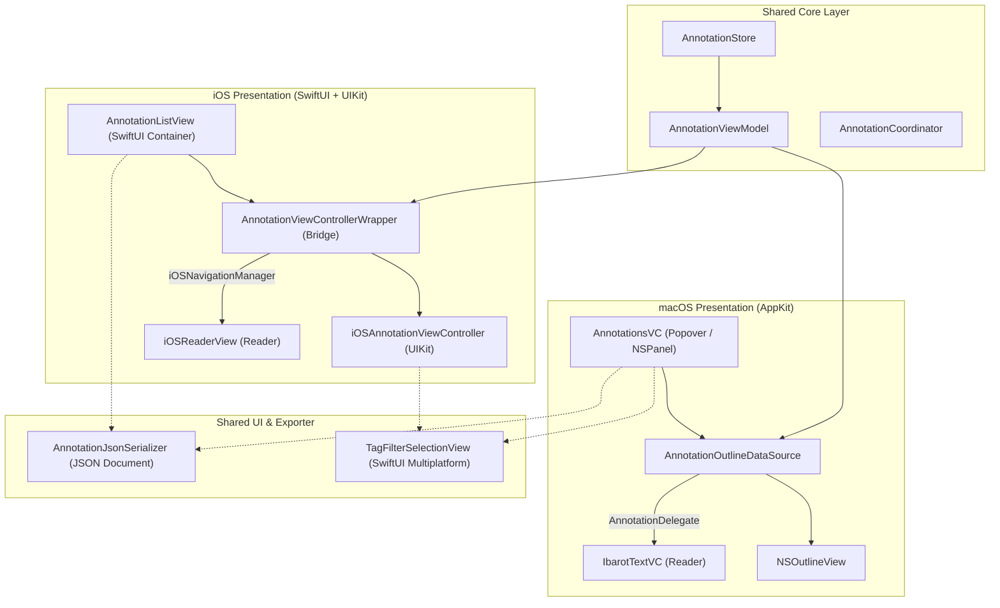

# UI & Platform Integration

Dokumentasi ini merangkum jembatan arsitektur dan pola integrasi antarmuka fitur Annotations pada macOS dan iOS, menghubungkan logika data bersama (*Core Engine*) dengan presentasi native di masing-masing platform.

Sumber kode:

* macOS: `Source/Features/Annotations/macOS/`
* iOS: `Source/Features/Annotations/iOS/`
* Shared Components: `Source/Features/Annotations/macOS/TagFilterSelectionView.swift`

---

## Arsitektur Integrasi Lintas Platform

Fitur Annotations berbagi logika bisnis, persistensi, dan pemodelan data yang sama (`AnnotationViewModel`, `AnnotationStore`, `AnnotationCoordinator`), namun menggunakan paradigma UI yang dioptimalkan untuk karakteristik masing-masing OS:

---

## Jembatan Integrasi Pembaca (Reader Navigation Bridge)

Saat pengguna memilih baris catatan, sistem harus menavigasi pembaca ke kitab dan halaman target secara mulus:

### macOS: AppKit Delegation
* **Protokol**: [`AnnotationDelegate`](file:///Volumes/Dokumen/Downloads/Shamela/Repositories/Maktabah/Source/Features/Annotations/Protocols/AnnotationDelegate.swift).
* **Alur**: `NSOutlineView` mendeteksi pergantian baris $\rightarrow$ `AnnotationsOutlineDelegate.outlineViewSelectionDidChange` $\rightarrow$ memanggil `dataSource.delegate?.didSelect(annotation:)` $\rightarrow$ ditangkap oleh `IbarotTextVC` yang dihubungkan melalui `SplitVC`.
* **Aksi**: Reader memuat kitab target jika belum terbuka, membuka halaman via `contentId`, dan menggeser viewport teks ke `highlightRange`.

### iOS: SwiftUI Coordinator & Navigation Manager
* **Alur**: Pengguna mengetuk sel $\rightarrow$ `iOSAnnotationViewController.didSelectItemAt` $\rightarrow$ memicu closure `onAnnotationSelected` $\rightarrow$ diterima oleh `AnnotationViewControllerWrapper.Coordinator.handleSelection(_:)`.
* **Pemeriksaan Kitab**: Coordinator memeriksa ketersediaan kitab via `LibraryDataManager.shared.getBook([ann.bkId])`:
    * Jika ada: Menjalankan `iOSNavigationManager.openBook(book, initialContentId: Int(ann.contentId), targetAnnotation: ann)`.
    * Jika tidak ada: Mengirimkan `Notification.Name.annotationMissingBook` untuk memunculkan modal alert di level SwiftUI `AnnotationListView`.

---

## Komponen Bersama (Multiplatform Component)

### `TagFilterSelectionView`
Meskipun tersimpan di direktori `Source/Features/Annotations/macOS/`, komponen ini dirancang multiplatform dengan kompilasi kondisional (`#if os(macOS)` dan `#if os(iOS)`):

* **macOS**: Ditampilkan di dalam popover pemilihan tag dengan batasan lebar `220–300 pt`.
* **iOS**: Dipresentasikan sebagai lembar modal adaptif (`UISheetPresentationController`) dengan detents `.medium()` dan `.large()`.
* **Fitur**: Pencarian nama tag secara instan, pemisahan mode logika AND/OR, penyediaan tag yang tersedia (*available tags provider*), serta tombol aksi *Select All* / *Deselect All*.

---

## Ekspor, Impor & Pertukaran Data

1. **Pertukaran Data JSON (macOS & iOS)**:
    * Menggunakan `AnnotationJsonSerializer` untuk serialisasi format JSON dokumen mandiri (`AnnotationJsonDocument`).
    * Di iOS, antarmuka ekspor/impor terintegrasi pada menu toolbar `AnnotationListView` via SwiftUI `.fileExporter` dan `.fileImporter` lengkap dengan dialog konfirmasi penanganan duplikat (*overwrite* atau *skip*).
    * Di macOS, proses ekspor dan impor diakses melalui menu berbagi (*share & import menu*) di toolbar `AnnotationsVC`.
2. **Ekspor RTF (Khusus macOS)**:
    * Komponen `AnnotationRTFExporter` menyusun anotasi terpilih ke dalam format RTF (*Rich Text Format*).
    * Menjaga atribut tipografi teks Arab, nomor jilid/halaman, catatan kaki, serta warna highlight untuk siap disalin ke clipboard atau dicetak ke dokumen lain.

---

## Integrasi Ekstensi Widget

Modul anotasi menyediakan data untuk target Widget Extension:

* **Timeline Provider**: Mengakses kutipan dan catatan harian langsung dari SQLite database terbagi via Shared App Group (`group.com.maktabah`).
* **PlatformColor**: Parsing warna hex platform-agnostik menjamin representasi visual sorotan dan garis bawah (*underline*) seragam di widget Home Screen maupun Lock Screen.

---

## Tabel Perbandingan UX Lintas Platform

| Fitur | macOS (AppKit) | iOS (SwiftUI + UIKit) |
| :--- | :--- | :--- |
| **Bentuk Tampilan** | Popover tersemat atau Panel melayang (`NSPanel`) | Tab / Navigation View hierarkis |
| **Mesin Daftar** | `NSOutlineView` (Expandable rows) | `UICollectionView` (Hierarchical section snapshot) |
| **Kalkulasi Tinggi** | `AnnotationRowHeightCalculator` manual | Auto-layout via `UIContentConfiguration` |
| **Aksi Geser (Swipe)** | Trailing swipe action untuk Hapus (`NSTableViewRowAction`) | Trailing swipe action untuk Hapus (`trailingSwipeActionsConfigurationProvider`) |
| **Pengeditan Anotasi** | Langsung di sidebar via `AnnotationMenu` & `AnnotationEditorVC` | Di dalam Reader view via `iOSAnnotationEditorSheet` |
| **Filter Tag** | Bilah horizontal di titlebar accessory (`NSTitlebarAccessoryViewController`) | Supplementary header view dengan teknik inversi matriks LTR/RTL |

