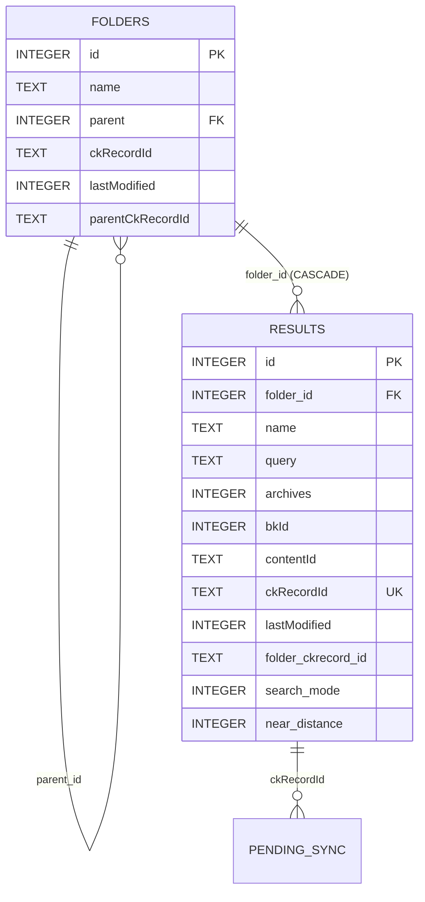
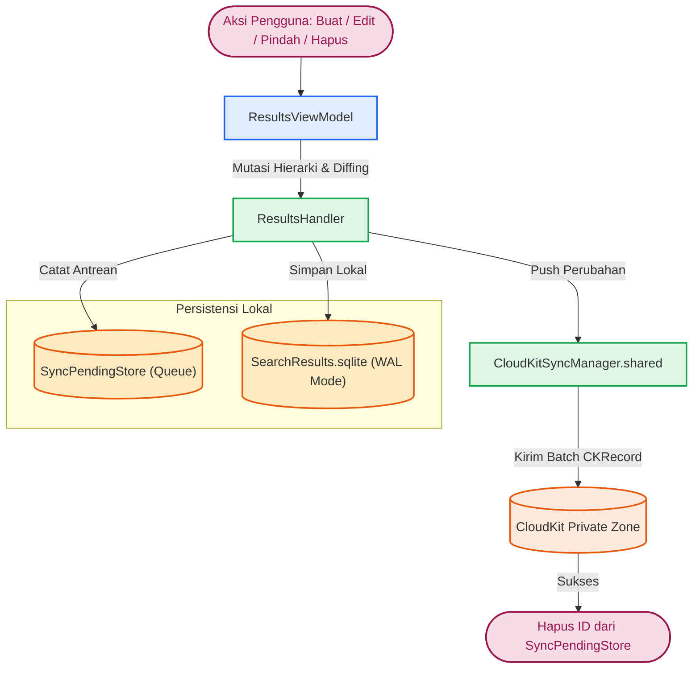
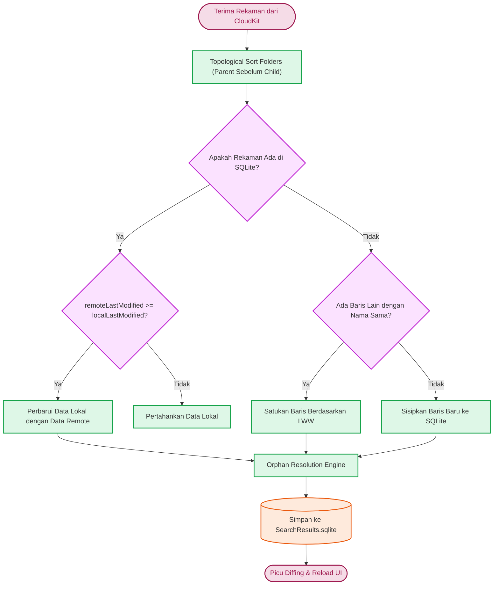

# Persistence, Cache & CloudKit Synchronization

Dokumentasi ini membedah arsitektur persistensi data, skema basis data SQLite lokal, mekanisme pemulihan integritas data (*orphan resolution*), dan mesin sinkronisasi CloudKit dua arah yang dikelola oleh `ResultsHandler` pada direktori `Source/Features/Bookmarks/Database/`.

---

## 1. Arsitektur Penyimpanan Lokal (`SearchResults.sqlite`)

Seluruh markah dan struktur foldernya disimpan di dalam berkas basis data SQLite khusus bernama `SearchResults.sqlite` yang berlokasi di direktori aplikasi:
`~/Library/Application Support/Maktabah/annotations_FolderPath/SearchResults.sqlite`

### Konfigurasi Koneksi & Thread Safety

Inisialisasi basis data diatur dengan konfigurasi performa tinggi dan keamanan konkurensi:

```swift
let flags = SQLITE_OPEN_READWRITE | SQLITE_OPEN_CREATE | SQLITE_OPEN_FULLMUTEX
let database = try SQLiteDatabase(path: url.path, flags: flags)
database.enableWALMode()
database.checkpoint()
```

*   **`SQLITE_OPEN_FULLMUTEX`**: Mengaktifkan mode *serialized threading* SQLite di mana beberapa *thread* dapat berbagi koneksi secara aman tanpa risiko korupsi internal.
*   **`NSRecursiveLock`**: Di lapisan `SQLiteDatabase`, seluruh eksekusi kueri (`fetch`, `execute`, `transaction`) dilindungi oleh *recursive lock* (`NSRecursiveLock`) untuk mencegah bentrokan instruksi *read-write*.
*   **WAL Mode (Write-Ahead Logging)**: Menjamin operasi pembacaan tidak memblokir penulisan, dan operasi penulisan tidak memblokir pembacaan.

---

## 2. Skema Tabel SQLite & Relasi Kaskade

Basis data terdiri dari dua tabel relasional utama serta satu tabel pelacak antrean sinkronisasi tertunda (*pending sync*):



### Tabel `folders`

Menyimpan hierarki direktori markah buku (*bookmarks*).

| Kolom | Tipe Data | Keterangan |
| :--- | :--- | :--- |
| `id` | `INTEGER PRIMARY KEY AUTOINCREMENT` | Kunci primer lokal baris folder. |
| `name` | `TEXT` | Nama folder. |
| `parent` | `INTEGER` | Kunci asing (*foreign key*) yang merujuk ke `folders(id)`. Nilai `NULL` menandakan folder berada di tingkat *root*. |
| `ckRecordId` | `TEXT` | ID rekaman deterministik di CloudKit Private Zone. |
| `lastModified` | `INTEGER` | Stempel waktu modifikasi lokal terakhir (UNIX *timestamp* detik). |
| `parentCkRecordId`| `TEXT` | ID CloudKit milik folder induk, digunakan untuk rekonsiliasi dependensi *cloud*. |

### Tabel `results`

Menyimpan item hasil pencarian yang dikelompokkan per kueri dan kitab.

| Kolom | Tipe Data | Keterangan |
| :--- | :--- | :--- |
| `id` | `INTEGER PRIMARY KEY AUTOINCREMENT` | Kunci primer lokal item. |
| `folder_id` | `INTEGER` | Kunci asing merujuk ke `folders(id)` dengan aturan `ON DELETE CASCADE`. |
| `name` | `TEXT` | Label nama *node bookmark*. |
| `query` | `TEXT` | String kueri asli yang dicari pengguna. |
| `archives` | `INTEGER` | Nomor berkas arsip basis data asal (misal `1` sampai `20`). |
| `bkId` | `INTEGER` | ID kitab asli di katalog Maktabah. |
| `contentId` | `TEXT` | Daftar ID halaman yang dipisahkan koma (misal `"10,12,15"`). |
| `ckRecordId` | `TEXT UNIQUE` | ID unik rekaman di CloudKit. |
| `lastModified` | `INTEGER` | Stempel waktu pembaruan terakhir. |
| `folder_ckrecord_id` | `TEXT` | Kunci referensi CloudKit ke folder penampung. |
| `search_mode` | `INTEGER` | Mode pencarian (`0: phrase`, `1: allWords`, `2: anyWord`). |
| `near_distance` | `INTEGER` | Toleransi jarak pencarian kata dekat (*proximity search*). |

### Indeks Khusus Performa & Keunikan

```sql
-- Mencegah duplikasi nama folder di bawah induk yang sama:
CREATE UNIQUE INDEX IF NOT EXISTS idx_folders_parent_name 
ON folders (COALESCE(parent, 0), name);

-- Mencegah duplikasi markah kueri untuk kitab yang sama dalam satu folder:
CREATE UNIQUE INDEX IF NOT EXISTS idx_results_folder_name_bk 
ON results (COALESCE(folder_id, 0), name, bkId);

-- Indeks pencarian cepat untuk pertukaran CloudKit:
CREATE INDEX IF NOT EXISTS idx_folders_ck_record_id ON folders (ckRecordId);
CREATE INDEX IF NOT EXISTS idx_results_ck_record_id ON results (ckRecordId);
```

---

## 3. Resolusi Rekaman Tanpa Induk (*Orphan Records*)

Saat sinkronisasi CloudKit berlangsung, *child record* sering kali tiba lebih awal daripada *parent record*-nya (*out-of-order delivery*). Kondisi ini menyebabkan nilai `parent` atau `folder_id` lokal bernilai `NULL` sementara referensi `parentCkRecordId` sebenarnya ada.

Sistem mengatasi kondisi ini melalui dua metode penyelarasan otomatis:

```swift
func resolveOrphanFolders() {
    // Mencocokkan folder yang memiliki parentCkRecordId dengan folder yang baru dibuat
    let sql = """
    SELECT f1.id, f1.name, f1.parentCkRecordId, f2.id as expected_parent
    FROM folders f1
    LEFT JOIN folders f2 ON f1.parentCkRecordId = f2.ckRecordId
    WHERE f1.parentCkRecordId IS NOT NULL 
    AND COALESCE(f1.parent, -1) != COALESCE(f2.id, -1)
    """
    // Menghubungkan kembali parent_id atau menggabungkan konflik duplikasi
}
```

```swift
func resolveOrphanResults() {
    // Mencocokkan hasil pencarian yang belum memiliki folder_id lokal dengan folder induknya
    let sql = """
    SELECT r.id, r.name, r.bkId, f.id as expected_folder
    FROM results r
    LEFT JOIN folders f ON r.folder_ckrecord_id = f.ckRecordId
    WHERE r.folder_ckrecord_id IS NOT NULL
    AND COALESCE(r.folder_id, -1) != COALESCE(f.id, -1)
    """
    // Mengarahkan folder_id ke folder yang benar
}
```

---

## 4. Alur Sinkronisasi CloudKit (`ResultsCloudKit.swift`)

Sinkronisasi markah memanfaatkan zona kustom (*Custom Zone*) di *Private Database* CloudKit pengguna.

### Alur Sinkronisasi Keluar (Upload & Delete)



### Format ID Rekaman Deterministik

Untuk mencegah duplikasi antarperangkat saat dua perangkat membuat folder dengan nama yang sama di induk yang sama secara luring (*offline*), Maktabah menggunakan pola penamaan deterministik:

*   **Folder Record ID**: `"folder_\(name)_\(parentIdentifier)"`
*   **Result Record ID**: `"result_\(folderIdentifier)_\(name)_\(bkId)_\(archive)"`

### Alur Sinkronisasi Masuk & Resolusi Konflik (LWW + Topological Sort)

Saat `CloudKitSyncManager` menerima rekaman dari server via `fetchChanges`, rekaman diproses oleh `ResultsHandler`:



### Pengurutan Topologis (*Topological Sorting*)

Sebelum menyimpan daftar folder yang diterima dari CloudKit ke basis data SQLite, sistem menjalankan pengurutan topologis (`sortFoldersTopologically`) untuk memastikan *parent folder* disisipkan terlebih dahulu sebelum *child folder*-nya, menjaga validitas integritas referensi relasional.

### Penanganan Mode Luring (`SyncPendingStore`)

Setiap mutasi lokal (Insert, Update, Delete) membungkus operasi penyimpanan dengan pendaftaran ke `SyncPendingStore`:

```swift
try transaction {
    try exec(insertResultSQL, parameters: params)
    rowId = db.lastInsertRowId()
    try self.addPendingSync(ckRecordId: cId, operation: "upload")
}
```

Bila perangkat sedang luring, data tertunda tersimpan aman di tabel SQLite lokal dan akan di-*flush* secara otomatis oleh `CloudKitSyncManager` sesaat setelah konektivitas internet pulih.
