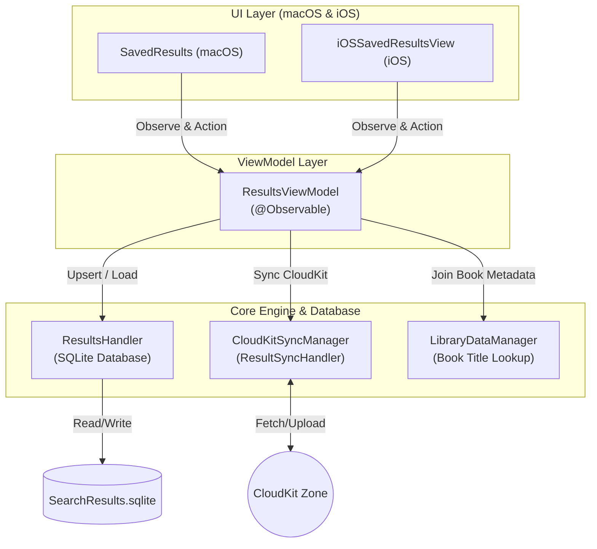

# Bookmarks (Saved Results) Architecture

Modul **Bookmarks** (secara internal diimplementasikan sebagai *Saved Results*) mengelola penyimpanan persisten, organisasi hierarkis berbasis folder, dan sinkronisasi cloud untuk hasil pencarian kitab di aplikasi Maktabah. Modul ini memungkinkan pengguna menyimpan kueri pencarian beserta referensi kitab dan halaman yang cocok ke dalam struktur pohon direktori kustom.

---

## 1. Arsitektur & Diagram Alur (Architecture & Pipeline)

Arsitektur modul ini dibangun menggunakan pola MVVM yang terpisah rapi dengan persistensi lokal SQLite dan sinkronisasi CloudKit dua arah.

---

## 2. Pemisahan Tanggung Jawab (Separation of Concerns)

Komponen-komponen dalam feature-slice ini mematuhi batas tanggung jawab yang tegas:

*   **UI Layer (macOS & iOS)**:
    *   Mengatur visualisasi representasi pohon direktori (hierarki folder dan item hasil pencarian).
    *   Platform macOS (`SavedResults`, `ResultsViewManager`) mengonsumsi `BookmarkTreeChange` untuk mengeksekusi animasi batch pada `NSOutlineView` (`insertItems`, `removeItems`, `moveItem`).
    *   Platform iOS (`iOSSavedResultsView`, `iOSFolderContentList`) memanfaatkan deklarasi hierarki berbasis `NavigationStack`, *swipe actions*, dan sheet navigasi interaktif.

*   **ViewModel Layer (`ResultsViewModel`)**:
    *   Berperan sebagai *single source of truth* untuk antarmuka pengguna pada kedua platform.
    *   Memelihara cache struktural dalam memori (`folderById`, `parentById`, `resultById`) untuk lookup `O(1)` selama pembaruan parsial.
    *   Mencegah siklus tak berujung (*circular dependency*) pada operasi pemindahan folder (*drag-and-drop*).

*   **Data Access Layer (`ResultsHandler`)**:
    *   Mengisolasi seluruh query SQL, migrasi skema tabel, dan eksekusi transaksi database `SearchResults.sqlite`.
    *   Menangani resolusi folder/hasil yatim (*orphan nodes*) akibat perbedaan urutan penerimaan data sinkronisasi CloudKit.
    *   Mengantrekan mutasi offline ke dalam `SyncPendingStore`.

*   **Synchronization Layer (`CloudKitSyncManager`)**:
    *   Menerjemahkan rekaman lokal ke `CKRecord` dengan penamaan ID deterministik.
    *   Menjalankan resolusi konflik *Last-Write-Wins* (LWW) berbasis stempel waktu `lastModified`.

---

## 3. Peta Navigasi Dokumentasi Teknis

Untuk memahami detail implementasi setiap komponen secara mendalam, silakan telusuri sub-dokumen berikut:

*   [Database & CloudKit Persistence](database.md)
    *   Skema SQLite, indeks unik gabungan, isolasi thread `SQLiteDatabase`, pemulihan simpul yatim (*orphan resolution*), dan sinkronisasi CloudKit.
*   [Data Models & State Types](models.md)
    *   Struktur data pohon, simpul hasil pencarian, model sinkronisasi, dan enum mutasi diffing.
*   [iOS SwiftUI Implementation](ios.md)
    *   Integrasi `NavigationStack`, pencarian global mendatar (*flattened search*), pengelolaan lembar pemindahan (*move sheet*), dan gestur geser (*swipe actions*).
*   [macOS AppKit Implementation](macos.md)
    *   Implementasi `NSOutlineView`, animasi diffing presisi tinggi (*batch updates*), drag-and-drop antar-hierarki, dan menu kontekstual.
*   [Protocols & Delegation](protocols.md)
    *   Kontrak komunikasi `@MainActor ResultsDelegate` untuk menghubungkan pemilihan markah ke modul Reader/Search.
*   [ViewModel & Reactive Workflows](viewmodel.md)
    *   Manajemen state berbasis `@Observable`, cache lookup `O(1)`, operasi rekursif pohon, dan integrasi notifikasi.
