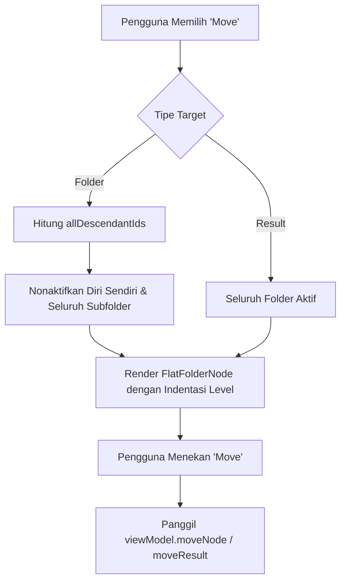

# iOS SwiftUI Implementation

Dokumentasi ini menguraikan arsitektur antarmuka native iOS untuk fitur markah (*Saved Results*), manajemen hierarki navigasi deklaratif, interaksi gestur, serta pengelolaan lembar dialog modal (*sheets*) dan peringatan (*alerts*) pada direktori `Source/Features/Bookmarks/iOS/`.

---

## 1. Arsitektur Antarmuka & Pilihan Desain

Berbeda dengan modul *Reader* atau *Library Catalog* yang memanfaatkan jembatan UIKit (`UIViewRepresentable`) karena kebutuhan perenderan tipografi Arab tingkat rendah atau layout sel kustom yang ekstrem, modul Bookmarks pada iOS diimplementasikan **100% menggunakan SwiftUI modern**.

Pilihan arsitektur ini didasarkan pada:

*   **Kepatuhan Human Interface Guidelines (HIG)**: Struktur folder markah sangat selaras dengan paradigma deklaratif `NavigationStack` bawaan iOS.
*   **Efisiensi Memori & Rendering**: Pohon folder markah umumnya berkisar antara puluhan hingga ratusan simpul, sehingga komponen native SwiftUI (`List`, `ForEach`, `swipeActions`) mampu bekerja dengan performa 60–120 FPS tanpa memerlukan daur ulang sel manual UIKit.
*   **Kesiapan Reaktivitas**: Penggunaan makro `@Observable` pada `ResultsViewModel` dan `FolderNode` membuat antarmuka SwiftUI bereaksi secara instan terhadap mutasi lokal maupun sinkronisasi latar belakang CloudKit tanpa *glue code* tambahan.

---

## 2. Struktur Komponen UI (`Source/Features/Bookmarks/iOS/`)

```
iOS/
├── iOSSavedResultsView.swift       # Tampilan utama & controller navigasi root
├── iOSMoveItemView.swift           # Lembar pemindahan folder / hasil kueri
├── iOSFolderSelectionGroup.swift   # Komponen hierarki pemilih folder (flattened tree)
└── iOSResultWriterView.swift       # Formulir dialog penyimpanan hasil pencarian
```

---

## 3. Komponen Utama & Alur Navigasi

### `iOSSavedResultsView`

Merupakan kontainer navigasi terluar yang membungkus seluruh hierarki markah menggunakan `NavigationStack`:

```swift
struct iOSSavedResultsView: View {
    @Environment(\.dismiss) private var dismiss
    @Environment(iOSNavigationManager.self) var navigationManager

    let viewModel: ResultsViewModel = .shared

    @State private var isLoading = true
    @State private var searchText = ""

    @State private var itemToMove: MoveTarget?
    @State private var folderToDelete: FolderNode?
    @State private var itemToRename: RenameTarget?

    var body: some View {
        NavigationStack {
            Group {
                if isLoading {
                    ProgressView().themeBackground()
                } else if viewModel.folderRoots.isEmpty,
                          (viewModel.folderResults[nil] ?? []).isEmpty {
                    ContentUnavailableView(
                        "No Saved Results",
                        systemImage: "bookmark.slash",
                        description: Text("Save search results to access them later.")
                    )
                } else if !searchText.isEmpty {
                    flattenedSearchList // Mode pencarian global datar
                } else {
                    makeFolderContentList(folder: nil) // Tampilan root folder
                }
            }
            .navigationTitle("Saved Results".localized)
            .navigationBarTitleDisplayMode(.inline)
            .searchable(text: $searchText, prompt: "Search globally")
            .navigationDestination(for: FolderNode.self) { folder in
                makeFolderContentList(folder: folder)
            }
            // ...
        }
    }
}
```

---

## 4. Gestur & Aksi Usap (Swipe Actions)

Pada tampilan daftar isi folder (`iOSFolderContentList`), setiap baris simpul dilengkapi dengan aksi gestur usap dua arah (*bidirectional swipe actions*):

```swift
// Aksi Usap Baris Folder
.swipeActions(edge: .trailing, allowsFullSwipe: false) {
    Button(role: .destructive) {
        onDeleteFolder(child)
    } label: {
        Label("Delete", systemImage: "trash")
    }
}
.swipeActions(edge: .leading) {
    Button {
        onMoveFolder(child)
    } label: {
        Label("Move", systemImage: "folder")
    }
    .tint(.blue)

    Button {
        onRenameFolder(child)
    } label: {
        Label("Rename", systemImage: "pencil")
    }
    .tint(.orange)
}
```

*   **Trailing Edge (Kanan)**: Tombol destruktif berwarna merah untuk memicu peringatan konfirmasi penghapusan (`folderToDelete` / `onDeleteResult`).
*   **Leading Edge (Kiri)**:
    *   *Move (Biru)*: Menampilkan sheet `iOSMoveItemView`.
    *   *Rename (Oranye)*: Membuka alert dengan `TextField` dinamis melalui pembungkus `RenameTarget`.

---

## 5. Lembar Pemindahan Item (`iOSMoveItemView`)

Ketika pengguna memindahkan folder atau simpul hasil pencarian, sistem menampilkan sheet modal yang menyajikan representasi pohon folder yang telah diratakan (*flattened list*) dengan indentasi visual:



### Visualisasi Indentasi Hierarki (`iOSFolderSelectionGroup`)

Struktur pohon rekursif diubah menjadi koleksi linier `[FlatFolderNode]` untuk disajikan di dalam `ThemeList`:

```swift
struct FlatFolderNode: Identifiable {
    let id: Int64
    let folder: FolderNode
    let level: Int // Kedalaman hierarki (0, 1, 2, ...)
}
```

Setiap baris folder menggeser konten visual ke kanan berdasarkan nilai `level * 16` poin, memberikan kejelasan visual hierarki yang intuitif pada layar sentuh perangkat bergerak.

---

## 6. Sinkronisasi Geser untuk Menyegarkan (Pull-to-Refresh)

`iOSFolderContentList` mendukung gestur tarik untuk menyegarkan (*pull-to-refresh*) yang terhubung langsung ke mesin CloudKit:

```swift
.refreshable {
    CloudKitSyncManager.shared.fetchChanges()
    try? await Task.sleep(nanoseconds: 1_000_000_000)
}
```

Ini memberi pengguna kendali penuh untuk memaksa pengecekan perubahan markah terbaru dari perangkat lain sewaktu-waktu.
