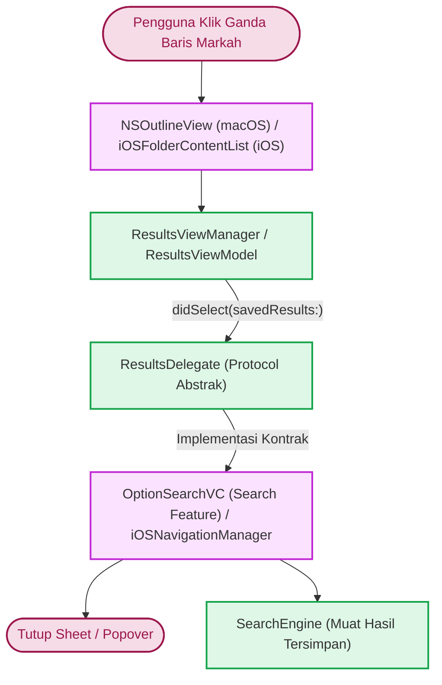
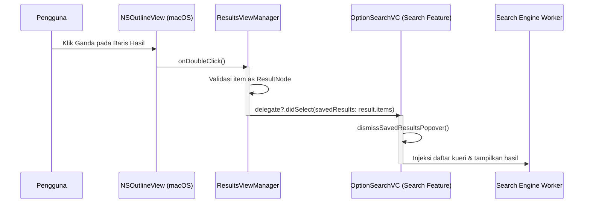

# Contracts & Loose Coupling

Dokumentasi ini menjelaskan antarmuka abstraksi dan *protocol* komunikasi yang didefinisikan pada direktori `Source/Features/Bookmarks/Protocols/`.

---

## 1. ResultsDelegate (Protocol)

*Protocol* utama yang menjembatani interaksi antara antarmuka markah hasil pencarian dengan modul pencarian (*Search Feature*) dan pembaca (*Reader Feature*).

```swift
import Foundation

@MainActor
protocol ResultsDelegate: AnyObject {
    /// Dipanggil saat pengguna memilih atau mengeklik ganda suatu node hasil pencarian tersimpan.
    ///
    /// - Parameter savedResults: Koleksi item hasil pencarian yang dikandung oleh node terpilih.
    func didSelect(savedResults: [SavedResultsItem])
}
```

---

## 2. Bedah Spesifikasi Kontrak

| Komponen | Spesifikasi | Keterangan |
| :--- | :--- | :--- |
| **Anotasi Konkurensi** | `@MainActor` | Menjamin metode delegasi selalu dieksekusi di antrean utama (*main thread*), mencegah potensi *race condition* saat memodifikasi UI antarmuka pencarian. |
| **Batasan Tipe** | `AnyObject` | Membatasi konformitas hanya pada tipe referensi (*class-only protocol*). Hal ini memungkinkan properti delegasi disimpan sebagai `weak var delegate: ResultsDelegate?` guna mencegah *retain cycle* (kebocoran memori). |
| **Parameter** | `savedResults: [SavedResultsItem]` | Berisi daftar lengkap seluruh kecocokan (nomor arsip, ID kitab, kueri asli, judul kitab, dan mode pencarian) yang tersimpan dalam markah tersebut. |
| **Nilai Kembalian** | `Void` | Operasi bersifat *fire-and-forget* dari sudut pandang pemanggil. |

---

## 3. Alur Kerja Sistem & Titik Panggilan (*Invocation Points*)





### Integrasi Lintas Modul

=== "macOS (`OptionSearchVC`)"
    Pada lingkungan macOS, kontroler `OptionSearchVC` (bagian dari `Source/Features/Search/macOS/`) mengadopsi *protocol* ini:

    ```swift
    extension OptionSearchVC: ResultsDelegate {
        func didSelect(savedResults: [SavedResultsItem]) {
            // 1. Tutup popover / sheet daftar bookmark
            dismissBookmarkSheet()
            
            // 2. Muat hasil pencarian yang tersimpan ke dalam tabel hasil aktif
            searchViewModel.loadSavedResults(savedResults)
        }
    }
    ```

=== "iOS (`iOSNavigationManager`)"
    Pada platform iOS, delegasi dilakukan secara langsung melalui *Environment Object* `iOSNavigationManager` di dalam *closure* `loadResult`:

    ```swift
    private func loadResult(_ resultNode: ResultNode) {
        dismiss()
        navigationManager.searchViewModel.loadSavedResults(resultNode.items)
    }
    ```

---

## 4. Keuntungan Loose Coupling

Dengan menggunakan *protocol* `ResultsDelegate`:

*   **Pelepasan Keterikatan (*Decoupling*)**: Modul Bookmarks sama sekali tidak perlu mengetahui *class* konkret dari kontroler yang membukanya (`OptionSearchVC`, `SplitVC`, atau komponen navigasi lainnya).
*   **Kemudahan Pengujian (*Testability*)**: Implementasi *Mock Delegate* dapat diinjeksikan dalam *unit test* untuk memverifikasi apakah interaksi pada `ResultsViewManager` memicu pengiriman data `[SavedResultsItem]` yang akurat.
