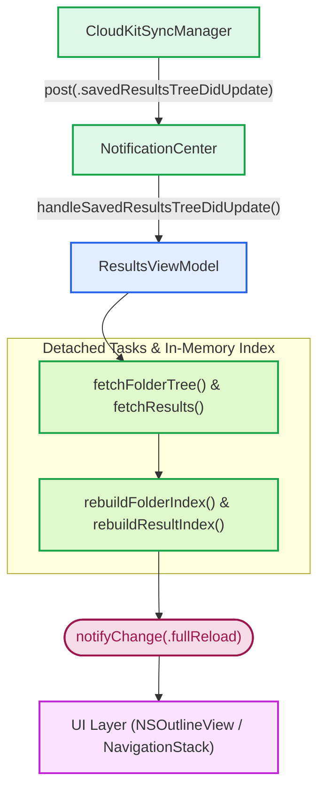
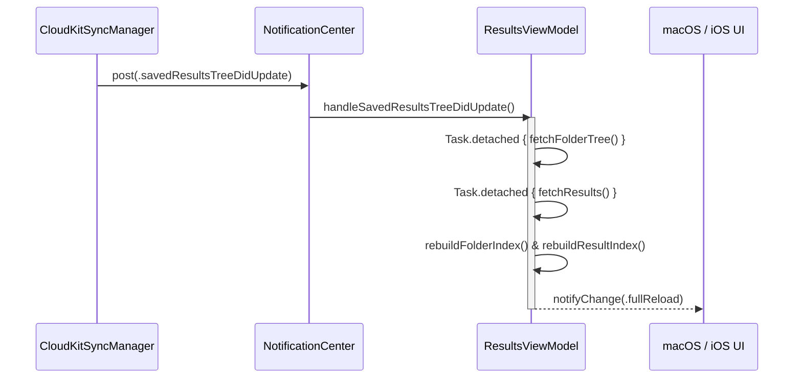

# State Management & Asynchronous Workflows

Dokumentasi ini membedah arsitektur logika bisnis, alur kerja reaktif, manajemen konkurensi, dan perluasan modular yang dikelola oleh `ResultsViewModel` pada direktori `Source/Features/Bookmarks/ViewModel/`.

---

## 1. ResultsViewModel (Class)

`ResultsViewModel` dirancang sebagai `class` *singleton* yang mengadopsi makro Swift Observation `@Observable` dan diikat secara mutlak ke antrean utama (`@MainActor`). Pendekatan ini menjamin bahwa seluruh mutasi properti yang diamati oleh SwiftUI maupun AppKit selalu terjadi secara aman di *main thread*.

```swift
@Observable @MainActor
class ResultsViewModel {
    static let shared: ResultsViewModel = .init()

    let db: ResultsHandler = .shared

    // Sumber Data Utama
    var folderRoots: [FolderNode] = []
    var folderResults: [Int64?: [ResultNode]] = [:] // Key nil = berada di root

    // Cache Struktural (Index untuk operasi O(1))
    var folderById: [Int64: FolderNode] = [:]
    var parentById: [Int64: Int64?] = [:] 
    var resultById: [Int64: ResultNode] = [:]

    var onTreeChange: ((BookmarkTreeChange) -> Void)?
    
    // ...
}
```

### Properti Sumber Data & Cache Struktural

*   `folderRoots`: Array node tingkat atas (*root level folders*).
*   `folderResults`: Kamus (*dictionary*) yang memetakan ID folder induk (`Int64?`, di mana `nil` mewakili hasil di *root*) ke daftar node `[ResultNode]` yang terkandung di dalamnya.
*   `folderById`: Indeks *hash map* untuk menemukan *instance* `FolderNode` dalam kompleksitas waktu $O(1)$ tanpa perlu menjelajahi seluruh hierarki secara rekursif.
*   `parentById`: Indeks pemetaan hubungan hierarki *child-to-parent*. Nilai `parentById[childId] = parentId`.
*   `resultById`: Indeks *hash map* untuk mengambil `ResultNode` berdasarkan kunci unik `id`.

---

## 2. Manajemen Konkurensi & Siklus Notifikasi

Untuk mencegah *freeze* antarmuka pengguna pada basis data yang memiliki ribuan markah tersimpan, proses pembacaan berat dan pengurutan dialihkan ke *background thread*.

### Pola Eksekusi `Task.detached`

Pada metode `getFolders()` dan `dbLoadAllResults()`, kalkulasi hierarki dan *sorting* dieksekusi di luar *MainActor* menggunakan `Task.detached`:

```swift
func getFolders() async {
    let roots = await Task.detached {
        var roots = ResultsHandler.shared.fetchFolderTree()
        roots.sort { $0.name.localizedCaseInsensitiveCompare($1.name) == .orderedAscending }

        func localSortTree(_ nodes: [FolderNode]) {
            for node in nodes {
                node.children.sort { $0.name.localizedCaseInsensitiveCompare($1.name) == .orderedAscending }
                localSortTree(node.children)
            }
        }
        localSortTree(roots)
        return roots
    }.value

    folderRoots = roots
    rebuildFolderIndex()
    notifyChange(.fullReload)
}
```

### Reaktivitas via NotificationCenter





*   `.savedResultsTreeDidUpdate`: Dipicu saat sinkronisasi CloudKit selesai menyerap perubahan dari server. ViewModel memuat ulang seluruh hierarki secara asinkron lalu membangun ulang indeks.
*   `.bookIdMigrated`: Dipicu saat modul katalog memperbarui skema ID buku internal, memastikan referensi markah diperbarui seketika.

---

## 3. Dekonstruksi Ekstensi Modular (`ViewModel/Extensions/`)

Logika bisnis dibagi menjadi beberapa modul fungsional di bawah folder `ViewModel/Extensions/`:

```
ViewModel/Extensions/
├── Results+Load.swift        # Pemuatan data & pembangunan indeks lookup
├── Results+Tree.swift        # Utilitas penelusuran hierarki & breadcrumb
├── Results+FolderOps.swift   # Operasi CRUD dan pemindahan folder
├── Results+ResultOps.swift   # Operasi CRUD dan pemindahan hasil pencarian
└── Results+Search.swift      # Mesin pencari markah dalam memori
```

---

### `Results+Load.swift`

Menangani fase inisialisasi data dan pemulihan konsistensi indeks:

*   `getFolders()`: Mengambil struktur hierarki folder dari basis data, mengurutkan secara rekursif berbasis lokalitas teks, dan memperbarui `folderRoots`.
*   `dbLoadAllResults()`: Menjelajahi seluruh folder yang terdaftar dan memuat hasil pencarian yang terkait ke dalam kamus `folderResults`.
*   `rebuildFolderIndex()`: Mengisi ulang kamus `folderById` dan `parentById` melalui penelusuran mendalam (*depth-first walk*).
*   `rebuildResultIndex()`: Mengisi ulang `resultById` dan memastikan integritas nilai `parentId` di setiap *child node*.

---

### `Results+Tree.swift`

Menyediakan fungsi pembantu operasi hierarki (*tree operations*):

*   `isDescendant(_ node: FolderNode, of ancestor: FolderNode) -> Bool`:
    *   Mencegah bahaya *infinite circular loop* saat pengguna memindahkan folder ke dalam dirinya sendiri atau ke dalam subfoldernya.
*   `folderPath(for folderId: Int64?) -> String`:
    *   Membangun jalur navigasi (*breadcrumb trail*), misalnya: `"Hadits / Shahih Bukhari / Kitab Iman"`. Menggunakan penelusuran balik ke atas (*bottom-up traversal*) via `parentById` dengan kompleksitas $O(d)$ di mana $d$ adalah kedalaman hierarki.
*   `removeNodeFromTree(_ node: FolderNode)`:
    *   Menghapus referensi node secara tepat dari array induknya tanpa merusak struktur cabang lainnya.

---

### `Results+FolderOps.swift`

Mengelola alur kerja transaksi pembuatan, modifikasi, dan pemindahan folder:

*   `addRootFolder(name: String) throws`:
    *   Menyimpan folder baru ke SQLite via `db.insertRootFolder`, memperbarui `folderRoots`, mendaftarkan ke indeks *cache*, dan memicu `.insertFolder` untuk animasi antarmuka pengguna.
*   `addSubFolder(parentNode: FolderNode, name: String) throws`:
    *   Membuat subfolder di bawah node yang ditentukan, menyortir node sejajar (*siblings*), dan memancarkan notifikasi perubahan.
*   `updateFolderName(id: Int64, newName: String) throws`:
    *   Mengubah nama pada basis data lokal, menyortir ulang posisi folder di antara *siblings*, serta memicu notifikasi `.moveFolder` jika posisinya bergeser secara alfabetis.
*   `deleteFolder(node: FolderNode)`:
    *   Menghapus folder beserta seluruh sub-hierarki di bawahnya secara kaskade (`allDescendantIds`), membersihkan hasil terkait dari memori dan indeks pencarian.
*   `moveNode(draggedNode: FolderNode, newParent: FolderNode?) throws`:
    *   Memvalidasi batasan hierarki, memperbarui basis data, mereposisi node dalam hierarki memori, dan mengabarkan perubahan indeks ke `NSOutlineView`.

---

### `Results+ResultOps.swift`

Mengatur siklus hidup *leaf node* hasil pencarian:

*   `saveSearchResults(results: [SearchResultItem], query: String, ...)`:
    *   Mengelompokkan baris hasil pencarian berdasarkan kombinasi arsip dan kitab menggunakan `GroupedResult`, lalu menyimpannya ke basis data dalam satu transaksi terpadu.
*   `updateResultQueryName(id: Int64, newName: String) throws`:
    *   Mengubah nama node hasil pencarian dan mengurutkan ulang posisinya pada folder yang bersangkutan.
*   `deleteResult(_ parentFolderId: Int64?, name: String)`:
    *   Menghapus hasil pencarian dari basis data dan memangkas entri dari memori dari urutan indeks belakang ke depan (*reverse iteration*) agar stabilitas indeks *array* tetap terjaga.
*   `moveResult(_ resultId: Int64, to newFolderId: Int64?) throws`:
    *   Memindahkan satu *result node* ke folder penampung yang berbeda.

---

### `Results+Search.swift`

Menyediakan pencarian instan dalam memori (*in-memory filtering*):

*   `searchFoldersInMemory(_ query: String) -> [FolderNode]`:
    *   Memfilter seluruh nilai pada `folderById` menggunakan `localizedStandardContains`.
*   `searchResultsInMemory(_ query: String) -> [ResultNode]`:
    *   Menyaring seluruh node pada `resultById`.
*   `searchResultsWithFolderPath(_ query: String) -> [SearchResultWithPath]`:
    *   Menggabungkan hasil pencarian dengan teks representasi jalur direktori (`folderPath`) untuk disajikan pada daftar pencarian global di macOS maupun iOS.
