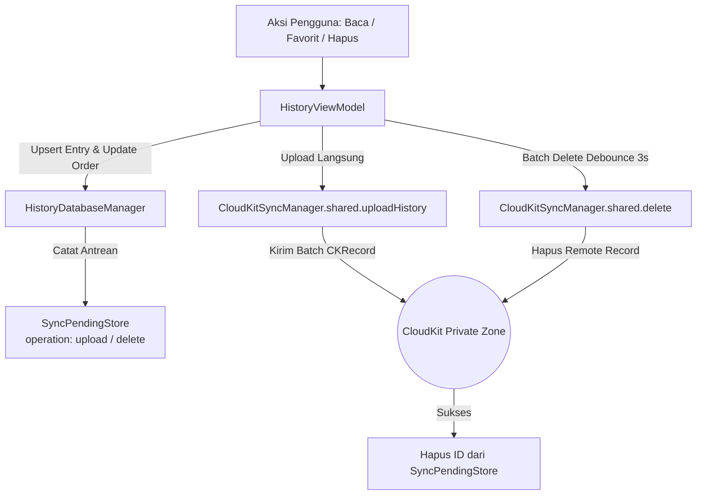
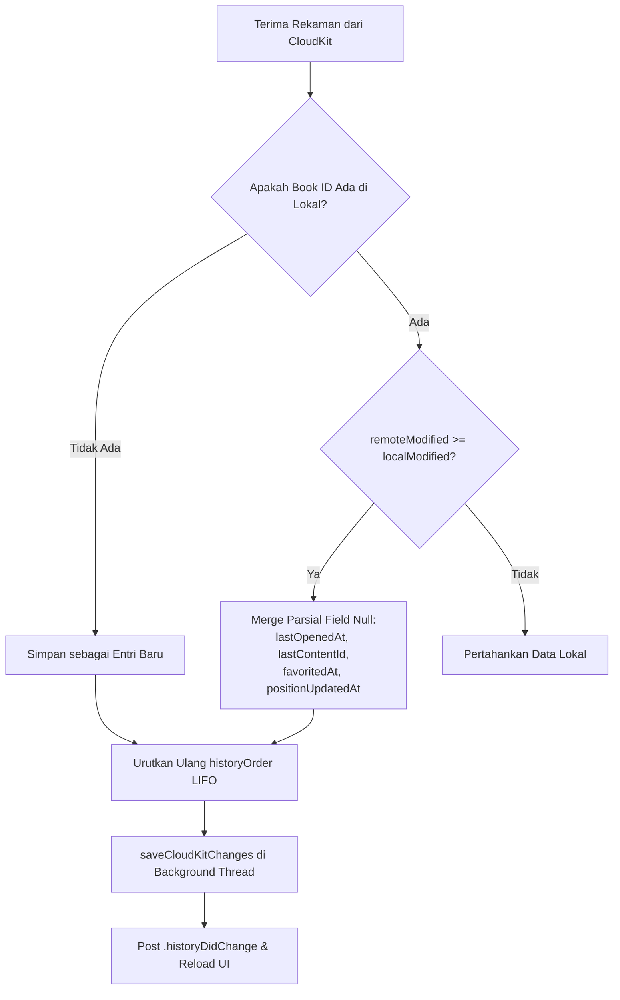

# Database & Storage

Subsistem persistensi lokal untuk modul History dijalankan oleh kelas Singleton `HistoryDatabaseManager`. Kelas ini berfungsi sebagai abstraksi basis data dan pembungkus (*wrapper*) eksekusi CRUD ke `SQLiteDatabase`. File ini bermukim di `Source/Features/History/Database/HistoryDatabaseManager.swift`.

## Konfigurasi SQLite

Basis data untuk History ditempatkan dalam arsip terpisah dari korpus buku (`main.sqlite`). Arsipnya dinamai `History.sqlite` dan berada berdampingan dengan direktori `Annotations` milik pengguna di `~/Library/Application Support/Maktabah/...`

### Skema Tabel

Kelas ini mendirikan 2 tabel inti jika belum terinisialisasi.

```sql
-- Tabel entri metadata pembacaan
CREATE TABLE IF NOT EXISTS reading_entries (
    book_id INTEGER PRIMARY KEY,
    last_content_id INTEGER,
    last_opened_at REAL,
    favorited_at REAL,
    position_updated_at REAL,
    updated_at REAL NOT NULL,
    is_favorite INTEGER NOT NULL DEFAULT 0,
    ck_record_id TEXT
);

-- Tabel urutan pembacaan
CREATE TABLE IF NOT EXISTS history_order (
    position INTEGER PRIMARY KEY,
    book_id INTEGER NOT NULL
);
```

Tabel `history_order` berfungsi secara khusus untuk melestarikan urutan linear sejarah pengguna secara persis (LIFO), di mana *record* terbaru akan memiliki *position* 0. Hal ini jauh lebih stabil ketimbang sekadar bergantung pada rentang stempel waktu (`updated_at`) yang mungkin bisa bertabrakan antar-perangkat.

### Mode Operasional WAL (Write-Ahead Logging)

Sejalan dengan komponen Maktabah lainnya, koneksi pada basis data dipaksa menggunakan mode WAL.

```swift
let db = try SQLiteDatabase(path: url.path)
db.enableWALMode()
db.checkpoint() // Flush jaminan WAL sebelum transaksi dimulai
```

Mode WAL memungkinkan modul History secara bersamaan mencatatkan pembaruan parameter (*seperti `updateLastContentId` terus menerus saat _scrolling_*), sembari sinkronisasi CloudKit tetap bisa menarik dan mengiterasi data yang sudah ada di utas (*thread*) yang berlainan tanpa mengunci seluruh basis data (_database lock_). 

Untuk mengatasi parameter dalam *bulk*, `HistoryDatabaseManager` mengeksekusi operasi `INSERT OR REPLACE` melalui antrean dengan ukuran *batch* 50 demi mencegah batas atas (*SQLite parameter limits*) jebol (SQLite hanya mengizinkan batas statis maksimal 999 parameter di tiap satu transaksi sisipan/ *insert command*).

## Thread-Safety & Concurrency

Meskipun menggunakan kelas biasa (bukan Actor model via tipe `actor` Swift) dan dianotasi dengan `@unchecked Sendable`, `HistoryDatabaseManager` memastikan _thread safety_ berlindung di balik *lock* reklusif (`NSRecursiveLock` atau flag `SQLITE_OPEN_FULLMUTEX`) yang diproses di internal kelas modul kustom `SQLiteDatabase`.

```swift
func transaction(_ block: () throws -> Void) throws {
    guard let _db else { return }
    try _db.transaction(block)
}
```

Metode `transaction` bertindak sebagai fasilitator aman bagi iterasi sisipan skala besar (`upsertEntries`).

## Alur Sinkronisasi CloudKit

Modul History terhubung dengan CloudKit melalui kolaborasi `HistoryDatabaseManager`, `HistoryViewModel`, `HistorySyncHandler`, dan `CloudKitSyncManager`. Sinkronisasi berjalan dua arah menggunakan zona privat kustom (*Private Database Custom Zone*) agar mendukung notifikasi perubahan berbasis delta (*CKFetchRecordZoneChangesOperation*).

### 1. Representasi CKRecord & Pemetaan Field

Model `ReadingEntry` mengimplementasikan protokol `CloudKitSyncable` dan dipetakan ke record CloudKit bertipe `ReadingEntry` via `HistorySyncHandler`:

| Field Lokal (`ReadingEntry`) | Field CloudKit (`CKRecord`) | Tipe Data | Keterangan |
| --- | --- | --- | --- |
| `ckRecordId` | `recordID.recordName` | `String` | ID deterministik (`String(bookId)`) |
| `bookId` | `bookId` | `Int` | Kunci unik buku Maktabah |
| `lastContentId` | `lastContentId` | `Int?` | ID halaman terakhir dibaca |
| `lastOpenedAt` | `lastOpenedAt` | `Date?` | Waktu buku dibuka terakhir kali |
| `favoritedAt` | `favoritedAt` | `Date?` | Waktu buku ditandai favorit |
| `positionUpdatedAt` | `positionUpdatedAt` | `Date?` | Waktu posisi scroll diperbarui |
| `isFavorite` | `isFavorite` | `Bool` | Status favorit buku |
| `updatedAt` | `lastModified` | `Int64` (Timestamp) | Penentu resolusi konflik (*LWW*) |

### 2. Alur Sinkronisasi Keluar (Upload & Delete)



* **Unggahan Langsung**: Ketika pengguna membuka atau memfavoritkan buku, entri di-upsert ke database lokal dan diantrekan ke `SyncPendingStore`. `HistoryViewModel` segera memicu unggahan ke CloudKit.
* **Debounced Batch Delete**: Operasi penghapusan buku dari riwayat dikumpulkan ke dalam antrean `pendingCloudKitDeletes` dengan penundaan (*debounce*) selama 3 detik sebelum dikirim serentak ke CloudKit, meminimalkan overhead jaringan.
* **Penanganan Mode Offline (`SyncPendingStore`)**: Jika perangkat sedang offline saat mutasi terjadi, ID record tetap tersimpan di tabel antrean. Begitu koneksi internet pulih, `CloudKitSyncManager` secara otomatis menguras antrean pending tersebut.

### 3. Alur Sinkronisasi Masuk & Resolusi Konflik (LWW + Field Merging)

Saat `CloudKitSyncManager` menerima perubahan remote via `fetchChanges`, rekaman diteruskan ke `HistoryViewModel.shared.applyCloudKitChanges(entriesToSave:recordIdsToDelete:)`:



1. **Last-Write-Wins (LWW)**: Membandingkan `updatedAt` lokal dengan `lastModified` remote. Jika remote lebih baru (`remoteModified >= localModified`), perubahan diterima.
2. **Field Merging Non-Destruktif**: Jika field remote bernilai `nil` (misalnya karena perubahan parsial), nilai lokal yang sudah ada tetap dipertahankan (`lastOpenedAt`, `lastContentId`, `favoritedAt`, `positionUpdatedAt`) untuk mencegah hilangnya progres membaca.
3. **Rekonsiliasi Urutan (`historyOrder`)**: Setelah entri remote digabung, `HistoryViewModel` menyortir ulang buku riwayat berdasarkan `lastOpenedAt` terbaru (dibatasi `maxHistoryCount = 50`), menghapus entri yatim (*prune*), dan menyimpannya kembali ke SQLite secara atomik via `HistoryDatabaseManager.saveCloudKitChanges` di background thread.
4. **Pembaruan UI**: Notifikasi `.historyDidChange` disiarkan untuk merefresh daftar riwayat dan favorit di antarmuka macOS dan iOS secara reaktif.
