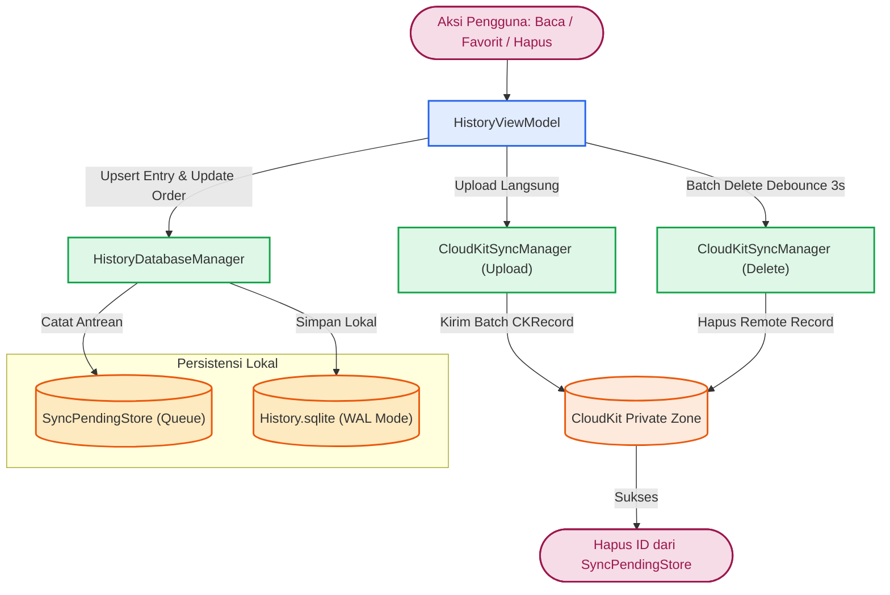
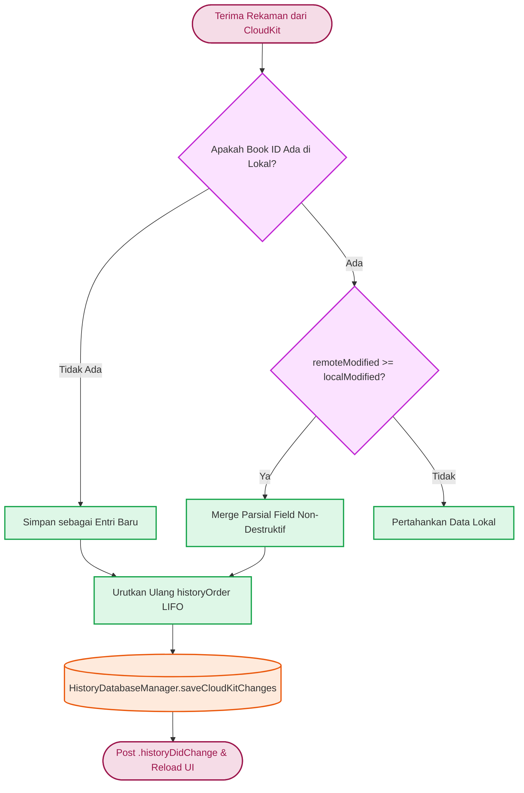

# Database & Storage

Subsistem persistensi lokal untuk modul History dikelola oleh *class* Singleton `HistoryDatabaseManager`. *Class* ini berfungsi sebagai abstraksi basis data dan pembungkus (*wrapper*) eksekusi CRUD ke `SQLiteDatabase`. Berkas ini berlokasi di `Source/Features/History/Database/HistoryDatabaseManager.swift`.

## Konfigurasi SQLite

Basis data untuk History ditempatkan dalam arsip terpisah dari korpus buku (`main.sqlite`). Berkasnya dinamai `History.sqlite` dan berada berdampingan dengan direktori `Annotations` milik pengguna di `~/Library/Application Support/Maktabah/...`

### Skema Tabel

*Class* ini menginisialisasi 2 tabel inti:

```sql
-- Tabel entri metadata pembacaan
CREATE TABLE IF NOT EXISTS reading_entries (
    book_id INTEGER PRIMARY KEY,
    last_content_id INTEGER,
    last_opened_at REAL,
    favorited_at REAL,
    position_updated_at REAL,
    updated_at REAL NOT NULL,
    is_favorite INTEGER NOT NULL DEFAULT 0,
    ck_record_id TEXT
);

-- Tabel urutan pembacaan
CREATE TABLE IF NOT EXISTS history_order (
    position INTEGER PRIMARY KEY,
    book_id INTEGER NOT NULL
);
```

Tabel `history_order` berfungsi secara khusus untuk mempertahankan urutan linear riwayat pengguna secara presisi (LIFO), di mana rekaman terbaru menempati `position` 0. Pendekatan ini lebih deterministik dibandingkan hanya bergantung pada stempel waktu (`updated_at`) yang berpotensi memiliki resolusi identik antarperangkat.

### Mode Operasional WAL (Write-Ahead Logging)

Sejalan dengan komponen Maktabah lainnya, koneksi basis data dikonfigurasi menggunakan mode WAL.

```swift
let db = try SQLiteDatabase(path: url.path)
db.enableWALMode()
db.checkpoint() // Flush jaminan WAL sebelum transaksi dimulai
```

Mode WAL memungkinkan modul History mencatatkan pembaruan parameter secara bersamaan (seperti `updateLastContentId` saat *scrolling*), sementara sinkronisasi CloudKit tetap dapat membaca dan mengiterasi data yang ada di *thread* berbeda tanpa mengunci seluruh basis data (*database lock contention*). 

Untuk menangani parameter dalam jumlah besar, `HistoryDatabaseManager` mengeksekusi operasi `INSERT OR REPLACE` melalui antrean dengan ukuran *batch* 50 demi mencegah pelampauan batas parameter SQLite (batas standar SQLite maksimal 999 parameter per transaksi *insert*).

## Thread-Safety & Concurrency

`HistoryDatabaseManager` mengadopsi protokol `Sendable` secara langsung tanpa anotasi `@unchecked Sendable`. Seluruh *pointer* database SQLite dan *instance* `SyncPendingStore` dibungkus di dalam struktur `State` privat yang diproteksi oleh `Synchronization.Mutex`:

```swift
final class HistoryDatabaseManager: SyncPendingManaging, Sendable {
    static let shared = HistoryDatabaseManager()

    private struct State: Sendable {
        var db: SQLiteDatabase?
        var syncPendingStore: SyncPendingStore?
    }

    private let state = Mutex(State())

    private var _db: SQLiteDatabase? {
        state.withLock { $0.db }
    }

    var syncPendingStore: SyncPendingStore? {
        state.withLock { $0.syncPendingStore }
    }
}
```

Metode `transaction` bertindak sebagai fasilitator aman bagi iterasi penyisipan skala besar (`upsertEntries`), di mana eksekusi kueri di level `SQLiteDatabase` tetap dilindungi oleh `NSRecursiveLock` dan flag `SQLITE_OPEN_FULLMUTEX`.

## Alur Sinkronisasi CloudKit

Modul History terhubung dengan CloudKit melalui kolaborasi antara `HistoryDatabaseManager`, `HistoryViewModel`, `HistorySyncHandler`, dan `CloudKitSyncManager`. Sinkronisasi berjalan dua arah menggunakan zona privat kustom (*Private Database Custom Zone*) guna mendukung notifikasi perubahan berbasis delta (`CKFetchRecordZoneChangesOperation`).

### 1. Representasi CKRecord & Pemetaan Field

Model `ReadingEntry` mengadopsi *protocol* `CloudKitSyncable` dan dipetakan ke rekaman CloudKit bertipe `ReadingEntry` via `HistorySyncHandler`:

| Field Lokal (`ReadingEntry`) | Field CloudKit (`CKRecord`) | Tipe Data | Keterangan |
| --- | --- | --- | --- |
| `ckRecordId` | `recordID.recordName` | `String` | ID deterministik (`String(bookId)`) |
| `bookId` | `bookId` | `Int` | Kunci unik buku Maktabah |
| `lastContentId` | `lastContentId` | `Int?` | ID halaman terakhir dibaca |
| `lastOpenedAt` | `lastOpenedAt` | `Date?` | Waktu buku dibuka terakhir kali |
| `favoritedAt` | `favoritedAt` | `Date?` | Waktu buku ditandai favorit |
| `positionUpdatedAt` | `positionUpdatedAt` | `Date?` | Waktu posisi *scroll* diperbarui |
| `isFavorite` | `isFavorite` | `Bool` | Status favorit buku |
| `updatedAt` | `lastModified` | `Int64` (Timestamp) | Penentu resolusi konflik (*LWW*) |

### 2. Alur Sinkronisasi Keluar (Upload & Delete)



* **Unggahan Langsung**: Ketika pengguna membuka atau memfavoritkan buku, entri di-*upsert* ke basis data lokal dan dimasukkan ke antrean `SyncPendingStore`. `HistoryViewModel` segera memicu unggahan ke CloudKit.
* **Debounced Batch Delete**: Operasi penghapusan buku dari riwayat dikumpulkan ke dalam antrean `pendingCloudKitDeletes` dengan penundaan (*debounce*) selama 3 detik sebelum dikirim serentak ke CloudKit, meminimalkan *overhead* jaringan.
* **Penanganan Mode Offline (`SyncPendingStore`)**: Jika perangkat sedang *offline* saat mutasi terjadi, ID rekaman tetap tersimpan di tabel antrean. Begitu konektivitas internet pulih, `CloudKitSyncManager` secara otomatis men-*flush* antrean *pending* tersebut.

### 3. Alur Sinkronisasi Masuk & Resolusi Konflik (LWW + Field Merging)

Saat `CloudKitSyncManager` menerima perubahan *remote* via `fetchChanges`, rekaman diteruskan ke `HistoryViewModel.shared.applyCloudKitChanges(entriesToSave:recordIdsToDelete:)`:



1. **Last-Write-Wins (LWW)**: Membandingkan `updatedAt` lokal dengan `lastModified` remote. Jika remote lebih baru (`remoteModified >= localModified`), perubahan diterima.
2. **Field Merging Non-Destruktif**: Jika *field* remote bernilai `nil` (misalnya karena perubahan parsial), nilai lokal yang sudah ada tetap dipertahankan (`lastOpenedAt`, `lastContentId`, `favoritedAt`, `positionUpdatedAt`) untuk mencegah hilangnya progres membaca.
3. **Rekonsiliasi Urutan (`historyOrder`)**: Setelah entri *remote* digabungkan, `HistoryViewModel` menyortir ulang buku riwayat berdasarkan `lastOpenedAt` terbaru (dibatasi `maxHistoryCount = 50`), menghapus *orphan records*, dan menyimpannya kembali ke SQLite secara atomik via `HistoryDatabaseManager.saveCloudKitChanges` di *background thread*.
4. **Pembaruan UI**: Notifikasi `.historyDidChange` disiarkan untuk menyegarkan daftar riwayat dan favorit di antarmuka macOS dan iOS secara reaktif.
