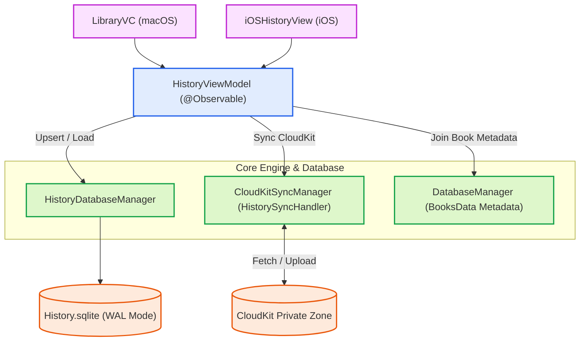

# Overview & Architecture Pipeline

Dokumentasi ini membedah arsitektur fitur **History & Favorites** pada Maktabah. Fitur ini bertanggung jawab untuk melacak buku yang terakhir dibuka (riwayat bacaan) beserta posisinya (`lastContentId`), serta daftar buku yang ditandai sebagai favorit oleh pengguna. Data ini disinkronkan secara mulus antarperangkat melalui CloudKit dan disimpan ke disk menggunakan SQLite.

## Diagram Arsitektur

Fitur History mengadopsi pola reaktif menggunakan `@Observable` dan memisahkan tanggung jawab antara *State Management*, *Persistensi Database*, dan *Sinkronisasi Cloud*.

## Prinsip Pemisahan Tanggung Jawab

Modul ini dipecah ke dalam beberapa *layer* untuk memastikan *Separation of Concerns* (SoC):

1. **State Management (`HistoryViewModel`)**: Bertindak sebagai *single source of truth* di level memori/UI. Memegang status `entriesByBookId` dan menangani *debouncing* untuk mencegah *over-fetching* saat CloudKit melakukan perubahan beruntun.
2. **Storage Layer (`HistoryDatabaseManager`)**: Berkomunikasi langsung dengan SQLite (menggunakan `SQLiteDatabase`). Bertanggung jawab untuk eksekusi CRUD, manajemen koneksi WAL (*Write-Ahead Logging*), dan menampung *queue* sinkronisasi yang tertunda.
3. **Data Model (`ReadingEntry`)**: Membungkus seluruh properti metadata aktivitas bacaan. Dioptimalkan dengan `Codable` dan `Hashable`.
4. **CloudKit Sync (`SyncPendingManaging`)**: Database ini terintegrasi dengan `SyncPendingStore` bawaan Core untuk memastikan *offline-first sync*, di mana perubahan saat luring (*offline*) akan diantrekan dan dikirim saat daring (*online*).

## Daftar Dokumen Teknis

Berikut adalah pembedahan mendalam untuk setiap komponen di dalam *feature-slice* History:

* [AppKit Implementation (macOS)](macos.md)
* [Database & Storage (SQLite)](database.md)
* [Data Models & State Types](models.md)
* [Protocols & Contracts](protocols.md)
* [State Management (ViewModel)](viewmodel.md)
* [SwiftUI & UIKit Integration (iOS)](ios.md)
