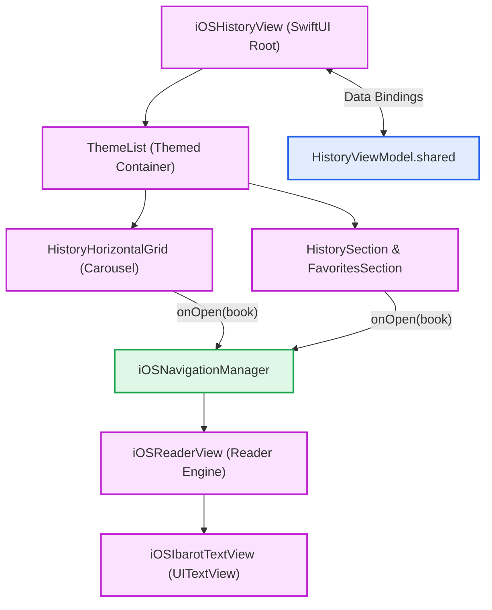
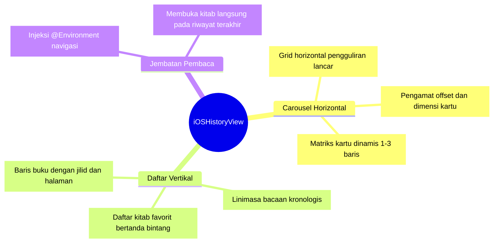
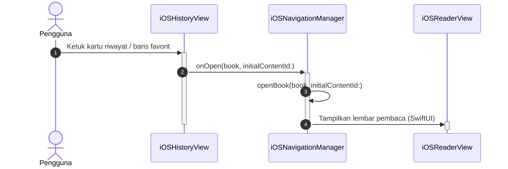
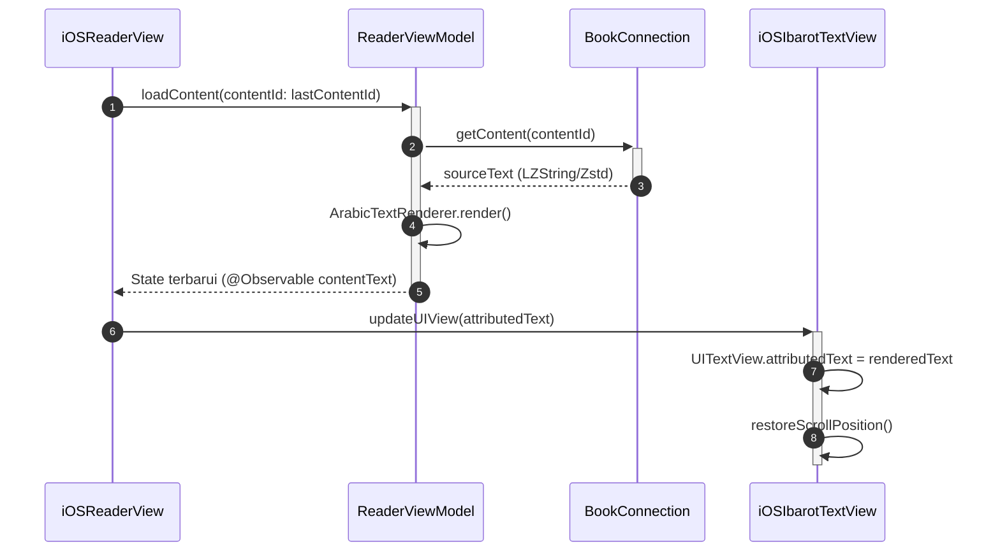

# History & Favorites iOS Implementation (SwiftUI)

Berbeda dengan macOS yang menyisipkan data riwayat ke dalam tampilan *Library* yang sudah ada, ekosistem iOS/iPadOS Maktabah menggunakan pendekatan deklaratif menggunakan komponen SwiftUI yang didedikasikan secara khusus untuk History di dalam folder `Source/Features/History/iOS/`.

---

## 1. Arsitektur Komponen Visual

Struktur tata letak riwayat bacaan dan buku favorit pada platform iOS dirancang secara reaktif menggunakan SwiftUI:

### A. Hierarki Kontainer Riwayat



### B. Taksonomi Komponen & Susunan Tata Letak



---

## 2. Alur Interaksi: Dari Aksi Klik Kartu Riwayat ke TextView

Ketika pengguna mengetuk salah satu kartu riwayat atau baris buku favorit pada `iOSHistoryView`:





---

## 3. Bedah Komponen & Logika Antarmuka

### A. `iOSHistoryView`
Sebagai kontainer beranda (*Root View*) ketika pengguna memilih menu "History & Favorites" di `iPhoneLayout` atau bilah samping `iPadLayout`, `iOSHistoryView` mengombinasikan koleksi favorit dan linimasa buku terakhir yang dibuka secara vertikal:

```swift
struct iOSHistoryView: View {
    var viewModel = HistoryViewModel.shared
    @Environment(iOSNavigationManager.self) private var navigationManager: iOSNavigationManager
    var donationManager = DonationManager.shared

    var body: some View {
        let filteredFavorites = viewModel.filteredFavorites
        let filteredHistory = viewModel.filteredHistory

        ThemeList {
            if !filteredHistory.isEmpty {
                HistorySection(books: filteredHistory, viewModel: viewModel)
            }
            
            if !filteredFavorites.isEmpty {
                FavoritesSection(
                    books: filteredFavorites,
                    viewModel: viewModel,
                    onOpen: { book in ... }
                )
            }
        }
    }
}
```

Fitur ini memanfaatkan makro `@Observable` (dari properti `viewModel.filteredFavorites` dan `filteredHistory`) untuk *rendering* secara reaktif. Seluruh penyaringan data dikelola pada lapisan logika `HistoryViewModel` (misalnya saat kolom pencarian diisi teks).

### B. `HistoryFavoriteSections.swift`
Berkas ini bertugas sebagai pembungkus (*wrapper*) bagian tampilan. Komponen statis seperti `Section(header: Text("History"))` dibungkus dalam modul terisolasi agar iPad dapat me-*render* bagian ini secara independen di *sidebar* tanpa perlu me-*render* ulang `ThemeList` secara penuh.

### C. `HistoryHorizontalGrid`
Karena riwayat yang baru dibaca disajikan di posisi teratas dalam tampilan *carousel* geser menyamping (*horizontal grid*), Maktabah menyediakan komponen `HistoryHorizontalGrid`:

```swift
// Di dalam HistoryComponents.swift
@State private var scrollState = ScrollState()

private var actualRowCount: Int {
    switch books.count {
    case 0...4: return 1
    case 5...8: return 2
    default: return 3
    }
}
```

**Optimasi Baris Dinamis:**
Blok kode di atas merupakan adaptasi tata letak layar sentuh (*layout adaptation*). Alih-alih menyajikan 1 baris yang terlalu panjang ke samping, grid ini menyesuaikan jumlah baris berdasarkan jumlah buku yang dimuat:

- Jika $\le 4$ buku: Menampilkan 1 baris horizontal.
- Jika 5–8 buku: Menampilkan matriks 2 baris.
- Jika $\ge 9$ buku: Menampilkan maksimal 3 baris kartu (*cards*).

### D. Manajemen *Scroll State*

Berkas `HistoryComponents.swift` juga memuat objek deklaratif pelacak parameter posisi *scroll*:

```swift
@Observable
final class ScrollState {
    var normalizedOffset: CGFloat = 0  // 0.0 to 1.0
    var lastScrollingRow: Int? = nil
}
```

`ScrollState` bertugas mempertahankan rasio posisi kompartemen *grid*. Jika pengguna kembali ke `iOSHistoryView` dari halaman membaca buku, *Scroll View* SwiftUI menyelaraskan *offset* `normalizedOffset` (0.0 hingga 1.0) ke lokasi semula (*last visual retention*) sehingga elemen kartu antarmuka tidak melompat (*flicker*) atau bergeser.
