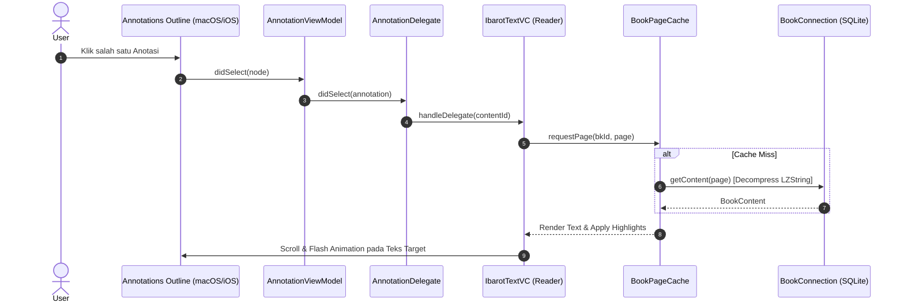

# Arsitektur Global Feature-Slice Maktabah

Dokumen ini menjelaskan struktur arsitektur **Feature-Sliced Design** yang diterapkan pada Maktabah (macOS & iOS), hubungan antarlapisan (*layering*), serta bagaimana modul fitur berkomunikasi dengan lapisan inti (*Core*).

---

## 1. Lapisan Arsitektur (Layering Hierarchy)

Codebase Maktabah dibagi menjadi tiga lapisan utama yang memiliki aturan ketergantungan satu arah (*unidirectional dependency*):

```text
┌─────────────────────────────────────────────────────────┐
│                    UI Shells                            │
│   • macOS: AppKit Windows, SplitVC, Toolbar, NSTextView │
│   • iOS: SwiftUI App, iPadLayout, UIViewControllerBridge│
│   • Extensions: WidgetKit Timeline Providers            │
└────────────────────────────┬────────────────────────────┘
                             │ (mengonsumsi)
┌────────────────────────────▼────────────────────────────┐
│                  Features (Slices)                      │
│   • Annotations  • Bookmarks  • History  • Library      │
│   • Narrator     • Quran      • Reader   • Search       │
└────────────────────────────┬────────────────────────────┘
                             │ (bergantung pada)
┌────────────────────────────▼────────────────────────────┐
│                  Core Engine Layer                      │
│   • Database (SQLite wrapper, zstd, BookConnection)     │
│   • SearchEngine (FTS5 Worker Pool, Query Parser)       │
│   • TextProcessing (Arabic typography, harakat mapping) │
│   • CloudKit (Sync Manager, Zone Coordinator)           │
│   • Configuration & Network (AppConfig, ArabicFont)     │
└─────────────────────────────────────────────────────────┘
```

### Aturan Ketergantungan:
1. **Lapisan Core** tidak boleh mengimpor atau bergantung pada modul di lapisan *Features* atau *UI*.
2. **Antar-Fitur (Cross-Feature)** tidak boleh saling mengimpor secara langsung. Komunikasi antar-fitur wajib melalui:
    * **Protokol / Delegate** (contoh: `AnnotationDelegate` untuk melompat ke pembaca di `Reader`).
    * **Notification / Combine Stream** (contoh: `AnnotationEvent`, `HistoryUpdateEvent`).
    * **Koordinator Sentral** (`AppCoordinator`, `LibraryDataManager`).

---

## 2. Struktur Internal Feature Slice

Setiap folder di dalam `Source/Features/<FeatureName>/` merupakan slice modular mandiri yang memiliki struktur seragam:

```text
Source/Features/<FeatureName>/
├── Models/        # Struct data immutable (Sendable) & Enum
├── Protocols/     # Interface kontrak & delegation untuk loose-coupling
├── ViewModel/     # State management, transformasi data, dan Combine bindings
├── Database/      # Logika persistensi lokal, repository, dan kueri spesifik fitur
├── macOS/         # Implementasi view native AppKit (ViewControllers, Outlines, Popovers)
└── iOS/           # Implementasi view SwiftUI dan UIViewControllerRepresentable bridges
```

---

## 3. Peta Fitur Utama (Feature Slices Overview)

| Feature Slice | Domain & Tanggung Jawab Utama | Ketergantungan Core Kunci |
| :--- | :--- | :--- |
| **Annotations** | Sorotan (highlight), garis bawah berwarna (underline), catatan, dan tagging. | `ArabicRangeCalculator`, `CloudKitSyncManager`, `Mutex` |
| **Bookmarks** | Penanda halaman dan pengorganisasian folder hasil pencarian favorit. | `ResultsHandler`, `CloudKitSyncManager` |
| **History** | Pelacakan riwayat bacaan kitab, sesi waktu membaca, dan resume posisi. | `HistoryDatabaseManager`, `ScreenTimeManager` |
| **Library** | Katalog buku, kategori, download manager, dekompresi arsip, update buku. | `DatabaseManager`, `ZstdDecompressor`, `BookDownloadManager` |
| **Narrator** | Eksplorasi biografi perawi hadis (*rijalul hadits*) dan relasi sanad. | `RowiDataManager`, `TarjamahDataManager`, `SQLiteDatabase` |
| **Quran** | Penjelajah ayat Al-Qur'an, navigasi surah/juz, dan tafsir terintegrasi. | `QuranDataManager`, `ArabicTextRenderer` |
| **Reader** | Penampil teks kitab, pagination, continuous scroll, dan styling font Arab. | `TextProcessing`, `BookConnection`, `BookPageCache` |
| **Search** | Antarmuka pencarian cepat teks penuh lintas puluhan ribu kitab. | `SearchEngine` (FTS5 Pool), `FtsQueryParser` |
| **Widget** | Menampilkan kutipan, catatan harian, dan ringkasan bacaan di Lock/Home Screen. | `WidgetUpdateCoordinator`, Shared App Group Storage |

---

## 4. Alur Komunikasi Antar-Komponen

Contoh alur terintegrasi saat user berinteraksi dari **Sidebar Anotasi** menuju ke **Reader**:



---

## 5. Keuntungan Arsitektur Ini

* **Multiplatform Bersih**: Logika bisnis (Model, ViewModel, Database) 100% dibagikan antara macOS dan iOS tanpa duplikasi kode.
* **Isolasi Masalah**: Bug atau perubahan skema pada modul *Narrator* tidak akan berdampak pada modul *Annotations* atau *Reader*.
* **Skalabilitas**: Menambah fitur baru (misalnya modul *Kamus/Mu'jam*) cukup membuat satu folder slice baru di `Features/` tanpa merombak modul yang sudah stabil.
