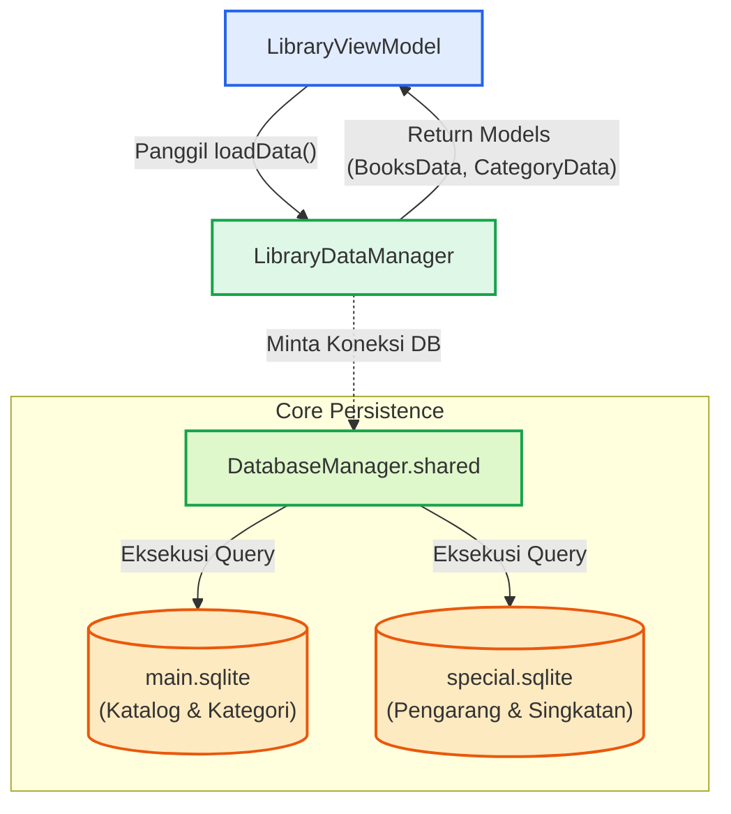

# Database & Persistensi Katalog

Modul Library mengandalkan **`LibraryDataManager`** sebagai lapisan akses data utama (*Data Access Layer*) untuk mengambil struktur katalog (kategori, pengarang, dan kitab). Namun, `LibraryDataManager` memiliki ketergantungan erat dengan **`DatabaseManager`** pada level *Core*.

---

## Ketergantungan Erat `LibraryDataManager` dan `DatabaseManager`

`LibraryDataManager` bertindak sebagai *repository* yang menyediakan fungsi pembacaan data (*read-only*) untuk UI dan ViewModel, sedangkan eksekusi kuerinya didelegasikan secara penuh ke koneksi yang dikelola oleh `DatabaseManager.shared`.

### Peran `DatabaseManager`
`DatabaseManager` merupakan komponen inti (*Core*) yang mengelola siklus hidup koneksi SQLite terhadap basis data korpus utama:

- `main.sqlite`: Menyimpan katalog buku, kategori, dan metadata inti.
- `special.sqlite`: Menyimpan data sekunder seperti daftar pengarang (*muallif*) dan singkatan.

Koneksi-koneksi ini dilindungi di dalam `DatabaseManager` untuk menjamin keamanan konkurensi (*thread-safe*) dan mencegah akses bersamaan yang berpotensi memicu *database lock*.

### Alur Eksekusi
Setiap kali `LibraryDataManager` perlu memuat atau menyegarkan (*refresh*) data katalog dari disk, komponen ini menggunakan instans `SQLiteDatabase` aktif dari `DatabaseManager`:



### Mutex & Thread-Safety di `LibraryDataManager`
Karena data katalog sering diakses dari berbagai *thread* (misalnya dari UI saat *scrolling*, dari *Search Engine* untuk pencarian judul buku, atau saat sinkronisasi data), `LibraryDataManager` menyembunyikan *state cache in-memory* internalnya di balik proteksi `Mutex` untuk pencarian $O(1)$ yang *thread-safe*.

```swift
private struct LibraryDataState: Sendable {
    var rawCategories: [CategoryData] = []
    var rawAuthors: [Muallif] = []
    var rawBooks: [BooksData] = []
    
    // ... indeks cache untuk O(1) lookup
}

private let state = Mutex(LibraryDataState())
```

Dengan pola pemisahan ini:

1. **`DatabaseManager`** bertanggung jawab penuh atas manajemen I/O disk (pembacaan berkas SQLite yang *thread-safe*).
2. **`LibraryDataManager`** bertanggung jawab atas struktur data dan I/O memori (*caching* model data di RAM yang *thread-safe* via Mutex).

Integrasi dan pemisahan tugas ini memastikan Maktabah dapat me-*render* ribuan buku, memfilter katalog, dan mencari metadata secara cepat tanpa membebani memori maupun operasi I/O disk secara repetitif.
