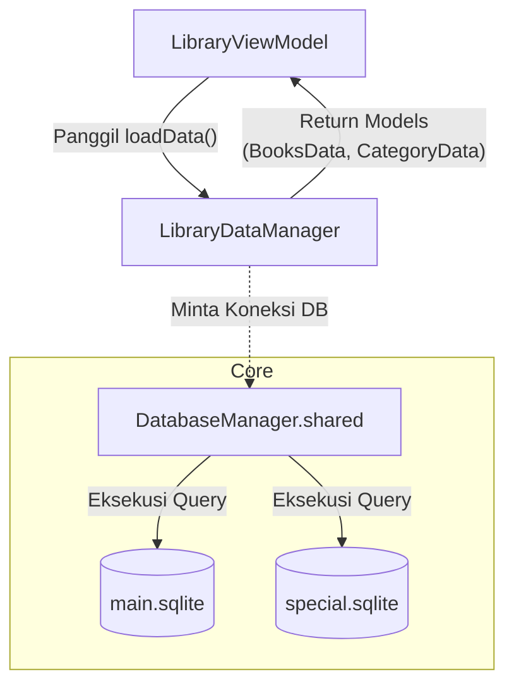

# Database & Persistensi Katalog

Modul Library mengandalkan **`LibraryDataManager`** sebagai lapisan akses data utama (Data Access Layer) untuk mengambil struktur katalog (kategori, pengarang, dan kitab). Namun, `LibraryDataManager` memiliki ketergantungan yang sangat erat dengan **`DatabaseManager`** di level Core.

---

## Ketergantungan Erat `LibraryDataManager` dan `DatabaseManager`

`LibraryDataManager` bertindak sebagai *repository* yang menyediakan fungsi pembacaan data (read-only) untuk UI dan ViewModel, namun eksekusi query-nya sendiri didelegasikan secara total ke koneksi yang dikelola oleh `DatabaseManager.shared`.

### Peran `DatabaseManager`
`DatabaseManager` merupakan komponen inti (Core) yang memegang dan mengelola siklus hidup koneksi SQLite terhadap basis data korpus utama:
- `main.sqlite`: Menyimpan katalog buku, kategori, dan metadata inti.
- `special.sqlite`: Menyimpan data sekunder seperti daftar pengarang (muallif) dan singkatan.

Koneksi-koneksi ini dilindungi di dalam `DatabaseManager` untuk memastikan *thread-safety* dan mencegah akses bersamaan yang bisa memicu *database lock*.

### Alur Eksekusi
Setiap kali `LibraryDataManager` perlu memuat atau me-refresh data katalog dari disk, ia meminjam instans `SQLiteDatabase` yang sedang aktif dari `DatabaseManager`:



### Mutex & Thread-Safety di `LibraryDataManager`
Karena data katalog sangat sering diakses dari berbagai thread (misalnya dari UI saat *scrolling*, dari *Search Engine* untuk *lookup* judul buku, atau saat sinkronisasi), `LibraryDataManager` menyembunyikan *state* cache internalnya di balik proteksi `Mutex` untuk pencarian `O(1)` in-memory.

```swift
private struct LibraryDataState: Sendable {
    var rawCategories: [CategoryData] = []
    var rawAuthors: [Muallif] = []
    var rawBooks: [BooksData] = []
    
    // ... indeks cache untuk O(1) lookup
}

private let state = Mutex(LibraryDataState())
```

Dengan pola pemisahan ini:
1. **`DatabaseManager`** bertanggung jawab penuh atas manajemen I/O disk (pembacaan berkas SQLite yang *thread-safe*).
2. **`LibraryDataManager`** bertanggung jawab atas struktur data dan I/O memori (*caching* model data di RAM yang *thread-safe* via Mutex).

Integrasi dan ketergantungan erat keduanya memastikan Maktabah dapat merender ribuan buku, memfilter katalog, dan mencari metadata dalam sepersekian milidetik tanpa membebani memori maupun I/O disk secara berulang.
