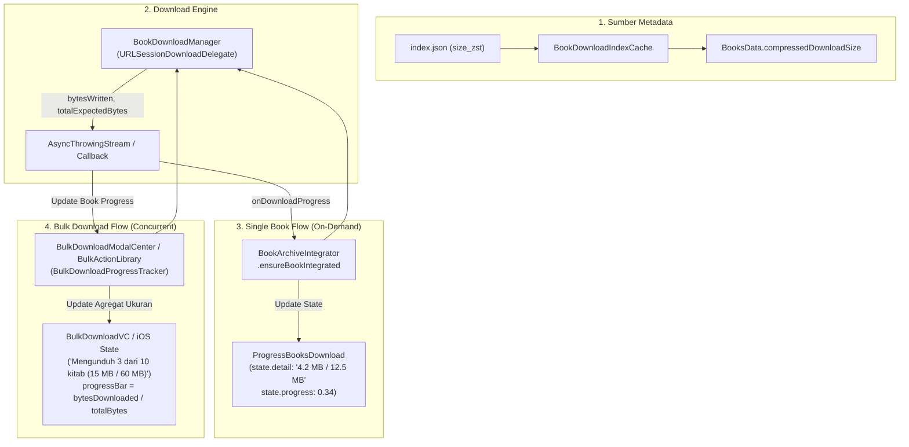

# Database Download, Archive Integration & Book Update Engine

Sumber kode:

* `Source/Features/Library/Database/`
    * `BookDownloadManager.swift`
    * `BookArchiveIntegrator.swift`
    * `Downloader/`
        * `BookDownloadDelegate.swift`
        * `BulkDownloadProgressTracker.swift`
    * `Updater/`
        * `BookUpdateManager.swift`
        * `BookUpdateMgr+Fetch.swift`
        * `BookUpdateMgr+Import.swift`
        * `BookUpdateMgr+Metadata.swift`
        * `BookUpdateMgr+SQLite.swift`

---

## 1. Masalah Rekayasa & Solusi Arsitektur

Maktabah memiliki katalog lebih dari **8.000 kitab**. Mengunduh arsip monolitik raksasa secara sekaligus tidak efisien untuk *bandwidth* pengguna, sedangkan menyimpan 8.000 berkas `.sqlite` terpisah akan menurunkan performa I/O sistem berkas (*file system*) dan menghambat fitur pencarian lintas kitab (*cross-book search*).

Arsitektur Maktabah menyelesaikan tantangan ini melalui **Tiga Pilar Siklus Data**:

```text
┌────────────────────────────────────────────────────────────────────────┐
│ 1. BookDownloadManager (Network Download & Ingestion)                  │
│    • Mengambil metadata & chunk per-buku dari GitHub Releases          │
│    • SingleFlight Deduplication: 1 HTTP Request per Book ID            │
└───────────────────────────────────┬────────────────────────────────────┘
                                    │ Menghasilkan temporary .sqlite
                                    ▼
┌────────────────────────────────────────────────────────────────────────┐
│ 2. BookArchiveIntegrator (Integrator Database & FTS)                   │
│    • Menyuntikkan tabel b{id} dan t{id} ke arsip 1-20.sqlite           │
│    • BookArchiveSingleFlight (Actor): Antrean serial per-arsip         │
│    • Pembangunan indeks teks penuh (FTS5 tokenization)                 │
└───────────────────────────────────┬────────────────────────────────────┘
                                    │ Saat versi baru tersedia di server
                                    ▼
┌────────────────────────────────────────────────────────────────────────┐
│ 3. BookUpdateManager (Staging & Atomic Upgrade Engine)                 │
│    • Komparasi versi bver di main.sqlite vs index.json                 │
│    • Unduh pembaruan pengarang, staging working directory terisolasi   │
│    • Transaksi atomik penggantian tabel tanpa merusak bookmark/anotasi  │
└────────────────────────────────────────────────────────────────────────┘
```

---

## 2. BookDownloadManager: Unduhan Asinkron & Deduplikasi

`BookDownloadManager` bertindak sebagai gerbang pengambilan berkas per-buku secara mandiri:

### A. Pola SingleFlight<Key, Value>
Untuk mencegah duplikasi permintaan (*request coalescing*) atau pemanggilan paralel dari beberapa subsistem secara bersamaan ke buku yang sama:

```swift
final class BookDownloadManager: @unchecked Sendable {
    private let singleFlight = SingleFlight<Int, URL>()

    func ensureBookDownloaded(bookId: Int) async throws -> URL {
        if let existing = localBookURL(bookId: bookId) {
            return existing
        }

        // Jika unduhan bookId sudah berlangsung, thread lain akan menumpang
        // pada Task yang sama tanpa membuat koneksi HTTP kedua
        return try await singleFlight.run(key: bookId) {
            try await self.performDownload(bookId: bookId)
        }
    }
}
```

### B. Ketahanan Jaringan (NetworkMonitor)
`BookDownloadManager` terhubung langsung ke `NetworkMonitor.shared`. Jika sambungan internet terputus saat proses pengunduhan, seluruh koneksi aktif dibatalkan secara tertib (`cancelAllDownloads()`), dan status parsial dibersihkan agar tidak meninggalkan berkas korup pada penyimpanan lokal.

### C. Pelaporan Ukuran & Progress Terdownload (Byte-Level Progress)

Sistem pengunduhan kitab dilengkapi pelacakan byte berbasis `URLSessionDownloadDelegate` yang mengalirkan progres ukuran nyata (baik untuk satu kitab maupun pengunduhan massal / *bulk download*):



* **Prioritas Penentuan Total Ukuran**:
  1. `HTTPURLResponse.expectedContentLength` dari server (jika > 0).
  2. Fallback ke `expectedSize` pemanggil (`BooksData.compressedDownloadSize`).
  3. Fallback ke `entry.sizeZst` dari `BookDownloadIndexCache`.
* **BulkDownloadProgressTracker**: Aktor pengelola agregat akumulasi byte dan jumlah kitab secara *thread-safe* saat unduhan berlangsung paralel melalui `withTaskGroup`.

---

## 3. BookArchiveIntegrator: Integrasi Tabel & Pembentukan FTS5

Setelah berkas sementara `.sqlite` kitab selesai diunduh, berkas tersebut diintegrasikan ke dalam salah satu dari 20 berkas arsip induk (`1.sqlite` s.d. `20.sqlite`).

### A. BookArchiveSingleFlight (Actor) - Koordinasi Konkurensi
Menulis ke satu basis data SQLite secara paralel dari banyak *thread* dapat memicu galat `SQLITE_BUSY` (*database is locked*). Modul ini menggunakan *Actor* dengan antrean *predecessor*:

```swift
actor BookArchiveSingleFlight {
    static let shared = BookArchiveSingleFlight()

    private var bookTasks: [Int: Task<Void, Error>] = [:]
    private var archiveTail: [Int: Task<Void, Error>] = [:]

    func run(archiveId: Int, bookId: Int, operation: @escaping @Sendable () async throws -> Void) async throws {
        // 1. Dedup per-buku: Hindari integrasi ganda untuk buku yang sama
        if let existingTask = bookTasks[bookId] {
            try await existingTask.value
            return
        }

        // 2. Serialisasi per-arsip: Tunggu operasi sebelumnya di arsip yang sama selesai
        let predecessor = archiveTail[archiveId]
        let task = Task<Void, Error> {
            _ = try? await predecessor?.value
            try await operation()
        }

        bookTasks[bookId] = task
        archiveTail[archiveId] = task
        try await task.value
    }
}
```

### B. IntegratePhase (Enum) - Dua Fase Integrasi

Operasi integrasi dibagi menjadi dua fase independen:

1. **Fase Data (`IntegratePhase.data`)**:
    * Menjalankan `ATTACH DATABASE` berkas buku sementara ke arsip `1-20.sqlite`.
    * Menyalin tabel konten (`b{id}`) dan tabel daftar isi (*Table of Contents* `t{id}`).
    * Menjalankan transaksi cepat agar *lock* basis data segera dilepas.
2. **Fase Indeks (`IntegratePhase.fts`)**:
    * Membaca teks Arab dari tabel `b{id}` yang baru disalin.
    * Melakukan normalisasi teks (penghapusan harakat/tasykil).
    * Memasukkan token teks ke dalam *virtual table* `search_index` (SQLite FTS5) agar kitab tersebut langsung dapat dicari pada fitur pencarian global.

---

## 4. BookUpdateManager: Staging & Pembaruan Atomik

Ketika naskah kitab direvisi, dikoreksi salah ketiknya, atau bertambah jilidnya di server, `BookUpdateManager` menangani proses pembaruan secara mulus (*seamless*).

### A. Deteksi Status Versi (BookVersionState)
Sistem memeriksa kolom versi (`bver` atau `bVer`) di `main.sqlite`:

```swift
enum BookVersionState: Sendable {
    case notInLibrary
    case unknownVersion
    case version(Int64)
}
```

Jika versi server di `index.json` lebih tinggi daripada `currentVersion`, buku tersebut ditandai dengan status *Update Available*.

### B. Isolasi Berkas Sementara (*Staging Workflow*)
Pembaruan buku tidak langsung menimpa data yang sedang dibaca. Sistem menggunakan mekanisme *Staging Directory*:

```swift
struct StagedBookUpdate: Sendable {
    let entry: BookIndexEntry
    let metadata: BookMetadata
    let downloadedBookURL: URL
    let ftsSourceURL: URL
    let authorContext: AuthorContext?
    let workingDirectory: URL
}
```

1. **Unduh ke Direktori Kerja Terisolasi**: Berkas buku baru dan data biografi pengarang diunduh ke direktori kerja sementara (`workingDirectory`).
2. **Validasi Skema**: Struktur tabel diverifikasi kelengkapannya sebelum menyentuh basis data utama.
3. **Pembaruan Konteks Pengarang**: Jika pengarang kitab tersebut memiliki revisi biografi, metadata di `special.sqlite` ikut diperbarui secara sinkron.
4. **Eksekusi Atomik (*Transaction Replace*)**:
    * Memperbarui baris metadata di `main.sqlite`.
    * Menimpa tabel `b{id}` di arsip `1-20.sqlite`.
    * Membangun ulang indeks FTS5 untuk ID kitab tersebut.
5. **Pembersihan (*Cleanup*)**: Direktori sementara dihapus setelah transaksi berhasil di-*commit*.

---

## 5. Pertimbangan Integritas Data & Transaksi

| Skenario Risiko | Mekanisme Pertahanan Maktabah |
| :--- | :--- |
| **Aplikasi dimatikan paksa saat proses unduh** | `SingleFlight` membersihkan berkas sementara; basis data utama tidak terpengaruh sebelum tahap *commit*. |
| **Dua buku dalam arsip yang sama selesai diunduh bersamaan** | `BookArchiveSingleFlight` memastikan buku kedua mengantre hingga buku pertama selesai menulis ke berkas arsip. |
| **Pembaruan buku saat pengguna sedang membaca kitab terkait** | Mode `WAL` (*Write-Ahead Logging*) di SQLite memungkinkan pembaca mengakses *snapshot* lama hingga koneksi disegarkan oleh *event* `.booksChanged`. |
| **Fragmentasi ruang kosong akibat pembaruan berulang** | `BookArchiveIntegrator` mencatat ID arsip ke `PendingVacuumArchiveIds` (`UserDefaults`) untuk menjadwalkan operasi `VACUUM` di latar belakang. |
