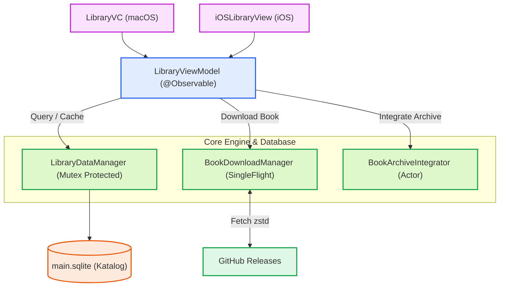

# Library & Catalog Management Architecture

Modul **Library** bertanggung jawab atas manajemen siklus hidup katalog kitab (kategori, pengarang, kitab), pengunduhan berkas `.sqlite` per-kitab, integrasi ke dalam arsip majemuk (`1-20.sqlite`), pembaruan versi kitab (*book updates*), serta koordinasi navigasi katalog lintas platform macOS dan iOS.

---

## 1. Diagram Arsitektur Komponen

---

## 2. Struktur Sub-Dokumentasi

Modul Library disusun secara modular ke dalam beberapa sub-dokumen teknis:

* **[Data Models](models.md)**: Model katalog inti (`BooksData`, `CategoryData`, `Muallif`), entitas pembaruan (`BookUpdateModels`), dan enum filter antarmuka pengguna.
* **[Database & Core Persistence](database.md)**: Integrasi `LibraryDataManager` dengan `DatabaseManager` dan arsitektur *caching in-memory* berbasis `Mutex`.
* **[Download & Archive Integration](download-integration.md)**: Mekanisme `BookDownloadManager`, deduplikasi HTTP `SingleFlight`, dan integrasi arsip `BookArchiveIntegrator` berbasis *Actor*.
* **[FTS Indexing & Stemming](stemming.md)**: Proses pembuatan indeks FTS5, dekompresi Zstandard (zstd), normalisasi teks Arab, dan migrasi FTS.
* **[iOS Implementation](ios.md)**: Implementasi SwiftUI (`iOSLibraryView`), jembatan UIKit (`LibraryViewControllerWrapper`), mode *toolbar*, dan impor luring (*offline import*).
* **[macOS Implementation](macos.md)**: Implementasi AppKit (`LibraryVC`), manajemen struktur hierarki multi-kolom (`LibraryViewManager`), dan *batch diffing*.
* **[Protocols & Delegation](protocols.md)**: Kontrak `LibraryDelegate`, `LibraryViewDelegate`, dan `SearchableLibrarySidebar`.
* **[ViewModel, State & Combine](viewmodel.md)**: Arsitektur `@Observable LibraryViewModel`, pengelolaan *state* katalog, *pagination*, mode filter, dan observasi Combine/NotificationCenter.
