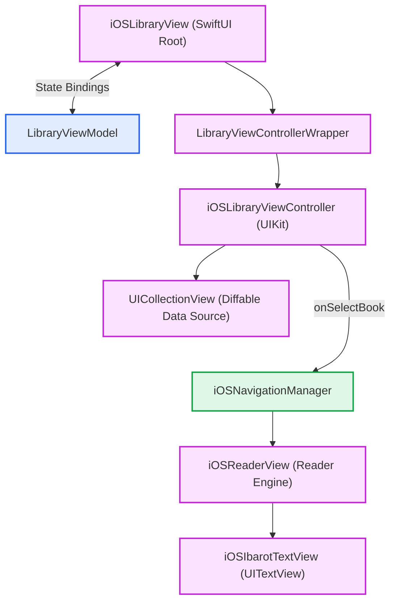
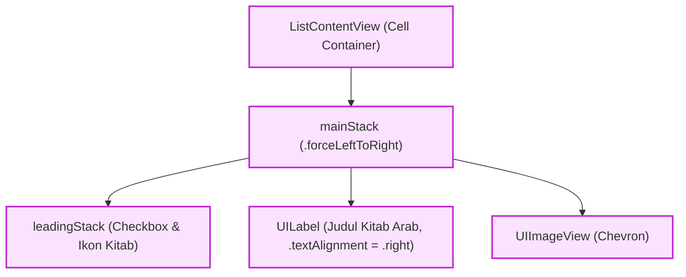
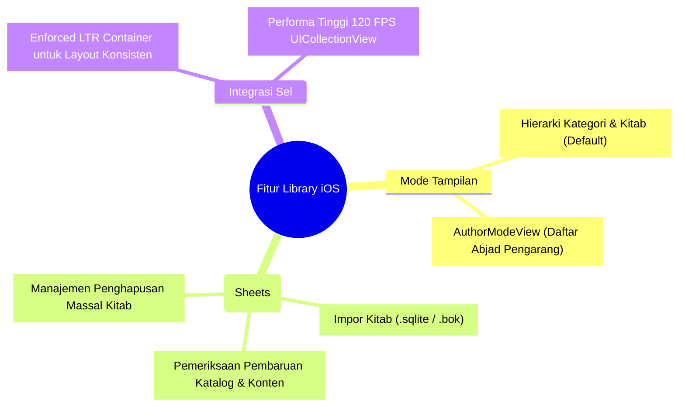
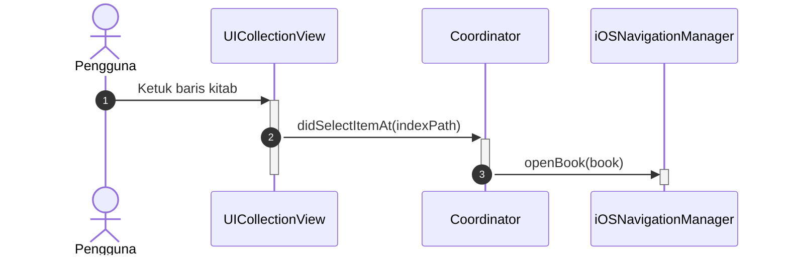
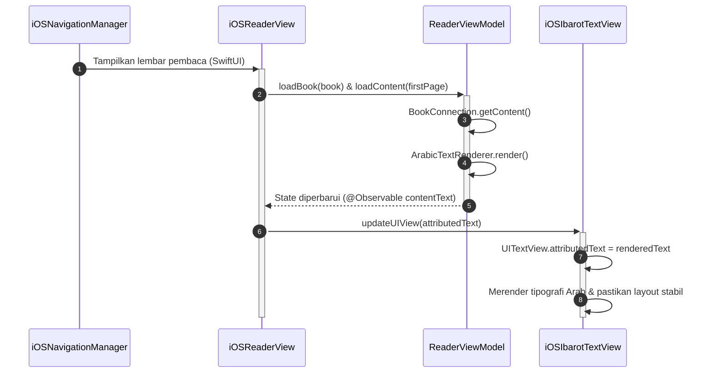

# Library iOS Implementation (SwiftUI & UIKit Bridge)

Pada platform iOS dan iPadOS, modul Library menggabungkan arsitektur deklaratif SwiftUI dengan efisiensi performa UIKit (`UICollectionView`) untuk menangani katalog ribuan kitab secara responsif pada layar ProMotion 120 FPS.

Sumber kode: `Source/Features/Library/iOS/`

---

## 1. Arsitektur Komponen Visual

Arsitektur antarmuka perpustakaan pada iOS memanfaatkan jembatan SwiftUI-UIKit untuk katalog hierarkis:

### A. Hierarki Kontainer Perpustakaan



### B. Arsitektur Sel Kustom Dwiarah (ListContentView)



### C. Taksonomi Lembar Kerja & Mode Tampilan



---

## 2. Alur Interaksi: Dari Aksi Klik Baris Kitab ke TextView

Ketika pengguna mengetuk baris kitab pada `iOSLibraryViewController`:





---

## 3. Bedah Komponen & Logika Antarmuka

### A. Tata Letak Sel: Force LTR StackView (ListContentView)
Aplikasi Maktabah secara global mendukung tipografi Arab (RTL). Namun, pada sel daftar kitab (`ListContentView`), elemen antarmuka dikonfigurasi secara terarah:

```swift
override var effectiveUserInterfaceLayoutDirection: UIUserInterfaceLayoutDirection {
    .leftToRight
}

init(_ configuration: ListContentConfiguration) {
    appliedConfiguration = configuration
    super.init(frame: .zero)
    semanticContentAttribute = .forceLeftToRight
    setupViews()
    apply(configuration)
}
```

* **Alasan Penggunaan Force LTR:**
  * Judul buku berbahasa Arab secara alami mengalir dari kanan ke kiri. Jika seluruh kontainer sel menggunakan mode RTL, kotak centang (*checkbox*) seleksi massal dan ikon unduhan akan terdorong ke posisi kanan, sedangkan *chevron* navigasi berpindah ke kiri.
  * Dengan menerapkan `semanticContentAttribute = .forceLeftToRight` pada `mainStack` dan `leadingStack`, posisi struktural elemen tetap konsisten: *Leading Stack* (*Checkbox* & Ikon Status) selalu di sisi kiri, dan *Chevron* di sisi kanan.
  * Teks Arab judul kitab (`UILabel`) diberi atribut `textAlignment = .right` dengan `contentHuggingPriority(.defaultLow, for: .horizontal)` sehingga teks mengisi ruang kosong dan rata ke kanan secara alami di dalam *stack* LTR tanpa merusak susunan tombol kontrol.

### B. iOSLibraryView (Struct)

* Mengikat *state* secara deklaratif ke `@Bindable var viewModel = navigationManager.libraryViewModel`.
* Mengelola presentasi modal (*sheets*):
  * **Offline Import Sheet (`OfflineImportFormView`)**: Mengimpor berkas kitab `.sqlite` mandiri dari pengelola berkas Files iOS.
  * **Update Sheet (`UpdateView`)**: Memeriksa dan mengunduh pembaruan isi kitab dari GitHub Releases.
  * **Bulk Delete Dialog**: Dialog konfirmasi penghapusan arsip lokal kitab.

### C. LibraryViewControllerWrapper (UIViewControllerRepresentable)

* Menjembatani `iOSLibraryViewController` ke SwiftUI untuk menjamin kestabilan *frame rate* 60–120 FPS saat pengguliran ribuan baris buku.
* Mengisolasi delegasi seleksi buku dan memperbarui status filter pencarian tanpa membuat ulang hierarki *view*.

### D. AuthorModeView (Struct)

* Mode penyajian katalog khusus berdasarkan daftar pengarang (*muallif*) secara kronologis tahun wafat atau abjad.
* Mengadopsi sistem *lazy loading* untuk memuat karya pengarang secara bertahap saat baris digulir.
