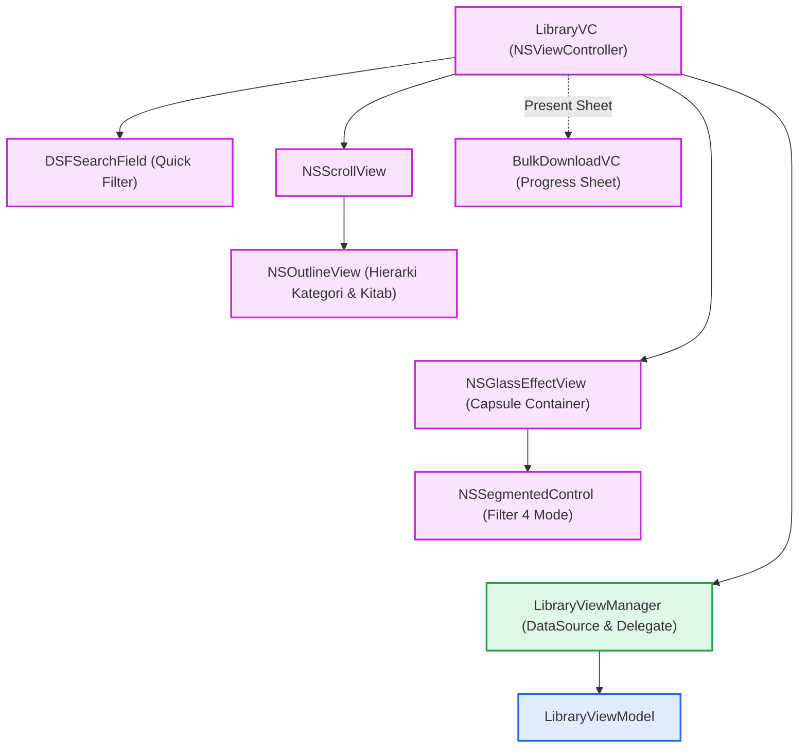
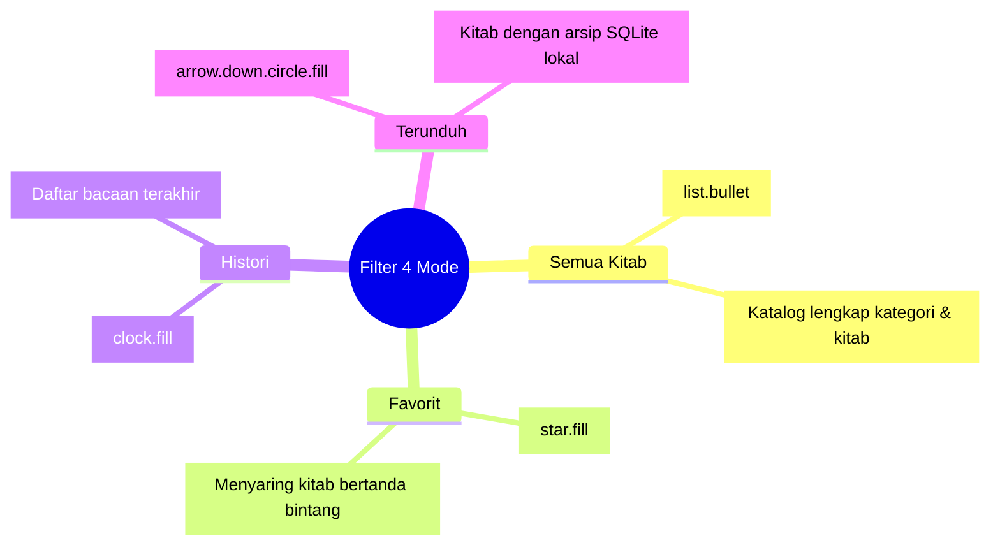
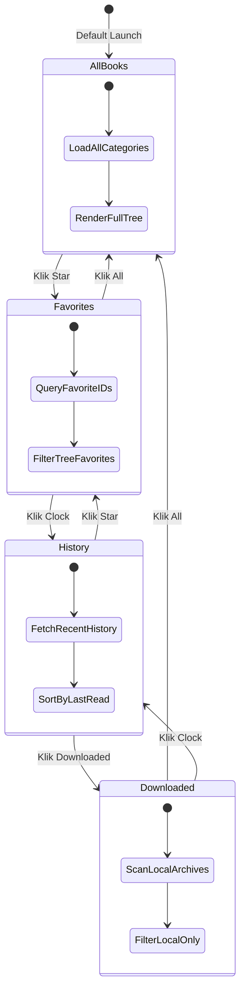
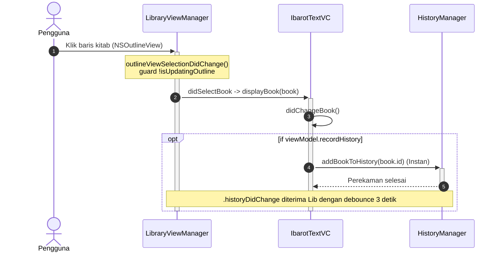
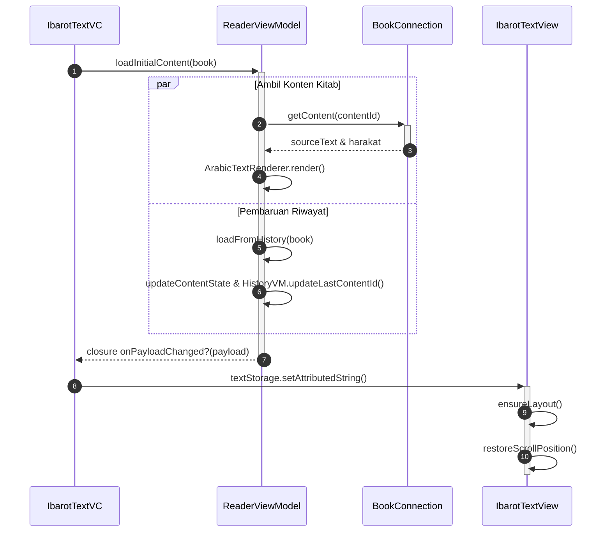

# macOS Implementation (AppKit)

Implementasi antarmuka Library di macOS berpusat pada hierarki `NSOutlineView` yang dioptimalkan untuk performa tinggi saat menampilkan ribuan kitab dan kategori, dilengkapi bilah segmentasi filter 4-mode di bagian bawah panel *sidebar*.

Sumber kode: `Source/Features/Library/macOS/`

---

## 1. Arsitektur Komponen Visual

Arsitektur antarmuka perpustakaan di macOS memisahkan antara kontainer navigasi, presentasi data, dan bilah segmentasi:

### A. Hierarki Kontainer Library

### B. Taksonomi Bilah Segmentasi Bawah 4-Mode

### C. Siklus Transisi Mode Segmentasi

---

## 2. Alur Interaksi: Dari Aksi Klik Baris Kitab ke TextView

Ketika pengguna mengklik salah satu baris kitab di `NSOutlineView`, data mengalir melintasi delegasi hingga dirender pada mesin pembaca:

---

## 3. Bedah Komponen & Logika Antarmuka

### A. Kontainer Segmentasi Bawah 4-Mode (setupFilterSegment)
Di bagian bawah *sidebar*, `LibraryVC` menyematkan bilah segmentasi mengambang berpenampilan kapsul (`NSGlassEffectView` di macOS 26+):

* **Segment 0 (`list.bullet`)**: Menampilkan seluruh katalog pustaka (*All Categories & Books*).
* **Segment 1 (`star.fill`)**: Menyaring hanya kitab yang telah ditandai sebagai favorit oleh pengguna.
* **Segment 2 (`clock.fill`)**: Menyajikan daftar kitab berdasarkan histori bacaan terakhir.
* **Segment 3 (`arrow.down.circle.fill`)**: Mode khusus unduhan (tersedia saat `AppConfig.isUsingBundleMode` aktif) untuk menyaring hanya kitab yang berkas arsip SQLite-nya telah diunduh secara lokal.
* **Manajemen Inset ScrollView (`updateScrollViewConstraint`)**: Ketinggian kontainer kapsul dihitung secara otomatis untuk menyesuaikan `scrollView.contentInsets.bottom` (atau `scrollViewBottomConstraint`), mencegah baris terbawah tabel tertutup oleh tombol segmentasi.

### B. LibraryVC (NSViewController)

* Mengelola siklus hidup tampilan *sidebar*, kaitan *constraint* pencarian, dan inisialisasi awal dataset secara asinkron (`dataVM.prepareData`).
* Mengamati notifikasi `.libraryFolderChanged` untuk mereset seleksi dan memuat ulang struktur direktori saat folder basis data beralih.

### C. LibraryViewManager (Class) & Render Baris Kustom

* Mengimplementasikan `NSOutlineViewDataSource` dan `NSOutlineViewDelegate`.
* Membedakan *rendering* sel induk (kategori kitab yang dapat diekspansi) dengan *child cell* (judul kitab dengan tipografi Arab, nama pengarang, indikator ketersediaan berkas, dan kapasitas MB).
* Menyediakan *context menu* klik kanan: Hapus unduhan arsip lokal, Buka detail informasi kitab (`BookInfoPopoverVC`), dan Tambah/Hapus dari Favorit.
* **Pencegahan Rekursi Seleksi (`isUpdatingOutline`)**: Menjaga agar pembaruan programatis pada outline view (`beginUpdates`, `selectRowIndexes`, `endUpdates`) tidak memicu *event* ganda pada `outlineViewSelectionDidChange`.
* **Preservasi Seleksi Flat List (`restoreFlatSelection`)**: Pada mode daftar datar (seperti hasil filter pencarian dan riwayat), seleksi dipulihkan menggunakan indeks baris langsung (`selectFlatRow`) untuk mencegah hilangnya fokus item yang aktif.

### D. Animasi Batch Inkremental & Debouncing Histori (`LibraryView+Diffing`)
Untuk mencegah *flickering* visual dan lonjakan tampilan (*content jumping*):

* **Sinkronisasi Filter Pencarian**: Pembaruan daftar datar memvalidasi `searchQuery` aktif dan sinkronisasi `baseCategories = displayedCategories`, menjamin hasil filter tetap utuh saat dataset dimutasi.
* **Debounce Pembaruan Histori (3 Detik)**: Notifikasi `.historyDidChange` di-*debounce* selama 3 detik pada `RunLoop.main` sebelum memicu penataan ulang baris. Hal ini mencegah outline view melompat-lompat (*jitter*) ketika pengguna menavigasi beberapa kitab secara cepat, sementara ID kitab tetap tercatat ke basis data histori secara instan.
* **Mutasi Terarah**: Menjalankan mutasi *native* AppKit secara presisi: `outlineView.insertItems(at:inParent:withAnimation:)` dan `outlineView.removeItems(at:inParent:withAnimation:)`.

### E. BulkDownloadVC (NSViewController)

* Panel *sheet* modal yang menampilkan status antrean unduhan kitab massal.
* Memuat bilah progres menyeluruh (*aggregate progress bar*), kecepatan jaringan aktual, dan kontrol jeda/batalkan.
