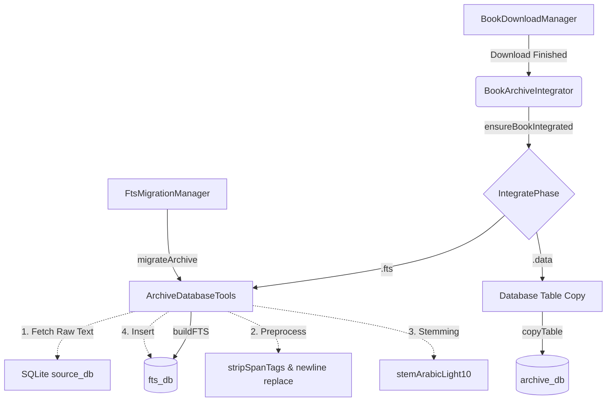

# Dokumentasi Deep-Dive: Indexing FTS dan Stemming

Dokumentasi ini membedah proses teknis pembuatan indeks Full-Text Search (FTS) secara menyeluruh saat sebuah kitab selesai diunduh, maupun saat proses migrasi terjadi.

## Architecture Pipeline

Berikut adalah diagram interaksi komponen yang merepresentasikan jalur integrasi dan indexing FTS:



### Separation of Concerns (Prinsip Pemisahan Tanggung Jawab)

Desain arsitektur FTS Maktabah menerapkan pemisahan yang jelas antara lapisan:

*   **Network & Cache Layer (`BookDownloadManager`)**: Bertanggung jawab murni pada pengambilan data Zstd/SQLite dari jaringan dan dekompresi file.
*   **Coordination Layer (`BookArchiveIntegrator`, `FtsMigrationManager`)**: Mengatur kapan integrasi dan indexing dilakukan, sinkronisasi antar Task/Thread, dan memberikan laporan progres.
*   **Database & Core Engine (`ArchiveDatabaseTools`)**: Menyediakan primitif operasi SQLite mentah, kompresi blob, stemming teks Arab, dan pembuatan struktur tabel virtual FTS5.

## Bedah Komponen Teknis

### 1. `BookArchiveIntegrator`

Komponen ini mengatur integrasi kitab individu yang baru selesai diunduh.

#### Struct & Class

```swift
actor BookArchiveSingleFlight {
    static let shared = BookArchiveSingleFlight()
    private var bookTasks: [Int: Task<Void, Error>] = [:]
    private var archiveTail: [Int: Task<Void, Error>] = [:]
    // (1)!
}

final class BookArchiveIntegrator: @unchecked Sendable {
    static let shared = BookArchiveIntegrator()
    private let pendingVacuumArchiveIds: Set<Int>
    // (2)!
}
```

1.  `BookArchiveSingleFlight` memastikan deduplikasi (satu kitab tidak diindeks dua kali bersamaan) dan serialisasi per-archive.
2.  Menggunakan atribut `@unchecked Sendable` karena state mutablenya dijaga oleh struktur internal atau dijalankan pada antrian khusus.

#### Enum & Status

```swift
enum IntegratePhase {
    case fts
    case data
}
```

*   `fts`: Menandakan mesin sedang mem-parsing dan membuat indeks FTS.
*   `data`: Menandakan mesin sedang menyalin tabel data utama.

```swift
enum BookArchiveIntegrateError: LocalizedError {
    case invalidArchiveId(Int)
    case sourceTableMissing(String)
    case fileReplacementFailed(String)
}
```

*   Menyimpan representasi *error* terstruktur dengan `LocalizedError` saat validasi sumber gagal atau pergantian *database file* rusak.

### 2. `ArchiveDatabaseTools`

Menangani operasi primitif SQLite, termasuk fase membaca baris teks, melakukan *stemming*, dan menulisnya ke FTS5.

#### Struct

```swift
struct TableColumnInfo {
    let name: String
    let type: String
    let isPrimaryKey: Bool
}
```

*   Digunakan untuk introspeksi kolom dinamis, memastikan skema tabel `main` bisa di-*copy* dengan sempurna sebelum indexing.

#### Optimasi Khusus

*   **String Interning & Binding Cepat**:

    ```swift
    static let sqliteTransient = unsafeBitCast(
        OpaquePointer(bitPattern: -1),
        to: sqlite3_destructor_type.self
    )
    ```

    Konstanta ini digunakan saat melakukan `sqlite3_bind_text`. Daripada SQLite membuat salinan string (yang memakan banyak RAM), ia menggunakan `SQLITE_TRANSIENT` pointer agar lebih efisien memori.

*   **Transaction Wrapper (`withTransaction`)**:
    Seluruh iterasi row insertion dibungkus dalam `BEGIN TRANSACTION` dan `COMMIT`. Tanpa transaksi eksplisit, SQLite akan membuat *journal* per instruksi insert, yang membuat disk I/O sangat lambat.

*   **Memory Management (`autoreleasepool`)**:
    Pada metode `processFtsRows`, setiap row diproses di dalam *block* `autoreleasepool`. Ini mencegah *memory spike* saat membaca ratusan ribu baris yang menghasilkan string sementara (hasil stemming).

*   **Normalisasi Teks Arab**:
    Teks dibersihkan menggunakan metode berantai `replacing("\n", with: " ").stripSpanTags()`, lalu diproses puncaknya pada algoritma `stemArabicLight10()`. Ini membuang harakat, tasydid, dan mengubah angka Arab agar indeks konsisten.

### 3. `FtsMigrationManager`

Berperan ketika pengguna memutakhirkan aplikasi dan format FTS lama terdeteksi (versi < 2).

#### Struct

```swift
private struct MigrationPaths: Sendable {
    let archiveOrig: String
    let ftsOrig: String
    let archiveWrite: String
    let ftsWrite: String
}
```

*   Menyimpan jalur awal dan sementar (temporary) untuk menulis *database*. `Sendable` memastikan data ini aman dikirim ke task konkurensi di *TaskGroup*.

#### Optimasi Khusus

*   **Concurrency Limits**:
    Migrasi massal dibatasi lewat perhitungan optimal `maxConcurrent = min(4, max(2, ProcessInfo.processInfo.activeProcessorCount))` agar tidak menyebabkan *Memory Warning*.

*   **Pragma Tuning**:
    Memberikan instruksi sementara ke SQLite untuk mematikan sinkronisasi I/O:

    ```swift
    PRAGMA synchronous = OFF;
    PRAGMA journal_mode = MEMORY;
    PRAGMA temp_store = MEMORY;
    ```

### 4. `BookDownloadManager`

Mengelola perolehan data awal.

#### Struct

```swift
struct BundleBookIndexEntry: Decodable {
    let bkid: Int
    let filename: String
    let release: String
    let sizeZst: Int64?

    enum CodingKeys: String, CodingKey {
        case bkid
        case filename
        case release
        case sizeZst = "size_zst"
    }
}
```

*   `CodingKeys` digunakan untuk memetakan nama key JSON eksternal (`size_zst`) ke *camelCase* milik Swift (`sizeZst`).

## Platform Specific Handling

Dalam hal manajemen background, setiap OS ditangani sesuai kemampuannya:

=== "macOS"

    Operasi background tidak membutuhkan interupsi spesifik `beginBackgroundTask` karena macOS secara *inherent* membiarkan proses *Task* berjalan hingga tuntas atau aplikasi ditutup secara manual.

=== "iOS"

    Membutuhkan implementasi khusus `UIApplication.shared.beginBackgroundTask`. Terdapat risiko jika migrasi sangat lambat, iOS akan menghentikan proses sebelum selesai. Manager juga memastikan `isIdleTimerDisabled = true` agar layar perangkat tidak tertidur selama proses berjalan.

!!! note "Status Integrasi"
    Proses integrasi dan indexing akan dieksekusi secara otomatis usai integrasi arsip. Status dan cache lalu disinkronkan melalui notifikasi UI.

!!! warning "Potensi Memory Spike"
    Hindari mencabut pengaman `autoreleasepool` pada iterasi FTS karena memori akan meningkat linear sesuai besaran kitab raksasa yang diurai teksnya.
