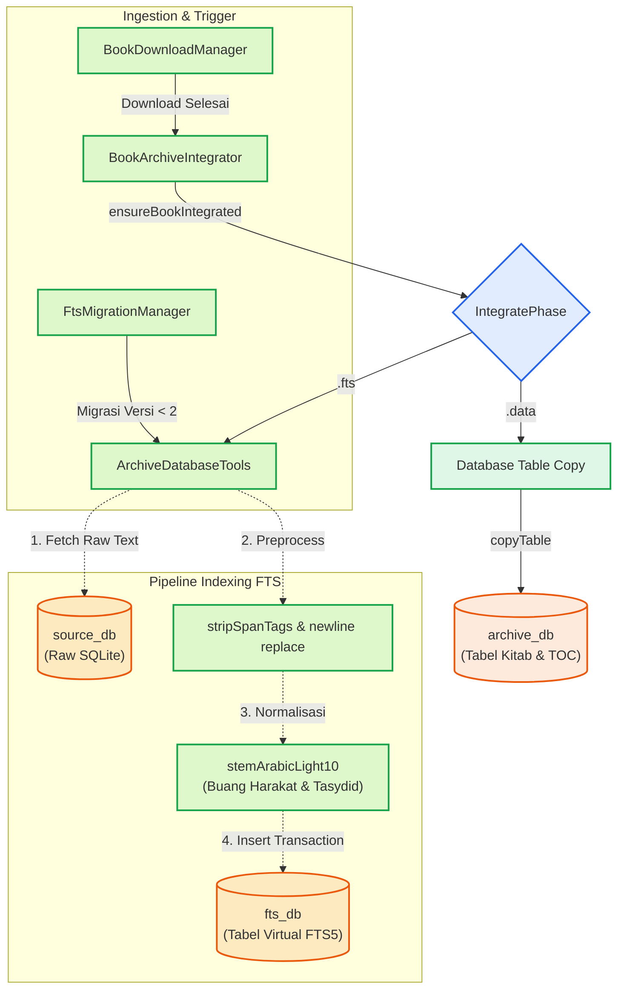

# Dokumentasi Deep-Dive: Indexing FTS dan Stemming

Dokumentasi ini membedah proses teknis pembuatan indeks *Full-Text Search* (FTS) secara menyeluruh saat sebuah kitab selesai diunduh maupun saat proses migrasi berlangsung.

## Alur Arsitektur (*Architecture Pipeline*)

Berikut adalah diagram interaksi komponen yang merepresentasikan jalur integrasi dan *indexing* FTS:



### Separation of Concerns (Prinsip Pemisahan Tanggung Jawab)

Desain arsitektur FTS Maktabah menerapkan pemisahan yang jelas antar-lapisan:

*   **Network & Cache Layer (`BookDownloadManager`)**: Bertanggung jawab secara spesifik pada pengambilan data Zstd/SQLite dari jaringan dan dekompresi berkas.
*   **Coordination Layer (`BookArchiveIntegrator`, `FtsMigrationManager`)**: Mengatur waktu eksekusi integrasi dan *indexing*, sinkronisasi antar-*Task/Thread*, serta pelaporan progres.
*   **Database & Core Engine (`ArchiveDatabaseTools`)**: Menyediakan operasi primitif SQLite, kompresi blob, *stemming* teks Arab, dan pembuatan struktur tabel virtual FTS5.

## Bedah Komponen Teknis

### 1. BookArchiveIntegrator (Class)

Komponen ini mengatur integrasi kitab individual yang baru selesai diunduh.

#### Struct & Class

```swift
actor BookArchiveSingleFlight {
    static let shared = BookArchiveSingleFlight()
    private var bookTasks: [Int: Task<Void, Error>] = [:]
    private var archiveTail: [Int: Task<Void, Error>] = [:]
    // (1)!
}

final class BookArchiveIntegrator: @unchecked Sendable {
    static let shared = BookArchiveIntegrator()
    private let pendingVacuumArchiveIds: Set<Int>
    // (2)!
}
```

1.  `BookArchiveSingleFlight` memastikan deduplikasi (satu kitab tidak diindeks dua kali secara bersamaan) dan serialisasi per-arsip.
2.  Menggunakan atribut `@unchecked Sendable` karena *mutable state*-nya dilindungi oleh struktur internal atau dijalankan pada antrean khusus.

#### Enum & Status

```swift
enum IntegratePhase {
    case fts
    case data
}
```

*   `fts`: Menandakan mesin sedang mem-*parsing* dan membuat indeks FTS.
*   `data`: Menandakan mesin sedang menyalin tabel data utama.

```swift
enum BookArchiveIntegrateError: LocalizedError {
    case invalidArchiveId(Int)
    case sourceTableMissing(String)
    case fileReplacementFailed(String)
}
```

*   Menyimpan representasi *error* terstruktur dengan `LocalizedError` saat validasi sumber gagal atau pergantian berkas basis data bermasalah.

### 2. ArchiveDatabaseTools (Class)

Menangani operasi primitif SQLite, termasuk fase membaca baris teks, menjalankan *stemming*, dan menulisnya ke FTS5.

#### TableColumnInfo (Struct)

```swift
struct TableColumnInfo {
    let name: String
    let type: String
    let isPrimaryKey: Bool
}
```

*   Digunakan untuk introspeksi kolom dinamis, memastikan skema tabel `main` dapat disalin secara akurat sebelum *indexing*.

#### Optimasi Khusus

*   **String Interning & Binding Cepat**:

    ```swift
    static let sqliteTransient = unsafeBitCast(
        OpaquePointer(bitPattern: -1),
        to: sqlite3_destructor_type.self
    )
    ```

    Konstanta ini digunakan saat melakukan `sqlite3_bind_text`. Dibandingkan membuat salinan *string* baru yang memakan memori RAM, sistem menggunakan pointer `SQLITE_TRANSIENT` agar lebih efisien.

*   **Transaction Wrapper (`withTransaction`)**:
    Seluruh iterasi penyisipan baris dibungkus dalam `BEGIN TRANSACTION` dan `COMMIT`. Tanpa transaksi eksplisit, SQLite akan membuat *journal file* terpisah untuk setiap instruksi *insert*, yang menyebabkan disk I/O lambat.

*   **Memory Management (`autoreleasepool`)**:
    Pada metode `processFtsRows`, setiap baris diproses di dalam blok `autoreleasepool`. Ini mencegah lonjakan alokasi memori (*memory spike*) saat membaca ratusan ribu baris yang menghasilkan *string* sementara.

*   **Normalisasi Teks Arab**:
    Teks dibersihkan menggunakan metode berantai `replacing("\n", with: " ").stripSpanTags()`, lalu diproses oleh algoritma `stemArabicLight10()`. Algoritma ini menghapus harakat, tasydid, dan menormalisasi glif Arab agar indeks pencarian konsisten.

### 3. FtsMigrationManager (Class)

Berperan ketika pengguna memutakhirkan aplikasi dan terdeteksi format FTS versi terdahulu (versi < 2).

#### MigrationPaths (Struct)

```swift
private struct MigrationPaths: Sendable {
    let archiveOrig: String
    let ftsOrig: String
    let archiveWrite: String
    let ftsWrite: String
}
```

*   Menyimpan jalur awal dan sementara untuk penulisan basis data. Tipe `Sendable` memastikan data ini aman dikirim ke konkurensi di `TaskGroup`.

#### Optimasi Khusus

*   **Concurrency Limits**:
    Migrasi massal dibatasi lewat kalkulasi adaptif `maxConcurrent = min(4, max(2, ProcessInfo.processInfo.activeProcessorCount))` agar tidak memicu peringatan keterbatasan memori (*Memory Warning*).

*   **Pragma Tuning**:
    Memberikan instruksi sementara ke SQLite untuk menonaktifkan sinkronisasi disk I/O yang berat selama migrasi:

    ```swift
    PRAGMA synchronous = OFF;
    PRAGMA journal_mode = MEMORY;
    PRAGMA temp_store = MEMORY;
    ```

### 4. BookDownloadManager (Class)

Mengelola perolehan data awal.

#### BundleBookIndexEntry (Struct)

```swift
struct BundleBookIndexEntry: Decodable {
    let bkid: Int
    let filename: String
    let release: String
    let sizeZst: Int64?

    enum CodingKeys: String, CodingKey {
        case bkid
        case filename
        case release
        case sizeZst = "size_zst"
    }
}
```

*   `CodingKeys` memetakan nama *key* JSON eksternal (`size_zst`) ke format *camelCase* Swift (`sizeZst`).

## Penanganan Khusus Platform (Platform Specific Handling)

Dalam hal manajemen latar belakang (*background task*), setiap sistem operasi ditangani secara spesifik:

=== "macOS"

    Operasi latar belakang tidak membutuhkan pendaftaran eksplisit `beginBackgroundTask` karena macOS secara bawaan membiarkan proses `Task` berjalan hingga selesai atau aplikasi ditutup oleh pengguna.

=== "iOS"

    Membutuhkan implementasi `UIApplication.shared.beginBackgroundTask`. Terdapat batasan waktu eksekusi latar belakang oleh iOS. Manajer juga mengatur `isIdleTimerDisabled = true` agar layar perangkat tidak masuk ke mode tidur (*sleep*) selama proses migrasi aktif.

!!! note "Status Integrasi"
    Proses integrasi dan *indexing* dieksekusi secara otomatis usai integrasi arsip. Status dan *cache* kemudian disinkronkan melalui notifikasi UI.

!!! warning "Pencegahan Lonjakan Memori"
    Pertahankan blok pelindung `autoreleasepool` pada iterasi FTS agar memori tidak meningkat secara linear saat mengurai teks kitab berukuran besar.
