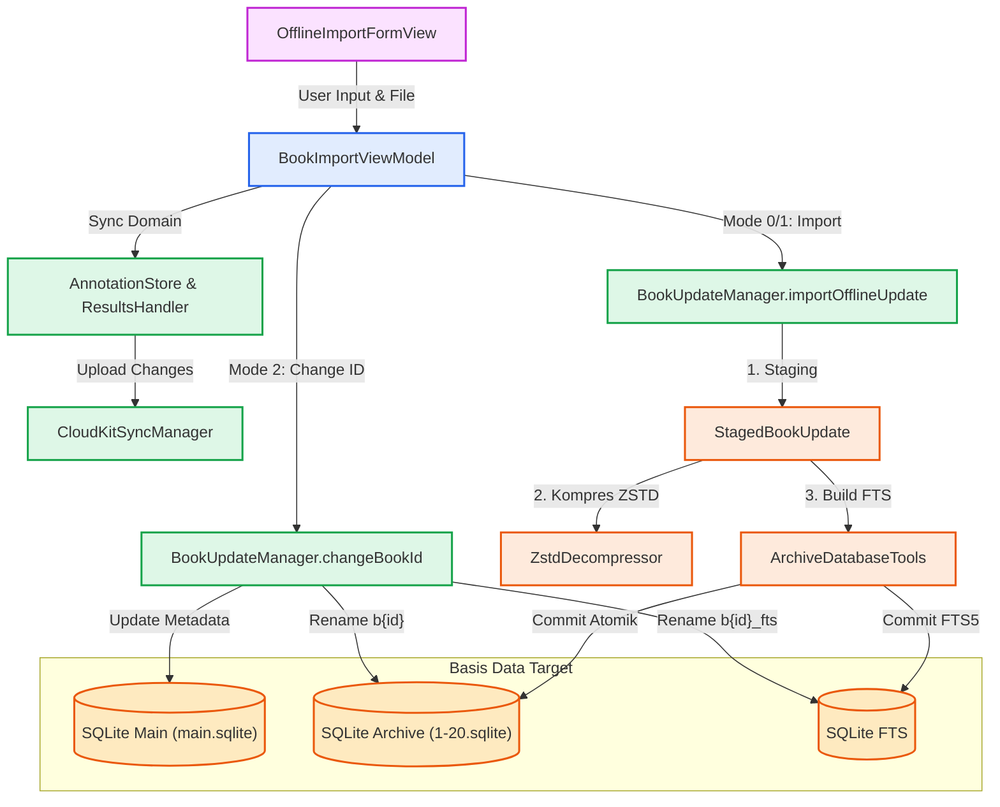
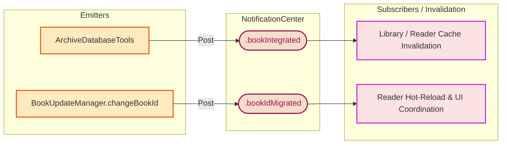

# Dokumentasi Proses Book Import & Offline Import

Proses ini menangani mekanisme impor kitab secara luring (*offline*), penggantian (*replace*) kitab, serta pengubahan identitas kitab (*change book ID*) secara aman tanpa menghilangkan data pengguna yang berharga (seperti anotasi dan *bookmark*). Dokumentasi ini membedah arsitektur secara mendalam (*deep-dive*) untuk memastikan pengembang dapat memahami *pipeline* secara utuh.

## Alur Arsitektur (*Architecture Pipeline*)

Alur kerja untuk memproses buku baru maupun pembaruan melibatkan antarmuka pengguna, lapisan *ViewModel*, dan subsistem sinkronisasi sebelum dieksekusi oleh mesin basis data SQLite.

### Diagram Interaksi Komponen

### 1. Data Pipeline & Persistence



### 2. Event Dispatch & Invalidation



### Prinsip Pemisahan Tanggung Jawab (Separation of Concerns)

Sistem pembaruan pustaka Maktabah dirancang dengan batasan tanggung jawab yang ketat:

1. **View Layer (`OfflineImportFormView`)**
    Fokus utama pada antarmuka *SwiftUI*. Menampilkan formulir input, menangani pemilihan berkas (`.fileImporter`), dan menangani interaksi pengguna tanpa logika basis data langsung.

2. **ViewModel Layer (`BookImportViewModel`)**
    Mengelola kondisi tampilan (*state*) dan memvalidasi interaksi. ViewModel menentukan kapan memanggil fungsi penggantian ID versus kapan mengimpor data baru, lalu meminta subsistem sinkronisasi (`CloudKitSyncManager`) untuk mencadangkan hasil mutasi lokal.

3. **Core Database Engine (`BookUpdateManager`)**
    Sebagai mesin utama yang mengeksekusi *raw SQL query*. Mesin ini menangani operasi seperti melampirkan (*attach*) *database* ganda, membuat tabel FTS sementara, menukar nama tabel, hingga membersihkan berkas setelah transaksi selesai.

### Alur Impor (Import Pipeline)

Proses impor buku dari berkas sistem pengguna berjalan melalui tahapan yang dirancang agar memiliki ketahanan terhadap kegagalan parsial:

1. **Pemilihan Berkas dan Staging**
    Pengguna memilih berkas SQLite. `OfflineImportFormView` mengamankan akses berkas (`startAccessingSecurityScopedResource`) lalu menyalin berkas ke direktori kerja sementara (*temporary directory*).

2. **Ekstraksi Metadata dan Persiapan (Preparation)**
    Fungsi `importOfflineUpdate` dipanggil. Sistem mengekstrak `BookMetadata` langsung dari berkas sumber. Berkas tersebut kemudian disiapkan menjadi berkas arsip (untuk konten dan TOC) serta berkas *FTS Source* (tabel sumber agar mesin FTS dapat membaca teks lengkap).

3. **Kompresi Konten Zstandard (Data Conversion)**
    Mesin memindai kolom teks. Setiap teks dikonversi menjadi BLOB menggunakan Zstandard (`ZstdDecompressor`). Tabel sementara (`_zstd`) dibangun lalu namanya dikembalikan menjadi `b{id}`.

4. **Integrasi ke Archive Database (Build & Replace)**
    Fungsi `replaceArchiveDatabase` dipanggil secara atomik:

    *   Menjalankan `ATTACH DATABASE` untuk `source_db` (asal), `fts_source_db` (teks belum dikompresi), dan `fts_db` (tabel pencarian target).
    *   Tabel data utama (`b{id}`) dan TOC (`t{id}`) disalin dalam satu sesi transaksi (*transaction*).
    *   Tabel `b{id}_fts` dibangun dari `fts_source_db` dan dimasukkan ke `fts_db` terpisah agar performa pencarian FTS5 tetap optimal.

5. **Finalisasi (Checkpoint & Notification)**
    Sistem merilis (*detach*) basis data dan memicu *checkpoint* pada *Write-Ahead Logging* (WAL). Kemudian, notifikasi `.bookIntegrated` dipancarkan melalui `NotificationCenter` agar *cache* pembaca memuat ulang buku tersebut.

### Metode Manipulasi Database

Terdapat tiga mode operasi utama yang dijalankan tergantung pada nilai `importMode`:

*   **Mode 0 (New) & Mode 1 (Replace)**
    Mengandalkan `importOfflineUpdate`. Pada mode ini, basis data dimigrasikan secara penuh dan tabel yang sudah ada sebelumnya akan ditimpa. Metode ini mengeksekusi klausa SQL `DROP TABLE IF EXISTS` dan merekonstruksi FTS dari awal.

*   **Mode 2 (Change Book ID)**
    Sistem mengeksekusi `changeBookId(oldId:newId:)`. Mode ini tidak memindahkan teks atau mengubah Zstandard.

    *   Tahapan dimulai dengan mengambil lokasi berkas arsip (misalnya `20.sqlite`) di dalam basis data utama.
    *   Mengeksekusi `ALTER TABLE "b{oldId}" RENAME TO "b{newId}";` serta hal yang sama untuk tabel TOC (`t{oldId}`).
    *   Jika gagal di tengah proses, perubahan pada tabel akan dikembalikan ke nama semula (*rollback*).
    *   Jika berhasil, tabel FTS di dalam berkas independen FTS akan diubah namanya: `ALTER TABLE "b{oldId}_fts" RENAME TO "b{newId}_fts";`.
    *   Terakhir, rekaman sinkronisasi anotasi dan riwayat membaca diperbarui ke ID baru lalu dikirim ke CloudKit.

!!! note "Pemisahan FTS Source"
    Tabel data arsip menyimpan teks dalam format kompresi Zstandard (tipe data BLOB). Namun, mekanisme internal *Full-Text Search* SQLite tidak dapat mengindeks teks yang terkompresi secara langsung. Oleh karena itu, sistem mempertahankan berkas sementara (`fts_source_db`) bertipe teks murni agar mesin FTS dapat membangun indeks *Virtual Table* sebelum berkas sementara tersebut dihapus.

## Bedah Komponen dan Struktur Data

Bagian ini mendokumentasikan tipe objek utama secara rinci.

### 1. View Layer

#### OfflineImportFormView (Struct)

Tampilan utama berbasis form yang kompatibel di macOS dan iOS. Memanfaatkan `@State` untuk membungkus `BookImportViewModel`.

=== "macOS"

    ```swift
    Form {
        bookInformationSection
        authorInformationSection
    }
    .safeAreaInset(edge: .top, spacing: 0) {
        topHeaderView
    }
    .safeAreaInset(edge: .bottom, spacing: 0) {
        bottomActionView
    }
    ```

=== "iOS"

    ```swift
    Form {
        Section { headerContent }
        bookInformationSection
        authorInformationSection
        Section { actionButtons }
    }
    ```

Fitur utama tampilan ini adalah *file picker* (`fileImporter`), pengecekan validasi ID interaktif, dan pembaruan antarmuka secara adaptif berdasarkan nilai `importMode`.

### 2. ViewModel Layer

#### BookImportViewModel (Class)

ViewModel berbasis `Observation` (menggunakan makro `@Observable` dan anotasi `@unchecked Sendable`).

```swift
@Observable
final class BookImportViewModel: @unchecked Sendable {
    var sqliteURL: URL? // (1)!
    var isImporting: Bool = false
    var importMode: Int = 0 // (2)!
    var selectedBookId: Int?

    // Identitas Kitab
    var bookName: String = ""
    var categoryId: Int = 0
    var archiveId: Int = 20
    var customBookIdText: String = "" // (3)!

    // Status Pemeriksaan Anotasi
    var newIdAnnotationCount: Int = 0

    // Computed Properties
    var isValid: Bool { get }
}
```

1. Berisi URL dari berkas lokal yang telah disalin ke direktori sementara (*temporary*).
2. Mode operasi: `0` = Buku Baru, `1` = Timpa Buku, `2` = Ganti ID Kitab.
3. ID buku tujuan, ditampung sebagai *string* untuk masukan *TextField* sebelum divalidasi menjadi integer.

ViewModel ini memanggil `executeDatabaseChanges(oldId:newId:)` pada proses *Change ID*, yang memicu tiga panggilan berurutan secara transaksional di *background thread*:

1. `BookUpdateManager.shared.changeBookId`
2. `AnnotationStore.shared.updateAnnotationsBookId`
3. `ResultsHandler.shared.migrateBookId`

### 3. Manager & Database Engine

#### BookUpdateManager (Class)

Manajer tunggal (*singleton*) yang bertanggung jawab atas proses SQL level rendah.

#### StagedBookUpdate (Struct)

*Struct* perantara yang menyatukan artefak pembaruan buku sebelum operasi *replace* atau ekspor dijalankan.

```swift
struct StagedBookUpdate: Sendable {
    let entry: BookIndexEntry // (1)!
    let metadata: BookMetadata // (2)!
    let downloadedBookURL: URL // (3)!
    let ftsSourceURL: URL // (4)!
    let authorContext: AuthorContext? // (5)!
    let workingDirectory: URL
}
```

1. Informasi buku tingkat katalog (nama kitab, kategori, ukuran berkas).
2. Metadata lengkap isi buku (versi, betaka, nama tafsir).
3. URL berkas yang berisi basis data konten Zstandard.
4. URL berkas sekunder untuk indeks FTS teks mentah.
5. Konteks pengarang terkait (bisa bernilai `nil` jika data pengarang sudah ada atau tidak didefinisikan).

#### AuthorContext (Struct)

```swift
struct AuthorContext: Sendable {
    let authId: Int
    let versionName: Int64
    let downloadURL: URL
}
```

*Struct* pembantu untuk mengambil, mengunduh, atau mengonfirmasi keberadaan data pengarang di `special.sqlite` guna mencegah *orphan records*.

#### BookVersionState (Enum)

Representasi status versi buku di basis data lokal:

```swift
enum BookVersionState: Sendable {
    case notInLibrary // (1)!
    case unknownVersion // (2)!
    case version(Int64) // (3)!

    var existsInLibrary: Bool { ... }
    var currentVersion: Int64? { ... }
}
```

1. ID Buku tidak terdaftar di direktori lokal.
2. Buku ada, namun tidak memiliki metadata baris versi (skema lawas).
3. Buku terdaftar bersama versi numeriknya.

### 4. Manajemen Status dan Notifikasi (Notification Events)

Sistem menggunakan `NotificationCenter` untuk mengoordinasikan subsistem setelah mutasi SQLite selesai:

*   `Notification.Name.bookIntegrated`:
    Dipicu dari dalam `BookUpdateManager.replaceArchiveDatabase` dengan *payload* ID buku. Komponen pendengar (`BookPageCache`, UI Library) akan membuang *cache in-memory* dan memuat ulang data terbaru.

*   `Notification.Name.bookIdMigrated`:
    Dipicu dari `BookImportViewModel.performChangeBookId` dengan *dictionary* `oldId` dan `newId`. Fitur Reader yang sedang membuka buku dengan `oldId` akan mendeteksi perubahan ini dan memperbarui posisinya ke ID baru secara otomatis (*hot-reload*).

!!! warning "Peringatan Migrasi CloudKit"
    Ketika `changeBookId` dijalankan, `BookImportViewModel` memicu unggahan anotasi (`CloudKitSyncManager.shared.upload(annotations:)`). Jika perangkat dalam kondisi luring (tanpa koneksi internet), pengelola sinkronisasi akan menyimpan status di antrean sinkronisasi luring (*offline queue / pending sync zone*) agar tidak hilang saat aplikasi ditutup.
