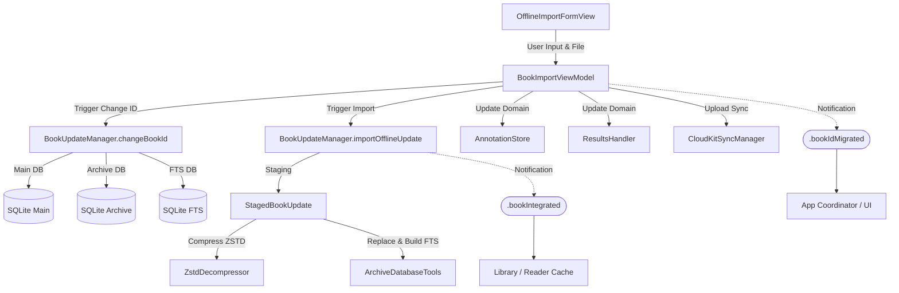

# Dokumentasi Proses Book Import & Offline Import

Proses ini menangani mekanisme impor kitab secara luring (*offline*), penggantian (*replace*) kitab, serta pengubahan identitas kitab (*change book ID*) secara aman tanpa menghilangkan data pengguna yang berharga (seperti anotasi dan *bookmark*). Dokumentasi ini membedah arsitektur secara mendalam (*deep-dive*) untuk memastikan pengembang dapat memahami pipeline secara utuh.

## Architecture Pipeline

Alur kerja untuk memproses buku baru maupun pembaruan melibatkan antarmuka pengguna, lapisan *ViewModel*, dan subsistem sinkronisasi sebelum akhirnya dikerjakan oleh mesin basis data SQLite.

### Diagram Interaksi Komponen



### Prinsip Pemisahan Tanggung Jawab (Separation of Concerns)

Sistem pembaruan pustaka Maktabah dirancang dengan batasan tanggung jawab yang ketat:

1. **View Layer (`OfflineImportFormView`)**
    Fokus utama pada antarmuka *SwiftUI*. Menampilkan kolom form, menangani pemilihan file (`.fileImporter`), dan menangani interaksi pengguna. Tidak ada logika *database* yang berjalan di sini.

2. **ViewModel Layer (`BookImportViewModel`)**
    Mengelola kondisi tampilan (*state*) dan memvalidasi interaksi. ViewModel memutuskan kapan memanggil fungsi penggantian ID versus kapan mengimpor data baru, lalu meminta subsistem sinkronisasi (`CloudKitSyncManager`) untuk mencadangkan hasil mutasi lokal.

3. **Core Database Engine (`BookUpdateManager`)**
    Sebagai mesin utama yang mengeksekusi *raw SQL query*. Mesin ini menanggung beban paling berat seperti melampirkan (*attach*) *database* ganda, membuat tabel FTS sementara, menukar nama tabel, hingga membersihkan berkas usai transaksi selesai.

### Alur Import (Import Pipeline)

Proses impor buku dari *file* sistem pengguna berjalan melalui tahapan yang dirancang agar kebal (*resilient*) terhadap kegagalan sebagian:

1. **Pemilihan File dan Staging**
    Pengguna memilih *file* SQLite. `OfflineImportFormView` mengamankan akses file (`startAccessingSecurityScopedResource`) lalu menyalin file ke folder sementara (*temporary directory*).

2. **Ekstraksi Metadata dan Persiapan (Preparation)**
    Fungsi `importOfflineUpdate` dipanggil. Sistem akan mengekstrak `BookMetadata` langsung dari berkas sumber. File tersebut kemudian dipisah menjadi *file archive* (untuk konten dan TOC) serta *file FTS Source* (tabel sumber agar mesin FTS bisa membaca nass utuh).

3. **Kompresi Konten ZSTD (Data Conversion)**
    Mesin akan memindai kolom nass. Karena ukuran nass bisa sangat besar, setiap nass dikonversi menjadi BLOB menggunakan Zstandard (`ZstdDecompressor`). Tabel sementara (`_zstd`) dibangun lalu namanya dikembalikan menjadi `b{id}`.

4. **Integrasi ke Archive Database (Build & Replace)**
    Fungsi `replaceArchiveDatabase` dipanggil secara atomik:

    *   Fungsi ini melakukan `ATTACH DATABASE` untuk `source_db` (asal), `fts_source_db` (nass belum dikompres), dan `fts_db` (tabel pencarian target).
    *   Tabel data utama (`b{id}`) dan TOC (`t{id}`) disalin (*copy table*) dalam satu sesi *Transaction*.
    *   Tabel `b{id}_fts` dibangun dari `fts_source_db` dan dimasukkan ke `fts_db` yang terpisah agar performa pencarian FTS5 tetap tinggi.

5. **Finalisasi (Checkpoint & Notification)**
    Sistem merilis (*detach*) *database* dan memaksa *Write-Ahead Logging* (WAL) untuk melakukan *checkpoint*. Kemudian, notifikasi `NotificationCenter` (yakni `.bookIntegrated`) dipancarkan agar Cache pembaca memuat ulang buku tersebut.

### Metode Manipulasi Database

Terdapat tiga metode utama yang dijalankan oleh pengguna, tergantung pada `importMode`:

*   **Mode 0 (New) & Mode 1 (Replace)**
    Mengandalkan `importOfflineUpdate`. Pada mode ini, *database* dimigrasi utuh dan tabel yang sebelumnya sudah ada akan ditimpa. Metode ini mengeksekusi klausa SQL `DROP TABLE IF EXISTS` dan merekonstruksi FTS secara penuh dari nol.

*   **Mode 2 (Change Book ID)**
    Sistem mengeksekusi `changeBookId(oldId:newId:)`. Mode ini tidak memindahkan teks atau mengubah ZSTD.

    *   Tahapan dimulai dengan mengambil lokasi berkas `Archive` (misal `20.sqlite`) di dalam pangkalan data utama.
    *   Mengeksekusi `ALTER TABLE "b{oldId}" RENAME TO "b{newId}";` serta hal yang sama untuk tabel TOC (`t{oldId}`).
    *   Jika gagal di tengah jalan (misalnya tabel `t` gagal diganti), tabel `b` akan dikembalikan ke nama semula (*rollback*).
    *   Jika berhasil, tabel FTS di dalam berkas independen FTS akan diubah dengan kueri serupa: `ALTER TABLE "b{oldId}_fts" RENAME TO "b{newId}_fts";`.
    *   Terakhir, kolom sinkronisasi anotasi dan riwayat membaca dipanggil untuk mencerminkan ID baru lalu didorong ke CloudKit.

!!! note "Kenapa FTS Source Dipisahkan?"
    Tabel data (*Archive*) menyimpan teks dalam format kompresi ZSTD (tipe data BLOB). Namun, mekanisme internal *Full-Text Search* SQLite tidak bisa melakukan pencarian teks yang terkompresi. Oleh karena itu, kita mempertahankan file sementara (`fts_source_db`) yang masih bertipe TEXT murni agar *engine* FTS bisa membangun indeks *Virtual Table* sebelum file sementara tersebut dihancurkan.

## Bedah Komponen dan Struktur Data

Bagian ini membedah kode sumber, mendokumentasikan setiap tipe objek penting secara rinci.

### 1. View Layer

#### `OfflineImportFormView`

Tampilan utama berbasis form yang kompatibel di macOS dan iOS. Memanfaatkan `@State` untuk membungkus `BookImportViewModel`.

=== "macOS"

    ```swift
    Form {
        bookInformationSection
        authorInformationSection
    }
    .safeAreaInset(edge: .top, spacing: 0) {
        topHeaderView
    }
    .safeAreaInset(edge: .bottom, spacing: 0) {
        bottomActionView
    }
    ```

=== "iOS"

    ```swift
    Form {
        Section { headerContent }
        bookInformationSection
        authorInformationSection
        Section { actionButtons }
    }
    ```

Fitur utama tampilan ini adalah *file picker* (`fileImporter`), pengecekan validasi ID interaktif (*status badge* berwarna merah atau jingga), dan pembaruan antarmuka secara adaptif berdasarkan nilai `importMode`.

### 2. ViewModel Layer

#### `BookImportViewModel`

ViewModel berbasis `Observation` (menggunakan makro `@Observable` dan anotasi `@unchecked Sendable`).

```swift
@Observable
final class BookImportViewModel: @unchecked Sendable {
    var sqliteURL: URL? // (1)!
    var isImporting: Bool = false
    var importMode: Int = 0 // (2)!
    var selectedBookId: Int?

    // Identitas Kitab
    var bookName: String = ""
    var categoryId: Int = 0
    var archiveId: Int = 20
    var customBookIdText: String = "" // (3)!

    // Status Pemeriksaan Anotasi
    var newIdAnnotationCount: Int = 0

    // Computed Properties
    var isValid: Bool { get }
}
```

1. Berisi URL dari berkas lokal yang telah dipindahkan ke folder sementara (*temporary*).
2. Mode operasi: `0` = Buku Baru, `1` = Timpa Buku, `2` = Ganti ID Kitab.
3. ID buku tujuan, ditampung sebagai string agar bisa menerima masukan *TextField* sebelum divalidasi dengan `Int(customBookIdText)`.

ViewModel ini memanggil `executeDatabaseChanges(oldId:newId:)` pada proses *Change ID*, yang memicu tiga panggilan berurutan secara transaksional di *thread* belakang:

1. `BookUpdateManager.shared.changeBookId`
2. `AnnotationStore.shared.updateAnnotationsBookId`
3. `ResultsHandler.shared.migrateBookId`

### 3. Manager & Database Engine

#### `BookUpdateManager`

Manajer tunggal (*singleton*) yang bertanggung jawab atas proses SQL level rendah.

#### `StagedBookUpdate` (Struct)

Struktur perantara yang menyatukan seluruh artefak pembaruan buku sebelum operasi *replace* atau ekspor dijalankan.

```swift
struct StagedBookUpdate: Sendable {
    let entry: BookIndexEntry // (1)!
    let metadata: BookMetadata // (2)!
    let downloadedBookURL: URL // (3)!
    let ftsSourceURL: URL // (4)!
    let authorContext: AuthorContext? // (5)!
    let workingDirectory: URL
}
```

1. Informasi buku tingkat katalog (nama kitab, kategori, ukuran file).
2. Metadata lengkap isi buku (versi, betaka, nama tafsir).
3. Tautan lokasi sistem berkas (URL) yang berisi basis data konten ZSTD murni.
4. Tautan lokasi berkas sekunder untuk indeks FTS murni berwujud teks.
5. Konteks nama dan ID pengarang terkait, bisa *nil* jika penulis sudah ada atau tidak didefinisikan.

#### `AuthorContext` (Struct)

```swift
struct AuthorContext: Sendable {
    let authId: Int
    let versionName: Int64
    let downloadURL: URL
}
```

Struktur bantuan untuk mengambil, mengunduh, atau mengonfirmasi keberadaan *database* pengarang (`special.sqlite`) agar tidak terputus (*orphan records*).

#### `BookVersionState` (Enum)

Representasi status mesin (meskipun lebih condong ke proses daring, ini menjadi landasan validasi apakah buku boleh ditimpa atau tidak).

```swift
enum BookVersionState: Sendable {
    case notInLibrary // (1)!
    case unknownVersion // (2)!
    case version(Int64) // (3)!

    var existsInLibrary: Bool { ... }
    var currentVersion: Int64? { ... }
}
```

1. ID Buku tidak terdaftar di direktori lokal mana pun.
2. Buku ada, namun tidak memiliki pragma/metadata baris versi (biasanya untuk buku warisan/lama).
3. Buku terdaftar bersama label versinya (misal: versi `2`).

### 4. Manajemen Status dan Notifikasi (Notification Events)

Sistem menggunakan `NotificationCenter` untuk merangkai subsistem terpisah setelah mutasi SQLite berhasil dijalankan.

*   `Notification.Name.bookIntegrated`:
    Dipicu dari dalam `BookUpdateManager.replaceArchiveDatabase`. Membawa ID buku di dalam objek *payload*. Komponen pendengar (`BookPageCache`, UI Pustaka) akan membuang memori *cache* mereka dan memuat teks secara bersih.

*   `Notification.Name.bookIdMigrated`:
    Dipicu dari `BookImportViewModel.performChangeBookId`. Membawa paket *dictionary* berisi `oldId` dan `newId`. Fitur Reader yang kebetulan sedang membuka buku dengan `oldId` wajib mendeteksi interupsi ini dan memantulkan posisinya ke ID buku yang baru secara seketika (*hot-reload*).

!!! warning "Peringatan Migrasi CloudKit"
    Ketika `changeBookId` dijalankan, `BookImportViewModel` akan memicu unggahan paksa anotasi (`CloudKitSyncManager.shared.upload(annotations:)`). Jika pengguna berada dalam kondisi luring (tanpa internet) saat melakukan *Change ID*, pengelola sinkronisasi akan menyimpan tiket sinkronisasi gantung (*pending sync zone*) agar tidak lenyap saat aplikasi tertutup.
