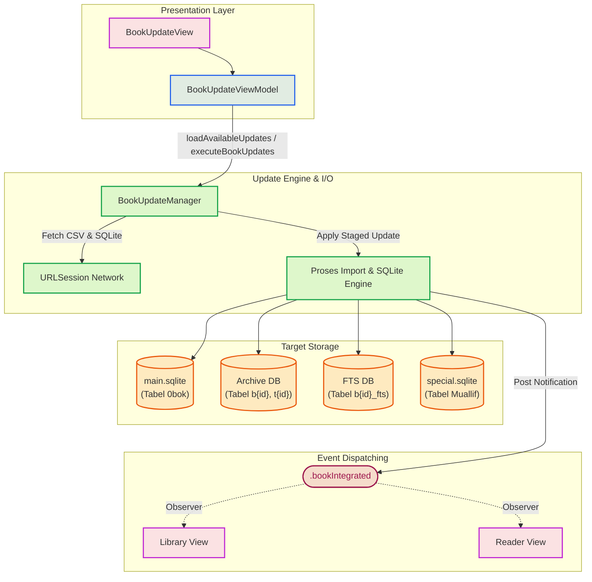
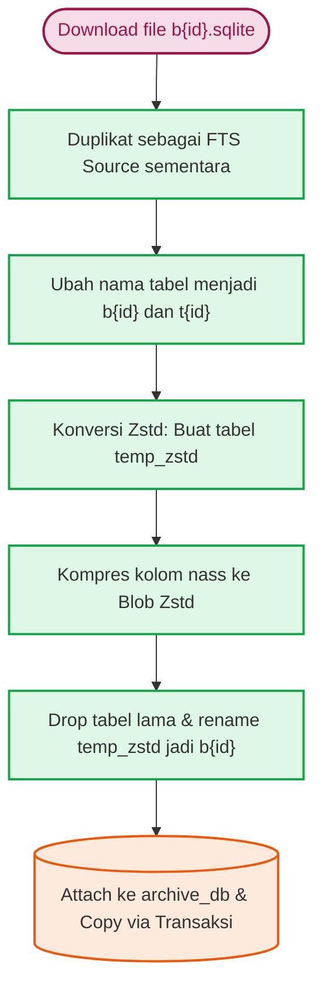
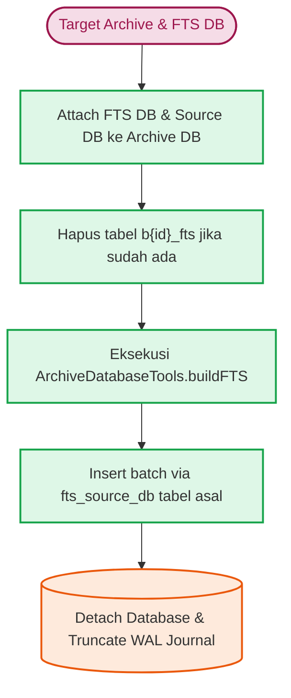
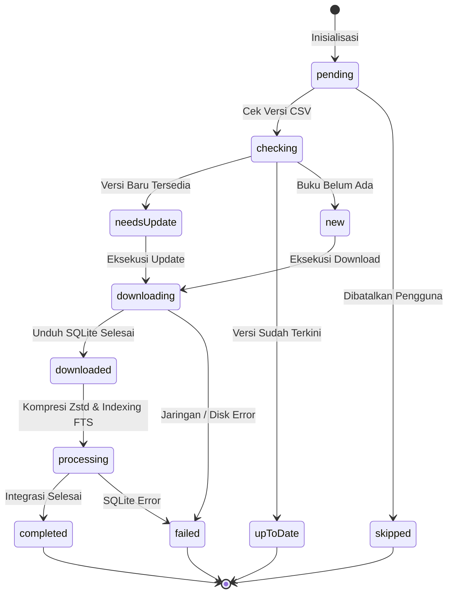

# Dokumentasi Teknis: Sistem Pembaruan Buku (Book Update)

Dokumen ini membedah arsitektur dan implementasi teknis dari proses pembaruan buku pada aplikasi Maktabah, mulai dari antarmuka pengguna (`BookUpdateView`), logika bisnis (`BookUpdateViewModel`), hingga lapisan mesin basis data (`BookUpdateManager`).

---

## 1. Pipeline Arsitektur

Pipeline sistem pembaruan buku dirancang dengan pemisahan tanggung jawab yang jelas. Lapisan antarmuka (View) berkomunikasi dengan ViewModel untuk manajemen *state* dan eksekusi paralel. ViewModel kemudian menyerahkan pekerjaan berat (I/O, basis data, jaringan) kepada komponen terdedikasi, yaitu `BookUpdateManager`. Setelah selesai, Manager mengirimkan notifikasi ke sistem agar subsistem lain (misalnya Reader atau Library) dapat merespons pembaruan data.

### 1.1 Diagram Interaksi Komponen



### 1.2 Alur Pembaruan (Update Pipeline)

Proses pembaruan buku secara garis besar berjalan dalam tahapan berikut:

1. **Pengambilan Metadata**: Mengunduh dan mem-*parsing* berkas CSV berisi indeks buku (*main*) dan indeks pengarang (*auth*).
2. **Download Berkas (*Staging*)**: Mengunduh basis data SQLite baru per-buku ke direktori sementara (`Updates/`).
3. **Pengecekan Metadata Berkas**: Membaca tabel `main_update` dari basis data hasil unduhan untuk mendapatkan informasi metadata yang akan disinkronisasikan.
4. **Penerapan Pembaruan (*Apply*)**:
    * Konversi isi teks menjadi blob Zstandard.
    * Memindahkan tabel data dan TOC ke *archive database*.
    * Menjalankan pembangunan ulang tabel FTS (*Full-Text Search*).
    * Memperbarui metadata ke tabel `0bok` di `main.sqlite` dan data pengarang di `special.sqlite`.
5. **Pembersihan (*Cleanup*)**: Menghapus basis data sementara hasil unduhan dan memancarkan notifikasi pembaruan sistem.

### 1.3 Alur Konversi Tabel SQLite ke Disk

Maktabah melakukan optimalisasi ruang penyimpanan dengan menggunakan kompresi `zstd` pada kolom teks sebelum diintegrasikan secara final ke arsip.



### 1.4 Metode Import, Rewrite, dan ChangeBookId

* **Impor Luring (`importOfflineUpdate`)**: Berfungsi untuk menerima berkas SQLite lokal yang dipilih pengguna. Logikanya mengabaikan pemeriksaan pembaruan daring dan mengeksekusi penimpaan (*update/insert*) berdasarkan tabel `main_update` lokal.
* **Rewrite Archive**: Berkas sementara di-*attach* ke basis data arsip, lalu tabel disalin dari `source_db` ke arsip. Tabel TOC disalin dengan pendekatan serupa.
* **Ubah ID Buku (`changeBookId`)**: Mengubah ID buku yang ada dengan ID baru. Karena arsitektur membagi buku ke beberapa arsip dan indeks FTS, fungsi ini melakukan:
    1. Mengubah nama tabel `b{oldId}` dan `t{oldId}` menjadi `b{newId}` dan `t{newId}` di basis data arsip.
    2. Mengubah nama tabel `b{oldId}_fts` di basis data FTS.
    3. Memperbarui referensi kolom `bkid` di tabel induk `0bok`.
    4. Menyediakan *rollback* otomatis jika salah satu langkah di atas mengalami kegagalan.

### 1.5 Pembangunan Ulang FTS (Rebuild FTS)



Pada fase ini, `BookUpdateManager` tidak langsung menyalin FTS secara manual; ia menyerahkan eksekusinya ke `ArchiveDatabaseTools.buildFTS` yang menjalankan *batch insertion* dengan konfigurasi khusus demi performa tinggi.

---

## 2. Prinsip Pemisahan Tanggung Jawab (Separation of Concerns)

Maktabah mematuhi arsitektur berbasis fitur dengan batasan domain yang ketat:

* **View Layer (`BookUpdateView.swift`)**: Murni bertanggung jawab atas tampilan UI. Komponen ini merefleksikan perubahan properti dari `viewModel` dan menggunakan instruksi pra-kompilasi `#if os(macOS)` dan antarmuka khusus iOS untuk diferensiasi antarmuka *native*.
* **ViewModel Layer (`BookUpdateVM.swift`)**: Menampung status presentasi (`isUpdating`, `progressMessage`) dan mengendalikan orkestrasi tugas. ViewModel memanfaatkan `TaskGroup` untuk unduhan paralel, namun tidak menulis langsung ke disk atau basis data.
* **Manager Layer (`BookUpdateManager`)**: Berperan sebagai *engine* I/O dan basis data. Terbagi ke dalam ekstensi-ekstensi:
    * `+Fetch.swift`: Pengambilan CSV dan pemeriksaan versi.
    * `+Metadata.swift`: Pembacaan dan penulisan metadata utama ke `main.sqlite`.
    * `+Import.swift`: Logika FTS, kompresi Zstandard, dan penyalinan arsip.
    * `+SQLite.swift`: Eksekusi operasi C-SQLite API tingkat rendah.

---

## 3. Bedah Komponen (Struct, Class, dan Enum)

### 3.1 Layer Tampilan (`UpdateView` & `BookUpdateRow`)

Implementasi antarmuka utama terbagi berdasarkan sistem operasi:

=== "macOS"

    ```swift
    private var macOSLayout: some View {
        NavigationStack {
            contentView
                .searchable(text: $searchText, prompt: "Search books...")
                .safeAreaInset(edge: .top, spacing: 0) { macOSHeaderView }
                .safeAreaInset(edge: .bottom) { macOSFooterView }
        }
    }
    ```

=== "iOS"

    ```swift
    private var iOSLayout: some View {
        contentView
            .toolbar {
                if viewModel.hasUpdates {
                    ToolbarItem(placement: .bottomBar) { iOSFooterView }
                }
            }
    }
    ```

Daftar `BookUpdateRow` merupakan baris UI yang menampilkan status pembaruan dan ukuran berkas. Komponen ini memuat *checkbox* untuk memilih buku yang membutuhkan pembaruan.

### 3.2 BookUpdateViewModel

* **Tipe**: `@Observable final class` yang memastikan keamanan pengiriman antar-*thread* (`@unchecked Sendable`).
* **Fungsi Utama**:
    * `loadAvailableUpdates()`: Memanggil Manager untuk mem-*parsing* CSV dan mencocokkan versi lokal.
    * `performSelectedUpdates()`: Mengumpulkan buku terpilih dan menjalankan unduhan secara asinkron menggunakan `TaskGroup`.
* **Mekanisme Concurrency**: Membatasi unduhan paralel maksimum menggunakan *chunking* (`maxConcurrentDownloads: 3`).

```swift
// (1)!
for chunkStart in stride(from: 0, to: taskInputs.count, by: maxConcurrentDownloads) {
    let chunkEnd = min(chunkStart + maxConcurrentDownloads, taskInputs.count)
    let chunk = Array(taskInputs[chunkStart ..< chunkEnd])

    await withTaskGroup(of: DownloadTaskOutput.self) { group in
        for taskInput in chunk {
            group.addTask { await self.stageSingleBookDownload(input: taskInput, authIndexMap: authIndexMap) }
        }
        // ... kumpulkan hasil
    }
}
```

1. Logika *concurrency* di dalam ViewModel membatasi eksekusi asinkron agar tidak membebani I/O jaringan maupun disk.

### 3.3 Struktur Data di Lapisan Model

#### `BookIndexEntry` (Struct)
Entitas yang merepresentasikan satu baris dalam berkas CSV indeks utama.

```swift
struct BookIndexEntry: Sendable {
    let bkid: Int
    let bk: String
    let category: Int
    let versionName: Int64
    let downloadURL: String
    let fileSize: Int64
}
```

* `bkid`: Pengenal unik kitab (*Book ID*).
* `bk`: Judul kitab.
* `category`: ID kategori kitab.
* `versionName`: Versi bilangan bulat (nilai lebih tinggi menunjukkan versi lebih baru).
* `downloadURL`: URL unduhan berkas.
* `fileSize`: Estimasi ukuran berkas dalam byte.

#### `AuthIndexEntry` (Struct)
Entitas indeks untuk data pengarang (*muallif*).

```swift
struct AuthIndexEntry: Sendable {
    let authId: Int
    let versionName: Int64
    let downloadURL: String
}
```

#### `BookMetadata` (Struct)
*Struct* yang merepresentasikan skema tabel `main_update` dari basis data per-kitab.

```swift
struct BookMetadata: Sendable {
    let bkid: Int
    let cat: Int?
    let bk: String
    let archive: Int
    let betaka: String?
    let authno: Int?
    let inf: String?
    let tafseerNam: String?
    let bVer: Int?
    let link: String?
    let pdfCs: Int?
}
```

#### `StagedBookUpdate` (Struct)
*Struct* yang merangkum seluruh dependensi dari satu pembaruan yang siap diterapkan (*applied*).

```swift
struct StagedBookUpdate: Sendable {
    let entry: BookIndexEntry
    let metadata: BookMetadata
    let downloadedBookURL: URL
    let ftsSourceURL: URL
    let authorContext: AuthorContext?
    let workingDirectory: URL
}
```

* `downloadedBookURL`: Lokasi berkas SQLite buku yang selesai diunduh.
* `ftsSourceURL`: Lokasi berkas duplikat teks mentah untuk FTS.
* `authorContext`: Informasi pengarang terkait.

#### `AuthorContext` (Struct)
Konteks pengarang terkait yang dipasangkan dengan buku.

```swift
struct AuthorContext: Sendable {
    let authId: Int
    let versionName: Int64
    let downloadURL: URL
}
```

### 3.4 `BookUpdateStatus` (Enum) - Status Event

Sistem pembaruan dipandu oleh status-status yang didefinisikan dalam `BookUpdateStatus`:

```swift
enum BookUpdateStatus: Equatable {
    case pending
    case checking
    case downloading
    case processing
    case downloaded
    case new
    case needsUpdate
    case upToDate
    case completed
    case skipped
    case failed(String)
}
```



* `pending`: Kondisi awal antrean.
* `checking` / `downloading` / `processing`: Transisi progres aktif.
* `downloaded`: Unduhan berhasil, siap dieksekusi ke arsip.
* `needsUpdate`: Versi lokal tertinggal dibanding server.
* `new`: Buku belum ada di basis data lokal.
* `failed`: Membawa pesan galat SQLite atau jaringan.

!!! note "Status Pengecekan Database"
    Untuk mengecek ketersediaan buku, Maktabah menggunakan enum internal di `BookUpdateManager` yaitu `BookVersionState`:

    * `.notInLibrary`: Tidak ditemukan rekaman dengan ID terkait.
    * `.unknownVersion`: Buku ditemukan namun kolom versinya kosong atau kolom `bVer` belum tersedia (skema lawas).
    * `.version(Int64)`: Versi numerik tersedia.

### 3.5 `BookUpdateManager` (Class) - Singleton

Manajer I/O dan pembaruan data utama (`final class BookUpdateManager: Sendable`).

* **Konkurensi**: Memenuhi *protocol* `Sendable` untuk pemanggilan lintas *Tasks*, dengan perlindungan `Mutex` pada *cache* kolom versi internal.
* **Fungsi Tahapan Eksekusi Utama**:
    * `stageBookDownload(_:authIndex:)`: Mengunduh dan menyiapkan metadata, mengembalikan `StagedBookUpdate`.
    * `applyStagedBookUpdate(_:knownExists:isOfflineImport:)`:
        * Memastikan data pengarang terunduh dan terpasang.
        * Memanggil `convertBookDatabase` untuk kompresi teks ke blob Zstandard.
        * Menggunakan `BookArchiveSingleFlight` agar penulisan arsip terkunci serial guna mencegah bentrokan transaksi SQLite antar-*thread*.
        * Mengeksekusi `replaceArchiveDatabase`.
        * Memperbarui rekaman metadata lokal (`saveBookMetadata`).

!!! warning "Notifikasi Integrasi"
    Setelah pembaruan buku selesai, sistem memancarkan *broadcast* internal: `NotificationCenter.default.post(name: .bookIntegrated, object: metadata.bkid)`. Subsistem UI lainnya akan merespons untuk memvalidasi *cache* dan memperbarui tampilan katalog.
