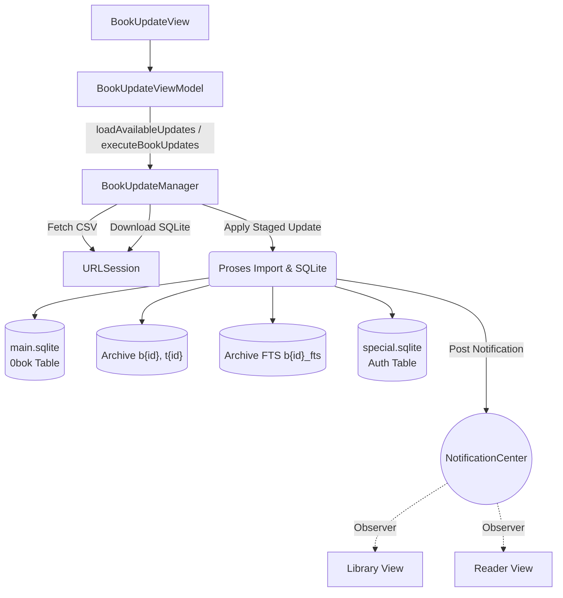
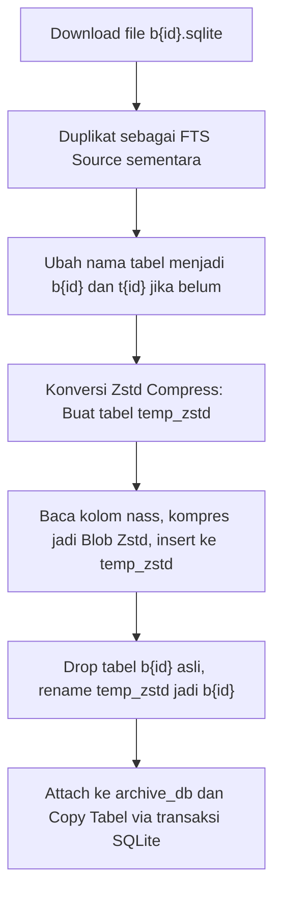
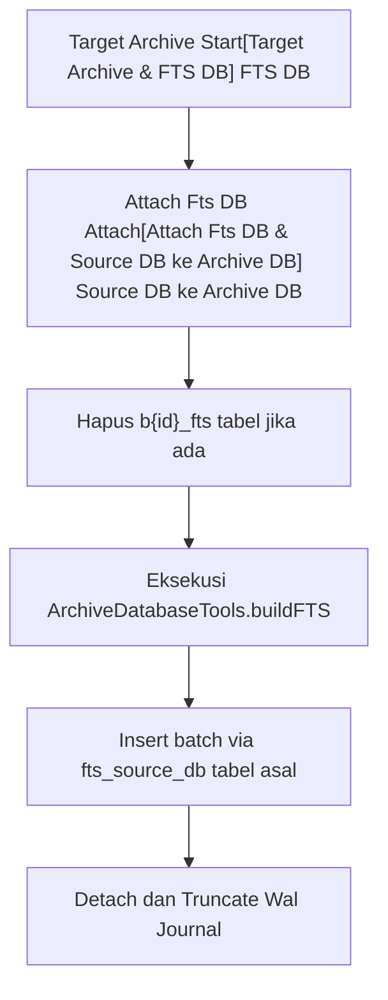

# Dokumentasi Teknis: Sistem Pembaruan Buku (Book Update)

Dokumen ini membedah arsitektur dan implementasi teknis dari proses pembaruan buku pada aplikasi Maktabah, mulai dari antarmuka pengguna (`BookUpdateView`), logika bisnis (`BookUpdateViewModel`), hingga lapisan mesin database dasar (`BookUpdateManager`).

---

## 1. Pipeline Arsitektur

Pipeline sistem pembaruan buku dirancang dengan pemisahan tanggung jawab yang jelas. Lapisan antarmuka (View) berkomunikasi dengan ViewModel untuk manajemen state dan eksekusi paralel. ViewModel kemudian menyerahkan pekerjaan berat (I/O, database, jaringan) kepada spesialis tunggal, yaitu `BookUpdateManager`. Setelah selesai, Manager mengirimkan notifikasi ke sistem agar subsistem lain (misalnya Reader atau Library) bisa merespons.

### 1.1 Diagram Interaksi Komponen



### 1.2 Alur Import (Pipeline Proses Pembaruan)

Proses pembaruan buku secara garis besar berjalan dalam tahapan berikut:

1. **Pengambilan Metadata**: Mengunduh dan melakukan parsing file CSV berisi indeks buku (main) dan indeks penulis (auth).
2. **Download File (Staging)**: Mengunduh database SQLite baru per buku ke folder sementara (`Updates/`).
3. **Pengecekan Metadata File**: Membaca tabel `main_update` dari database hasil unduhan untuk mendapatkan informasi metadata yang akan disinkronisasikan.
4. **Penerapan Pembaruan (Apply)**:
    * Konversi isi teks menjadi blob Zstandard.
    * Memindahkan tabel data dan TOC ke *archive database*.
    * Melakukan pembangunan ulang tabel FTS (Full-Text Search).
    * Memperbarui metadata ke tabel `0bok` di `main.sqlite` dan penulis di `special.sqlite`.
5. **Pembersihan (Cleanup)**: Menghapus database sementara hasil unduhan dan melakukan integrasi (broadcast notifikasi).

### 1.3 Alur Konversi Tabel SQLite ke Disk

Maktabah melakukan optimalisasi ruang dengan menggunakan kompresi `zstd` pada kolom teks sebelum diintegrasikan secara final ke arsip.



### 1.4 Metode Import, Rewrite, dan ChangeBookId

* **Import Offline (`importOfflineUpdate`)**: Berfungsi untuk menerima file SQLite lokal yang di-drop atau dipilih pengguna. Logikanya mengabaikan cek pembaruan daring dan memaksa penimpaan (update/insert) berdasarkan tabel `main_update` lokal.
* **Rewrite Archive**: File sementara di-*attach* ke database arsip, lalu tabel disalin dari `source_db` ke arsip. Tabel TOC disalin dengan pendekatan serupa.
* **Ubah ID Buku (`changeBookId`)**: Modifikasi ID buku yang ada dengan ID baru. Karena arsitektur membagi buku di beberapa arsip dan FTS, fungsi ini melakukan:
    1. Rename tabel `b{oldId}` dan `t{oldId}` menjadi `b{newId}` dan `t{newId}` di database arsip.
    2. Rename tabel `b{oldId}_fts` di FTS database.
    3. Update referensi kolom `bkid` di tabel induk `0bok`.
    4. Menyediakan *rollback* otomatis jika salah satu langkah di atas gagal.

### 1.5 Rebuild FTS



Pada fase ini, `BookUpdateManager` tidak langsung menyalin FTS; ia menyerahkan eksekusinya pada mekanisme `ArchiveDatabaseTools.buildFTS` yang menjalankan batch insertion dengan *synchronous mode* khusus demi performa.

---

## 2. Prinsip Pemisahan Tanggung Jawab (Separation of Concerns)

Maktabah mematuhi arsitektur berbasis fitur dengan batas domain ketat:

* **View Layer (`BookUpdateView.swift`)**: Murni untuk urusan render UI. Tidak ada state asinkronus yang kompleks, hanya bereaksi terhadap pembaruan properti `viewModel`. Menggunakan instruksi pra-kompilasi `#if os(macOS)` dan `=== "iOS"` untuk diferensiasi tampilan *native*.
* **ViewModel Layer (`BookUpdateVM.swift`)**: Penampung status presentasi (`isUpdating`, `progressMessage`) dan pengontrol orkestrasi task. ViewModel membungkus `TaskGroup` untuk *concurrent downloads* tetapi tidak menulis langsung ke disk atau database.
* **Manager Layer (`BookUpdateManager`)**: Berperan sebagai I/O dan Database engine. Terbagi ke dalam ekstensi terpisah agar rapi:
    * `+Fetch.swift`: Pengambilan CSV dan cek versi.
    * `+Metadata.swift`: Baca/Tulis metadata utama ke `main.sqlite`.
    * `+Import.swift`: Logika FTS, kompresi Zstd, salin arsip.
    * `+SQLite.swift`: Eksekusi dasar C-SQLite API.

---

## 3. Bedah Komponen (Struct, Class, dan Enum)

### 3.1 Layer Tampilan (`UpdateView` & `BookUpdateRow`)

Implementasi UI utama terbagi berdasarkan sistem operasi menggunakan fitur tab yang didukung Material MkDocs:

=== "macOS"

    ```swift
    private var macOSLayout: some View {
        NavigationStack {
            contentView
                .searchable(text: $searchText, prompt: "Search books...")
                .safeAreaInset(edge: .top, spacing: 0) { macOSHeaderView }
                .safeAreaInset(edge: .bottom) { macOSFooterView }
        }
    }
    ```

=== "iOS"

    ```swift
    private var iOSLayout: some View {
        contentView
            .toolbar {
                if viewModel.hasUpdates {
                    ToolbarItem(placement: .bottomBar) { iOSFooterView }
                }
            }
    }
    ```

Daftar `BookUpdateRow` merupakan baris UI yang menampilkan status pembaruan dan ukuran. Berisi tombol *toggle checkbox* untuk buku yang membutuhkan pembaruan.

### 3.2 BookUpdateViewModel

* **Tipe**: `@Observable final class` yang memastikan *thread-safety* parsial (`@unchecked Sendable`).
* **Fungsi Utama**:
    * `loadAvailableUpdates()`: Memanggil Manager untuk parsing CSV dan mencocokkan versi lokal.
    * `performSelectedUpdates()`: Mengumpulkan buku terpilih dan menjalankan unduhan secara asinkron menggunakan `TaskGroup`.
* **Mekanisme Concurrency**: Membatasi unduhan maksimum menggunakan *chunking* (`maxConcurrentDownloads: 3`).

```swift
// (1)!
for chunkStart in stride(from: 0, to: taskInputs.count, by: maxConcurrentDownloads) {
    let chunkEnd = min(chunkStart + maxConcurrentDownloads, taskInputs.count)
    let chunk = Array(taskInputs[chunkStart ..< chunkEnd])

    await withTaskGroup(of: DownloadTaskOutput.self) { group in
        for taskInput in chunk {
            group.addTask { await self.stageSingleBookDownload(input: taskInput, authIndexMap: authIndexMap) }
        }
        // ... kumpulkan hasil
    }
}
```

1. Logika Concurrency di dalam ViewModel membatasi eksekusi asinkron agar tidak membebani I/O jaringan maupun disk.

### 3.3 Struktur Data di Lapisan Model

#### `BookIndexEntry`
Entitas yang merepresentasikan satu baris dalam file CSV indeks utama (main CSV).

```swift
struct BookIndexEntry: Sendable {
    let bkid: Int
    let bk: String
    let category: Int
    let versionName: Int64
    let downloadURL: String
    let fileSize: Int64
}
```

* `bkid`: Identifier buku unik.
* `bk`: Judul buku.
* `category`: Kategori buku.
* `versionName`: Versi bilangan bulat (semakin besar semakin baru).
* `downloadURL`: URL Google Drive lengkap yang dikonversi dari ID.
* `fileSize`: Ukuran estimasi dalam byte.

#### `AuthIndexEntry`
Mirip dengan indeks buku, namun untuk penulis (muallif).

```swift
struct AuthIndexEntry: Sendable {
    let authId: Int
    let versionName: Int64
    let downloadURL: String
}
```

#### `BookMetadata`
Struktur data yang merepresentasikan skema tabel `main_update` dari sebuah database Iden (sqlite per kitab).

```swift
struct BookMetadata: Sendable {
    let bkid: Int
    let cat: Int?
    let bk: String
    let archive: Int
    let betaka: String?
    let authno: Int?
    let inf: String?
    let tafseerNam: String?
    let bVer: Int?
    let link: String?
    let pdfCs: Int?
}
```

#### `StagedBookUpdate`
Struktur yang membungkus seluruh dependensi dari satu pembaruan yang siap di-eksekusi (Apply).

```swift
struct StagedBookUpdate: Sendable {
    let entry: BookIndexEntry
    let metadata: BookMetadata
    let downloadedBookURL: URL
    let ftsSourceURL: URL
    let authorContext: AuthorContext?
    let workingDirectory: URL
}
```

* `downloadedBookURL`: Path file sqlite buku yang selesai diunduh.
* `ftsSourceURL`: Path duplikat untuk FTS yang terhindar dari kompresi.
* `authorContext`: Informasi *author* jika harus diunduh.

#### `AuthorContext`
Konteks penulis terkait yang dipasangkan dengan buku.

```swift
struct AuthorContext: Sendable {
    let authId: Int
    let versionName: Int64
    let downloadURL: URL
}
```

### 3.4 Enumerasi Status (Event Types)

Sistem pembaruan didorong oleh berbagai status yang dikirim kembali ke UI, didefinisikan dalam `BookUpdateStatus`.

```swift
enum BookUpdateStatus: Equatable {
    case pending
    case checking
    case downloading
    case processing
    case downloaded
    case new
    case needsUpdate
    case upToDate
    case completed
    case skipped
    case failed(String)
}
```

* `pending`: Kondisi awal.
* `checking` / `downloading` / `processing`: Transisi progress aktif.
* `downloaded`: Unduhan berhasil, bersiap dieksekusi I/O ke arsip.
* `needsUpdate`: Buku lokal tertinggal versi.
* `new`: Buku tidak ada di database lokal.
* `failed`: Menampung payload string berupa pesan error C-SQLite / Network.

!!! note "Status Pengecekan Database"
    Untuk mengecek apakah buku telah ada, Maktabah juga menggunakan enum internal di `BookUpdateManager` yaitu `BookVersionState`:

    * `.notInLibrary`: Tidak ditemukan record dengan id terkait.
    * `.unknownVersion`: Buku ditemukan tapi properti kolom versinya nihil atau kolom `bVer` tidak ada (biasanya legacy DB).
    * `.version(Int64)`: Versi integer tersedia.

### 3.5 BookUpdateManager (Singleton)

Kelas I/O dan Manajemen utama (`final class BookUpdateManager: Sendable`).

* **Konkurensi**: Disertai penandaan *Sendable* untuk memastikan fungsi dapat dipanggil dari pelbagai Tasks. Termasuk penguncian internal `cachedVersionColumn` dengan `Mutex`.
* **Fungsi Tahapan Eksekusi Utama**:
    * `stageBookDownload(_:authIndex:)`: Melakukan unduhan awal dan mempersiapkan metadata, mengembalikan `StagedBookUpdate`.
    * `applyStagedBookUpdate(_:knownExists:isOfflineImport:)`:
        * Memastikan *author* terkait terunduh dan terpasang.
        * Memanggil `convertBookDatabase` yang memanipulasi *bytes* ke Zstd blob.
        * Melakukan `BookArchiveSingleFlight` agar penulisan arsip terkunci satu arah demi mencegah kompetisi transaksi SQLite antar utas.
        * Eksekusi `replaceArchiveDatabase`.
        * Pembaruan record metadata lokal (`saveBookMetadata`).

!!! warning "Event Notification"
    Setelah penyelesaian sebuah buku, dipancarkan broadcast internal: `NotificationCenter.default.post(name: .bookIntegrated, object: metadata.bkid)`. Subsistem UI lainnya bereaksi untuk memvalidasi *cache* yang mereka pegang dan me-refresh tampilan daftar kitab.
