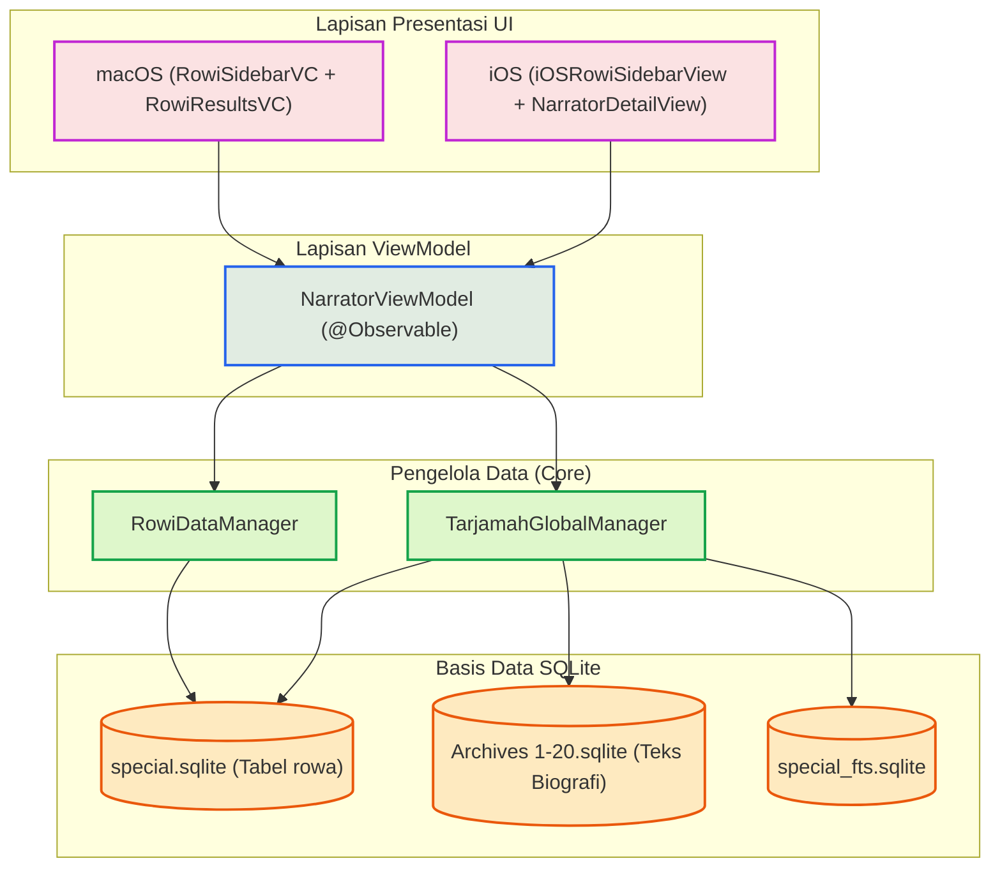

# Narrator (Rijāl)

Fitur **Narrator** (*Rijālul Hadīts*) dalam aplikasi Maktabah digunakan untuk menelusuri, mencari, dan membaca biografi para perawi hadis. Fitur ini memungkinkan pengguna untuk melihat detail perawi berdasarkan tingkatan (*Tabaqah*), serta mencari biografi (*Tarjamah*) secara global dari kitab-kitab biografi yang didukung.

## Arsitektur

Fitur Narrator dibangun menggunakan arsitektur MVVM (*Model-View-ViewModel*) yang memisahkan logika antarmuka pengguna dari logika pengelolaan data SQLite (baik untuk data referensi perawi maupun teks biografi di dalam arsip basis data).

### Komponen Utama

1. **Core & Database**: 
    - `RowiDataManager` mengelola kueri dari tabel `rowa` (data pokok perawi).
    - `TarjamahGlobalManager` mengelola pencarian teks penuh (FTS) dan biografi (`men_u`, `men_b`) secara konkuren.
2. **ViewModel**: 
    - `NarratorViewModel` bertanggung jawab menjaga status pencarian, status perawi yang dipilih, mode tampilan, dan sinkronisasi data antar-thread.
3. **UI (macOS / iOS)**: 
    - Menampilkan hierarki Tabaqah, hasil pencarian FTS, dan konten teks biografi.

## Daftar Dokumen Teknis

- [Database Layer](database.md): Akses ke `special.sqlite`, pembentukan `special_fts.sqlite`, dan *connection pool*.
- [Data Models](models.md): Model data perawi (`Rowi`), *tabaqah* (`TabaqaGroup`), dan biografi (`TarjamahResult`).
- [State Management (ViewModel)](viewmodel.md): Manajemen *state* reaktif dan *streaming pipeline* FTS perawi.
- [iOS Implementation](ios.md): Antarmuka *hierarchical collection* dan integrasi profil SwiftUI.
- [macOS Implementation](macos.md): Navigasi *sidebar* AppKit dan integrasi tampilan hasil biografi.
- [Protocols & Contracts](protocols.md): Kontrak delegasi antar-*controller*.
