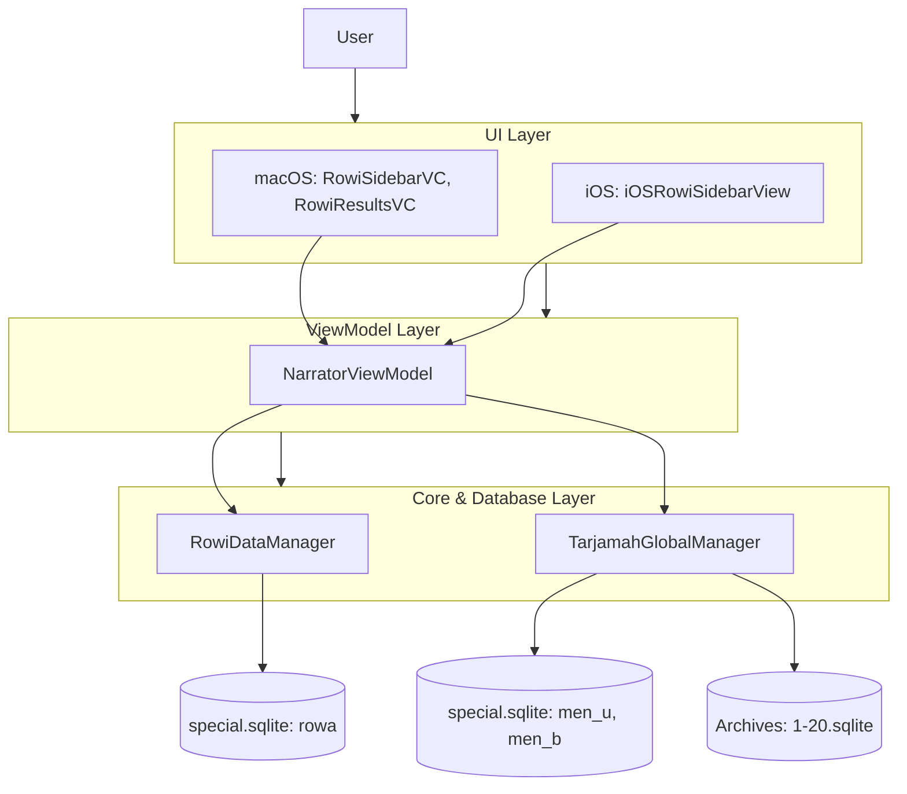

# Narrator (Rijāl)

Fitur **Narrator** (atau Rijālul Hadith) dalam aplikasi Maktabah digunakan untuk menelusuri, mencari, dan membaca biografi para perawi hadis. Fitur ini memungkinkan pengguna untuk melihat detail perawi berdasarkan tingkatan (Tabaqah), serta mencari biografi (Tarjamah) secara global dari kitab-kitab biografi yang didukung.

## Arsitektur

Fitur Narrator dibangun menggunakan arsitektur MVVM (Model-View-ViewModel) yang memisahkan logika antarmuka pengguna dari logika pengelolaan data SQLite (baik untuk data referensi perawi maupun teks biografi di dalam _archives_).

### Komponen Utama

1. **Core & Database**: 
    - `RowiDataManager` mengelola kueri dari tabel `rowa` (data pokok perawi).
    - `TarjamahGlobalManager` mengelola pencarian teks penuh (FTS) dan biografi (`men_u`, `men_b`) secara konkuren.
2. **ViewModel**: 
    - `NarratorViewModel` bertanggung jawab menjaga status pencarian, status perawi yang dipilih, mode tampilan, dan sinkronisasi data antar utas.
3. **UI (macOS / iOS)**: 
    - Menampilkan hierarki Tabaqah, hasil pencarian FTS, dan konten teks biografi.
