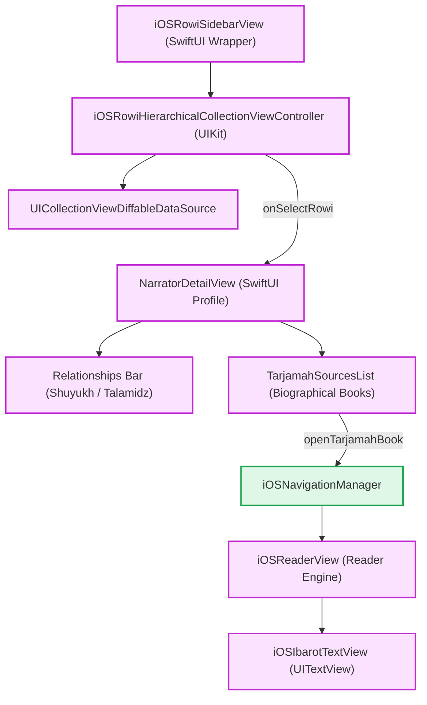
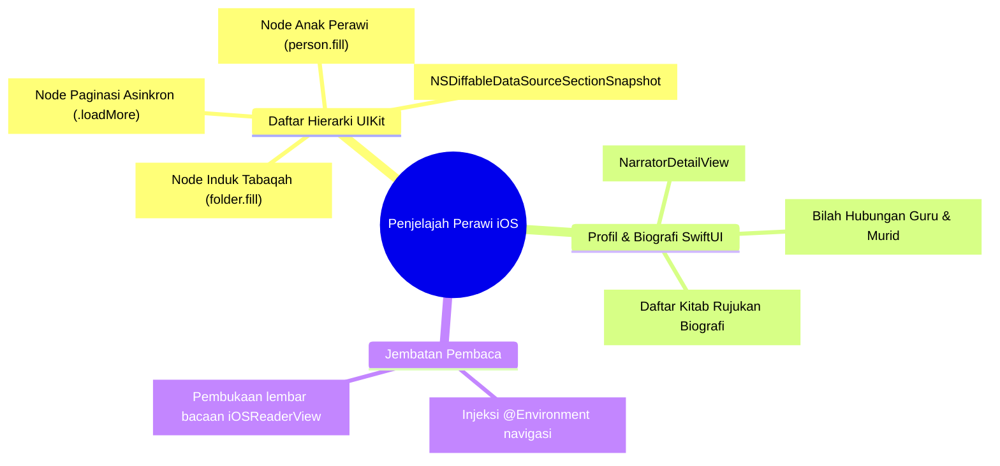
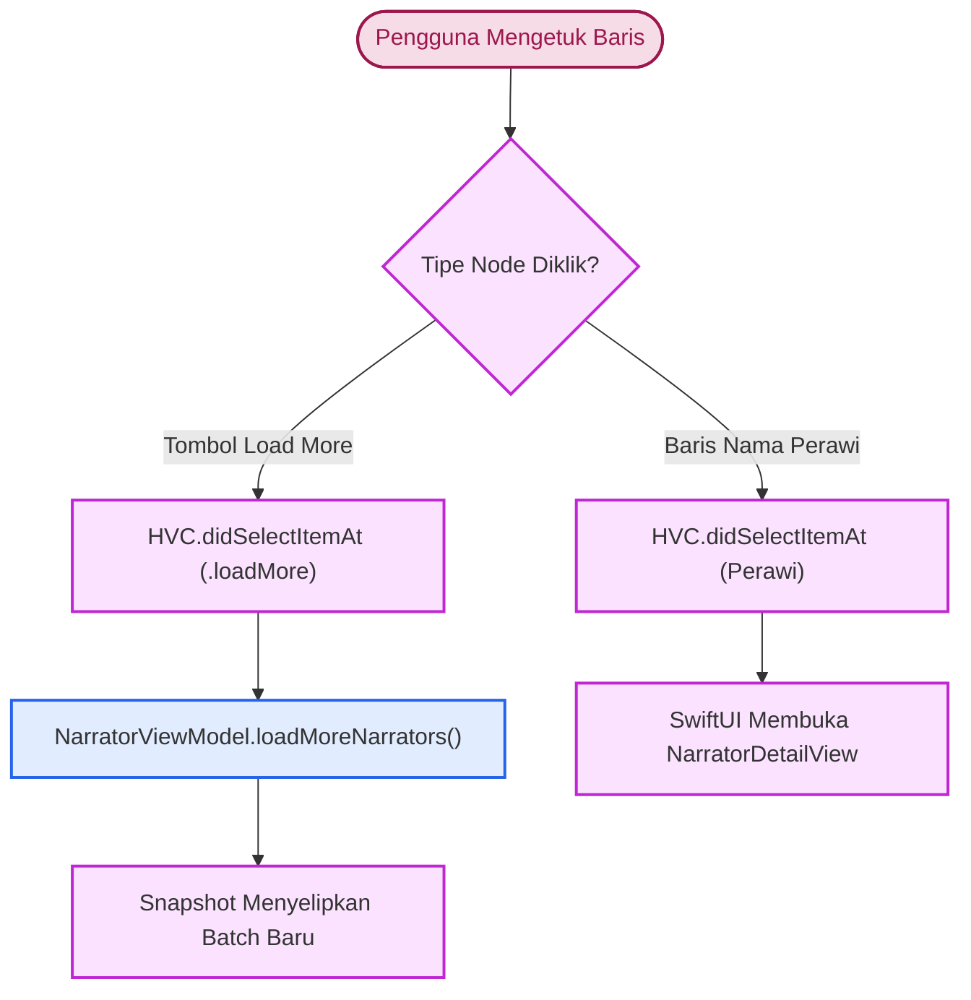
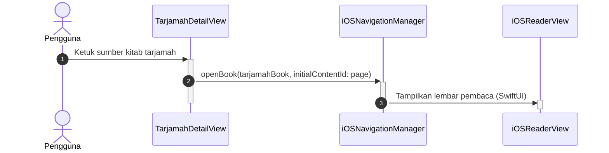
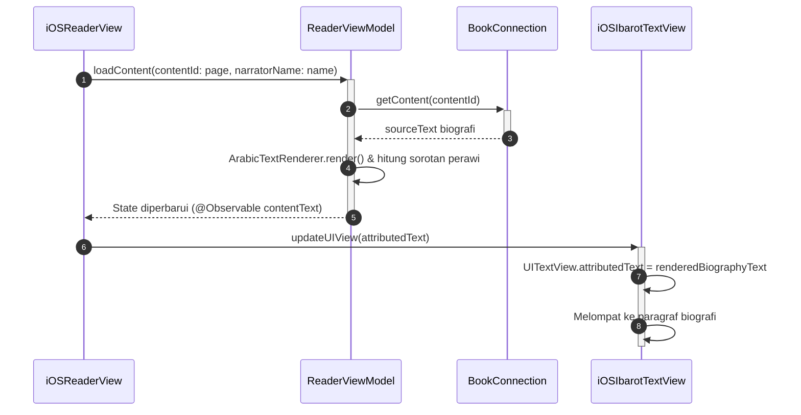

# Narrator iOS Implementation (SwiftUI & UIKit)

Di iOS, fitur Narrator (Rijāl al-Hadīts) beradaptasi dengan lingkungan hibrida: navigasi silsilah perawi yang dalam dieksekusi menggunakan UIKit modern (`UICollectionView` dengan *Diffable Section Snapshot*), sementara presentasi profil dan lembar biografi dikelola secara deklaratif di SwiftUI.

Sumber kode: `Source/Features/Narrator/iOS/`

---

## 1. Arsitektur Komponen Visual

Arsitektur antarmuka perawi pada iOS memadukan komponen UIKit hierarkis dengan presentasi profil SwiftUI:

### A. Hierarki Komponen Hybrid

### B. Taksonomi Arsitektur Hybrid

---

## 2. Alur Interaksi: Dari Aksi Klik Perawi / Tarjamah ke TextView

Alur interaksi mencakup dua fase: ekspansi/paginasi daftar di sidebar, lalu pembukaan kitab tarjamah ke mesin pembaca:

### A. Routing Interaksi Klik Sidebar

### B. Alur Buka Sumber Tarjamah ke TextView

---

## 3. Bedah Komponen & Logika Antarmuka

### 1. iOSRowiHierarchicalCollectionViewController (Class)
*Class* turunan dari `BaseHierarchicalListViewController` yang bertugas menampilkan struktur hierarki generasi perawi:

* **Diffable Section Snapshot**: Menggunakan `NSDiffableDataSourceSectionSnapshot` untuk mengelola hubungan bertingkat antara Tabaqah (Induk) dan Perawi (Anak).
* **Mekanisme "Load More" Paginasi**:
  * Untuk tabaqah dengan ratusan perawi, daftar tidak memuat seluruh rekaman sekaligus ke memori.
  * Sistem menyuntikkan sel interaktif khusus dengan identifikasi `.loadMore(tabaqahId)` di posisi akhir section snapshot.
  * Ketika sel ini diketuk, kontroler meminta batch berikutnya ke `special.sqlite`, lalu menyisipkan elemen-elemen baru tepat sebelum tombol "Load More".
* **Indentation Level Visual**: Mengatur `indentationLevel` bawaan UIKit untuk menghasilkan indentasi visual yang presisi tanpa peretasan margin (*margin hack*).

### 2. iOSRowiSidebarView (Struct)
Komponen pembungkus bertipe `UIViewControllerRepresentable`:

* **Pengikatan Coordinator**: Menjembatani delegasi ketukan seleksi perawi di `UICollectionView` menuju ekosistem SwiftUI `NarratorDetailView`.
* **Integrasi `.searchable()`**: Mendeteksi status `.isSearching` dan mengirim kueri pencarian teks secara langsung ke `NarratorViewModel` untuk penyaringan instan (*instant filtering*).

### 3. NarratorDetailView (Struct) & Tarjamah Source Navigation

* Menampilkan kartu biografi komprehensif: nama lengkap, nasab, laqab, tahun wafat, serta derajat jarh wa ta'dil.
* Menyediakan daftar kitab tarjamah yang memuat biografi perawi tersebut. Setiap baris kitab memuat nomor juz dan halaman, yang saat diketuk akan langsung memanggil `navigationManager.openBook` untuk membuka halaman primer kitab biografi terkait.
