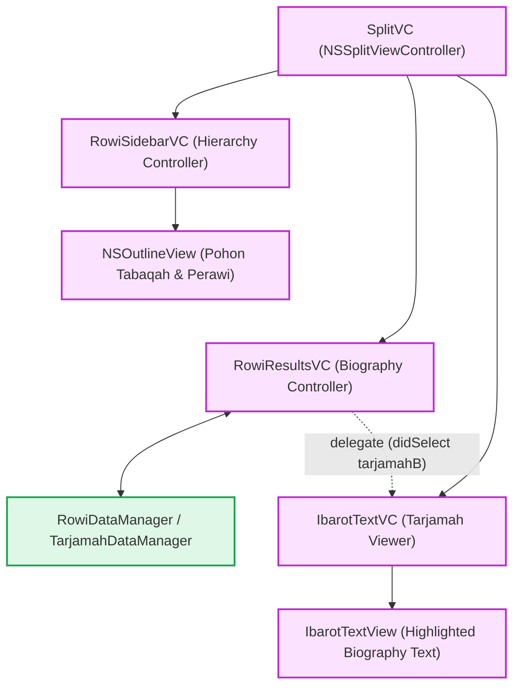
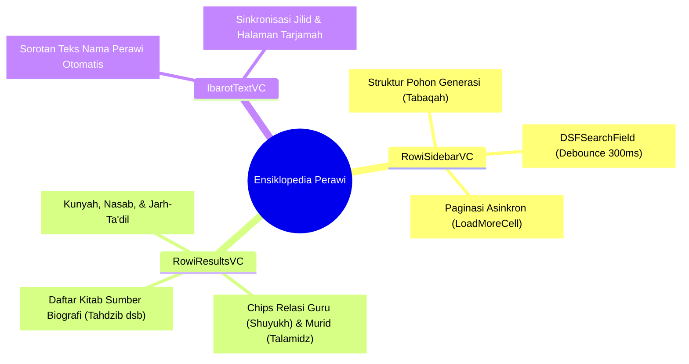
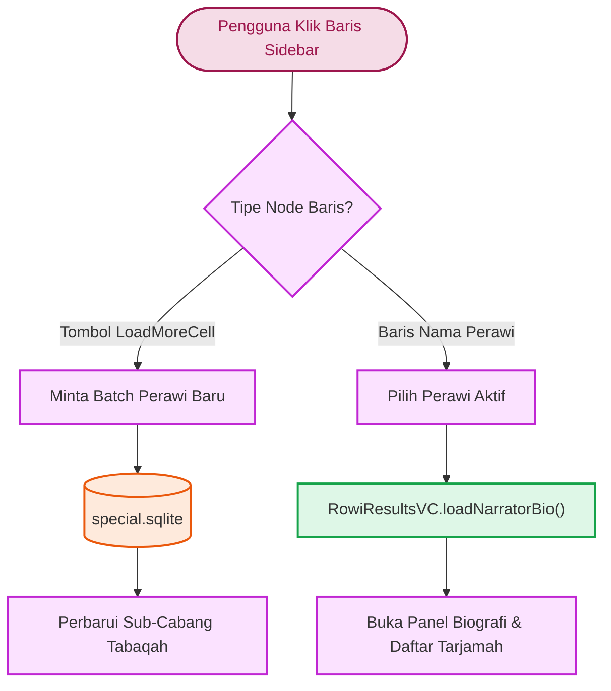
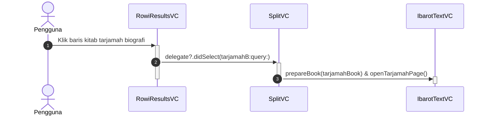
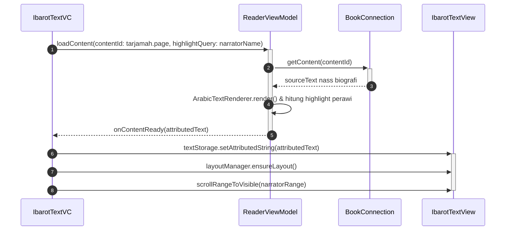

# Narrator macOS Implementation (AppKit)

Modul Narrator (Rijāl al-Hadīts) pada macOS memanfaatkan arsitektur terintegrasi `SplitVC`, membagi layar antara penjelajah silsilah perawi (Tabaqah), panel biografi terperinci (`RowiResultsVC`), dan mesin pembaca utama (`IbarotTextVC`).

Sumber kode: `Source/Features/Narrator/macOS/`

---

## 1. Arsitektur Komponen Visual

Antarmuka ensiklopedia perawi macOS mendistribusikan navigasi silsilah, panel biografi, dan pembaca teks ke dalam struktur modular:

### A. Hierarki Komponen Perawi

### B. Taksonomi Fitur & Panel Perawi

### C. Alur Keputusan Interaksi Baris Sidebar

---

## 2. Alur Interaksi: Dari Aksi Klik Sumber Tarjamah ke TextView

Ketika pengguna mengklik salah satu baris kitab tarjamah biografi perawi pada tabel `RowiResultsVC`:

---

## 3. Bedah Komponen Antarmuka Utama

### 1. RowiSidebarVC (Class) - Sidebar Hierarki & Tabaqah

* **Penyajian Struktur Pohon**: Menggunakan `NSOutlineView` untuk merender pembagian generasi perawi (*Tabaqah*) sebagai node induk dan nama perawi sebagai node anak.
* **Mekanisme Paginasi (`LoadMoreCell`)**: Jika suatu tabaqah memiliki perawi dalam jumlah besar, node terakhir menampilkan sel tombol "Load More" (`group.hasMore`) yang memicu pembacaan batch berikutnya secara asinkron dari basis data `special.sqlite`.
* **Pencarian Cepat**: Menggunakan `DSFSearchField` dengan penundaan *debounce* 300 ms untuk menyaring perawi berdasarkan nama atau laqab secara instan.

### 2. RowiResultsVC (Class) - Kontroler Biografi & Hasil
Memiliki dua mode presentasi dinamis:

* **Mode Profil Perawi (Sidebar Mode)**:
  * Menampilkan ringkasan kunyah, nasab, derajat ta'dil/jarh, serta bilah chip tombol hubungan ("التلاميذ" / Murid dan "الشيوخ" / Guru).
  * Menampilkan tabel `NSTableView` yang merangkum biografi perawi dari berbagai kitab rujukan induk (seperti *Tahdzib al-Kamal*, *Siyar A'lam an-Nubala*, atau *Tahdzib at-Tahdzib*).
* **Mode Pencarian Global (FTS Mode)**:
  * Jika kueri pencarian teks penuh diaktifkan, tabel beralih menampilkan daftar kutipan hadits/biografi dengan bilah kendali *Start/Pause/Stop*.
  * Baris baru disisipkan secara inkremental (`insertRows`) dengan animasi *fade* saat notifikasi `onSearchBatchAppended` diterima.

### 3. Restorasi State (ReaderStateComponent)

* Navigasi antar-perawi dan riwayat klik kitab tarjamah disimpan secara persisten. Ketika jendela ditutup atau mode berpindah, state terakhir perawi yang sedang diteliti dapat direstorasi seketika.
