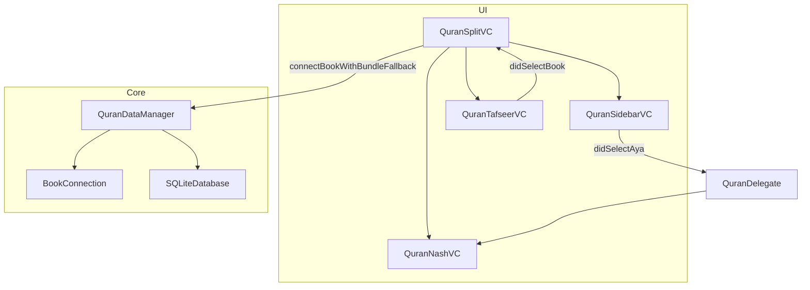

# Quran

Fitur `Quran` menyediakan kemampuan membaca Al-Quran beserta tafsirnya. Fitur ini dirancang khusus untuk macOS saat ini, menggunakan `QuranDataManager` untuk memuat data Al-Quran (Surah dan Ayat) dan mencocokkannya dengan buku-buku tafsir yang ada di perpustakaan Maktabah Syamilah.

## Arsitektur Pipeline

